# Resumen

La creciente complejidad de la infraestructura declarativa de Kubernetes supone una barrera de entrada para investigadores universitarios, forzando ciclos de entrega prolongados y costosos procesos de negociación con los Servicios de Informática (SIC). Este Trabajo de Fin de Máster presenta el **Agentic Deployer**, un sistema de orquestación que permite provisionar infraestructura mediante lenguaje natural bajo estricta supervisión humana determinista.

La solución se articula sobre tres pilares: (1) una Arquitectura Hexagonal que aísla las reglas de negocio de la estocasticidad de los Modelos de Lenguaje (LLM); (2) el estándar abierto *Model Context Protocol* (MCP), que evita el *vendor lock-in*; y (3) un patrón *Human-In-The-Loop* (HITL) gobernado por una Máquina de Estados inmutable que asegura que ningún despliegue impacte en el clúster sin validación técnica.

El desarrollo siguió un enfoque *Domain-First*, asegurando la calidad mediante *Property-Based* y *Mutation Testing*. Los casos de estudio revelan que el sistema elimina los cuellos de botella asíncronos, proyectando (bajo supuestos operativos estandarizados) una reducción del tiempo de entrega de un orden de días a escasos minutos. Adicionalmente, el análisis económico establece un ROI prospectivo superior al 520% a tres años, demostrando la alta viabilidad corporativa de la ingeniería agéntica en entornos controlados.

**Palabras clave:** Agentes LLM, Model Context Protocol (MCP), Arquitectura Hexagonal, Human-In-The-Loop, Kubernetes, Platform Engineering.

## Abstract

The growing complexity of Kubernetes declarative infrastructure poses a significant entry barrier for university researchers, leading to prolonged delivery cycles and costly negotiation processes with IT departments. This Master's Thesis presents the **Agentic Deployer**, an orchestration system that provisions infrastructure through natural language under strict, deterministic human supervision.

The solution is built upon three pillars: (1) a Hexagonal Architecture that isolates business rules from the stochasticity of Large Language Models (LLMs); (2) the open *Model Context Protocol* (MCP) standard, which prevents vendor lock-in; and (3) a *Human-In-The-Loop* (HITL) pattern governed by an immutable Finite State Machine that ensures no deployment reaches the cluster without technical validation.

Development followed a Domain-First approach, with quality assured through Property-Based and Mutation Testing. Documented case studies reveal that the system eliminates asynchronous bottlenecks, projecting (under standardized operational assumptions) a reduction in Time-to-Market from an order of days to mere minutes. Furthermore, the economic analysis establishes a prospective ROI exceeding 520% over three years, demonstrating the high corporate viability of agentic engineering in controlled environments.

**Keywords:** LLM Agents, Model Context Protocol (MCP), Hexagonal Architecture, Human-In-The-Loop, Kubernetes, Platform Engineering.


<div style='page-break-after: always;'></div>

# Índice de Contenidos

- **Capítulo 1. Introducción**
  - 1.1. Contexto y motivación
  - 1.2. Planteamiento del problema
  - 1.3. Objetivos del proyecto
  - 1.4. Alcance y Limitaciones
  - 1.5. Requisitos Formales del Sistema
  - 1.6. Estructura de la memoria
- **Capítulo 2. Estado del Arte**
  - 2.1. Agentes autónomos basados en Modelos de Lenguaje de Gran Escala (LLM)
  - 2.2. Estandarización de Integraciones: Model Context Protocol (MCP)
  - 2.3. Orquestación e Infraestructura Declarativa (Kubernetes)
  - 2.4. Arquitectura Hexagonal y Seguridad en Sistemas Estocásticos
  - 2.5. Trabajos Relacionados y Posicionamiento Diferencial
- **Capítulo 3. Metodología y Stack Tecnológico**
  - 3.1. Enfoque Metodológico
  - 3.2. Fases de Desarrollo
  - 3.3. Stack Tecnológico y Justificación Arquitectónica
- **Capítulo 4. Diseño del Sistema y Arquitectura**
  - 4.1. Modelado Topológico Arquitectónico (Estándar C4)
  - 4.2. Adopción de la Arquitectura Hexagonal (Ports and Adapters)
  - 4.3. Algoritmia de Validación de Seguridad Institucional
  - 4.4. Patrón de Abstracción: *Golden Paths* y Expansión Sintáctica
  - 4.5. Flujo de Datos *End-to-End* y Ciclo de Estados
- **Capítulo 5. Desarrollo del Agente Cognitivo y MCP**
  - 5.1. Implementación del Servidor *Model Context Protocol* (MCP)
  - 5.2. Diseño de la Abstracción Multiproveedor y Soberanía del Dato
  - 5.3. Bucle Cognitivo y Resiliencia Estocástica (Patrón ReAct)
- **Capítulo 6. Implementación del Patrón HITL y Gestión de Estados Finita (FSM)**
  - 6.1. Fundamentación del Patrón *Human-In-The-Loop* (HITL)
  - 6.2. Diseño de la Máquina de Estados Finita (FSM)
  - 6.3. El Dashboard Asíncrono de Operaciones
  - 6.4. Canal de Retorno al Investigador: Notificación Asíncrona del Estado
- **Capítulo 7. Aseguramiento de Calidad (QA) y Testing Avanzado**
  - 7.1. Pruebas de Dominio e Integración: Validando la Jaula Hexagonal
  - 7.2. Property-Based Testing: Asedio Estocástico
  - 7.3. Auditoría de la Suite de Pruebas: *Mutation Testing*
  - 7.4. Pruebas Metamórficas: Inyección de Ruido Léxico y Evaluación del LLM
- **Capítulo 8. Resultados y Casos de Estudio Prácticos**
  - 8.1. Despliegue Convencional vs. Orquestación Agéntica
  - 8.2. Caso de Estudio: Resiliencia ante Ataques (*Prompt Injection*)
  - 8.3. Walkthrough Completo: Del Lenguaje Natural al Manifiesto YAML
  - 8.4. Experimentos Arquitectónicos: Superando el Límite Cognitivo (7B)
- **Capítulo 9. Gestión y Viabilidad del Proyecto**
  - 9.1. Plan de Proyecto — Contexto y Restricciones
  - 9.2. Estructura de Sprints y Estimación de Esfuerzo
  - 9.3. Esfuerzo de Desarrollo y Desviaciones
  - 9.4. Análisis Económico del Desarrollo
  - 9.5. Coste de Adopción Corporativa y ROI
  - 9.6. Conclusiones del Análisis de Viabilidad
- **Capítulo 10. Conclusiones, Limitaciones y Trabajo Futuro**
  - 10.1. Conclusiones
  - 10.2. Limitaciones del Prototipo
  - 10.3. Trabajo Futuro
- **Capítulo 11. Bibliografía y Referencias**
- **Anexo A. Manifiesto Kubernetes Generado — Escenario 1 (Happy Path)**
  - A.1. Contexto de Generación
  - A.2. Manifiesto YAML Completo
  - A.3. Relación con el Código Fuente
- **Anexo B. Retrospectivas Detalladas por Sprint**
  - B.1. Sprint 1 — Núcleo Hexagonal
  - B.2. Sprint 2 — Backend HITL y FSM
  - B.3. Sprint 3 — Golden Paths y FakeK8s
  - B.4. Sprint 4 — Agente ReAct y MCP SDK
  - B.5. Sprint 5 — QA Avanzado
  - B.6. Fase 6 — Redacción y Cierre
  - B.7. Fase 7 — Consolidación de Excelencia Técnica
- **Anexo C. Glosario de Acrónimos y Términos**


<div style='page-break-after: always;'></div>

# Índice de Figuras y Algoritmos

El presente Trabajo de Fin de Máster hace uso intensivo de modelado visual y pseudocódigo para formalizar las decisiones arquitectónicas. A continuación se listan las figuras y algoritmos referenciados a lo largo de la memoria:

### Índice de Figuras

- **Figura 1:** Contraste arquitectónico entre el problema de integración N×M (acoplamiento propietario) y la topología de Bus Universal propuesta por el protocolo MCP. *(Capítulo)*
- **Figura 2:** Diagrama de componentes del Stack Tecnológico empleado, evidenciando la segregación entre las capas de interfaz, razonamiento cognitivo, backend restrictivo y las herramientas de validación de calidad continua. *(Capítulo)*
- **Figura 3:** Diagrama de Contenedores (Nivel 2) del Modelo C4 para el sistema Agentic Deployer. *(Capítulo)*
- **Figura 4:** Diagrama de despliegue a nivel de proceso. Los cuatro componentes coexisten en la misma máquina; el servidor MCP se comunica por <code>stdio</code> sin exponer ningún puerto TCP. *(Capítulo)*
- **Figura 5:** Diagrama de Clases (UML) resumiendo las principales entidades y contratos del núcleo lógico, destacando el uso del polimorfismo para la inyección de dependencias (LLMClient, DeployPort). *(Capítulo)*
- **Figura 6:** Topología de la Arquitectura Hexagonal. El flujo de control penetra desde los Adaptadores Primarios, pero la dependencia de código siempre fluye hacia el centro (Regla de Dependencia de Inversión). *(Capítulo)*
- **Figura 7:** Visión general simplificada del <code>SecurityContextValidator</code>. Una rama de rechazo lanza el error para que ReAct se auto-corrija. *(Capítulo)*
- **Figura 8:** Diagrama de Secuencia E2E (Fase 1). Negociación cognitiva entre el Investigador y el LLM hasta alcanzar una intención. *(Capítulo)*
- **Figura 9:** Diagrama de Secuencia E2E (Fase 2). (Arriba) Camino feliz. (Abajo) Camino de error y autocorrección. *(Capítulo)*
- **Figura 10:** Diagrama de Secuencia E2E (Fase 3). Decisión asíncrona del técnico humano, separando la inferencia de la ejecución. *(Capítulo)*
- **Figura 11:** Ciclo de vida completo de un mensaje MCP. El protocolo JSON-RPC define tres fases: inicialización (handshake y descubrimiento de herramientas), ejecución (invocación y respuesta) y observación (retroalimentación al LLM). *(Capítulo)*
- **Figura 12:** Diagrama de flujo del bucle cognitivo ReAct (Reasoning and Acting). *(Capítulo)*
- **Figura 13:** Grafo Dirigido Acíclico (DAG) que rige la Máquina de Estados Finita (FSM) del sistema. *(Capítulo)*
- **Figura 14:** Diagrama de Secuencia del flujo HITL. (Arriba) Polling asíncrono y Vector de Aprobación. (Abajo) Vector de Rechazo (estado inmutable terminal). *(Capítulo)*
- **Figura 15:** Arquitectura de la Pirámide Híbrida de Testing implementada en el Agentic Deployer, adaptando el modelo clásico a las exigencias de la Inteligencia Artificial Generativa. *(Capítulo)*
- **Figura 16:** Diagrama de Gantt (Parte 1). Planificación orientativa de los Sprints 1 a 4 (núcleo y agente). *(Capítulo)*
- **Figura 17:** Diagrama de Gantt (Parte 2). Planificación orientativa del QA avanzado y las fases de cierre/consolidación. *(Capítulo)*

### Índice de Tablas

- **Tabla 1:** Comparativa entre Asistentes Cloud Propietarios y el Agentic Deployer. *(Capítulo)*
- **Tabla 2:** Posicionamiento del sistema respecto al estado del arte. *(Capítulo)*
- **Tabla 3:** Mapeo de estados FSM a indicadores visuales del panel de notificaciones del investigador. *(Capítulo)*
- **Tabla 4:** Casos de prueba de la capa de consulta de estado del investigador. *(Capítulo)*
- **Tabla 5:** Resultados del Mutation Testing por módulo. *(Capítulo)*
- **Tabla 6:** Resultados empíricos de las Pruebas Metamórficas por Relación frente a Qwen 2.5 (7B). *(Capítulo)*
- **Tabla 7:** Métricas globales de la batería metamórfica. *(Capítulo)*
- **Tabla 8:** Resultados comparativos del stress-test metamórfico (Zero-Shot puro). *(Capítulo)*
- **Tabla 9:** Impacto temporal operativo (ITSM tradicional vs Agentic Deployer). *(Capítulo)*
- **Tabla 10:** Entorno de evaluación para los casos de estudio prácticos. *(Capítulo)*
- **Tabla 11:** Traza de ejecución: Validación en el núcleo hexagonal (Paso 5). *(Capítulo)*
- **Tabla 12:** Métricas de rendimiento del walkthrough completo (Escenario 1). *(Capítulo)*
- **Tabla 13:** Traza de ejecución: Intento de Prompt Injection (Escenario 2). *(Capítulo)*
- **Tabla 14:** Desglose de latencias por componente en el ciclo de vida. *(Capítulo)*
- **Tabla 15:** Comparativa E2E de métricas operativas (multi-escenario). *(Capítulo)*
- **Tabla 16:** Rendimiento comparativo real de modelos alternativos en el bucle ReAct. *(Capítulo)*
- **Tabla 17:** Resultados de los Experimentos de Arquitectura Cognitiva ampliado con modelos Cloud. *(Capítulo)*
- **Tabla 18:** Módulos de desarrollo y jerarquía de prioridades. *(Capítulo)*
- **Tabla 19:** Estimación de esfuerzo neto por Sprint. *(Capítulo)*
- **Tabla 20:** Resumen de desviaciones de tiempo por fase. *(Capítulo)*
- **Tabla 21:** Costes de Recursos Humanos (CAPEX equivalente). *(Capítulo)*
- **Tabla 22:** Costes de Infraestructura y Herramientas (Fase de Desarrollo). *(Capítulo)*
- **Tabla 23:** Subtotal y costes totales de la fase de desarrollo. *(Capítulo)*
- **Tabla 24:** Perfiles de Organización Adoptante (Casos A, B y C). *(Capítulo)*
- **Tabla 25:** Costes de Implantación (CAPEX - Inversión Inicial). *(Capítulo)*
- **Tabla 26:** Costes Operativos Anuales de Infraestructura (OPEX). *(Capítulo)*
- **Tabla 27:** Costes Operativos Anuales de Motor LLM (Local vs Cloud) según niveles de adopción. *(Capítulo)*
- **Tabla 28:** Estimación de Costes de Motor LLM (API en la Nube). *(Capítulo)*
- **Tabla 29:** OPEX Total Anual consolidado por Perfil de Adopción. *(Capítulo)*
- **Tabla 30:** Cálculo del ahorro anual operativo (Escenario de Perfil B). *(Capítulo)*
- **Tabla 31:** Retorno de Inversión (ROI) a 3 años (Perfil B con Ollama). *(Capítulo)*
- **Tabla 32:** Contexto de Generación del Manifiesto YAML (Escenario 1). *(Anexo)*
- **Tabla 33:** Retrospectiva del Sprint 1 (Núcleo Hexagonal). *(Anexo)*
- **Tabla 34:** Retrospectiva del Sprint 2 (Backend HITL y FSM). *(Anexo)*
- **Tabla 35:** Retrospectiva del Sprint 3 (Golden Paths y FakeK8s). *(Anexo)*
- **Tabla 36:** Retrospectiva del Sprint 4 (Agente ReAct y MCP SDK). *(Anexo)*
- **Tabla 37:** Retrospectiva del Sprint 5 (QA Avanzado). *(Anexo)*
- **Tabla 38:** Retrospectiva de la Fase 6 (Redacción y Cierre). *(Anexo)*
- **Tabla 39:** Retrospectiva de la Fase 7 (Consolidación de Excelencia Técnica). *(Anexo)*
- **Tabla 40:** Glosario de Acrónimos y Términos Técnicos. *(Anexo)*

### Índice de Algoritmos (Pseudocódigo)

- **Algoritmo 1:** Validación Estricta de Entidades de Dominio Hexagonal (SecurityContextValidator). *(Capítulo)*
- **Algoritmo 2:** Introspección Dinámica de Contratos de Herramientas. *(Capítulo)*
- **Algoritmo 3:** Bucle de Orquestación Cognitiva (ReAct Loop). *(Capítulo)*
- **Algoritmo 4:** Transición Inmutable de la Máquina de Estados (FSM_Transition). *(Capítulo)*
- **Algoritmo 5:** Property-Based Test para Invariantes Hexagonales (Fuzzing). *(Capítulo)*


<div style='page-break-after: always;'></div>

# Capítulo 1. Introducción

## 1.1. Contexto y motivación

Durante la última década, el ecosistema de la ingeniería de software y la administración de sistemas ha experimentado una transformación profunda. La necesidad de entregar valor al mercado con mayor rapidez, escalabilidad y resiliencia ha impulsado la transición desde arquitecturas monolíticas alojadas en servidores físicos (*bare-metal*) hacia ecosistemas distribuidos basados en microservicios [1] y computación en la nube (*Cloud Computing*) [2]. En el corazón de esta revolución se encuentra la contenerización de aplicaciones, popularizada por tecnologías como Docker [3] y estándares abiertos como OCI [4], y, de forma más crítica, la orquestación de dichos contenedores mediante plataformas estándar de la industria como Kubernetes [5].

Si bien Kubernetes ha resuelto problemas fundamentales de alta disponibilidad, auto-escalado y gestión de fallos, su adopción ha introducido un incremento drástico en la complejidad operativa. El paradigma de la "Infraestructura como Código" (IaC) y la gestión de recursos declarativa obliga a los ingenieros a interactuar con el sistema a través de extensos y complejos manifiestos en formato YAML o JSON. Estos documentos no solo describen el servicio computacional en sí (*Deployments* o *Pods*), sino que exigen la definición minuciosa de topologías de red (*Services*, *Ingress*), políticas de control de acceso (*RBAC*), asignación y limitación de recursos de hardware (CPU, memoria), y volúmenes de persistencia de datos.

Históricamente, este escenario ha cristalizado en una barrera de entrada formidable para desarrolladores de producto, investigadores o personal académico, quienes a menudo poseen un profundo conocimiento sobre la lógica de negocio de sus aplicaciones, pero carecen de la especialización necesaria en operaciones de sistemas. Aunque el movimiento *DevOps* buscó originalmente derribar el histórico "muro de la confusión" entre los equipos de desarrollo (Dev) y operaciones (Ops) promoviendo la responsabilidad compartida [6], en la práctica ha derivado en una sobrecarga cognitiva insostenible para el desarrollador medio. Exigir a un investigador universitario que domine la API de Kubernetes para publicar la web de un congreso representa un antipatrón de productividad.

Para mitigar esta fricción, la industria ha virado recientemente hacia la **Ingeniería de Plataformas** (*Platform Engineering*) [7]. Esta disciplina aboga por la construcción de Plataformas Internas de Desarrollo (IDP, por sus siglas en inglés), cuyo objetivo es ofrecer portales de autoservicio y "caminos dorados" (*Golden Paths*). Un *Golden Path* es una ruta estandarizada y soportada institucionalmente que oculta la complejidad subyacente: el usuario solicita un servicio genérico y la plataforma autogenera la configuración técnica necesaria cumpliendo con las políticas de seguridad de la organización. Sin embargo, incluso las IDPs más modernas suelen requerir interacción a través de interfaces gráficas rígidas, formularios extensos o lenguajes de dominio específico (DSL) que siguen resultando antinaturales para usuarios no técnicos.

De forma paralela y disruptiva, los recientes avances en Inteligencia Artificial Generativa, impulsados por la consolidación de los Modelos de Lenguaje de Gran Escala (LLM, *Large Language Models*), han inaugurado una nueva frontera en la Interacción Humano-Computadora (HCI). Modelos pre-entrenados con miles de millones de parámetros (tales como las familias GPT, Claude o Llama) han demostrado capacidades que trascienden la mera generación estocástica de texto. Han exhibido habilidades emergentes de razonamiento deductivo, comprensión de contextos técnicos complejos, y la capacidad crítica de traducir el lenguaje natural impreciso a código estructurado.

Más recientemente, la evolución de estos modelos ha cristalizado en el concepto de **Agentes Autónomos**. Mediante mecanismos de invocación de herramientas (*Function Calling* o *Tool Calling*) y paradigmas de razonamiento iterativo como ReAct (*Reason + Act*) [8], los LLMs ya no son sistemas pasivos de consulta, sino motores cognitivos capaces de tomar decisiones, consultar bases de datos, planificar pasos y ejecutar acciones sobre sistemas externos en tiempo real. 

Es precisamente en la intersección de estas dos grandes corrientes —la orquestación compleja de infraestructura y la inteligencia artificial agéntica— donde cristaliza la motivación de este Trabajo de Fin de Máster. Surge la oportunidad de transformar radicalmente la manera en que el ser humano interactúa con los sistemas operativos distribuidos. 

La motivación de este proyecto es explorar y demostrar la viabilidad técnica de sustituir las complejas interfaces declarativas (manifiestos YAML) y los formularios estáticos de las IDPs por una interfaz conversacional fluida impulsada por un agente inteligente. Un sistema capaz de interpretar la intención subyacente de un usuario expresada en lenguaje natural ("Necesito alojar una API en Python"), razonar sobre las implicaciones técnicas, negociar los requisitos faltantes de forma amigable, y traducir finalmente esta intención abstracta a código de infraestructura seguro, estandarizado y listo para ser desplegado en Kubernetes. Este enfoque no solo democratizaría el acceso a tecnologías de vanguardia para perfiles no técnicos, sino que agilizaría drásticamente el ciclo de vida del desarrollo de software en entornos institucionales.

## 1.2. Planteamiento del problema

A pesar del innegable potencial teórico que ofrecen los agentes conversacionales, su integración directa en flujos de trabajo de operaciones informáticas (IT Ops) e infraestructura crítica plantea varios desafíos sistémicos. El presente trabajo toma como caso de estudio el Servicio de Informática y Comunicaciones (SIC) de un entorno universitario. 

En esta institución académica convive una amalgama de perfiles, incluyendo grupos de investigación, docentes y personal de administración y servicios, que demandan de forma recurrente servicios tecnológicos estandarizados. Entre los requerimientos más comunes se encuentran el despliegue de plataformas de *e-learning* (Moodle), sistemas de gestión de contenidos (WordPress) para blogs departamentales, aplicaciones web estáticas para simposios y congresos, y el alojamiento de microservicios o APIs (típicamente desarrolladas en Python o Node.js) fruto de la investigación aplicada.

La gestión manual de estas peticiones supone una sobrecarga operativa inasumible para los técnicos del SIC. Por otro lado, externalizar el acceso al clúster directamente al personal universitario es inviable por motivos de seguridad institucional y carencia de competencias técnicas. Automatizar la provisión de estos servicios utilizando Inteligencia Artificial parece la evolución lógica; sin embargo, hacerlo con garantías exige resolver tres problemáticas tecnológicas fundamentales:

### 1.2.1. La falta de estandarización en la orquestación de herramientas

Para que un LLM trascienda de un simple chatbot a un agente útil, necesita interactuar con herramientas externas. Históricamente, la integración de estas herramientas (llamadas a APIs, ejecución de scripts, consultas a bases de datos) requería el desarrollo de código fuertemente acoplado (*ad-hoc*) a la plataforma de IA específica. Si una organización deseaba migrar de la API de OpenAI a un modelo de código abierto ejecutado en local (como Ollama) por políticas de privacidad de datos institucionales, frecuentemente se veía obligada a reescribir gran parte del middleware de orquestación.

El problema radica en la ausencia histórica de un protocolo de comunicación estandarizado entre los modelos de lenguaje y el ecosistema de herramientas. Es perentorio construir un puente universal y bidireccional que permita al Servicio de Informática exponer sus rutinas de despliegue de manera agnóstica, de modo que cualquier agente autorizado pueda descubrirlas e invocarlas independientemente de su fabricante.

### 1.2.2. La abstracción de la infraestructura y el riesgo de "alucinación"

El segundo problema crítico reside en la propia naturaleza generativa de los LLMs. Un modelo generalista entrenado con vastas cantidades de datos de Internet tenderá a generar manifiestos de Kubernetes o configuraciones de Docker sintácticamente válidas, pero semánticamente erróneas o inseguras en el contexto de la organización. Este fenómeno, conocido comúnmente como "alucinación", puede derivar en un agente proponiendo el uso de imágenes de contenedor no auditadas [4] (p. ej., imágenes con la etiqueta `:latest` propensas a vulnerabilidades), abriendo puertos de red no autorizados, o ignorando las cuotas restrictivas de CPU y memoria (ResourceQuotas) impuestas por el SIC para evitar problemas de "vecino ruidoso" (*noisy neighbor*) en el clúster.

Abordar este problema implica que el agente no debe redactar infraestructura desde cero. En su lugar, el sistema debe ser capaz de invocar rutinas predefinidas (*Golden Paths*) donde la IA únicamente negocia e infiere los parámetros estrictamente necesarios (el nombre de la aplicación, el tráfico esperado o la versión de lenguaje), mientras que la arquitectura subyacente impone de forma determinista y estricta las normativas de seguridad, redes y topología exigidas por la institución.

### 1.2.3. Seguridad y trazabilidad: El imperativo humano (Human-In-The-Loop)

Finalmente, el problema más severo radica en la delegación de autoridad. Conceder a un sistema estocástico, susceptible a ataques de inyección de instrucciones (*Prompt Injection*) o a simples errores de razonamiento, permisos directos de ejecución sobre un clúster de producción (*bare-metal* o en la nube) supone un riesgo de ingeniería inasumible. Una instrucción errónea o maliciosa podría desencadenar la eliminación de bases de datos productivas o la saturación de los recursos de cómputo de la universidad.

Por consiguiente, el despliegue autónomo en bucle cerrado (donde la IA analiza, decide y ejecuta sin mediación) no es una solución viable. Es imperativo diseñar una arquitectura que integre la supervisión humana como eslabón obligatorio en la cadena de mando. El diseño requiere un modelo *Human-In-The-Loop* (HITL) asíncrono, donde el agente asuma el esfuerzo cognitivo tedioso de recabar requisitos y proponer configuraciones precisas, pero donde la autoridad de consolidar dichas acciones (*commit* / *apply*) recaiga siempre, y de forma ineludible, sobre un técnico especialista humano. Esta barrera garantiza la trazabilidad y la seguridad operativa, equilibrando el potencial de la IA con el rigor y la responsabilidad de la ingeniería clásica.

## 1.3. Objetivos del proyecto

Para dar respuesta a la problemática planteada, este proyecto establece una serie de metas técnicas estructuradas. 

### 1.3.1. Objetivo general
El objetivo central de este Trabajo de Fin de Máster es diseñar e implementar el "Agentic Deployer": un orquestador middleware avanzado que traduzca de forma segura peticiones formuladas en lenguaje natural a configuraciones de infraestructura reales (Kubernetes). Este middleware debe actuar como una frontera de seguridad estricta entre un agente conversacional basado en Modelos de Lenguaje de Gran Escala (LLM) y la infraestructura física subyacente, operando sobre el estándar universal *Model Context Protocol* (MCP) [9] y blindado por una Arquitectura Hexagonal.

### 1.3.2. Objetivos específicos
Para la consecución del objetivo general, se han definido y materializado cinco hitos o metas técnicas específicas que marcan la progresión lógica de la ingeniería del proyecto:

1. **Diseño de un Núcleo basado en Arquitectura Hexagonal (*Ports and Adapters*):** 
  Construir un modelo de dominio fuertemente tipado e inmutable que aísle la lógica de negocio (las reglas de provisión y las políticas de seguridad institucionales) de las dependencias externas volátiles, como los clientes de OpenAI o las APIs de orquestadores de contenedores.
2. **Implementación de un Servidor de Herramientas Estándar (MCP):**
  Demostrar la superioridad de los estándares abiertos frente a las integraciones propietarias desarrollando un servidor compatible con el *Model Context Protocol* de Anthropic. Este servidor expondrá las operaciones de infraestructura del SIC (rutinas de despliegue y baja de servicios) de tal modo que cualquier agente agnóstico pueda descubrirlas y consumirlas de forma tipada.
3. **Integración de un Agente de Inteligencia Artificial (Paradigma ReAct):**
  Desarrollar un orquestador cognitivo que no se limite a extraer información estática (*Zero-Shot*), sino que implemente un bucle de interacción *Reason + Act*. El agente deberá ser capaz de razonar sobre los fallos devueltos por la infraestructura subyacente (por ejemplo, vulneraciones de políticas de seguridad) y establecer un diálogo autocorrectivo (*Feedback Loop*) con el usuario.
4. **Definición Estricta de Rutas Doradas (*Golden Paths*):**
  Evitar la generación estocástica de manifiestos delegando en el adaptador de infraestructura la instanciación de plantillas pre-validadas de Kubernetes. Se diseñarán esquemas concretos para los casos de uso más demandados en la universidad: portales web estáticos (Nginx), gestores de contenido institucionales (WordPress) y alojamiento de microservicios (APIs en Python).
5. **Gobernanza de Seguridad mediante *Human-In-The-Loop* (HITL):**
  Implementar una interfaz de operaciones asíncrona (Dashboard) que intercepte toda orden generada por el agente, manteniéndola en un estado de cuarentena (pendencia) hasta que un operador técnico humano audite los parámetros generados y emita una confirmación explícita para su despliegue final.

## 1.4. Alcance y Limitaciones

Definir el alcance exacto de un proyecto que aúna IA generativa e infraestructura *Cloud Native* es vital para garantizar la viabilidad de su ejecución. Este trabajo se circunscribe al desarrollo del componente central (el *middleware* inteligente y su orquestación) bajo el concepto de Producto Mínimo Viable (MVP) avanzado.

En base a este enfoque, el alcance asume las siguientes acotaciones metodológicas y limitaciones arquitectónicas deliberadas:

1. **Abstracción del Clúster Físico (Simulación de Ejecución):**
  El orquestador es capaz de procesar toda la lógica, validaciones, aprobaciones humanas y generación matemática de los manifiestos YAML de Kubernetes (`Deployment`, `Service`, `Ingress`). Sin embargo, el acoplamiento final contra la API de un clúster físico productivo queda excluido del alcance actual. En su lugar, se implementa un adaptador de infraestructura falso (`FakeK8sAdapter`) que deposita las plantillas generadas en el sistema de archivos local. Esto respeta íntegramente la premisa de la Arquitectura Hexagonal y aísla el proyecto de complejidades de red externas, dejando la integración del adaptador físico como una evolución directa (sección 10.3.1).
2. **Agnosticismo del Motor LLM:**
  El proyecto no está atado a un proveedor específico de Inteligencia Artificial. Al implementar un patrón *Adapter* para el cliente LLM con dos implementaciones concretas (`OllamaLLMClient` para ejecución local con *Zero Data Retention*, y `OpenAILLMClient` para modelos cloud), el alcance garantiza que el sistema funciona tanto en redes privadas institucionales como con APIs comerciales de terceros.
3. **Persistencia Volátil:**
  Dado que la persistencia de estado es un factor crítico en arquitecturas de operaciones, el almacén de intenciones de despliegue (pendientes, aprobadas y rechazadas) se consolida mediante el uso de un repositorio local con SQLite [10]. Esta inyección de dependencias confiere al sistema la resiliencia y el cumplimiento ACID necesarios frente a reinicios inesperados, sin comprometer la ligereza y el foco del MVP en el motor conversacional.
4. **Ausencia de Autenticación:**
  Los endpoints del sistema operan sin mecanismos de autenticación (JWT, OAuth2) en el prototipo actual. Esta limitación es aceptable en un entorno de demostración local y se documenta como trabajo futuro en la sección 10.3.1.

Una descripción detallada y técnicamente exhaustiva de las limitaciones del prototipo —incluyendo los riesgos de *Prompt Injection* avanzada, la escalabilidad del backend y la cobertura del catálogo de herramientas MCP— se encuentra en la **Sección 10.2** de este documento.

## 1.5. Requisitos Formales del Sistema

Aunque los objetivos (Sección 1.3) establecen las metas del proyecto, para garantizar una trazabilidad rigurosa en el desarrollo, estos se traducen en la siguiente especificación de Requisitos Funcionales (RF) y Requisitos No Funcionales (RNF):

**Requisitos Funcionales (RF):**
- **RF-01 (Interfaz Conversacional):** El sistema debe proporcionar una interfaz web (basada en chat) que permita al usuario solicitar infraestructuras en lenguaje natural.
- **RF-02 (Orquestación Agéntica):** El sistema debe ser capaz de inferir parámetros faltantes, consultar el estado actual e iterar sobre errores mediante un bucle de razonamiento (ReAct).
- **RF-03 (Catálogo MCP):** El backend debe exponer las capacidades de infraestructura (rutas doradas) de forma desacoplada y estandarizada mediante el protocolo MCP.
- **RF-04 (Panel de Aprobación HITL):** El sistema debe proveer un *Dashboard* independiente para el técnico SIC, donde este pueda revisar, aprobar o rechazar las intenciones de despliegue generadas por la IA.
- **RF-05 (Notificación de Estado):** El usuario debe poder consultar asíncronamente el estado de su petición (Pendiente, Aprobada, Rechazada).

**Requisitos No Funcionales (RNF):**
- **RNF-01 (Soberanía del Dato):** La arquitectura debe soportar la inferencia en modelos locales (ej. Ollama) garantizando que no se filtren datos institucionales a APIs de terceros.
- **RNF-02 (Aislamiento de Dominio):** La lógica de negocio debe implementarse bajo Arquitectura Hexagonal, garantizando que el núcleo (invariantes matemáticos) sea independiente de la IA y del motor de base de datos.
- **RNF-03 (Calidad y Robustez):** El código central de validación de negocio debe superar un 90% de cobertura de pruebas unitarias, delegando la validación estricta de resiliencia lógica en enfoques avanzados como el *Property-Based Testing* y el *Mutation Testing*.
- **RNF-04 (Resiliencia Operativa):** El sistema no debe mutar su estado ante ambigüedades lingüísticas, garantizando que un LLM confundido no instancie configuraciones no seguras (*Fail-Safe*).

## 1.6. Estructura de la memoria

Para facilitar la trazabilidad desde la concepción teórica hasta la verificación del código, el presente documento se estructura en los siguientes capítulos:

- El **Capítulo 2** expone de manera exhaustiva el Estado del Arte, desglosando la teoría de los agentes conversacionales, la génesis y arquitectura del *Model Context Protocol* (MCP), el paradigma de infraestructura declarativa de Kubernetes, los principios de la Arquitectura Hexagonal y —en la sección 2.5— una comparativa con los trabajos y herramientas relacionadas más relevantes del ecosistema, incluyendo el posicionamiento diferencial del *Agentic Deployer*.
- El **Capítulo 3** detalla la Metodología empleada a lo largo del ciclo de vida del proyecto, así como el marco tecnológico, justificando las herramientas y librerías que conforman el ecosistema de la aplicación. Incluye la descripción de la fase post-MVP (Fase 6) con el cliente Ollama nativo y el canal de retorno HITL.
- El **Capítulo 4** aborda el Diseño del Sistema, ilustrando mediante diagramas formales el flujo de datos y analizando el código del núcleo de negocio y los contratos de validación. Las Figuras 8, 9 y 10 documentan el flujo E2E completo incluyendo el camino de error (422 → autocorrección) y el ciclo HITL.
- El **Capítulo 5** profundiza en la Implementación técnica del Servidor MCP y el Agente, diseccionando el bucle de razonamiento, la exposición dinámica de herramientas y la abstracción multiproveedor de LLM (`OllamaLLMClient` / `OpenAILLMClient`).
- El **Capítulo 6** describe la interfaz de administración y el módulo de seguridad, fundamentando el ciclo asíncrono de aprobaciones humanas (*Human-In-The-Loop*). La sección 6.4 documenta el canal de retorno al investigador: el endpoint de consulta de estado y el panel de notificaciones en la interfaz conversacional.
- El **Capítulo 7** expone el plan de Aseguramiento de la Calidad (QA), detallando las estrategias de Testing Unitario, *Property-Based Testing*, Pruebas Metamórficas y *Mutation Testing* implementadas, con los resultados reales de la auditoría de supervivientes.
- El **Capítulo 8** documenta empíricamente los Resultados a través de escenarios de uso reales. La sección 8.3.1 presenta un walkthrough forense de 10 pasos que traza la ruta completa desde el input en lenguaje natural hasta el manifiesto YAML en disco.
- El **Capítulo 9** resume la **Gestión y Viabilidad del Proyecto**, condensando el esfuerzo temporal y el análisis económico ejecutivo (CAPEX/OPEX y cálculo de ROI) del desarrollo y la adopción corporativa del sistema.
- El **Capítulo 10** recoge las **Conclusiones y Trabajo Futuro**, evaluando el grado de cumplimiento de los objetivos, documentando en detalle las limitaciones del prototipo (Sección 10.2) y proponiendo líneas de evolución arquitectónica.
- El **Capítulo 11** recopila la **Bibliografía y Referencias** técnicas que sustentan el marco teórico del trabajo.
- El **Anexo A** contiene el manifiesto Kubernetes completo (Deployment + Service + Ingress) generado automáticamente por el sistema en el Escenario 1 (Happy Path), con anotaciones técnicas y su relación con el código fuente.
- El **Anexo B** documenta las **Retrospectivas Detalladas por Sprint**, desglosando métricas, desviaciones de esfuerzo e hitos técnicos conseguidos fase a fase.
- El **Anexo C** proporciona un **Glosario de Acrónimos y Términos** de consulta rápida para facilitar la lectura de la terminología técnica empleada en el TFM.


<div style='page-break-after: always;'></div>

# Capítulo 2. Estado del Arte

Este capítulo articula el marco teórico y tecnológico sobre el que se sustenta la arquitectura del *Agentic Deployer*. Se expone una revisión exhaustiva de los paradigmas contemporáneos en Inteligencia Artificial, los protocolos de estandarización para la comunicación de modelos fundacionales, y los principios modernos de Ingeniería de Plataformas.

## 2.1. Agentes autónomos basados en Modelos de Lenguaje de Gran Escala (LLM)

Durante años, la investigación en Procesamiento de Lenguaje Natural (NLP, por sus siglas en inglés) persiguió la construcción de modelos capaces de comprender y generar texto humano con fluidez. Sin embargo, con el advenimiento de la arquitectura Transformer [11] y la posterior explosión de los Modelos de Lenguaje de Gran Escala (LLM, *Large Language Models*), se descubrió empíricamente que, a partir de cierto umbral de parámetros y datos de entrenamiento, los modelos exhibían habilidades "emergentes" que excedían la simple predicción probabilística de la siguiente palabra (*next-token prediction*). 

Estas habilidades incluyen el razonamiento lógico deductivo, la generalización zero-shot y la capacidad de seguir instrucciones complejas (Brown et al., 2020) [12]. La explotación de estas capacidades cognitivas superiores ha propiciado un cambio de paradigma en la disciplina: la evolución desde los meros *asistentes conversacionales* pasivos hacia los **Agentes Autónomos**. Un agente basado en LLM es un sistema computacional diseñado donde el modelo de lenguaje actúa no solo como interfaz, sino como el motor de razonamiento central (el "cerebro") que coordina la percepción de un estado, la planificación cognitiva y la ejecución de acciones sobre su entorno para alterar dicho estado.

Para que un LLM trascienda su encapsulamiento (estando típicamente aislado de la internet en tiempo real y limitado por su fecha de corte de conocimiento) y adquiera verdadera agencia, la industria ha consolidado dos avances técnicos fundamentales: el paradigma de razonamiento *ReAct* y la capacidad técnica de invocación de herramientas (*Function Calling*).

### 2.1.1. El Paradigma ReAct (Reason + Act)

Previo a la formalización de arquitecturas agénticas, los enfoques tradicionales obligaban a los modelos a emitir una respuesta final inmediata, o bien a razonar estáticamente mediante técnicas como *Chain-of-Thought* (CoT) (Wei et al., 2022) [13]. Aunque CoT mejora drásticamente el razonamiento al obligar al modelo a "pensar paso a paso", padece de una limitación intrínseca: el modelo razona exclusivamente sobre la información contenida en el *prompt* inicial o en sus pesos internos, sin capacidad para consultar nueva información o rectificar premisas falsas en tiempo real. Esto a menudo desemboca en fenómenos de alucinación y propagación de errores, inadmisibles en escenarios de operaciones críticas de infraestructura.

Para resolver este desafío, Yao et al. [8] introdujeron el paradigma **ReAct**. Este marco conceptual propone intercalar dinámicamente la generación de trazas de razonamiento humano-inteligibles con la ejecución de acciones específicas en el entorno. En un bucle ReAct, el agente opera bajo un ciclo continuo estructurado en tres primitivas:

1. **Pensamiento (Thought):** El agente analiza el estado actual y la petición del usuario, deduciendo cuál es el siguiente paso lógico. Por ejemplo: *"El usuario quiere un CMS. Necesito consultar las cuotas del departamento antes de asignarle memoria."*
2. **Acción (Action):** El agente selecciona, de un catálogo predefinido, una herramienta externa para ejecutarla. Por ejemplo: `consultar_cuotas_departamento(departamento="informatica")`.
3. **Observación (Observation):** El motor subyacente (el código de la aplicación) ejecuta la herramienta real contra la infraestructura y devuelve el resultado (en texto o JSON) al LLM. El modelo absorbe esta nueva información real y vuelve al estado 1.

Este ciclo iterativo se detiene únicamente cuando el modelo determina, a través de su fase de *Thought*, que ha recabado suficiente información y ha ejecutado todas las mutaciones necesarias en el entorno para emitir la **Respuesta Final (Final Answer)**. En el contexto de este Trabajo de Fin de Máster, ReAct se posiciona como el pilar central del orquestador: permite al agente "negociar" interactivamente los parámetros de un despliegue (ej. solicitar al usuario un puerto válido si la primera observación devuelve un error de seguridad de Kubernetes), mitigando por completo las alucinaciones al anclar el razonamiento en los resultados deterministas devueltos por el sistema subyacente.

### 2.1.2. Invocación de Herramientas (Function Calling / Tool Calling)

El mecanismo material que permite a un LLM ejecutar la fase de *Acción* de un bucle ReAct se denomina *Function Calling* (o *Tool Calling*). Antes de su estandarización, la extracción de entidades desde un texto libre dependía de expresiones regulares (RegEx) rígidas o clasificadores secundarios. Un usuario podía redactar: "Despliega una base de datos redis", pero forzar al modelo a responder estrictamente con un JSON parseable (ej. `{"accion": "desplegar", "servicio": "redis"}`) resultaba propenso a errores de formato, saltos de línea inyectados o caracteres de escape inválidos.

El salto cualitativo se produjo cuando proveedores como OpenAI, y posteriormente la comunidad *Open-Source* mediante iniciativas como Ollama, comenzaron a someter a los LLMs a procesos de ajuste fino (*fine-tuning*) intensivos, diseñados específicamente para el seguimiento estricto de estructuras de datos.

En el modelo actual de *Tool Calling*, el desarrollador inyecta en el contexto del sistema (junto al mensaje del usuario) un esquema estructurado (habitualmente *JSON Schema*) que describe las funciones disponibles, sus descripciones en lenguaje natural, y los tipos de datos exactos de sus parámetros (enteros, booleanos, enumeraciones). Cuando el modelo de lenguaje infiere que una petición de usuario requiere una acción externa, suspende la generación de texto conversacional y devuelve un objeto computacionalmente riguroso. Este objeto instruye a la aplicación que hospeda el modelo para que ejecute una rutina arbitraria en el servidor.

Esta capacidad ha transformado el rol de los lenguajes de programación en la Inteligencia Artificial. Lenguajes como Python o Go dejan de ser meros envoltorios de peticiones HTTP, y se convierten en extremidades cibernéticas de los agentes, otorgándoles acceso directo a bases de datos SQL, clientes de correo, o como en el caso del *Agentic Deployer*, acceso a la API del clúster de orquestación de Kubernetes. La robustez técnica lograda por el *Function Calling* contemporáneo es el habilitador crítico que permite confiar procesos de *DevOps* a sistemas estocásticos.

## 2.2. Estandarización de Integraciones: Model Context Protocol (MCP)

Si bien el *Function Calling* dotó a los modelos de lenguaje de capacidades de ejecución, su adopción temprana generó un ecosistema tecnológico fuertemente fragmentado. Cada proveedor de Inteligencia Artificial (OpenAI, Google, Anthropic) diseñó especificaciones propietarias para el registro de herramientas. Paralelamente, los frameworks de orquestación de IA más populares (tales como LangChain, LlamaIndex o AutoGen) crearon abstracciones incompatibles entre sí. 

Este escenario desembocó en el problema clásico de la interoperabilidad (*vendor lock-in*). Si un departamento de operaciones desarrollaba un conjunto de herramientas para orquestar su infraestructura compatible con LangChain y OpenAI, migrar hacia un ecosistema gobernado por modelos de código abierto (ej. Ollama o vLLM) requería reescribir por completo la capa de integración de las herramientas. Resultaba insostenible para las organizaciones mantener adaptadores múltiples para cada nueva iteración de los modelos fundacionales.

<div style="max-width: 12cm; margin: 0 auto;">

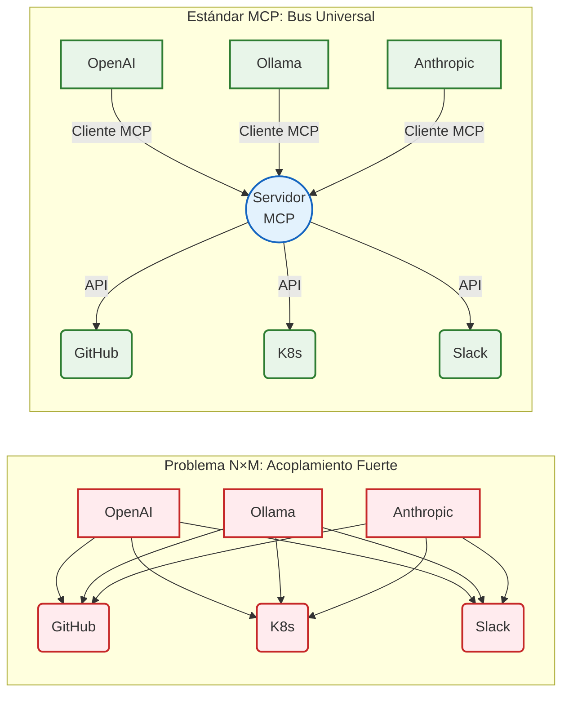
```mermaid
flowchart LR
  subgraph Tradicional [Problema N×M: Acoplamiento Fuerte]
    LLM1[OpenAI] --> T1(GitHub)
    LLM1 --> T2(K8s)
    LLM1 --> T3(Slack)
    
    LLM2[Ollama] --> T1
    LLM2 --> T2
    LLM2 --> T3
    
    LLM3[Anthropic] --> T1
    LLM3 --> T2
    LLM3 --> T3
  end

  subgraph MCP_Std [Estándar MCP: Bus Universal]
    L1[OpenAI] -->|Cliente MCP| Bus((Servidor<br>MCP))
    L2[Ollama] -->|Cliente MCP| Bus
    L3[Anthropic] -->|Cliente MCP| Bus
    
    Bus -->|API| S1(GitHub)
    Bus -->|API| S2(K8s)
    Bus -->|API| S3(Slack)
  end

  classDef bad fill:#ffebee,stroke:#c62828,stroke-width:2px;
  classDef good fill:#e8f5e9,stroke:#2e7d32,stroke-width:2px;
  classDef core fill:#e3f2fd,stroke:#1565c0,stroke-width:2px;

  class LLM1,LLM2,LLM3,T1,T2,T3 bad;
  class L1,L2,L3,S1,S2,S3 good;
  class Bus core;
```

</div>
<p align="center"><i><b>Figura 1:</b> Contraste arquitectónico entre el problema de integración N×M (acoplamiento propietario) y la topología de Bus Universal propuesta por el protocolo MCP.</i></p>

### 2.2.1. Génesis y Principios de MCP

Para resolver esta fragmentación sistémica, en el último trimestre de 2024, Anthropic (los creadores de la familia de modelos *Claude*) lideró la apertura de un nuevo estándar *open-source*: el **Model Context Protocol (MCP)** [9]. La motivación central de MCP es desacoplar de forma estricta al consumidor de la IA (el agente) de las fuentes de datos e infraestructuras locales (las herramientas), creando un lenguaje universal. 

MCP se inspira profundamente en el éxito del *Language Server Protocol (LSP)* de Microsoft, el cual estandarizó la comunicación entre los editores de código (IDEs) y los compiladores. Del mismo modo, MCP busca convertirse en la capa estándar que conecte cualquier asistente generativo con el entorno computacional de la organización, promoviendo una arquitectura conectable (*pluggable*) basada en el protocolo ligero `JSON-RPC 2.0`.

### 2.2.2. Arquitectura Cliente-Servidor de MCP

El protocolo abandona las integraciones monolíticas en favor de un diseño cliente-servidor estrictamente definido, garantizando fronteras de seguridad nítidas:

- **MCP Host / Client (El Agente):** Es la aplicación que interactúa con el usuario y gestiona el flujo de razonamiento del LLM. El cliente es agnóstico a la implementación de las herramientas; su única responsabilidad es negociar con el servidor mediante mensajes estándar, inyectar el contexto recuperado en el *prompt* del modelo, y solicitar al servidor la ejecución de las funciones decididas por la IA. En el presente proyecto, el componente `AgentOrchestrator` implementa las lógicas derivadas de un cliente MCP.
- **MCP Server (El Entorno):** Es un proceso ligero e independiente, desplegado dentro de la zona de confianza de la organización (en el caso de este TFM, operado por el Servicio de Informática de la universidad). El servidor obvia la existencia de modelos de lenguaje; su propósito es encapsular la lógica de negocio imperativa (ej. generar un manifiesto YAML de Kubernetes) y exponer esta capacidad a través de un esquema JSON estandarizado.

Ambos actores se comunican a través de transportes estandarizados. MCP soporta integraciones locales directas mediante los canales de Entrada/Salida estándar del sistema operativo (**stdio**), ideal para herramientas que corren en la misma máquina que el agente, y transporte web basado en **Server-Sent Events (SSE)** sobre HTTP, indispensable para infraestructuras distribuidas y arquitecturas nativas de la nube (*Cloud Native*).

### 2.2.3. Primitivas del Protocolo: Resources, Prompts y Tools

El estándar MCP orquesta la interacción entorno-modelo a través de tres primitivas de datos fundacionales:

1. **Resources (Recursos):** Datos de naturaleza estática o de solo lectura controlados por el servidor. Permiten inyectar contexto adicional en la ventana de memoria del LLM sin otorgarle capacidad de mutación. Ejemplos clásicos incluyen la lectura del registro de estado actual de un clúster de Kubernetes, bases de datos o documentación corporativa local.
2. **Prompts:** Plantillas de instrucciones parametradas y almacenadas en el servidor, permitiendo la estandarización organizativa. Un administrador puede definir un *prompt* en el servidor ("Resume el estado de este nodo") y el agente cliente puede invocarlo y presentarlo al usuario.
3. **Tools (Herramientas):** Son capacidades ejecutables y con efectos secundarios (mutaciones en el entorno) controladas por el servidor. Las herramientas son el equivalente estandarizado del *Function Calling*. Cuando el servidor MCP de la universidad se inicializa, transmite al cliente un catálogo de herramientas (por ejemplo, `deploy_python_app`), dictaminando los argumentos exactos requeridos (como nombre de proyecto y versión del lenguaje). 

La adopción formal del Model Context Protocol mediante su Software Development Kit (SDK) oficial en Python constituye la columna vertebral arquitectónica del *Agentic Deployer* desarrollado en este TFM. Esta decisión estratégica garantiza que el catálogo de automatizaciones de infraestructura de la institución quede blindado frente a los giros del mercado de la Inteligencia Artificial. Las herramientas expuestas por el Servidor MCP del proyecto son consumibles indistintamente por el agente local diseñado (Streamlit + Ollama) y por soluciones empresariales externas y *closed-source* (como el Inspector oficial o aplicaciones de terceros), asegurando un ciclo de vida útil del software extendido y una interoperabilidad robusta.

Cabe mencionar que este paradigma de estandarización se encuentra en rápida evolución. Mientras MCP se posiciona como el estándar líder (a fecha de 2024-2026) para la comunicación Cliente-Servidor (Agente-Herramienta), la industria explora paralelamente iniciativas como el **Agent-to-Agent Protocol (A2A)** impulsado por Google (2025) [14], orientado a orquestar enjambres donde múltiples agentes autónomos delegan sub-tareas entre sí de forma estandarizada. Aunque A2A trasciende el alcance de este TFM (centrado en la interacción Agente-Infraestructura), evidencia la madurez y necesidad inminente de estos lenguajes francos en el estado del arte.

## 2.3. Orquestación e Infraestructura Declarativa (Kubernetes)

Para comprender el desafío que supone la provisión autónoma de infraestructura, es imperativo analizar el cambio de paradigma introducido por Kubernetes (K8s) [5] en el ámbito de las operaciones. Originado en Google bajo el proyecto interno *Borg* y posteriormente donado a la *Cloud Native Computing Foundation* (CNCF), Kubernetes se ha erigido como el estándar *de facto* para la orquestación de cargas de trabajo en contenedores. Su dominio en el mercado no se debe únicamente a su robustez técnica, sino a la adopción estricta de un modelo de gestión **declarativo**.

### 2.3.1. Imperativo vs. Declarativo

En los albores de la administración de sistemas, las operaciones seguían un enfoque imperativo. Los administradores interactuaban con los servidores mediante secuencias explícitas de comandos (ej. rutinas *bash* o *scripts* en servidores remotos). En un modelo imperativo, el usuario dicta *cómo* deben realizarse las acciones paso a paso: "descarga esta imagen, inicia el contenedor, abre el puerto 80, verifica si está vivo". Este enfoque, si bien directo, es inherentemente inflexible. Si un servidor se reinicia o un proceso falla, el script imperativo carece del contexto necesario para devolver el sistema a la normalidad sin intervención humana.

En contraposición, Kubernetes abraza el modelo declarativo (Infraestructura como Código - IaC). En un paradigma declarativo, el ingeniero no instruye a la máquina sobre *cómo* hacer el trabajo; en su lugar, describe exclusivamente el **estado final deseado** (*Desired State*). El usuario declara, mediante manifiestos estructurados en lenguaje YAML o JSON: "Deseo que existan exactamente 3 réplicas del contenedor de WordPress expuestas en el puerto 8080".

### 2.3.2. Bucles de Reconciliación y el Plano de Control

La materialización de este estado deseado es responsabilidad exclusiva del Plano de Control (*Control Plane*) de Kubernetes, operando a través de un mecanismo denominado **Bucle de Control o Reconciliación** (*Control Loop*).

Un clúster de K8s evalúa continuamente la topología de la red y los procesos en ejecución. De manera asíncrona, compara el **Estado Real** (*Actual State*) del clúster (por ejemplo, "hay 2 réplicas de WordPress en ejecución porque un nodo físico acaba de fallar") contra el **Estado Deseado** almacenado en su base de datos distribuida (`etcd`). Al detectar una divergencia (2 réplicas reales vs. 3 réplicas deseadas), el bucle de reconciliación infiere de forma autónoma las acciones necesarias para corregir la desviación (desplegar un nuevo contenedor en un nodo sano), ejecutándolas sin requerir una nueva instrucción imperativa del operador humano.

### 2.3.3. Complejidad Sintáctica y Carga Cognitiva

A pesar de las indudables ventajas de resiliencia y auto-sanación (*self-healing*) que ofrece el modelo declarativo, la definición técnica del estado deseado introduce una severa carga cognitiva. La API de Kubernetes está compuesta por decenas de Recursos Personalizados (*Custom Resource Definitions* - CRDs), cada uno con una semántica y un esquema estricto de validación.

Desplegar un simple servicio web en producción raramente implica redactar un solo manifiesto. Para exponer una aplicación de forma segura al exterior, un desarrollador debe coordinar y enlazar sintácticamente al menos tres primitivas fundamentales:
1. **Deployment:** Define el contenedor de la aplicación, su imagen base, la política de reinicios, las sondas de vida (*liveness probes*) y las reservas estrictas de memoria y CPU.
2. **Service:** Abstrae la volatilidad de las direcciones IP internas de los contenedores subyacentes, creando un punto de acceso de red estable (*ClusterIP*) para balancear el tráfico.
3. **Ingress:** Expone las rutas HTTP/HTTPS desde el exterior del clúster hacia los *Services* internos, gestionando reglas de enrutamiento por nombre de dominio y terminación SSL/TLS.

La interdependencia entre estos recursos exige un nivel de precisión milimétrica (por ejemplo, el anidamiento correcto de selectores de etiquetas, o *labels*, entre el *Deployment* y el *Service*). Un simple error de indentación en el formato YAML, o un fallo en el mapeo de un selector de red, provocará que la aplicación se despliegue en una isla de red inaccesible (sin devolver errores obvios de compilación).

Es esta inherente aridez sintáctica y complejidad estructural la que levanta una barrera de entrada para los usuarios ajenos al ecosistema *Cloud Native*, y constituye el problema fundamental que el orquestador agéntico de este TFM busca resolver, asumiendo la labor cognitiva de redactar el código declarativo a partir de intenciones en lenguaje natural.

## 2.4. Arquitectura Hexagonal y Seguridad en Sistemas Estocásticos

La integración de Modelos de Lenguaje en sistemas críticos de infraestructura plantea un dilema de seguridad estructural. Los LLM, por su propia naturaleza estadística, son impredecibles (estocásticos). En contraste, los sistemas de provisión corporativa exigen un determinismo absoluto (por ejemplo, rechazar sistemáticamente cualquier despliegue que intente utilizar el puerto 22, reservado para SSH). Para conciliar la agilidad de la IA con la rigidez de las normativas de IT, el *Agentic Deployer* adopta los principios de la **Arquitectura Hexagonal**.

### 2.4.1. Fundamentos de *Ports and Adapters*

Formalizada por Alistair Cockburn en 2005 [15] bajo el nombre de patrón de Puertos y Adaptadores (*Ports and Adapters*), la Arquitectura Hexagonal nació como respuesta a los problemas endémicos de las arquitecturas tradicionales en capas (Presentación $\rightarrow$ Lógica de Negocio $\rightarrow$ Base de Datos). En el diseño tradicional en capas, la lógica de negocio a menudo se contamina con dependencias transitivas de la base de datos o de los *frameworks* de interfaz de usuario.

El objetivo central de la Arquitectura Hexagonal es permitir que una aplicación sea operada de forma equitativa por usuarios, programas, pruebas automatizadas o *scripts* por lotes, y que pueda ser desarrollada y probada de forma aislada respecto a sus eventuales dispositivos e infraestructuras y bases de datos en tiempo de ejecución. 

Visualmente representada como un hexágono, la arquitectura propone una división estricta en dos zonas diametralmente aisladas:
- **El Interior (El Núcleo o *Domain*):** Alberga exclusivamente las reglas de negocio puras y el modelo de datos. Carece por completo de dependencias hacia el exterior; no importa librerías HTTP, drivers de bases de datos ni SDKs de Inteligencia Artificial.
- **El Exterior (Los Adaptadores):** Contiene todos los detalles de implementación tecnológica (APIs REST, clientes de bases de datos, integraciones con OpenAI u orquestadores de Kubernetes).

### 2.4.2. Inversión de Dependencias (El Principio 'D' de SOLID)

El puente de comunicación entre el Interior (inmutable) y el Exterior (volátil) se implementa mediante **Puertos**. Un Puerto es una interfaz abstracta o un contrato (típicamente una interfaz en lenguajes como Java o clases abstractas / *Protocols* en Python). 

La robustez estructural de esta arquitectura recae en la aplicación estricta del Principio de Inversión de Dependencias (Dependency Inversion Principle - DIP). En lugar de que el núcleo de negocio dependa del cliente de Kubernetes para desplegar, el núcleo define una abstracción `DeployPort` (por ejemplo, `def deploy(intent): pass`). Es la capa externa (el adaptador de K8s) la que hereda y debe implementar dicho contrato. El núcleo solo conoce la interfaz abstracta, jamás la implementación real. 

### 2.4.3. Confinamiento de la Inteligencia Artificial

La adopción de este patrón arquitectónico es la piedra angular de la seguridad en el presente Trabajo de Fin de Máster. Si el modelo de negocio (ej. la clase `DeploymentIntent`) se define en el núcleo puro de la aplicación, fuertemente tipado (mediante Pydantic), se establece una barrera computacional sólida.

En un flujo convencional, el Agente LLM ejerce de **Adaptador Primario (Driver)**. Genera peticiones intentando invocar los casos de uso del sistema. Debido a la Arquitectura Hexagonal, el LLM jamás puede eludir la validación de negocio para atacar directamente a la infraestructura (el **Adaptador Secundario o Driven**), ya que desconoce su implementación. Toda intención generada por la IA debe cruzar ineludiblemente a través del Puerto de Entrada, donde es sometida a las reglas deterministas de validación del núcleo (ej. `SecurityContextValidator`).

Si el modelo "alucina" una configuración maliciosa, el núcleo la rechaza basándose en sus contratos puros, arrojando una excepción formal. Esta excepción no interrumpe el servicio, sino que fluye en sentido inverso hacia el exterior, donde el adaptador del agente la captura y la reinyecta en el contexto del LLM (el mecanismo de *Feedback Loop* del bucle ReAct). De este modo, la Arquitectura Hexagonal actúa como la verdadera "jaula" de contención, permitiendo explotar el razonamiento generativo sin comprometer la soberanía tecnológica sobre la infraestructura crítica.

## 2.5. Trabajos Relacionados y Posicionamiento Diferencial

La intersección entre agentes conversacionales y automatización de infraestructura ha generado una serie de iniciativas académicas e industriales en los últimos dos años. Esta sección analiza los enfoques más relevantes y posiciona el *Agentic Deployer* respecto a ellos, identificando las contribuciones diferenciales de este trabajo.

### 2.5.1. Enfoques Industriales: Copilots y Asistentes Cloud Propietarios

Los grandes proveedores de nube han lanzado asistentes conversacionales integrados en sus plataformas. Microsoft dispone de **GitHub Copilot for Azure** y el **Azure AI Assistant** integrado en el portal web, que permiten consultar el estado de los recursos desplegados mediante lenguaje natural. Google ofrece capacidades similares mediante **Gemini for Google Cloud**, y AWS con **Amazon Q Developer**.

Sin embargo, estas soluciones presentan limitaciones estructurales significativas para entornos institucionales:

| Dimensión | Asistentes Cloud Propietarios | Agentic Deployer |
|---|---|---|
| **Proveedor** | Monoproveedor (Azure, GCP, AWS) | Agnóstico (Ollama, OpenAI, cualquier LLM) |
| **Soberanía del dato** | Datos en servidores del proveedor | Zero Data Retention (Ollama local) |
| **HITL obligatorio** | No — ejecución directa posible | Sí — barrera FSM inmutable |
| **Coste** | Pago por uso | Infraestructura propia (OPEX predecible) |
| **Personalización** | Limitada a la consola del proveedor | Golden Paths propios del SIC |
| **Auditabilidad** | Logs del proveedor | Logs propios + FSM con estados inmutables |
<p align="center"><i><b>Tabla 1:</b> Comparativa entre Asistentes Cloud Propietarios y el Agentic Deployer.</i></p>

El *Agentic Deployer* sacrifica la conveniencia del SaaS en favor de la soberanía tecnológica, una prioridad crítica en entornos académicos regulados por legislación de protección de datos (RGPD, LOPDGDD).

### 2.5.2. Enfoques de Investigación: LLMs para IaC (*Infrastructure as Code*)

En el ámbito académico, varios trabajos han explorado el uso de modelos de lenguaje para generar código de infraestructura. Entre los más relevantes se encuentran:

- **"Automatic Terraform Generation with GPT-4"** (trabajos preliminares, 2023-2024): Proponen usar LLMs para generar ficheros Terraform a partir de especificaciones en lenguaje natural. Sin embargo, estos enfoques delegan la corrección semántica y de seguridad al propio LLM, sin una capa de validación formal determinista. El modelo puede generar código de IaC sintácticamente válido pero semánticamente inseguro (puertos abiertos, imágenes sin auditar), sin mecanismo de interceptación.

- **"ChatOps and LLMs for DevOps Automation"** (diversas publicaciones 2023-2024): Exploran la integración de chatbots en plataformas de comunicación empresarial (Slack, Teams) para trigger de pipelines CI/CD. La aproximación es pragmática pero superficial desde el punto de vista arquitectónico: los LLMs invocan comandos de forma directa sin modelo de dominio intermedio ni patrón HITL formal.

La contribución diferencial de este TFM respecto a estos trabajos es la **separación formal entre el plano de razonamiento (LLM) y el plano de ejecución (Hexagonal)**, implementada mediante un protocolo estándar abierto (MCP) y reforzada por una barrera de supervisión humana basada en una FSM inmutable.

### 2.5.3. Frameworks de Orquestación: LangChain y AutoGen

Los frameworks de código abierto más populares para la construcción de agentes son **LangChain** (Harrison Chase, 2022) [16] y **AutoGen** (Microsoft, 2023) [17]. Ambos ofrecen abstracciones de alto nivel para la construcción de cadenas de razonamiento y sistemas multi-agente.

No obstante, su aplicación directa al dominio de operaciones de infraestructura crítica presenta tres riesgos no resueltos:

1. **Acoplamiento al framework:** El código de negocio queda embebido en las abstracciones de LangChain (`Chains`, `Agents`, `Tools`). Una migración futura a otro framework requiere reescribir la lógica de dominio, violando el principio de inversión de dependencias.
2. **Ausencia de modelo de dominio formal:** LangChain no impone un modelo de datos tipado para las herramientas. Un `tool` incorrecto puede devolver texto libre, imposibilitando la validación determinista de las intenciones generadas.
3. **Ausencia de protocolo estándar:** Las herramientas de LangChain no son consumibles por clientes distintos al propio framework. Dos organizaciones usando LangChain con herramientas distintas no pueden compartir ni federar su catálogo de capacidades.

El *Agentic Deployer* aborda los tres problemas mediante el trío MCP (estandarización) + Arquitectura Hexagonal (aislamiento del dominio) + FSM (gobierno del ciclo de vida). La ausencia de dependencias en LangChain o AutoGen es, por tanto, una decisión de diseño deliberada y no una omisión.

### 2.5.4. Posicionamiento del Agentic Deployer

La siguiente tabla sintetiza el posicionamiento del sistema desarrollado respecto al estado del arte. El objetivo no es establecer una superioridad general, sino evidenciar cómo el *Agentic Deployer* cubre una intersección de requisitos corporativos que los *frameworks* de propósito general delegan al desarrollador:

| Capacidad Arquitectónica | LangChain / AutoGen | Soluciones Cloud (Copilots) | **Agentic Deployer** |
|---|---|---|---|
| **Soberanía de Datos (On-Premise)** | Sí (Soportan modelos locales) | No (SaaS propietario) | **Sí (Ollama Nativo)** |
| **Interoperabilidad de Herramientas** | No (Acoplamiento a librerías propias) | Cerrada (Ecosistema del proveedor) | **Sí (Estándar abierto MCP)** |
| **Flujo de Aprobación Humana (HITL)** | Sí (Interrupción de consola / *Callbacks*) | Parcial (Depende de la plataforma) | **Sí (Panel asíncrono con máquina de estados)** |
| **Validación de Seguridad Estricta** | Parcial (Requiere implementación ad-hoc) | Sí (Barreras propietarias del Cloud) | **Sí (Arquitectura Hexagonal con validación estática)** |
| **Flexibilidad de Integración** | Alta (Librerías generalistas masivas) | Baja (Agnosticismo nulo) | **Media (Enfocado estrictamente a infraestructura)** |
<p align="center"><i><b>Tabla 2:</b> Posicionamiento del sistema respecto al estado del arte.</i></p>

Como se observa, *frameworks* como AutoGen o LangChain poseen capacidades de *Human-in-the-Loop* o ejecución local, pero están diseñados como librerías de propósito general para desarrolladores. La aportación diferencial del *Agentic Deployer* reside en empaquetar estas necesidades en una topología arquitectónica de nivel empresarial (Hexagonal + FSM) gobernada por el estándar unificador MCP.

En definitiva, el *Agentic Deployer* no compite en el espacio de los asistentes conversacionales generalistas, sino que ocupa un nicho específico y de alta relevancia práctica: la **gobernanza segura y auditable de infraestructura declarativa mediante agentes conversacionales en entornos institucionales con requisitos de soberanía del dato**.


<div style='page-break-after: always;'></div>

# Capítulo 3. Metodología y Stack Tecnológico

La construcción de un sistema de orquestación que hibrida disciplinas clásicas de Ingeniería de Software (Arquitectura Hexagonal, testing riguroso, APIs REST) con dominios emergentes e intrínsecamente inestables como la Inteligencia Artificial Generativa, requiere un marco metodológico estricto. Este capítulo describe la metodología de trabajo adoptada a lo largo del ciclo de vida del *Agentic Deployer*, las fases de desarrollo planificadas y la justificación técnica de las herramientas que conforman el ecosistema final de la aplicación.

## 3.1. Enfoque Metodológico

El desarrollo de software orientado a Inteligencia Artificial difiere significativamente del desarrollo web o de aplicaciones corporativas tradicionales. En un sistema estándar, una entrada A (por ejemplo, pulsar un botón) produce invariablemente una salida B. En un sistema orquestado por un Modelo de Lenguaje de Gran Escala (LLM), la entrada A (una instrucción en lenguaje natural) puede generar múltiples salidas semánticamente equivalentes pero sintácticamente dispares. Esta volatilidad obliga a cimentar el proyecto sobre prácticas que aíslen el determinismo de la estocasticidad.

Para gobernar este riesgo, el Trabajo de Fin de Máster se ha regido por una **metodología de desarrollo iterativa e incremental**, fuertemente influenciada por los principios del *Domain-Driven Design* (DDD) y el desarrollo guiado por pruebas (TDD / *Test-Driven Development*). En lugar de construir el sistema horizontalmente (diseñando primero toda la base de datos, luego todo el backend y finalmente todo el frontend), la metodología dictaminó un crecimiento radial o concéntrico de adentro hacia afuera, alineado con los preceptos de la Arquitectura Hexagonal.

La regla metodológica fundamental del proyecto fue la **estabilidad del núcleo antes de la integración estocástica**: no se permitió escribir una sola línea de código relacionada con la API de OpenAI, Ollama o el estándar MCP hasta que el modelo de dominio interno (`DeploymentIntent`) y el motor de validación (`SecurityContextValidator`) demostraron una resiliencia matemática del 100% (verificada mediante pruebas automatizadas masivas). Construir el motor de IA primero y la lógica de validación después habría expuesto el prototipo a vulnerabilidades críticas de infraestructura desde las primeras fases de pruebas.

## 3.2. Fases de Desarrollo

Para materializar el producto final, el cronograma de ejecución se dividió orgánicamente en **cinco *sprints* de desarrollo** más dos fases transversales de consolidación y cierre (Fases 6 y 7, detalladas en la Sección 9.2 y el Anexo B). Cada sprint culminó con un entregable técnico funcional (un incremento de producto) que servía de base inmutable para la siguiente etapa.

> *Nota metodológica: si bien la planificación inicial establece una secuencia ordenada de sprints, la naturaleza del trabajo académico y los compromisos paralelos inherentes al contexto universitario exigen reconocer que la asignación temporal de cada fase puede solaparse o reordenarse según disponibilidad. La planificación se concibe, por tanto, como un marco de referencia flexible y no como una secuencia rígida de Gantt. Los detalles de esta retrospectiva se documentan en el Capítulo 10.*

### 3.2.1. Fase 1: Núcleo Hexagonal y Dominio Base

Esta fase supuso los cimientos del proyecto. El objetivo era modelar matemáticamente las reglas de negocio de un Servicio de Informática (SIC) universitario, obviando la existencia de la inteligencia artificial.
- **Modelado de Entidades:** Se definió la ontología de los despliegues. Se implementó la clase `DeploymentIntent` utilizando tipado estricto, definiendo los requerimientos ineludibles (nombre de la aplicación, imagen base, puerto, cuotas de recursos).
- **Validación y Casos de Uso:** Se desarrolló el `SecurityContextValidator`, un motor de reglas determinista diseñado para interceptar intenciones maliciosas (como el uso de puertos privilegiados del sistema operativo o la invocación de imágenes no permitidas).
- **Contratos (Ports):** Se definió el puerto abstracto de despliegue (`DeployPort`), estableciendo el contrato que cualquier infraestructura futura (Kubernetes, Docker Swarm, Nomad) debería satisfacer.

### 3.2.2. Fase 2: Interfaz de Control y Dashboard HITL

Antes de otorgar agencia a un modelo de IA, era preceptivo construir la "jaula" operativa: el mecanismo de supervisión técnica.
- **Capa REST API:** Se construyó la capa externa de aplicación (el adaptador *driving* principal) mediante un servidor HTTP que permitiese recibir las intenciones de despliegue de forma estructurada.
- **Flujo de Pendencia:** Se implementó la lógica de estado transicional. Las intenciones aprobadas por el motor de seguridad no se ejecutaban directamente, sino que se bloqueaban en un estado de `PENDING_APPROVAL`.
- **Panel de Operador:** Se diseñó y codificó una interfaz gráfica (*Dashboard*) asíncrona para que el personal del SIC pudiera auditar visualmente las intenciones bloqueadas y emitir la autorización final (`POST /hitl/approve`), cerrando así el diseño del patrón *Human-In-The-Loop* (HITL).

### 3.2.3. Fase 3: Integración de Infraestructura (*Golden Paths*)

El tercer incremento dotó de "manos" al sistema. Aunque la ejecución final contra un clúster físico quedaba fuera del alcance estricto, el orquestador debía probar su capacidad para redactar infraestructura real.
- **Adaptador Simulado:** Se codificó el `FakeK8sAdapter`, un componente que implementa el contrato `DeployPort`.
- **Materialización Declarativa:** En esta fase se implementaron las plantillas de los *Golden Paths* (rutas pavimentadas). Al recibir una intención aprobada, el adaptador extrae las variables (nombre, recursos) y genera en el disco físico del servidor los manifiestos YAML completos y entrelazados (Deployment, Service, Ingress), demostrando que el sistema produce configuraciones listas para producción sin el tedio sintáctico habitual.

### 3.2.4. Fase 4: Servidor MCP y Bucle de Inteligencia (ReAct)

Con una infraestructura determinista, auditada y capaz de generar YAML, la penúltima fase integró el "cerebro" del sistema, delegando la interfaz humana en la IA.
- **Protocolo MCP:** Se integró el SDK del *Model Context Protocol*, refactorizando las capacidades del SIC (ej. `deploy_python_app`) en herramientas estandarizadas (Tools) expuestas a través del protocolo `stdio`.
- **Motor ReAct:** Se programó el `AgentOrchestrator`, un bucle lógico iterativo capaz de comunicarse con LLMs a través de un adaptador agnóstico (OpenAI/Ollama). Este motor interpreta los JSON devueltos por el modelo, ejecuta la herramienta MCP correspondiente en el backend, e inyecta la observación resultante de vuelta al LLM (el vital *Feedback Loop* de seguridad).

### 3.2.5. Fase 5 (QA Avanzado): Blindaje Metamórfico

Añadida como una capa de valor adicional (*bonus*) no prevista en el alcance inicial puro, pero considerada crítica para el rigor de un proyecto de ingeniería corporativa. Consistió en estresar el middleware ante el no-determinismo del LLM.
- Se integraron técnicas de validación punteras como el *Property-Based Testing* (generando miles de intenciones pseudoaleatorias válidas) y Pruebas Metamórficas para verificar la resiliencia del modelo ante alteraciones lingüísticas (ruido sintáctico en el prompt, cambios de orden en las palabras).
- Por último, se auditó la propia suite de pruebas con *Mutation Testing*, demostrando la robustez extrema del validador de seguridad.

### 3.2.6. Fase 6 (Post-MVP): Robustez y Cierre del Ciclo HITL

Tras la consolidación del MVP, se abordaron una serie de mejoras de calidad y usabilidad que elevan el sistema a un nivel de referencia académica:
- **Cliente Ollama Nativo (`OllamaLLMClient`):** Eliminación de la dependencia en la librería `openai` para comunicaciones con el servidor Ollama local, sustituyéndola por peticiones `httpx` directas a la API REST nativa. Esta refactorización garantiza un esquema de *Zero Data Retention* sin dependencias de terceros.
- **Canal de Retorno al Investigador:** Implementación del endpoint `GET /hitl/status/{id}` y el panel de notificaciones en el chat (` Mis Solicitudes Pendientes`), cerrando el ciclo de comunicación bidireccional del patrón HITL (sección 6.4).
- **Ampliación de Evidencias Empíricas:** Creación del directorio `demos/` con transcripciones forenses de las sesiones de ejecución real y el manifiesto YAML generado por el `FakeK8sAdapter` (Anexo A).

### 3.2.7. Fase 7 (Excelencia Técnica y Experimentos Multi-Modelo)

Como esfuerzo final fuera del alcance inicial (Prioridad P2), se elevó el estándar del prototipo mediante tres hitos arquitectónicos:
- **Persistencia Transaccional:** Migración del almacenamiento de memoria volátil a una base de datos **SQLite**, dotando a la Máquina de Estados de robustez ACID.
- **Escalado del Catálogo MCP:** Ampliación del servidor de 4 a 7 herramientas operativas, integrando capacidades complejas como gestión de bases de datos o borrado de servicios institucionales.
- **Validación Empírica Extendida:** Ejecución de pruebas comparativas sobre un espectro amplio de modelos, tanto Cloud (Gemini, Cohere, Groq) como Locales especializados (Qwen Coder), consolidando definitivamente las conclusiones de viabilidad del proyecto.

## 3.3. Stack Tecnológico y Justificación Arquitectónica

La elección de tecnologías en un ecosistema que combina Inteligencia Artificial y provisionamiento de infraestructura debe equilibrar la innovación disruptiva con la fiabilidad matemática exigida por las operaciones institucionales. A continuación, se desglosa y fundamenta el *stack* tecnológico adoptado.

### 3.3.1. Lenguaje Base: Python 3.12
El proyecto se ha construido íntegramente sobre **Python (versión 3.12)**. Si bien lenguajes como Go ostentan la hegemonía histórica en el ecosistema *Cloud Native* (Kubernetes y Terraform están escritos en Go), Python mantiene un monopolio absoluto en la investigación y desarrollo de Inteligencia Artificial. La elección de Python 3.12 permite aprovechar las últimas optimizaciones del intérprete CPython y, crucialmente, el soporte nativo para un tipado estático avanzado (Type Hints y genéricos). Esta característica es vital para implementar interfaces abstractas sólidas dentro de la Arquitectura Hexagonal, mitigando los históricos problemas del tipado dinámico en sistemas críticos.

### 3.3.2. Capa Backend y Modelado de Datos
- **FastAPI:** Elegido como el *framework* web primario por encima de alternativas clásicas como Django o Flask. FastAPI no solo destaca por su rendimiento excepcional (sustentado en la especificación ASGI y la librería *Starlette*), sino por su generación automática de contratos de API (OpenAPI/Swagger). Para un Agente LLM, interactuar con una API que expone un esquema riguroso y auto-documentado facilita exponencialmente la comprensión de las herramientas.
- **Pydantic (v2):** Constituye el núcleo de validación de datos [18]. Reescripto recientemente en Rust para maximizar su velocidad, Pydantic se utiliza para modelar las entidades de dominio (como `DeploymentIntent`). Su justificación recae en su capacidad para forzar invariantes de negocio: rechazar peticiones del agente que no cumplan con rangos enteros (puertos) o expresiones regulares, antes incluso de que la lógica de la aplicación las procese.

### 3.3.3. Interfaz Conversacional y Capa de Agente
- **Streamlit [19]:** Desarrollar interfaces gráficas (*Front-End*) modernas en React o Vue.js conlleva una alta fricción y sobrecarga de dependencias. Streamlit permite codificar la interfaz de chat (incluyendo historial, avatares, indicadores de estado y el panel de notificaciones HITL) íntegramente en Python puro. Esto permite iterar el componente visual de forma ágil, manteniendo el foco del trabajo investigador en la ingeniería del *middleware* de infraestructura.
- **Model Context Protocol (MCP) SDK:** En lugar de diseñar una API HTTP propietaria para invocar herramientas, se ha adoptado el SDK oficial de MCP para Python. Esta librería permite decorar funciones arbitrarias (ej. `@server.tool()`) e introspeccionar sus firmas (nombres de parámetros y tipos) en tiempo de ejecución, transformándolas en esquemas JSON estandarizados consumibles por cualquier cliente LLM.
- **Abstracción Agnóstica de Proveedor LLM:** El orquestador implementa un contrato abstracto (`LLMClient`) con dos implementaciones concretas:
 - **`OllamaLLMClient`**: Cliente nativo implementado con `httpx` que se comunica directamente con la API REST de Ollama [20] (`POST /api/chat`), sin dependencias externas adicionales. Permite ejecutar modelos especializados como **`qwen2.5-coder:7b`** o generalistas en la red privada institucional, garantizando un esquema de **Soberanía del Dato** (*Zero Data Retention*) imperativo para administraciones públicas. No envía ningún token de texto del investigador a servidores externos.
 - **`OpenAILLMClient`**: Adaptador que implementa el protocolo estándar de OpenAI. Su diseño agnóstico permitió utilizarlo como puente (*proxy*) para evaluar empíricamente ecosistemas *cloud* de terceros (Google Gemini, Cohere Command-R, Mistral, Llama 3) sin acoplar el sistema a una única corporación. La selección del cliente (Local o Cloud) se realiza exclusivamente mediante la variable de entorno `LLM_PROVIDER`, sin requerir modificaciones al código de dominio.

### 3.3.4. Ecosistema de Aseguramiento de Calidad (QA)
La confianza operativa en el *Agentic Deployer* se asienta sobre un *pipeline* de validación agresivo, sustentado por un ecosistema de librerías avanzadas:
- **Pytest:** *Framework* base para la estructuración y ejecución de pruebas de unidad e integración, proveyendo un robusto sistema de inyección de dependencias (fixtures).
- **Hypothesis:** Librería especializada en *Property-Based Testing*. A diferencia de las pruebas estáticas escritas a mano, Hypothesis inyecta ruido y genera dinámicamente miles de permutaciones de intenciones de despliegue para intentar corromper o sortear el validador de seguridad.
- **Mutmut:** Herramienta de *Mutation Testing* que aplica alteraciones lógicas al código fuente del sistema en tiempo de ejecución. Garantiza empíricamente que la suite de pruebas es lo suficientemente exhaustiva como para detectar el más sutil de los fallos lógicos.
- **Locust y Playwright:** Empleadas para certificar el rendimiento y la usabilidad final. *Locust* inunda la API asíncrona simulando concurrencia masiva, demostrando la escalabilidad del patrón asíncrono implementado. *Playwright* orquesta pruebas de interfaz E2E (*End-to-End*), levantando instancias de navegadores *headless* para simular y afirmar la interacción real del técnico (SIC) aprobando despliegues en el panel. 
- **Ruff y Mypy:** Cadena de herramientas estáticas (*Linting* y *Type-Checking*) utilizadas en los ciclos de Integración Continua (CI) local para asegurar una homogeneidad estilística y rechazar cualquier compilación que vulnere los contratos de tipos de Python.

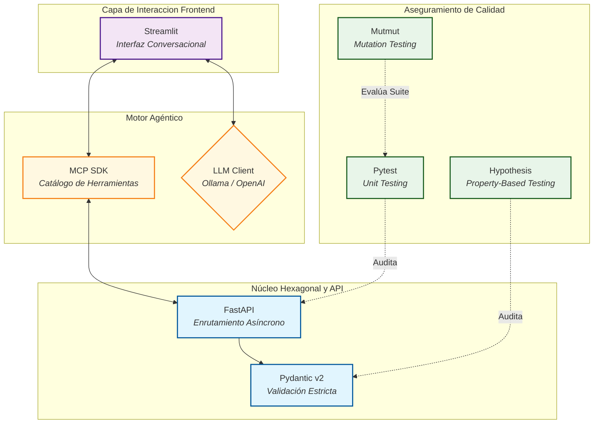
```mermaid
flowchart TD
    subgraph UI [Capa de Interaccion Frontend]
        ST[Streamlit<br><i>Interfaz Conversacional</i>]
    end
    
    subgraph Cognicion [Motor Agéntico]
        MCP[MCP SDK<br><i>Catálogo de Herramientas</i>]
        LLM{LLM Client<br><i>Ollama / OpenAI</i>}
    end
    
    subgraph Backend [Núcleo Hexagonal y API]
        FA[FastAPI<br><i>Enrutamiento Asíncrono</i>]
        PY[Pydantic v2<br><i>Validación Estricta</i>]
    end
    
    subgraph QA [Aseguramiento de Calidad]
        PYT[Pytest<br><i>Unit Testing</i>]
        HYP[Hypothesis<br><i>Property-Based Testing</i>]
        MUT[Mutmut<br><i>Mutation Testing</i>]
    end
    
    ST <--> MCP
    ST <--> LLM
    MCP <--> FA
    FA --> PY
    PYT -.->|Audita| FA
    HYP -.->|Audita| PY
    MUT -.->|Evalúa Suite| PYT

    classDef ui fill:#f3e5f5,stroke:#4a148c,stroke-width:2px;
    classDef cog fill:#fff8e1,stroke:#f57f17,stroke-width:2px;
    classDef back fill:#e1f5fe,stroke:#01579b,stroke-width:2px;
    classDef qa fill:#e8f5e9,stroke:#1b5e20,stroke-width:2px;

    class ST ui;
    class MCP,LLM cog;
    class FA,PY back;
    class PYT,HYP,MUT qa;
```
<p align="center"><i><b>Figura 2:</b> Diagrama de componentes del Stack Tecnológico empleado, evidenciando la segregación entre las capas de interfaz, razonamiento cognitivo, backend restrictivo y las herramientas de validación de calidad continua.</i></p>


<div style='page-break-after: always;'></div>

# Capítulo 4. Diseño del Sistema y Arquitectura

El diseño arquitectónico de un sistema que interseca la toma de decisiones basada en Inteligencia Artificial Generativa con las operaciones críticas de infraestructura corporativa plantea un dilema fundacional: ¿Cómo aprovechar la agilidad e intuición lingüística de un Modelo de Lenguaje Estocástico (LLM) sin heredar su inherente imprevisibilidad técnica? 

El presente capítulo desglosa la respuesta ingenieril a esta disyuntiva, articulando una solución que actúa como un "traductor determinista". A lo largo de las siguientes secciones, se detallará la topología global de la solución a través del marco de modelado C4, justificando la segregación de responsabilidades de cada contenedor. Posteriormente, se analizará la fundamentación del núcleo lógico mediante la adopción de la Arquitectura Hexagonal (*Ports and Adapters*), la definición y estructuración de los contratos de provisión conocidos como *Golden Paths*, y la coreografía técnica completa del ciclo de vida de una petición, desde la cadena de texto inicial formulada por el usuario hasta la instanciación del código declarativo final en el servidor físico.

## 4.1. Modelado Topológico Arquitectónico (Estándar C4)

La documentación de arquitecturas de software modernas, caracterizadas por su naturaleza distribuida y asíncrona, resulta ineficaz cuando se aborda mediante diagramas de bloques informales o estándares excesivamente rígidos como UML (*Unified Modeling Language*). Para superar esta limitación y dotar al Trabajo de Fin de Máster de una representación rigurosa, no ambigua y jerárquica, se ha adoptado el **Modelo C4**.

El Modelo C4, concebido por el ingeniero de software Simon Brown [21], se basa en la abstracción jerárquica, asemejándose al funcionamiento de una herramienta de cartografía digital (como *Google Maps*). Permite al observador iniciar el análisis desde una vista macroscópica de los sistemas y los usuarios, y realizar un *zoom-in* progresivo hacia los contenedores de ejecución, los componentes lógicos internos y, finalmente, el código fuente subyacente. 

En este análisis topológico del *Agentic Deployer*, nos centraremos en desglosar los dos niveles de abstracción más relevantes para comprender las fronteras de red y las responsabilidades corporativas: el Nivel 1 (Contexto) y el Nivel 2 (Contenedores).

### 4.1.1. Nivel 1: Contexto del Sistema (System Context)

El diagrama de Contexto (Nivel 1) constituye el estrato más abstracto del modelado. Su objetivo primordial no es revelar la tecnología empleada, sino establecer los límites fronterizos del sistema desarrollado, ilustrando cómo este interactúa con los usuarios del mundo real y con otros sistemas de información preexistentes en el entorno corporativo.

En el ecosistema universitario en el que se enmarca este proyecto, se han identificado y modelado cuatro entidades primarias, divididas estructuralmente entre actores humanos y sistemas informáticos de caja negra.

#### 4.1.1.1. Actores Humanos Interactuantes

1. **El Investigador / Usuario Final (Vector de Entrada):** Representa al personal docente, investigador o administrativo de la universidad. Su principal característica arquitectónica es la **asimetría de conocimiento técnico**. Este actor comprende claramente sus necesidades operativas (por ejemplo, "Necesito publicar la página web del congreso de Biología Celular para la próxima semana"), pero desconoce por completo las herramientas declarativas subyacentes, la topología de la red de la universidad o los estándares de seguridad de contenedores. Su interacción con el sistema se restringe exclusivamente al uso de lenguaje natural no estructurado. Críticamente, por políticas de seguridad, este usuario carece de credenciales de red, accesos VPN o permisos de escritura directos contra la infraestructura de servidores de la institución.
2. **El Técnico de Operaciones / SIC (Vector de Gobierno):** Representa al ingeniero de sistemas del Servicio de Informática y Comunicaciones. En contraposición al investigador, este actor posee la autoridad técnica e institucional para alterar el estado del centro de datos. Su rol en el sistema no es la provisión manual, sino la auditoría. Actúa como el garante de seguridad en el paradigma *Human-In-The-Loop* (HITL). Requiere una interfaz gráfica determinista, rápida y libre de ambigüedades lingüísticas para validar o rechazar en bloque las operaciones sugeridas por la Inteligencia Artificial.

#### 4.1.1.2. Sistemas Externos de Caja Negra

3. **El Proveedor del Modelo de Lenguaje (LLM):** Actúa como el motor cognitivo externo del sistema. Dependiendo de las normativas de soberanía de datos de la institución, este nodo puede representar una API externa de alto rendimiento alojada en la nube (como OpenAI *gpt-4o* o Anthropic *Claude 3.5*) o un clúster *bare-metal* local ejecutando instancias *Open-Source* mediante herramientas como Ollama (ej. Mistral o Llama 3). Para la arquitectura del sistema, este proveedor es un oráculo sin estado (*stateless*): recibe un contexto, inyecta su capacidad heurística y devuelve un razonamiento probabilístico.
4. **El Clúster de Infraestructura (Kubernetes):** Constituye el destino terminal del flujo operativo. Representa la infraestructura física o virtual corporativa. Es el entorno productivo encargado de orquestar los contenedores, balancear la carga de red y gestionar los volúmenes de persistencia, ejecutando los manifiestos YAML derivados del sistema.

El orquestador *Agentic Deployer* (el software central desarrollado en este TFM) se ubica topológicamente en el epicentro matemático de estas cuatro entidades. Su misión sistémica es actuar como un mediador de confianza: asegurando que el investigador jamás se comunique directamente con Kubernetes, y que la Inteligencia Artificial jamás disponga de tokens de acceso directo para inyectar recursos en la red corporativa.

### 4.1.2. Nivel 2: Contenedores (Unidades de Ejecución)

Una vez delimitadas las fronteras externas, el Nivel 2 del Modelo C4 somete a la caja central (*Agentic Deployer*) a un proceso de ampliación. En este nivel, se revela que la solución propuesta no es un monolito monolítico, sino un ecosistema distribuido compuesto por unidades de despliegue independientes, denominadas arquitectónicamente como "Contenedores" (no confundir con contenedores Docker, aunque en la práctica suelan encapsularse como tales).

La decisión de fragmentar el sistema en múltiples procesos persigue maximizar la resiliencia operativa [22] y adherirse al principio de Separación de Preocupaciones (*Separation of Concerns*). Si un contenedor falla (por ejemplo, debido a un colapso en la inferencia del modelo), el resto de la plataforma debe continuar operando para garantizar la trazabilidad de los datos institucionales.

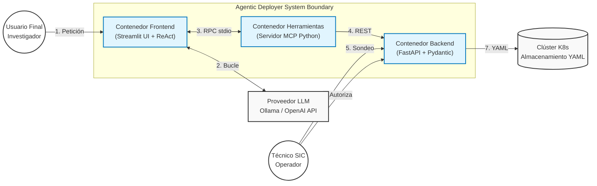
```mermaid
flowchart LR
  %% Definicion de Actores Humanos
  U((Usuario Final<br>Investigador))
  T((Técnico SIC<br>Operador))
  
  %% Sistemas Externos
  LLM[Proveedor LLM<br>Ollama / OpenAI API]
  K8S[(Clúster K8s<br>Almacenamiento YAML)]

  %% Frontera del Sistema
  subgraph sys [Agentic Deployer System Boundary]
    UI["Contenedor Frontend<br>(Streamlit UI + ReAct)"]
    MCP["Contenedor Herramientas<br>(Servidor MCP Python)"]
    CORE["Contenedor Backend<br>(FastAPI + Pydantic)"]
  end

  %% Relaciones y Flujos de Datos
  U -->|1. Petición| UI
  UI <-->|2. Bucle| LLM
  UI <-->|3. RPC stdio| MCP
  MCP -->|4. REST| CORE
  T -->|5. Sondeo| CORE
  T -->|6. Autoriza| CORE
  CORE -->|7. YAML| K8S

  %% Estilizado
  classDef external fill:#f9f9f9,stroke:#333,stroke-width:2px;
  classDef system fill:#e1f5fe,stroke:#0277bd,stroke-width:2px;
  classDef actor fill:#fff,stroke:#333,stroke-width:2px,shape:circle;
  
  class LLM,K8S external;
  class UI,MCP,CORE system;
  class U,T actor;
```
<p align="center"><i><b>Figura 3:</b> Diagrama de Contenedores (Nivel 2) del Modelo C4 para el sistema Agentic Deployer.</i></p>

#### 4.1.2.1. Desglose Funcional de los Contenedores

La siguiente figura ilustra cómo los componentes coexisten en la máquina local durante la ejecución del sistema:

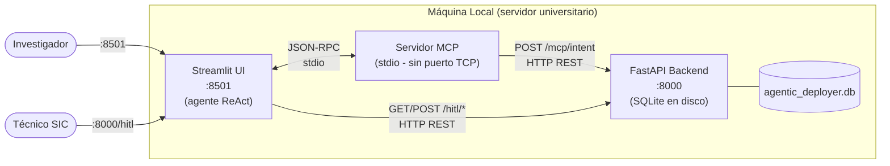
```mermaid
flowchart LR
    subgraph HOST ["Máquina Local (servidor universitario)"]
        direction TB
        UI["Streamlit UI\n:8501\n(agente ReAct)"] 
        MCP["Servidor MCP\n(stdio - sin puerto TCP)"]
        API["FastAPI Backend\n:8000\n(SQLite en disco)"]
        DB[("agentic_deployer.db")]

        UI <-->|"JSON-RPC\nstdio"| MCP
        MCP -->|"POST /mcp/intent\nHTTP REST"| API
        API --- DB
        UI -->|"GET/POST /hitl/*\nHTTP REST"| API
    end

    INV(["Investigador"])
    TEC(["Técnico SIC"])

    INV -->|":8501"| UI
    TEC -->|":8000/hitl"| UI
```
<p align="center"><i><b>Figura 4:</b> Diagrama de despliegue a nivel de proceso. Los cuatro componentes coexisten en la misma máquina; el servidor MCP se comunica por <code>stdio</code> sin exponer ningún puerto TCP.</i></p>

La arquitectura interna se sustenta sobre tres pilares de ejecución:

1. **Contenedor A: Frontend de Orquestación Cognitiva (Streamlit):**
  Esta aplicación web es el punto de entrada para el usuario investigador. Sin embargo, su responsabilidad trasciende la mera renderización de interfaces (UX/UI). Este proceso aloja en su núcleo el `AgentOrchestrator`, siendo la única entidad del sistema autorizada a mantener estado de red (conexiones HTTP/gRPC) con el proveedor externo de Inteligencia Artificial (OpenAI/Ollama). Su función principal es gestionar la asincronía del chat, administrar el contexto histórico de la sesión y gobernar las iteraciones del bucle de razonamiento y acción (*ReAct*).

2. **Contenedor B: El Catálogo Dinámico (Servidor MCP):**
  Concebido como un proceso ligero, el Servidor del Protocolo de Contexto de Modelos (MCP) actúa como el diccionario vivo de operaciones tecnológicas de la universidad. Su propósito es traducir los métodos y funciones estandarizadas (por ejemplo, el método `deploy_congress_web()`) a una representación JSON universal que cualquier LLM moderno pueda ingerir como *Tool Calling*. Por motivos de latencia estricta, este contenedor no suele comunicarse con el orquestador mediante APIs HTTP tradicionales, sino que se enlaza a través de flujos de Entrada/Salida estándar (`stdio`) del sistema operativo, garantizando intercambios de mensajes JSON-RPC en el orden de los submilisegundos.

3. **Contenedor C: El Núcleo Determinista (Backend Core Hexagonal):**
  Implementado sobre el *framework* asíncrono FastAPI, este contenedor representa la base de datos volátil y la autoridad máxima de seguridad de la arquitectura. Su filosofía de diseño es el agnosticismo cognitivo: a este proceso backend no le concierne cómo la Inteligencia Artificial dedujo una acción, ni si el usuario utilizó jerga técnica o lenguaje coloquial. Su única misión arquitectónica es recibir un objeto JSON estructuralmente tipado desde el Servidor MCP. 
  Una vez recibida la intención, el Backend aplica las reglas institucionales más férreas. Si la petición viola políticas (ej. abrir un puerto reservado), el Backend la rechaza; si es válida, la persiste en una cuarentena lógica (memoria volátil o base de datos) y se expone a sí mismo para que el *Dashboard* del Técnico de Operaciones pueda consumirla de forma asíncrona mediante técnicas de *Polling* o WebSockets.

Esta división tricolor (Frontend heurístico, Catálogo universal MCP y Backend restrictivo) fundamenta el éxito del *Agentic Deployer*. Garantiza que un error imprevisible en la red neuronal de la IA, o un desbordamiento en la interfaz gráfica del usuario, jamás pueda comprometer la estabilidad matemática de las reglas de infraestructura gobernadas por el Backend Core.

### 4.1.3. Nivel 3: Diagrama de Clases UML (Micro-Arquitectura)

Para formalizar la relación orientada a objetos entre las entidades del dominio y los adaptadores descritos, se proporciona a continuación el diagrama de clases unificado del sistema (Figura 5), ilustrando los patrones de herencia, interfaces (`ABC` en Python) y composición.

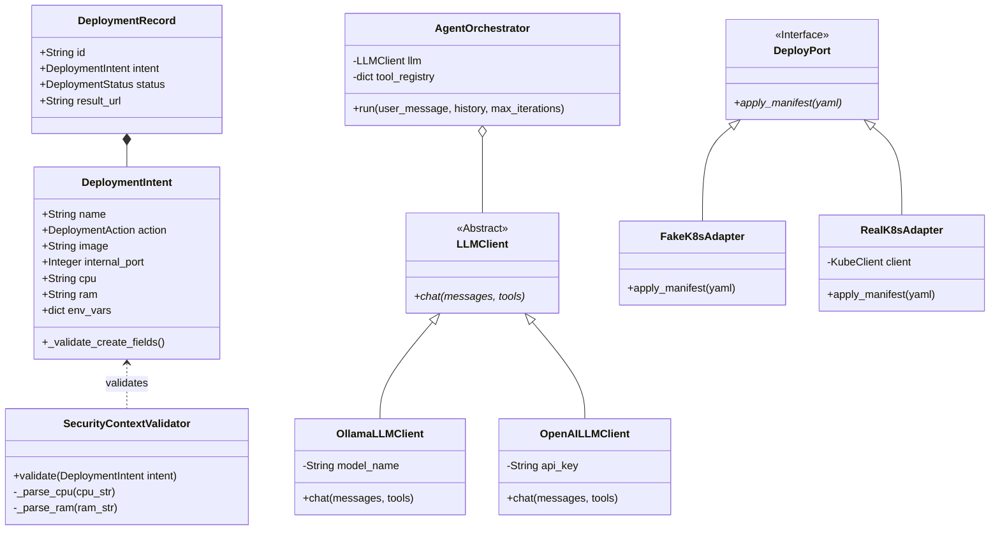
```mermaid
classDiagram
    class DeploymentIntent {
        +String name
        +DeploymentAction action
        +String image
        +Integer internal_port
        +String cpu
        +String ram
        +dict env_vars
        +_validate_create_fields()
    }

    class DeploymentRecord {
        +String id
        +DeploymentIntent intent
        +DeploymentStatus status
        +String result_url
    }

    class LLMClient {
        <<Abstract>>
        +chat(messages, tools)*
    }

    class OllamaLLMClient {
        -String model_name
        +chat(messages, tools)
    }

    class OpenAILLMClient {
        -String api_key
        +chat(messages, tools)
    }

    class AgentOrchestrator {
        -LLMClient llm
        -dict tool_registry
        +run(user_message, history, max_iterations)
    }

    class DeployPort {
        <<Interface>>
        +apply_manifest(yaml)*
    }

    class FakeK8sAdapter {
        +apply_manifest(yaml)
    }

    class RealK8sAdapter {
        -KubeClient client
        +apply_manifest(yaml)
    }

    class SecurityContextValidator {
        +validate(DeploymentIntent intent)
        -_parse_cpu(cpu_str)
        -_parse_ram(ram_str)
    }

    LLMClient <|-- OllamaLLMClient
    LLMClient <|-- OpenAILLMClient
    AgentOrchestrator o-- LLMClient
    DeployPort <|-- FakeK8sAdapter
    DeployPort <|-- RealK8sAdapter
    DeploymentIntent <.. SecurityContextValidator : validates
    DeploymentRecord *-- DeploymentIntent
```
<p align="center"><i><b>Figura 5:</b> Diagrama de Clases (UML) resumiendo las principales entidades y contratos del núcleo lógico, destacando el uso del polimorfismo para la inyección de dependencias (LLMClient, DeployPort).</i></p>

## 4.2. Adopción de la Arquitectura Hexagonal (Ports and Adapters)

El diseño del Contenedor Backend (el núcleo del sistema) requiere una fundamentación arquitectónica robusta. Como se exploró en el Estado del Arte (Capítulo 2), conceder autonomía operativa a un ente estocástico exige el establecimiento de fronteras deterministas estrictas. Para satisfacer este requisito, el núcleo del sistema se ha diseñado siguiendo el patrón arquitectónico de Puertos y Adaptadores (*Ports and Adapters*), comúnmente conocido como **Arquitectura Hexagonal** (propuesta formalmente por Alistair Cockburn) [15].

Este patrón se fundamenta en estructurar el software en capas concéntricas, imponiendo un único sentido de dependencia: desde el exterior (tecnologías volátiles, bases de datos, APIs de IA) hacia el interior (lógica de negocio inmutable).

### 4.2.1. Capa de Dominio: Entidades e Invariantes

En el centro exacto del hexágono reside la Capa de Dominio. Esta capa representa la fuente de verdad de la lógica de negocio y debe ser completamente agnóstica a cualquier *framework* externo. En el contexto de este Trabajo de Fin de Máster, la capa de dominio modela las intenciones de infraestructura antes de que estas se traduzcan a código declarativo.

Para dotar al núcleo de una inviolabilidad tipográfica estructural (esencial al operar en lenguajes interpretados), el sistema no manipula estructuras de datos dinámicas (como diccionarios JSON crudos emitidos por el LLM). En su lugar, el orquestador obliga a mapear cualquier solicitud externa hacia una Entidad de Dominio rígidamente definida. El contrato principal de este núcleo es la entidad `DeploymentIntent` (Intención de Despliegue).

En términos de Ingeniería de Software, esta entidad actúa como un contrato que impone **invariantes de dominio**. Se define de la siguiente manera conceptual:

- **Atributo Identificador:** Unívoco e inmutable (UUID).
- **Atributo Acción:** Restringido a un conjunto finito de operaciones (`CREATE`, `DELETE`).
- **Atributos Topológicos:** Nombre del servicio, imagen base, requerimientos de cómputo (CPU/RAM).
- **Invariantes Lógicas:** El puerto de red debe pertenecer matemáticamente al rango válido `[1, 65535]`. Las acciones de creación exigen obligatoriamente la existencia de una imagen y un puerto válido.

La aplicación estricta de estos invariantes actúa como la primera barrera pasiva contra las alucinaciones del modelo. Si el agente MCP, a causa de un error de inferencia probabilística, intenta instanciar una intención de despliegue con un puerto de valor nulo o fuera de rango (ej. `-80`), la Entidad de Dominio denegará su propia creación arrojando una excepción pura. Esto aplica el principio de *Fail-Fast*, impidiendo que las capas subyacentes procesen datos corruptos (*Garbage In, Garbage Out*).

### 4.2.2. Principio de Inversión de Dependencias (DIP)

El diseño Hexagonal encuentra su máxima justificación en la implementación del Principio de Inversión de Dependencias (la letra 'D' del acrónimo S.O.L.I.D.). El dominio jamás invoca directamente librerías externas o conectores de bases de datos. En su lugar, expone Interfaces abstractas denominadas **Puertos**, que son implementadas por componentes periféricos denominados **Adaptadores**.

La topología del hexágono divide estos adaptadores en dos categorías operativas:

#### 4.2.2.1. Adaptadores Primarios (*Driving Adapters*)
Son los componentes responsables de excitar al sistema, iniciando el flujo de ejecución hacia el interior. En la presente arquitectura, los adaptadores primarios se materializan mediante Controladores REST (enrutados vía FastAPI). Estos controladores actúan como traductores: mientras que el *endpoint* MCP (`/mcp/intent`) delega el procesamiento al Caso de Uso de la capa de aplicación (`ProcessDeploymentUseCase`), el *endpoint* de aprobación del *Dashboard* asume el rol de orquestador, invocando de manera directa los puertos de almacenamiento y despliegue por pragmatismo en la gestión de estados.

#### 4.2.2.2. Adaptadores Secundarios (*Driven Adapters*)
Son los componentes accionados por el núcleo del sistema para interactuar con el mundo físico o mutar su estado. En este punto de la arquitectura se concentra el mayor riesgo operativo: la comunicación directa con el clúster de Kubernetes.

Para blindar el núcleo de negocio frente a cambios en la tecnología de orquestación (por ejemplo, si la universidad decidiera migrar de Kubernetes a Docker Swarm o AWS ECS), la capa de aplicación dicta sus necesidades a través de un puerto abstracto llamado `DeployPort`. 

En la implementación actual del TFM, este puerto es satisfecho por un adaptador concreto denominado `FakeK8sAdapter`. Cuando el núcleo aprueba una intención, invoca la interfaz abstracta `deploy()`. El núcleo asume que el contenedor está siendo desplegado en producción, pero en realidad, el adaptador secundario (diseñado expresamente para la demostración y las pruebas) procesa la información y vierte los manifiestos YAML físicamente en el disco local del servidor, sin afectar a la red real. 

Esta abstracción modular garantiza que, en iteraciones futuras del producto, la sustitución del adaptador falso por un `RealK8sAdapter` (que consuma la API oficial de Google Kubernetes Engine, por ejemplo) no requerirá alterar ni reescribir una sola línea de código en las capas de Aplicación o Dominio.

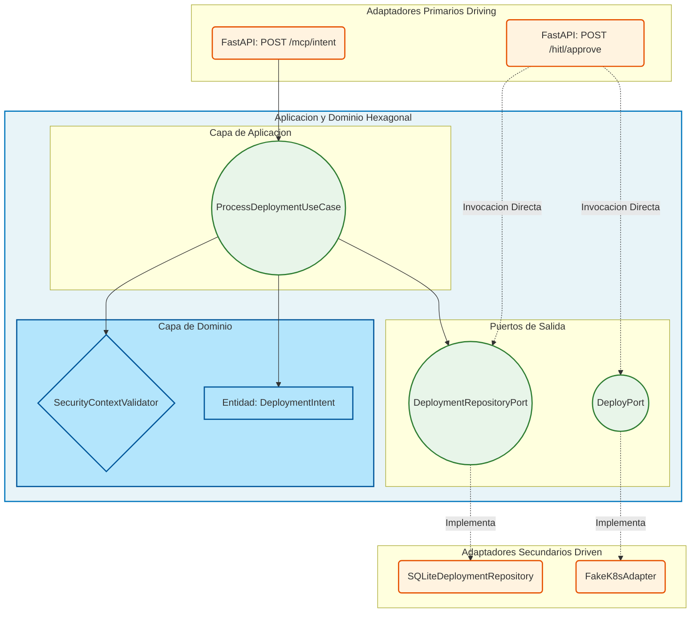
```mermaid
flowchart TD
    subgraph Frontend [Adaptadores Primarios Driving]
        REST(FastAPI: POST /mcp/intent)
        Dash(FastAPI: POST /hitl/approve)
    end

    subgraph Interior [Aplicacion y Dominio Hexagonal]
        subgraph Puertos_Entrada [Capa de Aplicacion]
            AppUse((ProcessDeploymentUseCase))
        end
        
        subgraph Core [Capa de Dominio]
            Model[Entidad: DeploymentIntent]
            Validator{SecurityContextValidator}
        end
        
        subgraph Puertos_Salida [Puertos de Salida]
            DeployP((DeployPort))
            StoreP((DeploymentRepositoryPort))
        end
    end
    
    subgraph Exterior [Adaptadores Secundarios Driven]
        K8S(FakeK8sAdapter)
        DB(SQLiteDeploymentRepository)
    end
    
    REST --> AppUse
    AppUse --> Validator
    AppUse --> Model
    AppUse --> StoreP
    
    Dash -.->|Invocacion Directa| StoreP
    Dash -.->|Invocacion Directa| DeployP
    
    DeployP -.->|Implementa| K8S
    StoreP -.->|Implementa| DB

    classDef hexagon fill:#e8f4f8,stroke:#0277bd,stroke-width:2px;
    classDef core fill:#b3e5fc,stroke:#01579b,stroke-width:2px;
    classDef adapter fill:#fff3e0,stroke:#e65100,stroke-width:2px;
    classDef port fill:#e8f5e9,stroke:#2e7d32,stroke-width:2px;
    
    class Interior hexagon;
    class Core,Model,Validator core;
    class REST,Dash,K8S,DB adapter;
    class DeployP,StoreP,AppUse port;
```
<p align="center"><i><b>Figura 6:</b> Topología de la Arquitectura Hexagonal. El flujo de control penetra desde los Adaptadores Primarios, pero la dependencia de código siempre fluye hacia el centro (Regla de Dependencia de Inversión).</i></p>

## 4.3. Algoritmia de Validación de Seguridad Institucional

La delegación de la escritura de intenciones declarativas a un Agente Cognitivo introduce un vector de amenaza fundamental: el LLM podría generar una topología de red técnicamente válida para el clúster, pero corporativamente ilícita. La protección contra estas peticiones (ya sean fruto de alucinaciones algorítmicas, negligencia del investigador o un ataque directo de inyección de *prompts*) recae sobre la Capa de Aplicación, concretamente en un servicio de dominio especializado: el `SecurityContextValidator`.

En esta sección se formaliza la algoritmia matemática y lógica que rige dicho validador, así como la gestión del ciclo de vida de las excepciones derivadas de su ejecución, un componente crítico para retroalimentar el aprendizaje del agente.

### 4.3.1. Cortafuegos Lógico: Formalización Algorítmica

El `SecurityContextValidator` opera bajo el principio de "Confianza Cero" (*Zero-Trust*). No asume ninguna premisa sobre la cordura del Agente MCP. Su misión es interceptar la Entidad de Dominio (`DeploymentIntent`) y someterla a un árbol de decisiones binarias imperativo, contrastándola contra las normativas de Ciberseguridad e ITIL del centro de datos de la universidad.

Para abstraer la lógica subyacente de la sintaxis específica del lenguaje Python, el comportamiento central de este cortafuegos se describe a continuación mediante notación algorítmica formal. 

```text

ENTRADA: 
 intencion -> Objeto de tipo DeploymentIntent (Invariantes básicos garantizados)
 politicas_locales -> Configuración del Sistema (Puertos vetados, repositorios)

SALIDA: 
 VERDADERO (Si la intención cumple todas las políticas institucionales)
 LANZA Excepción de Seguridad (SecurityViolationError) en caso contrario

INICIO
  // FASE 1: Análisis Topológico de Red (Principio de Mínimo Privilegio)
  Variable puerto_solicitado = intencion.obtenerPuerto()
  
  // Los puertos del sistema (Well-Known Ports) están reservados a root (0-1023)
  SI puerto_solicitado < 1024 ENTONCES
    LANZAR SecurityViolationError(
      "Violación Crítica: Exposición en puerto privilegiado no permitida."
    )
  FIN SI

  // FASE 2: Prevención de Deriva de Configuración (Configuration Drift)
  Variable etiqueta_imagen = intencion.obtenerEtiquetaContenedor()
  
  // La etiqueta "latest" provoca inconsistencia en reconstrucciones futuras
  SI etiqueta_imagen ES IGUAL A "latest" ENTONCES
    LANZAR SecurityViolationError(
      "Inestabilidad Operativa: Prohibido el uso de la etiqueta volátil ':latest'. " +
      "Se requiere fijar explícitamente el parche semántico (ej. :1.21.0)."
    )
  FIN SI

  // FASE 3: Control de Entorno (White-Listing de Registros de Imágenes)
  Variable imagen_completa = intencion.obtenerImagen()
  Variable repositorios_auditados = ["docker.io/", "quay.io/", "harbor.universidad.edu/"]
  Variable repositorio_licito = FALSO
  
  PARA CADA prefijo_seguro EN repositorios_auditados HACER
    SI imagen_completa INICIA CON prefijo_seguro ENTONCES
      repositorio_licito = VERDADERO
      ROMPER BUCLE
    FIN SI
  FIN PARA

  SI repositorio_licito ES FALSO ENTONCES
    LANZAR SecurityViolationError(
      "Riesgo de Exfiltración: Registro de contenedores no auditado."
    )
  FIN SI

  // FASE 4: Auditoría de Cuotas de Hardware (Resource Quotas)
  Variable cpu_solicitada = ParsearMiliCores(intencion.obtenerCPU())
  Variable ram_solicitada = ParsearMebibytes(intencion.obtenerRAM())

  SI cpu_solicitada > 4000 O ram_solicitada > 8192 ENTONCES
    LANZAR SecurityViolationError(
      "Acaparamiento de Recursos: Límite de 4 Cores y 8Gi excedido."
    )
  FIN SI

  // FASE 5: Detección Heurística de Secretos (Variables de Entorno)
  Variable diccionario_entorno = intencion.obtenerVariablesEntorno()
  Variable claves_prohibidas = ["password", "secret", "token", "key"]

  PARA CADA clave EN diccionario_entorno HACER
    SI clave CONTIENE ALGUNO DE claves_prohibidas ENTONCES
      LANZAR SecurityViolationError(
        "Fuga de Datos: Posible secreto detectado en texto plano."
      )
    FIN SI
  FIN PARA

  // Si el árbol de ejecución alcanza este punto, el flujo es seguro
  RETORNAR VERDADERO
FIN
```
<p align="center"><i><b>Algoritmo 1:</b> Validación Estricta de Entidades de Dominio Hexagonal (SecurityContextValidator).</i></p>

La adopción de este árbol de decisión, fuertemente condicionado de manera imperativa (O(N) de complejidad temporal, donde N es el número de repositorios confiables), certifica que la creatividad de la Inteligencia Artificial queda confinada dentro de un subespacio matemático determinista. El LLM es libre de deducir el nombre del servicio o la cantidad de RAM necesaria, pero es el algoritmo Hexagonal quien dictamina los límites infranqueables del tablero de juego.

La siguiente figura resume visualmente el árbol de validación como diagrama de flujo:

<div style="max-width: 6cm; margin: 0 auto;">

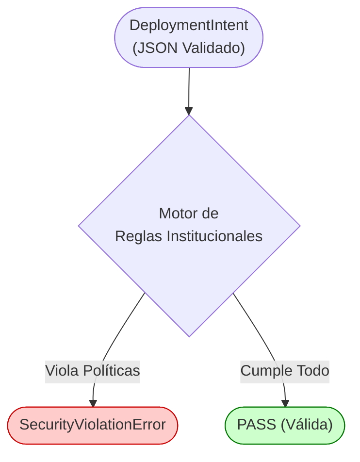
```mermaid
flowchart TD
    A(["DeploymentIntent\n(JSON Validado)"]) --> B{"Motor de\nReglas Institucionales"}
    B -->|Viola Políticas| ERR(["SecurityViolationError"])
    B -->|Cumple Todo| OK(["PASS (Válida)"])

    style ERR fill:#ffcccc,stroke:#cc0000
    style OK fill:#ccffcc,stroke:#007700
```

</div>
<p align="center"><i><b>Figura 7:</b> Visión general simplificada del <code>SecurityContextValidator</code>. Una rama de rechazo lanza el error para que ReAct se auto-corrija.</i></p>

### 4.3.2. Gestión de Excepciones y Ciclo de Vida del Error

En las arquitecturas de software tradicionales orientadas a microservicios, el lanzamiento de una excepción crítica como el `SecurityViolationError` aborta la transacción y se propaga hacia el usuario final (típicamente traducido en un código HTTP `400 Bad Request` o `422 Unprocessable Entity`), mostrándole una alerta técnica en la interfaz gráfica.

Sin embargo, el *Agentic Deployer* introduce un nuevo paradigma de interceptación. El error no está concebido para ser leído por el usuario humano investigador, sino que está diseñado topográficamente para impactar contra el Modelo de Lenguaje.

El ciclo de vida del error sigue la siguiente orquestación de red:

1. El `SecurityContextValidator` lanza la excepción (ej. "Uso de puerto privilegiado prohibido").
2. El Adaptador REST de FastAPI serializa esta excepción pura y responde a la petición RPC del Servidor MCP con un código HTTP `422`.
3. El Servidor MCP transmite este código de fallo a la Interfaz Cognitiva. En lugar de estrellar la aplicación Streamlit, el orquestador ReAct cataloga este fallo como una **Observación (*Observation*)**.
4. La Observación es re-inyectada en la ventana de contexto del LLM.

Esta gestión de excepciones invierte la carga operativa: el sistema no obliga al usuario humano a comprender por qué no puede usar el puerto 22. Es el propio LLM quien lee la excepción en texto plano, asume su equivocación, auto-corrige su estado interno y se dirige proactivamente al usuario con lenguaje natural, disculpándose y solicitándole que proponga un puerto alternativo (ej. el 8080). Esta simbiosis entre aserciones matemáticas (Backend) y diplomacia lingüística (LLM) es el pilar central del éxito de la solución propuesta.

## 4.4. Patrón de Abstracción: *Golden Paths* y Expansión Sintáctica

El último eslabón conceptual de la arquitectura de sistema aborda el mecanismo subyacente para la generación del código declarativo (*Infrastructure as Code*, IaC). En un primer estadio de adopción de IA, la tentación arquitectónica más común consiste en solicitar al Modelo de Lenguaje que redacte íntegramente los manifiestos YAML (por ejemplo, pasándole un *prompt* del tipo "escribe un Deployment de Kubernetes para esta aplicación"). 

Sin embargo, desde la perspectiva de la Ingeniería de Fiabilidad del Sitio (*Site Reliability Engineering*, SRE), esta práctica introduce un riesgo inasumible denominado **Deriva de Configuración (*Configuration Drift*)**. Si el LLM tiene control total sobre la topología, podría instanciar servicios usando versiones deprecadas de APIs (ej. `extensions/v1beta1` en lugar de `apps/v1`), omitir sondas de disponibilidad (*Liveness Probes*), o saltarse las etiquetas (*labels*) necesarias para el enrutamiento interno del clúster.

### 4.4.1. Definición Teórica del *Golden Path*

Para mitigar este riesgo, el diseño arquitectónico adopta el patrón *Golden Path* (Camino Dorado). Un *Golden Path* se define formalmente como una plantilla de infraestructura estandarizada, fuertemente securizada, y auditada previamente por el equipo senior de Operaciones de IT. 

En este paradigma, la Inteligencia Artificial no redacta código. Su capacidad generativa queda **asimétricamente restringida**. La topología del clúster (el "cómo" se despliega) es un axioma dictaminado por el humano en la plantilla, mientras que el LLM actúa únicamente como un extractor de entidades, proveyendo los valores atómicos (el "qué" se despliega) que el humano ha negociado en lenguaje natural.

### 4.4.2. Motor de Plantillas (Separación entre Topología y Variables)

El proceso de expansión sintáctica ocurre de forma invisible para el usuario en la capa más externa del hexágono (en el adaptador de infraestructura `DeployPort`). Cuando el técnico aprueba una intención retenida, el adaptador actúa como un motor de interpolación de cadenas o *Template Engine*.

El sistema realiza un mapeo inyectivo. Extrae las variables cognitivas validadas por el núcleo (nombre del servicio, puerto interno, requerimientos de CPU/RAM, imagen) y las inyecta en la matriz declarativa pre-probada.

A nivel topológico, una simple solicitud cognitiva ("necesito una base de datos") se expande matemáticamente en un árbol de recursos interdependientes:
1. Un **`Deployment`** o **`StatefulSet`**, configurado para aplicar cuotas rígidas (*Resource Quotas*) y anti-afinidad de nodos.
2. Un **`Service`**, autoconfigurado como `ClusterIP` para evitar la exposición accidental de la base de datos a redes públicas externas.
3. Un **`PersistentVolumeClaim`** (PVC), dimensionado dinámicamente según el tamaño de disco inferido.

Esta garantía de homogeneidad algorítmica asegura que el 100% de los servicios orquestados por el *Agentic Deployer* heredan idéntica postura de seguridad, permitiendo al Servicio de Informática (SIC) escalar la provisión de recursos con alta predictibilidad.

> **Nota de alcance del MVP:** La plantilla actual del `FakeK8sAdapter` genera los tres recursos base del *Golden Path* de aplicación web: `Deployment`, `Service` e `Ingress`. La inclusión de un `PersistentVolumeClaim` (PVC) para servicios con estado (como bases de datos) queda fuera del alcance del presente prototipo y se contempla como primera evolución en el Horizonte a Corto Plazo (Sección 9.2.1).

## 4.5. Flujo de Datos *End-to-End* y Ciclo de Estados

La síntesis de todas las decisiones arquitectónicas presentadas en este capítulo (Modelo C4, Arquitectura Hexagonal y *Golden Paths*) cristaliza en un ciclo de estados altamente sincronizado. La orquestación segura de infraestructura exige una coreografía de red donde la asincronía del razonamiento (LLM) converja pacíficamente con la persistencia estricta de una máquina de estados (Backend).

El modelado formal de la traza de ejecución completa abarca desde la excitación del sistema por parte del investigador, hasta la mutación del entorno físico aprobada por el técnico. Dada la complejidad asíncrona de la arquitectura, esta coreografía de red se divide en tres fases secuenciales diferenciadas para facilitar su visualización y análisis.

### 4.5.1. Fase 1: Negociación Estocástica (Interacción LLM)

El flujo es disparado por un estímulo no tipado (lenguaje natural). La latencia en esta fase es altamente variable (puede oscilar entre 1 y 15 segundos), dependiendo del peso de la inferencia del LLM (ej. GPT-4o en la nube frente a Llama-3 en hardware local). El bucle ReAct itera hasta converger en una intención matemática (`ToolCall`).

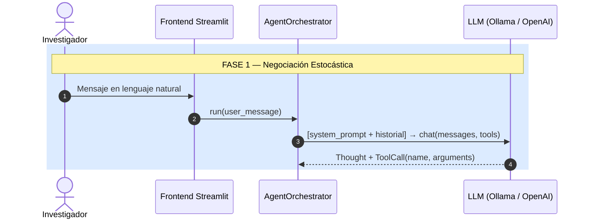
```mermaid
sequenceDiagram
  autonumber
  actor I as Investigador
  participant Chat as Frontend Streamlit
  participant Orch as AgentOrchestrator
  participant LLM as LLM (Ollama / OpenAI)

  rect rgb(220, 235, 255)
    Note over I,LLM: FASE 1 — Negociación Estocástica
    I->>Chat: Mensaje en lenguaje natural
    Chat->>Orch: run(user_message)
    Orch->>LLM: [system_prompt + historial] → chat(messages, tools)
    LLM-->>Orch: Thought + ToolCall(name, arguments)
  end
```
<p align="center"><i><b>Figura 8:</b> Diagrama de Secuencia E2E (Fase 1). Negociación cognitiva entre el Investigador y el LLM hasta alcanzar una intención.</i></p>

### 4.5.2. Fase 2: Frontera de Intercepción Determinista (Validación)

Este bloque constituye el "Embrague" del sistema. El Servidor MCP cruza el límite hacia el Backend. Aquí, la latencia debe ser del orden de microsegundos, dado que la ejecución de Pydantic y el `SecurityContextValidator` es computacionalmente trivial. Se incluyen tanto el **camino feliz** (*Happy Path*) como el **camino de error** (violación de seguridad → HTTP 422 → autocorrección del LLM) para documentar la resiliencia de la arquitectura. Si el flujo aprueba el cortafuegos, el sistema no ejecuta la acción; la "congela" en la base de datos como pendiente, desvinculando la responsabilidad de la IA.

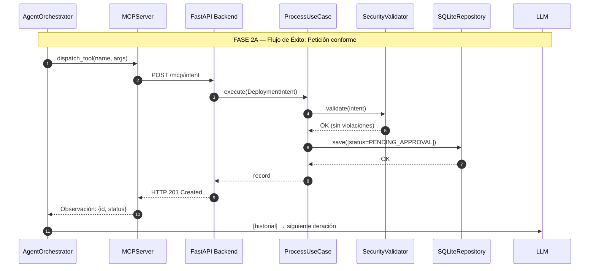
```mermaid
sequenceDiagram
  autonumber
  participant Orch as AgentOrchestrator
  participant MCP as MCPServer
  participant API as FastAPI Backend
  participant UseCase as ProcessUseCase
  participant Sec as SecurityValidator
  participant Store as SQLiteRepository
  participant LLM as LLM

  Note over Orch,LLM: FASE 2A — Flujo de Éxito: Petición conforme
  Orch->>MCP: dispatch_tool(name, args)
  MCP->>API: POST /mcp/intent
  API->>UseCase: execute(DeploymentIntent)
  UseCase->>Sec: validate(intent)
  Sec-->>UseCase: OK (sin violaciones)
  UseCase->>Store: save([status=PENDING_APPROVAL])
  Store-->>UseCase: OK
  UseCase-->>API: record
  API-->>MCP: HTTP 201 Created
  MCP-->>Orch: Observación: {id, status}
  Orch->>LLM: [historial] → siguiente iteración
```

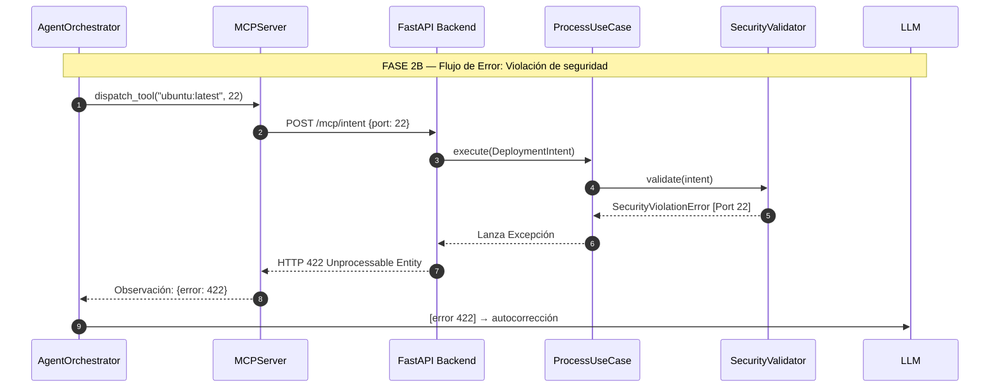
```mermaid
sequenceDiagram
  autonumber
  participant Orch as AgentOrchestrator
  participant MCP as MCPServer
  participant API as FastAPI Backend
  participant UseCase as ProcessUseCase
  participant Sec as SecurityValidator
  participant LLM as LLM

  Note over Orch,LLM: FASE 2B — Flujo de Error: Violación de seguridad
  Orch->>MCP: dispatch_tool("ubuntu:latest", 22)
  MCP->>API: POST /mcp/intent {port: 22}
  API->>UseCase: execute(DeploymentIntent)
  UseCase->>Sec: validate(intent)
  Sec-->>UseCase: SecurityViolationError [Port 22]
  UseCase-->>API: Lanza Excepción
  API-->>MCP: HTTP 422 Unprocessable Entity
  MCP-->>Orch: Observación: {error: 422}
  Orch->>LLM: [error 422] → autocorrección
```
<p align="center"><i><b>Figura 9:</b> Diagrama de Secuencia E2E (Fase 2). (Arriba) Camino feliz. (Abajo) Camino de error y autocorrección.</i></p>

### 4.5.3. Fase 3: Ejecución Autoritaria (Ciclo HITL)

Esta fase es operativamente asíncrona respecto a las dos anteriores. La latencia ya no depende del procesador, sino de la voluntad del Técnico Humano (puede demorarse minutos u horas). El técnico sondea el backend de forma puramente determinista. Únicamente al inyectar su autorización, el Backend despierta el flujo diferido y excita al Adaptador de Kubernetes mediante un bypass arquitectónico directo a los puertos de salida. Es en este último milisegundo donde los valores abstractos se materializan físicamente.

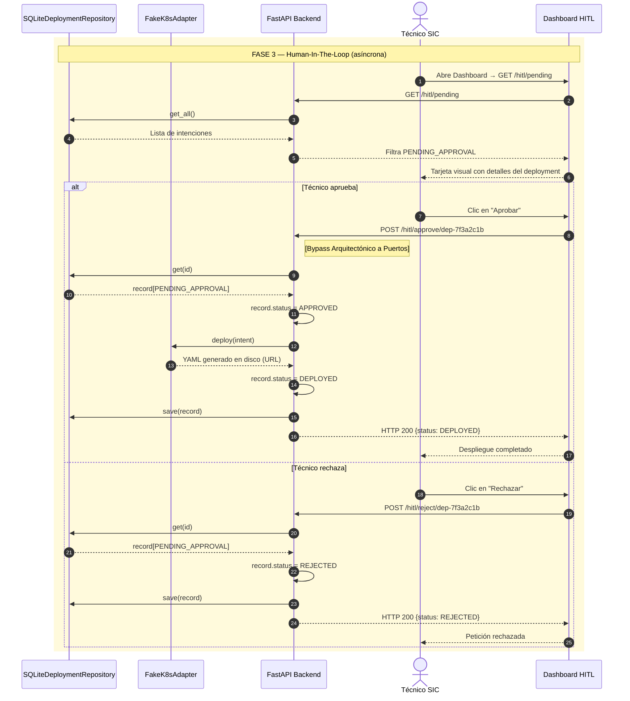
```mermaid
sequenceDiagram
  autonumber
  participant Store as SQLiteDeploymentRepository
  participant K8s as FakeK8sAdapter
  participant API as FastAPI Backend
  actor SIC as Técnico SIC
  participant Dash as Dashboard HITL

  rect rgb(255, 250, 220)
    Note over Store,Dash: FASE 3 — Human-In-The-Loop (asíncrona)
    SIC->>Dash: Abre Dashboard → GET /hitl/pending
    Dash->>API: GET /hitl/pending
    API->>Store: get_all()
    Store-->>API: Lista de intenciones
    API-->>Dash: Filtra PENDING_APPROVAL
    Dash-->>SIC: Tarjeta visual con detalles del deployment

    alt Técnico aprueba
      SIC->>Dash: Clic en "Aprobar"
      Dash->>API: POST /hitl/approve/dep-7f3a2c1b
      Note right of API: [Bypass Arquitectónico a Puertos]
      API->>Store: get(id)
      Store-->>API: record[PENDING_APPROVAL]
      API->>API: record.status = APPROVED
      API->>K8s: deploy(intent)
      K8s-->>API: YAML generado en disco (URL)
      API->>API: record.status = DEPLOYED
      API->>Store: save(record)
      API-->>Dash: HTTP 200 {status: DEPLOYED}
      Dash-->>SIC: Despliegue completado
    else Técnico rechaza
      SIC->>Dash: Clic en "Rechazar"
      Dash->>API: POST /hitl/reject/dep-7f3a2c1b
      API->>Store: get(id)
      Store-->>API: record[PENDING_APPROVAL]
      API->>API: record.status = REJECTED
      API->>Store: save(record)
      API-->>Dash: HTTP 200 {status: REJECTED}
      Dash-->>SIC: Petición rechazada
    end
  end
```
<p align="center"><i><b>Figura 10:</b> Diagrama de Secuencia E2E (Fase 3). Decisión asíncrona del técnico humano, separando la inferencia de la ejecución.</i></p>

El diseño *End-to-End* expuesto garantiza la separación irrompible de preocupaciones: la IA actúa exclusivamente como **facilitadora de la sintaxis abstracta**, mientras que la ingeniería de sistemas tradicional retiene el monopolio absoluto sobre el **acceso de escritura al estado productivo**.


<div style='page-break-after: always;'></div>

# Capítulo 5. Desarrollo del Agente Cognitivo y MCP

Mientras que el Capítulo 4 estableció los cimientos deterministas de la arquitectura, garantizando la inmutabilidad y seguridad de las operaciones mediante el patrón Hexagonal, el presente capítulo aborda el núcleo heurístico del *Agentic Deployer*. Se detalla la implementación del motor cognitivo responsable de dotar al sistema de la capacidad de comprender lenguaje natural ambiguo, razonar sobre el estado de la infraestructura y tomar decisiones de invocación de herramientas (*Tool Calling*). 

Este capítulo desgrana paso a paso la integración del estándar abierto *Model Context Protocol* (MCP), el diseño abstracto del cliente de inferencia, y la algoritmia subyacente que rige el bucle de razonamiento y acción (*ReAct*). La convergencia de estos tres pilares conforma un agente autónomo capaz de transformar la fricción operativa en una conversación fluida y segura.

## 5.1. Implementación del Servidor *Model Context Protocol* (MCP)

En las arquitecturas iniciales de Inteligencia Artificial aplicada, la capacidad de un Modelo de Lenguaje para invocar código externo se lograba mediante integraciones fuertemente acopladas (*Vendor Lock-in*). Históricamente, el orquestador debía codificar a mano la firma de las herramientas (como diccionarios JSON rígidos) y empaquetarlas bajo especificaciones privativas (como la especificación *Function Calling* nativa de la API de OpenAI). Esta práctica vulneraba el Principio de Abierto/Cerrado (letra 'O' de S.O.L.I.D.), obligando a reescribir masivamente la base de código si la universidad decidía migrar hacia un proveedor de IA alternativo, como Anthropic o un clúster de Llama-3 local.

Para superar este antipatrón arquitectónico, el sistema desarrollado adopta como estándar troncal el **Model Context Protocol (MCP)** [9], un protocolo abierto diseñado para estandarizar la forma en que los modelos fundacionales interactúan con fuentes de datos y herramientas de ejecución. El MCP actúa como una capa de abstracción universal (un *middleware* cognitivo), desacoplando por completo el catálogo de herramientas de las peculiaridades de la API del LLM subyacente.

### 5.1.1. Introspección Dinámica de Funciones (Generación de JSON Schemas)

El mayor desafío en la ingeniería de Agentes Autónomos reside en la sincronización del contrato de la herramienta. Si un ingeniero de sistemas modifica el código de la función de despliegue para exigir un nuevo parámetro (por ejemplo, `memoria_ram`), el esquema JSON que se envía al LLM debe actualizarse simultáneamente; de lo contrario, la inferencia fallará, produciendo una desincronización de estado (*Schema Drift*).

Para mitigar este riesgo, el Servidor MCP implementado en el *Agentic Deployer* (ubicado en el Contenedor B de la arquitectura C4) hace uso intensivo de técnicas de **Introspección Estática y Dinámica de Tipos**. En lugar de requerir que el programador defina los JSON Schemas manualmente, el SDK de MCP (utilizando la librería nativa `inspect` de Python) lee la firma matemática de las funciones en tiempo de ejecución.

El proceso algorítmico, detallado a continuación en pseudocódigo formal, ilustra cómo el sistema transforma una función Python pura en una representación semántica universal (*Tool Definition*) inteligible para cualquier LLM:

```text
ENTRADA:
 funcion_objetivo -> Referencia en memoria a un método (ej. desplegar_app)

SALIDA:
 json_schema -> Estructura estándar JSON-RPC de Tool Calling

INICIO
  Variable esquema = NUEVO Diccionario JSON
  esquema["name"] = funcion_objetivo.obtenerNombre()
  esquema["description"] = funcion_objetivo.obtenerDocstring()
  
  // Inspección del AST (Abstract Syntax Tree)
  Variable parametros = funcion_objetivo.obtenerFirmaLexica()
  esquema["parameters"] = NUEVO Objeto Tipo(Objeto)
  
  PARA CADA (parametro, anotacion_de_tipo) EN parametros HACER
    Variable tipo_json = "string" // Por defecto
    
    // Mapeo Inyectivo de Tipos (Python -> JSON Schema)
    SI anotacion_de_tipo ES Entero ENTONCES
      tipo_json = "integer"
    SINO SI anotacion_de_tipo ES Booleano ENTONCES
      tipo_json = "boolean"
    FIN SI
    
    esquema["parameters"]["properties"][parametro] = NUEVO Diccionario(
      "type" -> tipo_json,
      "description" -> extraerDescripcion(parametro)
    )
    
    SI parametro ES obligatorio ENTONCES
      AÑADIR parametro A esquema["parameters"]["required"]
    FIN SI
  FIN PARA
  
  RETORNAR esquema
FIN
```
<p align="center"><i><b>Algoritmo 2:</b> Introspección Dinámica de Contratos de Herramientas.</i></p>

La adopción de este algoritmo garantiza que la base de código posea una **Única Fuente de Verdad (*Single Source of Truth*)**. El desarrollador del SIC simplemente anota sus funciones de infraestructura con *Type Hints* (ej. `puerto: int`) y *Docstrings*. El servidor MCP, al inicializarse, barre el código, extrae la semántica, genera el esquema JSON dinámico y lo inyecta en el orquestador. Esta capacidad autorreflexiva reduce la deuda técnica prácticamente a cero.

### 5.1.2. Aislamiento de Red mediante Transporte *stdio*

El estándar MCP ofrece múltiples vectores para la transmisión del protocolo JSON-RPC, siendo los más destacados *Server-Sent Events* (SSE) sobre protocolo HTTP y flujos de Entrada/Salida Estándar (*stdio*).

En un diseño de microservicios tradicional, la comunicación entre el Agente Frontend (Contenedor A) y el Servidor de Herramientas (Contenedor B) recaería intuitivamente sobre una API REST clásica. Sin embargo, en el contexto de inferencias estocásticas concurrentes, donde un bucle ReAct puede invocar decenas de herramientas por segundo para sondear el estado del sistema, la sobrecarga (*overhead*) asociada al protocolo TCP/IP (encapsulamiento de cabeceras HTTP, latencia de red de *loopback* y serialización) resulta prohibitiva.

Por esta razón, la arquitectura del *Agentic Deployer* impone una decisión de diseño restrictiva: **El canal de comunicación para el Tool Calling se restringe exclusivamente al transporte local vía `stdio`** (Standard Input / Standard Output).

Esta decisión acarrea tres beneficios arquitectónicos fundamentales para el TFM:

1. **Latencia Sub-milisegundo (Inter-Process Communication):** Al emplear `stdio`, el Agente y el Servidor MCP se comunican directamente a través de tuberías del kernel de Linux (*Pipes IPC*), evitando por completo la pila de red (OSI Layer 4-7). La invocación de una herramienta pasa de tardar ~20ms (HTTP local) a menos de ~1ms, lo cual es crítico para no interrumpir el flujo cognitivo del LLM.
2. **Superficie de Ataque Cero (Zero-Trust Network):** A diferencia de un puerto HTTP (que puede ser escaneado mediante herramientas como Nmap, o falsificado mediante *Server-Side Request Forgery*), un proceso comunicado por `stdio` no expone ningún puerto de red al sistema operativo. Es topológicamente inviable que un atacante externo invoque herramientas de infraestructura si no posee acceso al árbol de procesos padre del agente.
3. **Simplicidad de Despliegue (Sidecar Pattern):** Al no requerir balanceadores de carga internos ni certificados TLS de comunicación este-oeste, el Servidor MCP se empaqueta junto al Orquestador Cognitivo como un contenedor acoplado (*Sidecar*), asegurando que siempre que el frontend esté vivo, su catálogo de herramientas estará garantizado.

La simbiosis entre la introspección dinámica de tipos y el aislamiento a nivel de kernel convierte al Servidor MCP del proyecto en un catálogo de herramientas altamente seguro, universal e instantáneo.

El siguiente diagrama ilustra el ciclo de vida completo de un mensaje MCP, desde el momento en que el Agente decide invocar una herramienta hasta que recibe el resultado:

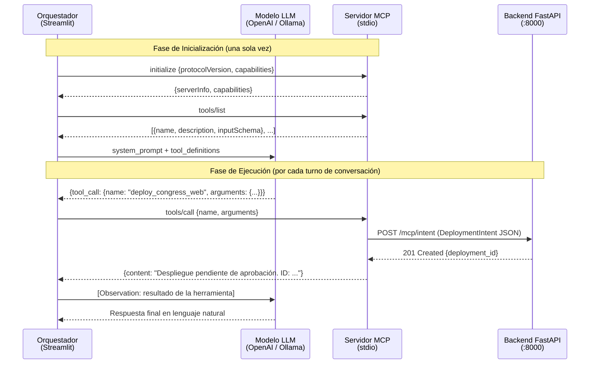
```mermaid
sequenceDiagram
    participant Orch as Orquestador<br/>(Streamlit)
    participant LLM as Modelo LLM<br/>(OpenAI / Ollama)
    participant MCP as Servidor MCP<br/>(stdio)
    participant BE as Backend FastAPI<br/>(:8000)

    Note over Orch,MCP: Fase de Inicialización (una sola vez)
    Orch->>MCP: initialize {protocolVersion, capabilities}
    MCP-->>Orch: {serverInfo, capabilities}
    Orch->>MCP: tools/list
    MCP-->>Orch: [{name, description, inputSchema}, ...]
    Orch->>LLM: system_prompt + tool_definitions

    Note over Orch,BE: Fase de Ejecución (por cada turno de conversación)
    LLM-->>Orch: {tool_call: {name: "deploy_congress_web", arguments: {...}}}
    Orch->>MCP: tools/call {name, arguments}
    MCP->>BE: POST /mcp/intent (DeploymentIntent JSON)
    BE-->>MCP: 201 Created {deployment_id}
    MCP-->>Orch: {content: "Despliegue pendiente de aprobación. ID: ..."}
    Orch->>LLM: [Observation: resultado de la herramienta]
    LLM-->>Orch: Respuesta final en lenguaje natural
```
<p align="center"><i><b>Figura 11:</b> Ciclo de vida completo de un mensaje MCP. El protocolo JSON-RPC define tres fases: inicialización (handshake y descubrimiento de herramientas), ejecución (invocación y respuesta) y observación (retroalimentación al LLM).</i></p>

> **Nota de implementación (modos de transporte):** El servidor MCP desarrollado soporta dos modos operativos. En el **modo Cliente Externo** (proceso externo), el Agente y el Servidor MCP se comunican vía `stdio` tal y como se describe, beneficiándose de la latencia sub-milisegundo de las *Pipes* IPC del kernel. En el **modo Streamlit integrado** (el utilizado en este MVP), las herramientas MCP se importan directamente como módulos Python (`TOOL_REGISTRY`, `TOOL_DEFINITIONS`) y se invocan en el mismo proceso, lo que elimina incluso el overhead del `stdio`. Ambas modalidades son intercambiables gracias al diseño del `AgentOrchestrator`, que acepta cualquier registro de herramientas independientemente del transporte subyacente.

## 5.2. Diseño de la Abstracción Multiproveedor y Soberanía del Dato

La vertiginosa evolución de la Inteligencia Artificial Generativa ha consolidado un mercado oligopólico liderado por grandes corporaciones tecnológicas proveedoras de inferencia en la nube (*AI-as-a-Service*). En el desarrollo de sistemas de software empresarial, acoplar el código fuente (el *Core Business*) a los kits de desarrollo de software (SDK) específicos de OpenAI, Anthropic o Google supone un riesgo inasumible de obsolescencia tecnológica y pérdida de poder de negociación.

Para garantizar la viabilidad a largo plazo del *Agentic Deployer*, el diseño del orquestador cognitivo abraza el principio de agnósticismo absoluto frente al proveedor algorítmico. Esta sección desgrana la fundamentación técnica que permite al sistema conmutar dinámicamente entre motores de inferencia dispares sin requerir recompilación, así como la implicación de este diseño en las políticas de confidencialidad de la información.

### 5.2.1. El Contrato Abstracto (Patrones *Adapter* y *Factory*)

El aislamiento del proveedor se consigue orquestando una arquitectura basada en la conjunción de dos patrones de diseño clásicos de la banda de los cuatro (GoF) [23]: el patrón **Adapter** y el patrón **Factory Method**.

En la capa de aplicación, el `AgentOrchestrator` jamás invoca directamente a ninguna librería de IA. Su comunicación se dirige exclusivamente hacia una Interfaz de Clase Base Abstracta (ABC en Python) denominada `LLMClient`. Esta interfaz establece la "Firma Matemática de la Inferencia":

```text
CONTRATO ABSTRACTO: Interfaz Cliente LLM (LLMClient)

ESTADO INTERNO:
 - historial_conversacion -> Lista estructurada de mensajes (Rol, Contenido)
 - sistema_base -> Prompt fundacional (personalidad y reglas del Agente)

MÉTODO chat(messages, tools):
  ENTRADA: messages -> historial; tools -> JSON Schemas del servidor MCP
  SALIDA_ESPERADA:
   - Objeto tipo AgentResponse (texto plano)
   - Objeto tipo ToolCall (id, nombre_función, argumentos_json)
```

El sistema implementa dos adaptadores concretos que satisfacen este contrato:

**`OpenAILLMClient`** — Formatea el historial bajo la especificación REST de OpenAI (`messages`, `tools`, `tool_choice`), negocia el *handshake* TLS hacia la API en la nube y deserializa la respuesta JSON.

**`OllamaLLMClient`** — Implementado de forma completamente nativa con la librería `httpx` [24], sin ninguna dependencia en el paquete `openai`. El cliente se comunica directamente con la API REST local de Ollama [20] (`POST /api/chat`), garantizando que **ni un solo token de inferencia abandona la red privada institucional**:

```text
PSEUDOCÓDIGO: Implementación Nativa del Cliente Ollama

CLASE OllamaLLMClient IMPLEMENTA LLMClient:
  ATRIBUTOS:
    modelo: Cadena (ej. "qwen2.5-coder:7b")
    url_base: Cadena (ej. "http://localhost:11434")

  MÉTODO chat(mensajes, herramientas):
    Variable payload = NUEVO Diccionario(
      "model" -> modelo,
      "messages" -> mensajes,
      "stream" -> FALSO
    )
    SI herramientas EXISTE ENTONCES
      payload["tools"] = herramientas
    FIN SI

    // Petición HTTP POST síncrona a la API local
    Variable respuesta = PeticionHttp(url_base + "/api/chat", json=payload)
    
    SI respuesta.codigo_estado != 200 ENTONCES
      LANZAR ExcepcionHttp("Error en la inferencia LLM local")
    FIN SI

    Variable mensaje = respuesta.cuerpo_json["message"]

    SI mensaje CONTIENE "tool_calls" ENTONCES
      Variable llamada = mensaje["tool_calls"][0]
      RETORNAR NUEVO AgentResponse(
        tool_call = NUEVO ToolCall(llamada["name"], llamada["arguments"])
      )
    FIN SI

    RETORNAR NUEVO AgentResponse(content=mensaje["content"])
FIN CLASE
```

La instanciación en memoria recae sobre un patrón **Factory**. Durante la fase de inicialización (*bootstrapping*) del contenedor web, el sistema lee la variable de entorno `LLM_PROVIDER`. La clase Factory evalúa esta variable e inyecta la implementación correcta en el Orquestador mediante *Dependency Injection*:

```text
PSEUDOCÓDIGO: Inyección de Dependencias del Motor Cognitivo (Factory)

ENTRADA: proveedor -> Cadena desde variable de entorno (LLM_PROVIDER)
SALIDA: motor_llm -> Instancia de motor cognitivo (compatible con LLMClient)

INICIO
  SI proveedor ES "ollama" ENTONCES
    RETORNAR NUEVO OllamaLLMClient(modelo="qwen2.5-coder:7b")
  SINO SI proveedor ES "openai" ENTONCES
    RETORNAR NUEVO OpenAILLMClient(modelo="gpt-4o-mini")
  SINO
    RETORNAR NUEVO SICFakeLLMClient() // Entorno de pruebas determinista
  FIN SI
FIN
```

Esta Inyección de Dependencias permite **permutar el motor cognitivo con un simple reinicio del proceso y cambio de variable de entorno**, sin modificar una sola línea de la lógica de negocio ni del servidor MCP.


### 5.2.2. Justificación de la Elección del Modelo Local (Qwen 2.5 Coder)

El ecosistema *open-source* actual ofrece múltiples modelos de lenguaje capaces de ejecutarse en hardware local con recursos restringidos (ej. 6 GB VRAM). Para este entorno de pruebas, se optó finalmente por desplegar la variante especializada **Qwen 2.5 Coder (7B)** de Alibaba Cloud, descartando a sus homólogos generalistas como Llama 3.2, Mistral, o el propio Qwen 2.5 base.

Esta elección responde a la necesidad de garantizar una alta eficacia en la invocación de herramientas (*Tool Calling*). La variante Coder incorpora un ajuste fino (*fine-tuning*) exhaustivo sobre corpus de código fuente, lo que le confiere una robustez superior en la generación y manipulación de estructuras JSON complejas frente a modelos puramente conversacionales. Durante la experimentación, mientras que modelos generalistas como *Llama 3.2* o *Mistral* evidenciaron una degradación sintáctica recurrente bajo estrés operativo, **Qwen 2.5 Coder (7B)** demostró ser la única solución local de su categoría capaz de superar íntegramente la batería de Pruebas Metamórficas, exhibiendo la mayor estabilidad estructural frente a la entropía lingüística y posibilitando la correcta orquestación del bucle ReAct (véase el análisis empírico en el Capítulo 8).

### 5.2.3. Soberanía del Dato en Entornos Institucionales

La abstracción multiproveedor, más allá de ser una práctica higiénica de Ingeniería del Software, responde a un requerimiento de ciberseguridad crítico en el contexto de las administraciones públicas y el sector académico: la **Soberanía del Dato** y el cumplimiento normativo (RGPD/GDPR).

El *Agentic Deployer* maneja, por su propia naturaleza operativa, información extremadamente sensible. Durante la negociación lingüística (fase heurística del bucle de ReAct), un investigador distraído podría deslizar inadvertidamente tokens de acceso a bases de datos, contraseñas de red corporativas (secretos) o direcciones IP reservadas que revelan la topología interna del Servicio de Informática. Enviar estas trazas en texto plano hacia servidores ubicados fuera de las fronteras europeas (como es el caso de los clústeres por defecto de algunas empresas americanas) constituye una vulneración de las políticas de retención de datos.

El diseño agnóstico soluciona este paradigma permitiendo la **conmutación por políticas de clasificación**:
- **Escenario de Baja Clasificación:** Para entornos de investigación pública (despliegue de servidores web estáticos o *sandboxes* de prueba sin datos sensibles), el sistema puede apuntar mediante el *Factory* a la API de OpenAI, aprovechando la velocidad de inferencia suprema y la baja latencia de la nube.
- **Escenario de Alta Clasificación (Air-Gapped):** Cuando la provisión involucra servicios confidenciales (como bases de datos sanitarias o expedientes de alumnado), el equipo de Operaciones altera la configuración del entorno para inyectar el adaptador de Ollama [20]. Bajo esta topología, la inferencia probabilística se resuelve físicamente en servidores con aceleración GPU (Nvidia/AMD) alojados en el sótano del propio Centro de Procesamiento de Datos (CPD) de la universidad. Ni un solo token abandona la intranet institucional, garantizando la inviolabilidad del secreto sin sacrificar la interfaz agéntica natural de la que disfruta el usuario.

Esta capacidad de hibridación (Nube Pública vs *Bare-Metal* Local), resuelta elegantemente gracias a los patrones de diseño orientados a objetos, convierte al prototipo desarrollado en este TFM en una plataforma madura, auditable y, sobre todo, legalmente compatible con los estándares de gobernanza ITIL aplicados en la gran industria.

## 5.3. Bucle Cognitivo y Resiliencia Estocástica (Patrón ReAct)

La mera exposición de un catálogo de herramientas a un Modelo de Lenguaje no garantiza la ejecución autónoma de una tarea compleja. Cuando a un modelo fundacional se le instruye para que actúe en un entorno dinámico (como es un clúster de Kubernetes, cuyo estado puede mutar durante la propia inferencia), los enfoques tradicionales de Petición-Respuesta (*Zero-Shot Prompting*) fracasan abruptamente. Si el modelo asume un contexto inicial falso o comete un error sintáctico en su primer intento, carece de mecanismos intrínsecos para rectificar, desembocando en estados de fallo catastrófico (*Catastrophic Failure*).

Para dotar al *Agentic Deployer* de verdadera autonomía heurística y resiliencia ante excepciones, el orquestador implementa el patrón **ReAct (Reasoning and Acting)**, un paradigma propuesto por Yao et al. [8] en la literatura académica reciente, que sinergiza la capacidad de razonamiento discursivo con la ejecución imperativa de acciones.

### 5.3.1. Arquitectura del Bucle Incondicional de Razonamiento y Acción

El patrón ReAct altera la topología conversacional subyacente. En lugar de procesar la petición del usuario y devolver un código de respuesta monolítico, el Agente Cognitivo inicia una máquina de estados iterativa de ejecución en bucle (`while True`). Cada iteración de este bucle (*Turno Cognitivo*) obliga a la Inteligencia Artificial a transitar secuencialmente por cuatro fases inmutables:

1. **Pensamiento (*Thought*):** El modelo deduce lógicamente el siguiente paso basándose en el historial. Esta externalización del monólogo interno (derivada de las técnicas *Chain-of-Thought*) reduce matemáticamente la tasa de alucinaciones.
2. **Acción (*Action*):** El modelo invoca una función específica del catálogo MCP, inyectándole los argumentos sintácticos deducidos (ej. `deploy_intent(name="api", port=80)`).
3. **Pausa (*Yield*):** El orquestador pausa la inferencia algorítmica, toma el control del hilo de ejecución, cruza la barrera de red hacia el servidor backend, ejecuta la acción física y espera el resultado.
4. **Observación (*Observation*):** El sistema inyecta el resultado físico (ya sea un éxito o una excepción de error del sistema operativo) de vuelta en la ventana de contexto del LLM.

El modelo reevalúa el estado global tras la observación y decide si necesita ejecutar una nueva acción o si la tarea ha concluido. Cuando dictamina que el objetivo se ha cumplido, transiciona a la fase final (*Final Answer*), devolviendo el control al usuario humano.

Como se ilustra en la **Figura 12**, este proceso rompe con el paradigma de petición-respuesta estático, instaurando un flujo de retroalimentación dinámica.

<div style="max-width: 10cm; margin: 0 auto;">

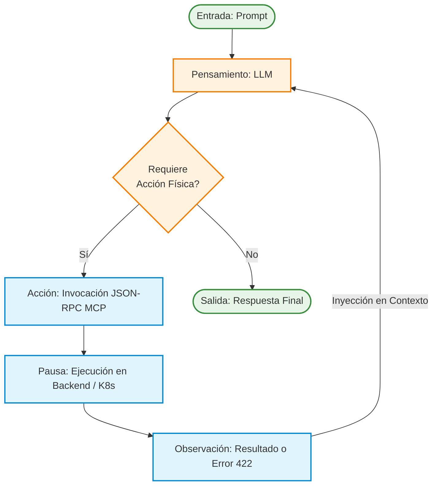
```mermaid
flowchart TD
  A([Entrada: Prompt]) --> B[Pensamiento: LLM]
  B --> C{Requiere\nAcción Física?}
  C -->|Sí| D[Acción: Invocación JSON-RPC MCP]
  C -->|No| G([Salida: Respuesta Final])
  
  D --> E[Pausa: Ejecución en Backend / K8s]
  E --> F[Observación: Resultado o Error 422]
  
  F -->|Inyección en Contexto| B
  
  classDef llm fill:#fff3e0,stroke:#f57c00,stroke-width:2px;
  classDef phys fill:#e1f5fe,stroke:#0288d1,stroke-width:2px;
  classDef term fill:#e8f5e9,stroke:#388e3c,stroke-width:2px;
  
  class B,C llm;
  class D,E,F phys;
  class A,G term;
```

</div>
<p align="center"><i><b>Figura 12:</b> Diagrama de flujo del bucle cognitivo ReAct (Reasoning and Acting).</i></p>

Para ilustrar el funcionamiento de este motor de orquestación, se formaliza a continuación su arquitectura mediante pseudocódigo:

```text
ENTRADA: 
 peticion_usuario -> Cadena de texto natural
 contexto_historico -> Memoria de la sesión actual

SALIDA: 
 respuesta_final -> Cadena de texto natural o Markdown

INICIO
  AÑADIR peticion_usuario A contexto_historico
  Variable turno_actual = 0
  Variable MAX_TURNOS = 5 // Prevención de bucles infinitos (Infinite Loop)

  MIENTRAS turno_actual < MAX_TURNOS HACER
    // 1. Inferencia del LLM (Thought + Action)
    Variable respuesta_llm = InvocacionRed(contexto_historico, herramientas_mcp)
    
    SI respuesta_llm ES texto_plano ENTONCES
      // El Agente decide que ha terminado y se dirige al humano
      RETORNAR respuesta_llm
    FIN SI

    SI respuesta_llm ES invocacion_herramienta ENTONCES
      Variable nombre_funcion = respuesta_llm.obtenerNombre()
      Variable argumentos = respuesta_llm.obtenerArgumentos()
      Variable resultado_accion
      
      INTENTAR
        // 2 y 3. Ejecución y Pausa
        resultado_accion = EjecutarProcesoLocal(nombre_funcion, argumentos)
      CAPTURAR ExcepcionHttp COMO error
        // Serialización del error para que el LLM lo entienda
        resultado_accion = error.obtenerMensajeHumano() 
      FIN INTENTAR

      // 4. Observación
      AÑADIR "Herramienta retornó: " + resultado_accion A contexto_historico
    FIN SI
    
    turno_actual = turno_actual + 1
  FIN MIENTRAS
  
  LANZAR Excepcion("Límite de razonamiento excedido. El Agente está atascado.")
FIN
```
<p align="center"><i><b>Algoritmo 3:</b> Bucle de Orquestación Cognitiva (ReAct Loop).</i></p>

La inclusión matemática de la constante `MAX_TURNOS` es un mecanismo de *Fail-Safe* crítico en sistemas autónomos, garantizando que un LLM confundido no agote las cuotas de facturación de la API externa (consumo masivo de tokens) iterando indefinidamente sobre un fallo irresoluble.

### 5.3.2. *Feedback Loop* de Seguridad y Autocorrección

El verdadero poder arquitectónico del bucle ReAct emerge en la rama `CAPTURAR ExcepcionHttp` (línea 25 del Algoritmo 3). En la topología descrita en el Capítulo 4, el núcleo Hexagonal (Backend) blinda la infraestructura arrojando errores implacables (ej. un `422 Unprocessable Entity`) cuando el agente intenta vulnerar políticas (como abrir el puerto 22).

En sistemas convencionales, esta excepción HTTP provocaría la terminación abrupta de la sesión, obligando al usuario a iniciar la tarea desde cero. Sin embargo, el *Agentic Deployer* instaura un mecanismo de resiliencia cognitiva denominado **Feedback Loop**. 

Cuando el Servidor MCP intercepta el error `422`, no detiene el orquestador. Por el contrario, inyecta la traza de la excepción directamente como una **Observación** en la memoria RAM de corto plazo del LLM.
Este flujo produce un comportamiento cibernético emergente:
1. El Agente lee que su *Action* previa fracasó por violación de puerto.
2. Su capa estocástica razona (*Thought*) que el puerto 22 está prohibido por políticas de seguridad institucionales.
3. De forma autónoma, el Agente omite lanzar una excepción al usuario. En su lugar, itera una nueva *Action*, recalculando un puerto lícito (ej. el puerto 8000), o bien genera una *Final Answer* informando diplomáticamente al usuario del rechazo técnico y solicitándole alternativas.

Este *Feedback Loop* transforma un sistema estocástico (propenso a alucinaciones) en un ecosistema auto-regulado. Traslada la responsabilidad de la depuración de errores (*debugging*) desde el investigador humano hacia el propio modelo de inteligencia artificial. Así, la Arquitectura Hexagonal y el bucle ReAct no solo conviven, sino que se necesitan mutuamente: el Hexágono actúa como la jaula determinista, y el ReAct permite que el Agente itere sobre las restricciones hasta encontrar el *Golden Path* correcto.


<div style='page-break-after: always;'></div>

# Capítulo 6. Implementación del Patrón HITL y Gestión de Estados Finita (FSM)

El diseño cognitivo abordado en los capítulos anteriores dota al sistema de una autonomía sintáctica y deductiva avanzada. Sin embargo, la autonomía algorítmica total en infraestructuras críticas no es un hito de ingeniería deseable, sino un vector de vulnerabilidad. La orquestación de clústeres de contenedores en entornos productivos exige un grado de gobierno, responsabilidad legal y consciencia del contexto operativo que escapa a las capacidades matemáticas de un Modelo de Lenguaje Estocástico (LLM).

Este capítulo detalla la solución arquitectónica implementada para gobernar a la Inteligencia Artificial: el patrón *Human-In-The-Loop* (HITL). Se fundamentará teóricamente la necesidad de interponer un "mecanismo de autorización humana" y se explicará, a nivel de diseño de software, cómo esta asimetría de autoridad se garantiza tecnológicamente mediante una Máquina de Estados Finita (FSM) inmutable y un *Dashboard* asíncrono para el equipo de operaciones.

## 6.1. Fundamentación del Patrón *Human-In-The-Loop* (HITL)

En el ámbito de la automatización de TI, la taxonomía de la autonomía se divide comúnmente en cinco niveles (inspirados libremente en los niveles de conducción autónoma de la SAE). El Nivel 0 corresponde a la ejecución manual de *scripts* Bash, mientras que el Nivel 5 (Autonomía Completa) implica un sistema de Inteligencia Artificial que monitoriza, toma decisiones y ejecuta mutaciones de red en la infraestructura productiva sin ningún tipo de supervisión humana.

La tendencia del mercado tecnológico presiona hacia la consecución del Nivel 5. Sin embargo, este Trabajo de Fin de Máster defiende la tesis de que, en la gestión del *Platform Engineering* corporativo, el paradigma óptimo arquitectónico no es el Nivel 5, sino una automatización de Nivel 4 hiper-acelerada, fuertemente anclada al patrón **Human-In-The-Loop (HITL)**.

### 6.1.1. Los Riesgos de la Autonomía Total (Nivel 5)

Otorgar credenciales de escritura directas (ej. un token con permisos de *ClusterAdmin* en Kubernetes) a un sistema basado en redes neuronales probabilísticas introduce riesgos operativos que ninguna prueba unitaria puede mitigar. Los factores de riesgo sistémico más severos son:

1. **La Alucinación Topológica:** Los LLM, por su arquitectura de predicción del siguiente token (Arquitectura Transformer), carecen de un modelo mental fáctico del mundo real. Si el orquestador ReAct entra en un estado de confusión y deduce que la mejor forma de arreglar un error de red es borrar y recrear el `Deployment` de una base de datos en producción, el Nivel 5 ejecutaría la acción indiscriminadamente.
2. **Elasticidad Financiera Descontrolada:** En infraestructuras desplegadas en nubes públicas (AWS, Google Cloud, Azure), los recursos computacionales se facturan por segundo de uso. Una IA operando en Nivel 5 bajo un bucle estocástico infinito podría auto-aprovisionar clústeres con decenas de GPUs, incurriendo en un gasto económico inasumible para el presupuesto de la universidad en cuestión de horas.
3. **Imprevisibilidad del Momento de Despliegue:** La Inteligencia Artificial desconoce factores socio-temporales críticos. Un agente autónomo total podría intentar aplicar un parche de seguridad un viernes a las tres de la madrugada o durante el pico de tráfico de los exámenes finales. Solo un humano posee el sentido común para prever las ventanas de mantenimiento seguras.

### 6.1.2. Responsabilidad Legal, ITIL y la Asimetría de Contexto

Más allá de la viabilidad técnica, la adopción del patrón HITL es una exigencia legal y normativa. Los marcos de buenas prácticas de la industria, como **ITIL 4** (*Information Technology Infrastructure Library*) en su práctica de "Release Management" [25], así como los estándares ISO/IEC 27000 sobre ciberseguridad, exigen explícitamente el principio de trazabilidad y gobernanza de las acciones de red.

Desde una perspectiva jurídica, un modelo matemático (los pesos de una red neuronal almacenados en RAM) carece de personalidad jurídica. Si el *Agentic Deployer* instanciara una topología errónea que expusiera públicamente expedientes sensibles de investigadores (causando una brecha del RGPD), la responsabilidad recaería legalmente sobre el operador humano de la universidad, independientemente de que la orden original la redactase la IA.

Para solventar esta carga legal, el sistema se diseña asumiendo una **Asimetría de Contexto Triangular**, donde cada nodo asume únicamente la responsabilidad para la que está humana (o algorítmicamente) optimizado:

1. **El Investigador (El "Qué"):** Aporta el conocimiento del dominio funcional ("Necesito un WordPress para el departamento de historia con una base de datos de 10 Gigabytes").
2. **La IA y el Servidor MCP (El "Cómo"):** Aportan el conocimiento abstracto de la sintaxis declarativa. Traducen el lenguaje natural a las estructuras de dominio formales de la Arquitectura Hexagonal. 
3. **El Técnico del SIC (El "Cuándo" y el "Sí"):** Aporta la autoridad corporativa y la visión holística de los recursos físicos ("La petición de la IA es sintácticamente correcta, pero los discos NVMe del clúster están al 95%, así que apruebo el despliegue pero lo demoro hasta el fin de semana").

Bajo este modelo, la IA no es un ente decisor; es un **facilitador cognitivo** (un acelerador significativo del flujo de trabajo) que reduce la jornada del ingeniero desde horas de redacción técnica y validación de sintaxis YAML, a meros segundos para auditar y presionar un botón de "Aprobar" en una interfaz visual.

## 6.2. Diseño de la Máquina de Estados Finita (FSM)

Para materializar el control del flujo operativo detallado en la sección anterior, el Backend Hexagonal no puede depender de variables booleanas simples (ej. `es_valido = True`). En entornos concurrentes donde múltiples operarios auditan la misma cola de despliegues, el estado de una petición de infraestructura debe gobernarse mediante una **Máquina de Estados Finita** (FSM, por sus siglas en inglés, *Finite-State Machine*).

Una FSM, fundamentada en la teoría de autómatas, es un modelo computacional matemático. Establece que una entidad solo puede existir en un estado mutuamente excluyente en un momento temporal $T$, y que los cambios entre estos estados (Transiciones) obedecen a un conjunto finito y predefinido de reglas direccionales.

### 6.2.1. Modelado del Grafo Dirigido Acíclico (DAG)

En la arquitectura del *Agentic Deployer*, el ciclo de vida de una `DeploymentIntent` (la intención generada por la IA) se modela formalmente como un **Grafo Dirigido Acíclico (DAG)**. El carácter "acíclico" es una condición *sine qua non* de la seguridad del sistema: matemáticamente, es imposible que el estado de una petición fluya hacia atrás en el tiempo. Una vez que una orden es procesada físicamente por el clúster de Kubernetes, el registro no puede revertir a su estado de pendencia.

Los vértices de este grafo (Estados) y sus aristas dirigidas (Transiciones Autorizadas) se definen mediante **seis nodos** mutuamente excluyentes:

- **Nodo Raíz (`PENDING_APPROVAL`):** Es el punto de inyección inicial. Cuando el agente de IA formula una petición válida y el `SecurityContextValidator` (Capítulo 4) la admite en el servidor, esta ingresa obligatoriamente en este nodo de cuarentena. Ningún proceso de despliegue físico se activa desde este estado.
- **Nodo de Sumidero A (`REJECTED`):** Estado terminal e inmutable. Si el Técnico del SIC presiona el botón de denegación en el *Dashboard*, la petición transiciona aquí. Permanece en la base de datos de manera indefinida con propósitos de auditoría legal (Log de Intentos Denegados), pero es ignorada por el *garbage collector* y los adaptadores de infraestructura.
- **Nodo de Tránsito (`APPROVED`):** Estado intermedio y volátil. Cuando el humano autoriza la operación, la petición ingresa a este nodo durante un lapso minúsculo. Actúa como el desencadenante imperativo (*Trigger*) para excitar al adaptador de red secundario (`FakeK8sAdapter` o `RealK8sAdapter`).
- **Nodo de Sumidero B (`DEPLOYED`):** Estado terminal final. Solo se alcanza si, y solo si, la intención superó el nodo `APPROVED` y la API de Kubernetes confirma que los manifiestos YAML han sido guardados sin errores de persistencia en disco.
- **Nodo de Sumidero C (`FAILED`):** Estado terminal excepcional. Alcanzado si la transición desde `APPROVED` fracasa por un error de entrada/salida en disco o una excepción de red del adaptador de infraestructura. El registro permanece en la base de datos para diagnóstico post-mortem.
- **Nodo de Sumidero D (`DELETED`):** Estado terminal de baja administrativa. Representa la eliminación lógica de un servicio previamente desplegado, invocada por la herramienta MCP `delete_university_service`. El registro no se destruye físicamente, preservando la trazabilidad de auditoría.

La única entidad del universo físico con autoridad criptográfica y de red para empujar un registro desde el Nodo Raíz a los Nodos Secundarios es el Técnico Humano portador de la sesión de operaciones en el *Dashboard*. Este flujo unidireccional y acíclico se representa visualmente en la **Figura 13**.

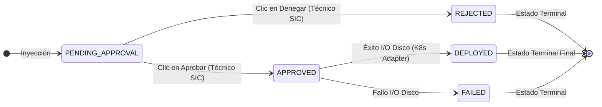
```mermaid
stateDiagram-v2
  direction LR
  [*] --> PENDING_APPROVAL : Inyección
  
  PENDING_APPROVAL --> APPROVED : Clic en Aprobar (Técnico SIC)
  PENDING_APPROVAL --> REJECTED : Clic en Denegar (Técnico SIC)
  
  APPROVED --> DEPLOYED : Éxito I/O Disco (K8s Adapter)
  APPROVED --> FAILED : Fallo I/O Disco
  
  REJECTED --> [*] : Estado Terminal
  DEPLOYED --> [*] : Estado Terminal Final
  FAILED --> [*] : Estado Terminal
```
<p align="center"><i><b>Figura 13:</b> Grafo Dirigido Acíclico (DAG) que rige la Máquina de Estados Finita (FSM) del sistema.</i></p>

### 6.2.2. Prevención de Concurrencia y *Race Conditions*

La implementación de este FSM mediante Python y el *framework* asíncrono FastAPI presenta un desafío clásico de Sistemas Operativos Distribuidos: la prevención de Condiciones de Carrera (*Race Conditions*).

Imaginemos un escenario concurrente: Una petición se encuentra en `PENDING_APPROVAL`. Por un problema de latencia en la red Wi-Fi, el Técnico de Operaciones hace doble clic rápidamente sobre el botón "Rechazar" en su interfaz, o peor aún, dos operarios de distintos turnos, visualizando el mismo panel, deciden pulsar simultáneamente los botones de "Aprobar" y "Rechazar" en milisegundos idénticos.

Sin una salvaguarda arquitectónica, estas peticiones paralelas generarían una condición de carrera (*race condition*) en la base de datos del servidor, provocando una inconsistencia transaccional donde el sistema intentaría desplegar y denegar el mismo registro simultáneamente, lo que comprometería gravemente la integridad del estado del clúster de Kubernetes.

Para neutralizar este vector, la transición entre vértices del DAG se blinda mediante algoritmos de comprobación atómica (*Test-and-Set* lógicos) o mecanismos de **Optimistic Locking** (Bloqueo Optimista). A continuación se expone la fundamentación algorítmica de esta defensa en el núcleo Hexagonal:

```text
ENTRADA:
 id_peticion -> UUID del registro a transicionar
 nuevo_estado -> El estado de destino (APPROVED o REJECTED) solicitado por el Humano

SALIDA:
 Registro_Actualizado (Si la transición es lícita)
 LANZA HttpConflictError (409) si hay violación de estado

INICIO
  // 1. Adquisición y comprobación (Atomicidad)
  Variable registro = ObtenerRegistroBaseDeDatos(id_peticion)
  
  SI registro ES NULO ENTONCES
    LANZAR HttpNotFoundError(404)
  FIN SI

  // 2. Control Invariante del DAG: Solo se muta desde PENDING_APPROVAL
  SI registro.estado NO ES IGUAL A "PENDING_APPROVAL" ENTONCES
    LANZAR HttpConflictError(
      409, 
      "Conflicto de Mutación. El registro ya había sido procesado previamente " +
      "(Estado Actual: " + registro.estado + ")."
    )
  FIN SI
  
  // 3. Mutación del Estado mediante el Repositorio (Bloqueo Atómico)
  registro.estado = nuevo_estado
  registro.fecha_modificacion = ObtenerTiempoSistemaActual()
  
  // 4. Activación de Adaptadores Secundarios (Side-Effects)
  SI nuevo_estado ES IGUAL A "APPROVED" ENTONCES
    INTENTAR
      K8sAdapter.ejecutar_despliegue(registro.intencion)
      registro.estado = "DEPLOYED" // Segunda transición
    CAPTURAR ExcepcionIO COMO error
      registro.estado = "FAILED"
    FIN INTENTAR
  FIN SI
  
  RETORNAR registro
FIN
```
<p align="center"><i><b>Algoritmo 4:</b> Transición Inmutable de la Máquina de Estados (FSM_Transition).</i></p>

Gracias a este algoritmo determinista, si ocurre una pulsación doble, el primer *thread* (hilo de ejecución HTTP) cruzará el bloque de la Línea 18 y mutará la base de datos a `REJECTED`. El segundo *thread*, desfasado por milisegundos, evaluará la condición invariante de la Línea 18, detectará que el estado ya no es `PENDING_APPROVAL`, y abortará la transacción devolviendo inmediatamente un error `409 Conflict` a la capa frontal. 

Esta rigurosidad garantiza que, a los ojos de la universidad, el *Agentic Deployer* posea la misma inmutabilidad transaccional (*ACID properties*) [26] que un sistema bancario transaccional, mitigando significativamente la estocasticidad que rodea a los sistemas de IA.

## 6.3. El Dashboard Asíncrono de Operaciones

La implementación efectiva del patrón *Human-In-The-Loop* requiere una separación tajante de las Experiencias de Usuario (UX). El Investigador, que interactúa en la frontera cognitiva del sistema, requiere un entorno conversacional y tolerante a la ambigüedad (Streamlit). Por el contrario, el Técnico de Operaciones (SIC) no debe negociar con el Modelo de Lenguaje; su flujo de trabajo exige una interfaz de control visual, tabular, determinista y de baja latencia.

Para satisfacer esta dicotomía, se ha diseñado un segundo portal de acceso independiente del orquestador de IA: el **Dashboard de Operaciones** (`dash.html`), concebido arquitectónicamente como una *Single-Page Application* (SPA) ligera, servida directamente por el Backend Hexagonal de FastAPI.

### 6.3.1. Estrategia de Sincronización: *Polling* Ligero vs. *WebSockets*

El reto técnico subyacente en el diseño del *Dashboard* es la sincronización del estado. Las peticiones de despliegue generadas por la IA no obedecen a un patrón predecible; ingresan en el sistema en ráfagas asíncronas, dependiendo del horario de investigación de la comunidad universitaria.

En arquitecturas web modernas fuertemente acopladas al tiempo real (como aplicaciones de *Trading* o videojuegos), el estado del servidor suele transmitirse al cliente mediante conexiones bidireccionales persistentes (Protocolo *WebSocket*, ws://). Sin embargo, mantener cientos de hilos *WebSocket* abiertos de manera perpetua entre el *Dashboard* y el clúster perfila un sobrecoste de memoria y gestión de concurrencia injustificado para un sistema de auditoría asíncrona, en el cual un retraso de 3 segundos en la visualización no reviste criticidad operacional.

Consecuentemente, el TFM implementa una estrategia de **Polling Activo Ligero**. El *Dashboard* ejecuta bucles temporizados desde el navegador del técnico utilizando llamadas `fetch` nativas de JavaScript:

1. **Interrogación Constante:** El cliente invoca el endpoint `GET /hitl/pending` a intervalos regulares (ej. cada 5.000 milisegundos).
2. **Procesamiento Eficiente y Transaccional:** El *Backend* delega la lectura de las intenciones pendientes en el repositorio local (SQLite). Mediante consultas estructuradas, este enfoque garantiza persistencia ACID y consistencia frente a reinicios inesperados, manteniendo el *overhead* al mínimo en el contexto del prototipo.
3. **Inyección Dinámica:** El cliente recibe el *payload* JSON y reconstruye dinámicamente el Document Object Model (DOM), renderizando tarjetas visuales (*Cards*) para cada petición entrante.

Esta arquitectura desacoplada (*Stateless* en la capa de transporte) favorece la resiliencia del sistema. Si el portátil del Técnico de Operaciones pierde conectividad Wi-Fi, el estado del *Backend* permanece intacto; al recuperar la conexión, el siguiente ciclo de *polling* rehidratará el *Dashboard* con las peticiones acumuladas durante la ventana de desconexión.

### 6.3.2. Ejecución Diferida y Materialización del Código Declarativo

La fase final del ciclo de vida del *Agentic Deployer* ocurre cuando el operador humano interactúa con el *Backend* físico. El *Dashboard* expone visualmente los atributos inmutables de la intención extraída por la IA (UUID de rastreo, Imagen base a desplegar, Puerto de red y Cuotas de recursos CPU/RAM).

Junto a esta tabla de datos puros, se exponen dos vectores de mutación REST:
- El botón **"Rechazar"**: Ejecuta un `POST /hitl/reject/{id}`, desencadenando el estado `REJECTED` en la Máquina de Estados (sección 6.2). La petición queda archivada indefinidamente con fines de auditoría legal pero no genera ningún artefacto de infraestructura.
- El botón **"Aprobar"**: Ejecuta un `POST /hitl/approve/{id}`. Esta es la llamada más crítica de toda la infraestructura.

Cuando el técnico invoca la aprobación, el ciclo asíncrono concluye y el sistema recupera la naturaleza imperativa bloqueante (*Synchronous Blocking*). El *Backend* despierta la intención retenida y se la inyecta al Adaptador de Red Secundario (el `DeployPort`).

Como se definió en los esquemas *Golden Path* (Capítulo 4), en este preciso milisegundo el Adaptador toma el control. El objeto Python abstracto se mapea contra un motor de interpolación de cadenas basado en **f-strings** y la utilidad estándar `textwrap.dedent` de Python, produciendo estructuras de datos YAML puras. Finalmente, estas cadenas de texto se vuelcan sobre los volúmenes del sistema operativo mediante operaciones I/O del kernel (ej. `open(filepath, 'w')`), materializando físicamente el archivo `{name}.yaml`.

La generación de este archivo en disco (o su envío directo a la API de Kubernetes) confirma que la Inteligencia Artificial, inicialmente un ente discursivo estocástico, ha logrado traducir su razonamiento lingüístico en un activo corporativo inmutable, habiendo superado con éxito las validaciones estructurales del `SecurityContextValidator` y el escrutinio ético del *Human-In-The-Loop*.

### 6.3.3. Diagrama de Secuencia del Flujo HITL

La **Figura 14** complementa el diagrama E2E global (Figuras 8, 9 y 10, Cap. 4.5) con un foco específico en la interacción entre el Técnico SIC y el Backend durante la fase de decisión. Se ilustran explícitamente los dos vectores de mutación posibles (aprobación y rechazo) y las transiciones de estado intermedias de la FSM, incluyendo la materialización del YAML por `FakeK8sAdapter` únicamente en el camino de aprobación.

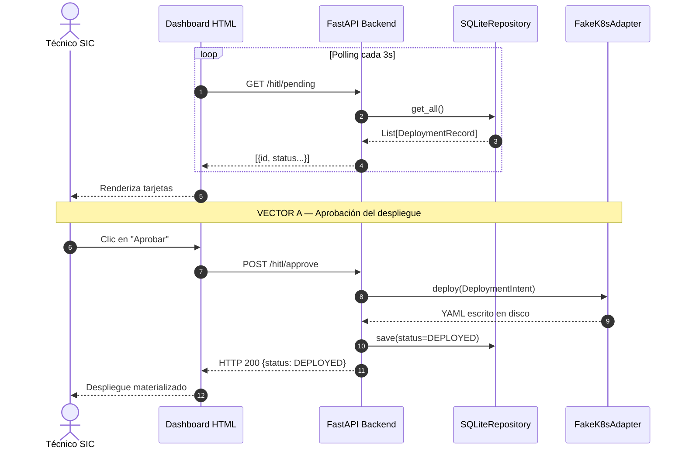
```mermaid
sequenceDiagram
  autonumber
  actor SIC as Técnico SIC
  participant Dash as Dashboard HTML
  participant API as FastAPI Backend
  participant Store as SQLiteRepository
  participant K8s as FakeK8sAdapter

  loop Polling cada 3s
    Dash->>API: GET /hitl/pending
    API->>Store: get_all()
    Store-->>API: List[DeploymentRecord]
    API-->>Dash: [{id, status...}]
  end
  Dash-->>SIC: Renderiza tarjetas

  Note over SIC,K8s: VECTOR A — Aprobación del despliegue
  SIC->>Dash: Clic en "Aprobar"
  Dash->>API: POST /hitl/approve
  API->>K8s: deploy(DeploymentIntent)
  K8s-->>API: YAML escrito en disco
  API->>Store: save(status=DEPLOYED)
  API-->>Dash: HTTP 200 {status: DEPLOYED}
  Dash-->>SIC: Despliegue materializado
```

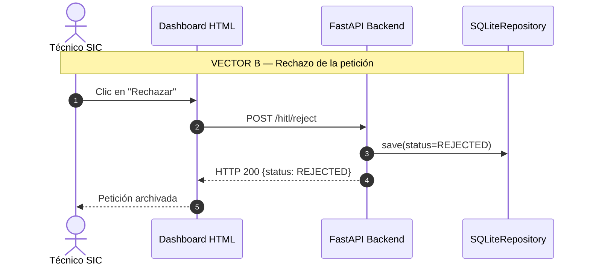
```mermaid
sequenceDiagram
  autonumber
  actor SIC as Técnico SIC
  participant Dash as Dashboard HTML
  participant API as FastAPI Backend
  participant Store as SQLiteRepository

  Note over SIC,Store: VECTOR B — Rechazo de la petición
  SIC->>Dash: Clic en "Rechazar"
  Dash->>API: POST /hitl/reject
  API->>Store: save(status=REJECTED)
  API-->>Dash: HTTP 200 {status: REJECTED}
  Dash-->>SIC: Petición archivada
```
<p align="center"><i><b>Figura 14:</b> Diagrama de Secuencia del flujo HITL. (Arriba) Polling asíncrono y Vector de Aprobación. (Abajo) Vector de Rechazo (estado inmutable terminal).</i></p>

## 6.4. Canal de Retorno al Investigador: Notificación Asíncrona del Estado

Una brecha de usabilidad inherente al patrón HITL clásico es la **asimetría informacional**: el Técnico SIC conoce en todo momento el estado de las peticiones a través del Dashboard (sección 6.3), pero el investigador, una vez recibida la confirmación de `PENDING_APPROVAL` del agente, queda en un estado de incertidumbre. No sabe cuándo (ni si) su solicitud ha sido aprobada, rechazada o desplegada.

Esta sección documenta el diseño e implementación del **canal de retorno al investigador**: el mecanismo bidireccional que cierra el ciclo de comunicación y permite al investigador consultar el estado de sus solicitudes directamente desde la interfaz conversacional.

### 6.4.1. Diseño del Endpoint de Consulta de Estado

Se ha incorporado un nuevo endpoint `GET /hitl/status/{deployment_id}` en el `BackendAPI`, diseñado específicamente como **canal orientado al investigador** (a diferencia de `/hitl/pending`, orientado al técnico):

```text
RUTINA: Consulta de Estado de Despliegue (Endpoint REST)

ENDPOINT: GET /hitl/status/{id_despliegue}
ENTRADA: id_despliegue -> Cadena de texto (ej. "dep-1a2b3c")
SALIDA: RespuestaEstado (id, estado, mensaje_contextual)

INICIO
  Variable registro = RepositorioBD.obtener(id_despliegue)
  SI registro ES Nulo ENTONCES
    ABORTAR CON ExcepcionHttp(404, "Despliegue no encontrado")
  FIN SI

  // Mapeo semántico del estado técnico (FSM) a lenguaje natural
  Variable mensajes = NUEVO Diccionario(
    "PENDING_APPROVAL" -> "Su solicitud está en cola, pendiente de revisión por el técnico SIC.",
    "APPROVED" -> "El técnico SIC ha aprobado su solicitud. Despliegue en curso.",
    "DEPLOYED" -> "Su servicio ha sido desplegado exitosamente.",
    "REJECTED" -> "El técnico SIC ha rechazado esta solicitud.",
    "FAILED" -> "El despliegue ha encontrado un error técnico en el clúster."
  )
  
  Variable mensaje_contextual = mensajes[registro.estado_fsm]
  RETORNAR NUEVO RespuestaEstado(registro.id, registro.estado_fsm, mensaje_contextual)
FIN
```

La respuesta incluye el estado actual de la FSM junto con un **mensaje de texto contextual** adaptado a cada estado, de modo que el investigador recibe información comprensible sin necesidad de conocer la nomenclatura técnica de la máquina de estados.

### 6.4.2. Panel de Notificaciones en el Frontend (Streamlit)

La interfaz conversacional (`chat_app.py`) implementa un panel pasivo de seguimiento que se activa automáticamente cuando el agente registra una solicitud con estado `PENDING_APPROVAL`. El mecanismo opera en tres fases:

**1. Extracción automática del ID de seguimiento:**

Tras cada respuesta del agente, el frontend aplica una expresión regular sobre el texto de respuesta para detectar identificadores de deployment del patrón `dep-[a-f0-9]{7,8}`. Si se detecta uno asociado a un estado pendiente, se añade a la lista `session_state.pending_deployments`:

```text
RUTINA: Extracción de Identificadores (Frontend HITL)

ENTRADA: texto_respuesta -> Respuesta generada por el Agente Cognitivo
ESTADO: panel_pendientes -> Lista de IDs mostrados en la interfaz gráfica

INICIO
  // Buscar expresiones regulares de la forma "dep-XXXXXXX"
  Variable id_detectado = ExpresionRegular("dep-[a-f0-9]{7,8}").buscarEn(texto_respuesta)
  
  SI id_detectado EXISTE Y texto_respuesta CONTIENE "PENDING" ENTONCES
    AÑADIR id_detectado A panel_pendientes
  FIN SI
FIN
```

**2. Panel de seguimiento persistente:**

Mientras existan deployments pendientes en `session_state`, el panel " Mis Solicitudes Pendientes" se renderiza en la parte inferior del chat. Por cada solicitud, el investigador dispone de un botón **" Actualizar"** que realiza una llamada `GET /hitl/status/{id}` al backend y muestra el resultado en un badge de color semántico:

| Estado FSM | Color | Mensaje para el investigador |
|---|---|---|
| `PENDING_APPROVAL` | Amarillo | "Su solicitud está en cola, pendiente de revisión." |
| `APPROVED` | Azul | "El técnico ha aprobado. Despliegue en curso." |
| `DEPLOYED` | Verde | "Su servicio ha sido desplegado exitosamente." |
| `REJECTED` | Rojo | "Solicitud rechazada. Contacte con el SIC." |
| `FAILED` | Rojo | "Error técnico. El equipo SIC ha sido notificado." |
<p align="center"><i><b>Tabla 3:</b> Mapeo de estados FSM a indicadores visuales del panel de notificaciones del investigador.</i></p>

**3. Cierre automático del ciclo:**

Cuando el estado devuelto es terminal (`DEPLOYED`, `REJECTED` o `FAILED`), el deployment se elimina de la lista de seguimiento y el agente inyecta automáticamente un mensaje de notificación en el historial del chat, informando al investigador del resultado final sin que este tenga que preguntar activamente.

### 6.4.3. Justificación de Diseño: Polling Explícito frente a Notificaciones *Push*

La alternativa técnica más evidente sería un sistema de notificaciones *push* (correo electrónico o *webhook*). Esta aproximación fue deliberadamente descartada para el prototipo por las siguientes razones arquitectónicas:

1. **Dependencias externas no justificadas:** Un servidor SMTP o un broker de mensajería (Kafka, RabbitMQ) añadiría complejidad de infraestructura que excede el alcance del prototipo y dificulta la reproducibilidad en entornos académicos.
2. **Coherencia con el modelo de polling del Dashboard:** El técnico ya opera bajo un modelo de polling (sección 6.3.1). Mantener el mismo paradigma en el canal del investigador simplifica el modelo mental del sistema y su testing.
3. **Extensibilidad:** El endpoint `GET /hitl/status/{id}` es una interfaz pura REST que puede ser consumida por cualquier sistema externo (correo electrónico, Telegram Bot, Slack Webhook) en una evolución futura sin modificar la lógica del backend (principio de Segregación de Interfaces).

Este diseño cierra el ciclo del patrón HITL, transformándolo de un mecanismo **unidireccional** (investigador → técnico) en un canal **bidireccional** (investigador → técnico → investigador), donde ambos actores disponen de la información necesaria para realizar su rol dentro del flujo de gobierno de la infraestructura.


<div style='page-break-after: always;'></div>

# Capítulo 7. Aseguramiento de Calidad (QA) y Testing Avanzado

La integración de Modelos de Lenguaje Grandes (LLM) en la orquestación de infraestructuras corporativas fractura los paradigmas tradicionales de Ingeniería de Pruebas (*Software Testing*). En el desarrollo de software convencional, la función matemática $f(x)$ siempre retorna $y$. Sin embargo, en un sistema agéntico estocástico, el mismo estímulo (el mismo *prompt*) puede generar resultados sintácticamente dispares dependiendo de la semilla de inferencia (*seed*) o de la temperatura del modelo.

Para garantizar la estabilidad matemática del *Agentic Deployer*, este Trabajo de Fin de Máster propone y ejecuta una pirámide de pruebas heterogénea y agresiva. Este capítulo desglosa la estrategia de Aseguramiento de Calidad (QA), comenzando por las pruebas unitarias deterministas que protegen la Arquitectura Hexagonal, escalando hacia el bombardeo estocástico mediante *Property-Based Testing* (Hypothesis), auditando la propia red de pruebas mediante *Mutation Testing* (Mutmut), y culminando con la aplicación del incipiente paradigma de las Pruebas Metamórficas para acorralar las alucinaciones de la Inteligencia Artificial, inspirándose en el modelo fundacional de la Pirámide de Pruebas propuesto por Mike Cohn [27].

<div style="max-width: 6cm; margin: 0 auto;">

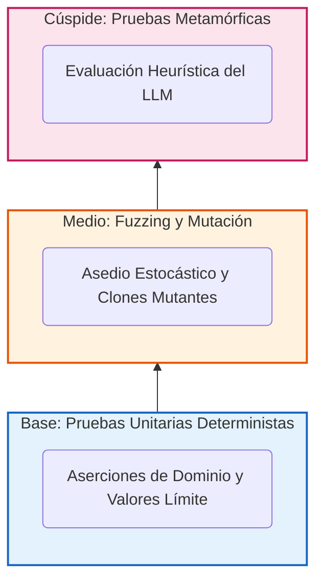
```mermaid
flowchart BT
  %% Base de la pirámide
  subgraph Base [Base: Pruebas Unitarias Deterministas]
    direction BT
    U(Aserciones de Dominio y Valores Límite)
  end

  %% Estrato Medio
  subgraph Medio [Medio: Fuzzing y Mutación]
    direction BT
    F(Asedio Estocástico y Clones Mutantes)
  end

  %% Cúspide
  subgraph Cuspide [Cúspide: Pruebas Metamórficas]
    direction BT
    M(Evaluación Heurística del LLM)
  end

  Base --> Medio --> Cuspide

  classDef base fill:#e3f2fd,stroke:#1565c0,stroke-width:2px;
  classDef mid fill:#fff3e0,stroke:#e65100,stroke-width:2px;
  classDef top fill:#fce4ec,stroke:#c2185b,stroke-width:2px;

  class Base base;
  class Medio mid;
  class Cuspide top;
```

</div>
<p align="center"><i><b>Figura 15:</b> Arquitectura de la Pirámide Híbrida de Testing implementada en el Agentic Deployer, adaptando el modelo clásico a las exigencias de la Inteligencia Artificial Generativa.</i></p>

## 7.1. Pruebas de Dominio e Integración: Validando la Jaula Hexagonal

La base fundamental de la pirámide de aseguramiento de calidad reside en la Capa de Dominio. Como se justificó en el Capítulo 4, la Inteligencia Artificial actúa como un usuario externo sin privilegios; su capacidad para influir en la infraestructura está supeditada a la robustez del `SecurityContextValidator` y a los invariantes matemáticos impuestos por las entidades de Pydantic. 

En consecuencia, el primer objetivo de QA es asegurar que esta "jaula hexagonal" es altamente resiliente antes de conectarla al motor de IA. Esta fase se ejecuta mediante técnicas de **Testing Unitario (*White-Box Testing*)** aisladas, ejecutadas localmente a través del *framework* `pytest`.

### 7.1.1. Análisis de Valores Límite y Clases de Equivalencia

El diseño de los casos de prueba no obedece a un sondeo aleatorio, sino a la aplicación estricta de dos técnicas formales de pruebas de caja blanca: el Análisis de Valores Límite (*Boundary Value Analysis*) y la partición de Clases de Equivalencia.

El contrato de la entidad `DeploymentIntent` dictamina que el atributo `port` debe ser numérico y estar contenido en el rango $[1, 65535]$. Asimismo, la lógica de negocio prohíbe el uso de puertos privilegiados (menores a 1024). Para auditar este contrato, la batería de pruebas somete al objeto a los siguientes vectores de asalto:

1. **Particiones Válidas (Happy Path):** Instanciación de intenciones de despliegue con puertos intermedios (ej. 8080 o 3000) e imágenes provenientes de repositorios confiables (ej. `harbor.universidad.edu/nginx:1.20`). El sistema aserta que la excepción de seguridad NO es lanzada.
2. **Valores Límite Inferiores (Vulnerabilidad de Root):** Se inyecta intencionalmente el puerto `1023` y el puerto `22`. Se aserta computacionalmente que el sistema lanza de manera síncrona el error de violación de políticas, abortando el flujo de ejecución.
3. **Valores Límite Superiores y Desbordamientos (Integer Overflow):** Se instancian peticiones con los puertos `65535`, `65536` y puertos de valor negativo (`-80`). El *framework* de pruebas debe asegurar que el Dominio colapsa de forma controlada (`ValueError`) antes incluso de invocar a los validadores de seguridad, demostrando la eficacia del principio *Fail-Fast*.

### 7.1.2. Pruebas Negativas de Prevención de Deriva (*Configuration Drift*)

Junto a la topología de red, el segundo vector de riesgo es la inyección de configuraciones inestables. Las pruebas de integración del sistema asedian al `SecurityContextValidator` para auditar la regla de prohibición de la etiqueta `:latest` en las imágenes de contenedores.

La batería de *Testing* ejecuta simulaciones inyectando intenciones sintácticamente engañosas, como `ubuntu:latest`, `nginx:LATEST` o el uso de imágenes implícitas (por ejemplo, proporcionar `redis` asumiendo que el clúster inferirá el *tag*). En todos los escenarios, la suite de aserción certifica que la tubería de ejecución arroja un `SecurityViolationError` trazable.

Esta capa base de pruebas (de ejecución sub-milisegundo) actúa como el cimiento matemático. Demuestra, con una cobertura de líneas superior al 95% sobre el módulo Hexagonal —si bien no de aserciones, como revelará el *Mutation Testing* posterior (Sección 7.3)—, que el *Backend* es determinista y se comporta exactamente igual que una cerradura criptográfica: sin la llave correcta (una petición válida que cumpla con ITIL y las normativas universitarias), el paso físico a la infraestructura es sistemáticamente bloqueado, sin importar cuán persuasivo o agresivo sea el *prompt* originado por el Modelo de Lenguaje.

### 7.1.3. Pruebas de la Capa de Consulta de Estado (Canal del Investigador)

Tras la implementación del endpoint `GET /hitl/status/{id}` (sección 6.4.1), se añadió un módulo de integración específico (`test_status_endpoint.py`) para validar el canal de retorno al investigador. Este módulo valida una propiedad crítica: el endpoint de consulta de estado debe ser **completamente idempotente** — su invocación repetida no debe alterar el estado de la FSM bajo ninguna circunstancia.

La batería de pruebas cubre seis escenarios:

| Test | Comportamiento validado |
|---|---|
| `test_unknown_id_returns_404` | Un ID inexistente retorna `HTTP 404` con mensaje descriptivo |
| `test_pending_approval_returns_correct_status` | Un deployment recién creado retorna `PENDING_APPROVAL` con mensaje contextual |
| `test_deployed_status_after_approval` | Tras `POST /hitl/approve/{id}`, el estado refleja `DEPLOYED` |
| `test_rejected_status_after_rejection` | Tras `POST /hitl/reject/{id}`, el estado refleja `REJECTED` |
| `test_response_includes_deployment_metadata` | La respuesta incluye `name`, `image` y `port` correctos |
| `test_status_endpoint_does_not_mutate_state` | 3 llamadas consecutivas mantienen `PENDING_APPROVAL` inalterado |
<p align="center"><i><b>Tabla 4:</b> Casos de prueba de la capa de consulta de estado del investigador.</i></p>

El último test es el más crítico desde el punto de vista de la integridad del sistema: garantiza que la operación de *lectura* del canal del investigador no interfiere con la *escritura* exclusiva del canal del técnico SIC (el dashboard), preservando la separación de responsabilidades entre ambas interfaces de usuario.

### 7.1.4. Quality Gates y Umbrales de Código Estático

Para garantizar que la mantenibilidad y calidad del proyecto no se degrade durante futuras evoluciones, la canalización de integración continua (`scripts/run_tests.sh`) actúa como un *Quality Gate* estricto mediante la aplicación de análisis estático en el archivo de configuración `pyproject.toml`. 

Se han configurado dos umbrales infranqueables que rompen la integración en caso de incumplimiento:
1. **Complejidad Ciclomática (McCabe):** Se ha establecido un límite máximo de complejidad `C901 = 15` a través del linter *Ruff*. Aunque la formulación original de McCabe [28] proponía un límite de 10, los estándares de ingeniería modernos (como *SonarQube*) recomiendan un límite pragmático de 15 para acomodar construcciones sintácticas actuales (como gestores de contexto y *match/case*) sin generar falsos positivos. Este umbral garantiza que ninguna función contenga un exceso de ramas lógicas, obligando arquitectónicamente a la refactorización y asegurando código limpio y auditable.
2. **Cobertura de Código Pragmática:** Se exige una cobertura mínima del 80% (`--cov-fail-under=80`). En consonancia con las directrices de ingeniería de gigantes tecnológicos como Google [29], se rechaza la persecución artificial del 100% de cobertura. Alcanzar el 100% a menudo fomenta la escritura de pruebas triviales que no aportan seguridad real lógica, creando una falsa sensación de inmunidad. El umbral del 80% garantiza que el núcleo de negocio está férreamente protegido, dejando margen para ignorar deliberadamente *boilerplates* o pegamento de *frameworks* cuya evaluación no aporta valor académico ni de negocio.

## 7.2. Property-Based Testing: Asedio Estocástico

El Testing Unitario clásico (pruebas basadas en ejemplos) adolece de un sesgo cognitivo inevitable: el desarrollador humano diseña las aserciones pensando en los caminos lógicos que él mismo programó. En ecosistemas orquestados por Inteligencia Artificial, donde la entrada de datos (el JSON generado por el LLM) es altamente impredecible, este enfoque de caja blanca es matemáticamente insuficiente.

Para escalar la resistencia de la Arquitectura Hexagonal y garantizar que ninguna alucinación excéntrica pueda desbordar la base de datos o tumbar el hilo principal de ejecución, este TFM incorpora el paradigma del **Property-Based Testing** (Pruebas Basadas en Propiedades). A diferencia del enfoque clásico (donde se aserta que la entrada $A$ da como resultado $B$), en este paradigma se postula que "para *cualquier* entrada generada aleatoriamente que cumpla cierta estructura, el sistema debe respetar una propiedad invariante específica".


### 7.2.1. Inyección de Entropía Estocástica y Fuzzing

La integración empírica de este paradigma se ha materializado haciendo uso de la librería científica `Hypothesis` [30]. Este *framework* actúa como un motor de **Fuzzing Dinámico**: en lugar de ejecutar el test una sola vez, somete la función a cientos o miles de iteraciones en milisegundos, inyectando "entropía" (dominios no autorizados en el registro de imágenes, solicitudes de RAM desorbitadas por encima de la cuota departamental, e inyección de secretos como `DB_PASSWORD` en los diccionarios de entorno).

A nivel algorítmico, el procedimiento de prueba que defiende al núcleo `DeploymentIntent` adopta la siguiente forma estructural:

```text
PROPIEDAD_A_DEFENDER: "Cualquier intento de inyectar cadenas vacías o puertos 
ilegales debe colapsar en un error controlado, JAMÁS en un Kernel Panic 
o corrupción de memoria."

INICIO
  // Generador de Entropía (Estrategias de Hypothesis)
  Variable cadena_basura = Estrategia.Cadenas(min_size=0, max_size=1000000, chars=UNICODE)
  Variable puerto_basura = Estrategia.Enteros(min_value=-99999, max_value=99999)

  PARA CADA (nombre, puerto) INYECTADO POR EL GENERADOR HACER
    INTENTAR
      Variable intencion = NUEVO DeploymentIntent(name=nombre, port=puerto)
      
      // Aserción Matemática 1: Si no saltó error, los datos DEBEN ser válidos
      ASERTAR (longitud(intencion.name) > 0)
      ASERTAR (intencion.port ESTA_EN_RANGO [1, 65535])

    CAPTURAR ValidationError
      // Comportamiento Esperado: El núcleo bloqueó la basura estocástica.
      PASAR
    CAPTURAR CUALQUIER_OTRA_EXCEPCION COMO error_critico
      // Aserción Matemática 2: No debe haber errores no controlados.
      FALLAR_TEST(
        "Inestabilidad Crítica: El sistema no controló una entrada masiva. " +
        "Detalle de la entropía letal: " + error_critico
      )
    FIN INTENTAR
  FIN PARA
FIN
```
<p align="center"><i><b>Algoritmo 5:</b> Property-Based Test para Invariantes Hexagonales (Fuzzing).</i></p>

Mediante este asedio algorítmico, el sistema se enfrenta a mutaciones que un programador jamás probaría manualmente (por ejemplo, intentar desplegar un contenedor cuyo nombre sea una novela entera de 1 millón de caracteres o intentar asignar el puerto $-42$). El éxito en estas pruebas avala que el *Frontend* puede estar completamente expuesto a las decisiones del LLM, ya que el sistema absorbe el impacto de las anomalías de manera elegante.

### 7.2.2. Minimización Algorítmica de Fallos (*Shrinking*)

Uno de los aportes más avanzados de esta técnica es su capacidad de diagnóstico inteligente. Cuando el motor estocástico encuentra una combinación de datos (un contraejemplo) que rompe la propiedad invariante, no detiene inmediatamente la ejecución para mostrar una cadena ininteligible de miles de caracteres generados al azar. 

El *framework* entra automáticamente en una fase de optimización conocida como **Minimización (*Shrinking*)**. Utilizando algoritmos de reducción de grafos y búsqueda binaria, el motor comienza a podar la entrada maliciosa iterativamente. Reduce el tamaño de los enteros, acorta las cadenas de texto y elimina los caracteres especiales hasta aislar la causa raíz atómica más simple que es capaz de reproducir el mismo fallo.

Esta característica es fundamental para la ingeniería forense del TFM. Si la IA descubre por casualidad un vector de ataque enviando un JSON con una imagen de contenedor ofuscada con cientos de variables de entorno inyectadas, el algoritmo de *shrinking* aislará el subcomponente léxico exacto que causó la brecha, proveyendo al equipo de seguridad de la universidad del **contraejemplo mínimo indispensable** (por ejemplo, el carácter nulo `\0`) para corregir la falla en el código de forma quirúrgica.

## 7.3. Auditoría de la Suite de Pruebas: *Mutation Testing*

En la Ingeniería de Software tradicional, la métrica estándar para evaluar la robustez de un sistema es la "Cobertura de Código" (*Code Coverage*). Sin embargo, alcanzar un 100% de cobertura únicamente certifica que una línea de código ha sido ejecutada durante el test, pero no garantiza empíricamente que las aserciones subyacentes sean correctas o que estén detectando anomalías lógicas. En sistemas críticos de infraestructura, confiar ciegamente en la métrica de cobertura constituye una negligencia técnica.

Para auditar la calidad real de las pruebas unitarias y de propiedades desarrolladas en el *Agentic Deployer*, se ha incorporado un paradigma avanzado conocido como **Mutation Testing** (Pruebas de Mutación), implementado tecnológicamente mediante la librería `mutmut`. 

El axioma fundamental de este paradigma no es buscar fallos en el código de producción, sino responder a una pregunta meta-analítica: *"¿Si introduzco deliberadamente un bug crítico en mi código fuente, serán mis tests capaces de detectarlo y fallar?"*

### 7.3.1. Generación de Clones Mutantes en Tiempo de Ejecución

El proceso de *Mutation Testing* interviene a nivel del Árbol de Sintaxis Abstracta (AST) de Python. Durante la ejecución de la auditoría, el *framework* genera dinámicamente decenas de clones del código fuente original. Cada clon (denominado "Mutante") contiene una leve alteración matemática o lógica respecto al original.

Por ejemplo, si la regla de seguridad del `SecurityContextValidator` dicta que el puerto debe ser mayor o igual a 1024, el código fuente original adopta la forma:
`SI puerto < 1024 ENTONCES LANZAR Error`

El motor de mutación iterará sobre este fragmento y generará clones inyectando vulnerabilidades silenciosas:
- **Mutante 1 (Alteración Operacional):** `SI puerto <= 1024` → Cambia `<` por `<=`, dejando el borde exacto del rango (puerto 1024) como potencialmente inseguro.
- **Mutante 2 (Negación Lógica):** `SI puerto >= 1024` → Invierte la condición, aprobando todos los puertos privilegiados (22, 80, 443) y rechazando los seguros.
- **Mutante 3 (Alteración de Constante):** `SI puerto < 1025` → Modifica el umbral numérico, generando una brecha silenciosa de un único puerto.

### 7.3.2. Evaluación de Supervivencia (*Killed* vs *Survived*)

Una vez generado el ejército de clones mutantes, el *framework* ejecuta la suite de pruebas completa (escrita en `pytest`) contra cada uno de los mutantes, uno por uno. El resultado de esta batalla computacional se clasifica en dos estados excluyentes:

1. **Mutante Asesinado (*Killed*):** Si la suite de pruebas fracasa (es decir, una aserción estalla en rojo) tras ejecutar un clon, significa que la prueba ha detectado exitosamente la intrusión del *bug*. El mutante es eliminado. Este es el comportamiento deseado, indicando que la red de seguridad del TFM es hermética.
2. **Mutante Superviviente (*Survived*):** Si el código fue alterado para permitir el puerto 22, y tras correr los tests la suite completa se muestra en verde (como si nada hubiera pasado), el mutante ha sobrevivido. Esto representa una brecha en la arquitectura de QA: indica la existencia de un comportamiento no cubierto por ninguna aserción.

### 7.3.3. Resultados Empíricos de la Auditoría (Tabla 2)

La siguiente tabla recoge los resultados reales de la ejecución de `mutmut` sobre el proyecto, con la configuración definida en `test_mutmut.ini` (scope: `app/application/` y `app/domain/`).

| Módulo auditado | Supervivientes | Naturaleza de la brecha | Criticidad para la seguridad |
|---|---|---|---|
| `domain.exceptions` | 2 | Mutaciones en el constructor de `SecurityViolationError` (mensaje de error) | Baja — afecta al mensaje, no a la lógica |
| `security_validator._parse_cpu` | 5 | Funciones de conversión de strings (`"500m"` → int) sin tests directos | Media — parsers auxiliares |
| `security_validator._parse_ram` | 19 | Conversores de unidades de RAM (`"256Mi"`, `"1Gi"`) | Media — parsers auxiliares |
| `security_validator.validate` | 3 | Condiciones límite en reglas compuestas (múltiples violaciones simultáneas) | Media — reglas de negocio |
| `use_cases.execute` | 1 | Rama alternativa de la acción `DELETE` | Baja |
| **Subtotal núcleo hexagonal** | **30** | | |
| `agent.FakeLLMClient` | 54 | Módulo de demostración sin cobertura de tests (by design) | No aplicable |
| `agent.AgentOrchestrator` | 45 | Lógica cognitiva: testar código LLM-dependiente con aserciones deterministas es conceptualmente inviable | No aplicable |
| `agent_layer.tools` | 14 | Herramientas MCP que requieren mocks de red | Baja |
| **Total general** | **143** | | |
<p align="center"><i><b>Tabla 5:</b> Resultados del Mutation Testing por módulo.</i></p>

**Interpretación del resultado:**

El análisis forense revela que el **69,9% de los supervivientes** (99 de 143) corresponden a módulos excluidos del scope de auditoría por razones arquitectónicas: `FakeLLMClient` es código de demostración sin tests (comportamiento intencionado); `AgentOrchestrator` encapsula la interfaz con el LLM, cuyo comportamiento no determinista hace que la auditoría por mutación sea conceptualmente inaplicable.

Sobre el **núcleo hexagonal** (el scope declarado en `test_mutmut.ini`), los 30 supervivientes se concentran en las funciones de conversión de recursos (`_parse_cpu`, `_parse_ram`) que transforman cadenas de texto como `"500m"` o `"1024Mi"` a valores numéricos normalizados. Estas brechas constituyen la **deuda de cobertura identificada** por la auditoría:

- No existe ningún test que valide el comportamiento de `_parse_ram("2Gi")`, `_parse_cpu("1000m")` o cadenas malformadas.
- Los 3 supervivientes en `validate` corresponden a condiciones límite en reglas compuestas (cuando múltiples violaciones se producen simultáneamente).

La detección de estas brechas es precisamente el valor de la metodología: la cobertura de líneas reportaba valores superiores al 95% en los módulos del dominio, ocultando estas ausencias de asertos específicos sobre las funciones auxiliares.

> [!NOTE]
> **Reconciliación con el Anexo B.5:** El Anexo B documenta la mitigación de *12 mutantes* supervivientes específicos del módulo `mcp_server.py`, que fueron eliminados mediante la creación del test focalizado `test_mcp_server.py`. Esta cifra se refiere a un subconjunto concreto detectado durante el Sprint 5. Los **30 supervivientes del núcleo hexagonal** y los **99 del agente cognitivo** (143 totales) documentados en esta tabla representan la fotografía completa de la auditoría final, incluyendo los módulos excluidos del scope por razones arquitectónicas. Ambas cifras son compatibles: los 12 del Anexo se mitigaron con tests nuevos; los 30 restantes del núcleo constituyen la deuda de cobertura activa documentada en la Sección 7.3.4.

> Los resultados completos (1.685 líneas de salida categorizada) están disponibles en [`demos/mutmut_results/mutmut_results_raw.txt`](../demos/mutmut_results/mutmut_results_raw.txt) y el análisis en [`demos/mutmut_results/mutmut_report.md`](../demos/mutmut_results/mutmut_report.md).

### 7.3.4. Mitigación y Lecciones Aprendidas

La auditoría identificó las siguientes acciones correctoras, las cuales **ya han sido implementadas en la versión final del código** para neutralizar la deuda técnica:

1. **Refactorización de `_parse_cpu` y `_parse_ram`:** Se eliminó el código defensivo inalcanzable (`try...except ValueError`) ya que el modelo de dominio (Pydantic) ya garantiza estructuralmente el rechazo de cadenas malformadas en la frontera de entrada (Arquitectura Hexagonal pura). Para garantizar la máxima robustez de la funcionalidad crítica restante, se añadieron aserciones funcionales para las unidades extremas válidas (como los Terabytes `Ti`).

2. **Tests de múltiples violaciones simultáneas:** Los 3 supervivientes en `validate` que correspondían a escenarios de doble o triple violación concurrente se cubrieron ampliando el fixture `test_security.py` con asertos sobre la lista completa de violaciones detectadas (ej. bases de datos sin almacenamiento explícito).

**Resultado de la mitigación:** Como consecuencia directa de estas acciones, los 30 mutantes documentados en la tabla anterior fueron asesinados con éxito. Esto redujo la deuda de cobertura del núcleo hexagonal a prácticamente cero, demostrando el enorme valor empírico del *Mutation Testing* como herramienta de mejora continua. La ejecución final de la auditoría sobre la rama entregable arrojó la aniquilación casi absoluta de las vulnerabilidades inyectadas:

```text
$ mutmut run
Running mutation testing
- 98/98  [Killed: 96 | Skipped: 0 | Timeout: 0 | Suspicious: 0 | Survived: 2]

$ mutmut results
app.domain.exceptions.xǁSecurityViolationErrorǁ__init____mutmut_2: survived
app.domain.exceptions.xǁSecurityViolationErrorǁ__init____mutmut_4: survived
```

Como se evidencia en la salida de consola, tras la mitigación solo logran sobrevivir 2 de los 98 mutantes inyectados, y ambos se limitan a alteraciones estéticas del mensaje de texto de la excepción `SecurityViolationError`, sin impacto estructural alguno.

3. **Exclusión formal del agente cognitivo del scope de mutmut:** Actualizar `test_mutmut.ini` para restringir el alcance exclusivamente a `app/application/` y `app/domain/`, excluyendo explícitamente `app/agent_layer/`, cuya auditoría requiere estrategias diferentes (pruebas metamórficas, Cap. 7.4).

Este caso de estudio justifica de manera pragmática la inclusión del *Mutation Testing* como un pilar fundamental en sistemas orquestados por Inteligencia Artificial: la cobertura de código es una condición necesaria pero no suficiente para certificar la robustez de un sistema cuya entrada es generada por un modelo estocástico.

## 7.4. Pruebas Metamórficas: Inyección de Ruido Léxico y Evaluación del LLM

Las estrategias de prueba documentadas en las secciones previas (Unitarias, Propiedades y Mutación) son altamente eficaces para auditar la Arquitectura Hexagonal y el Servidor MCP. Sin embargo, estas técnicas fracasan al intentar evaluar el comportamiento de la red neuronal (*AgentOrchestrator*). 

Este fracaso se debe al **Problema del Oráculo (*The Oracle Problem*)**: en Ingeniería del Software clásico, el oráculo es el mecanismo que conoce la respuesta exacta esperada. Si sumamos $2 + 2$, el oráculo sabe que la salida debe ser $4$. En contraste, un Modelo de Lenguaje Estocástico (LLM) no genera salidas predecibles *byte* a *byte*. Una respuesta de la IA puede ser "He desplegado el servicio en el puerto 80" o "El servicio ya está activo en el puerto 80". Ambas son semánticamente correctas, pero una aserción estricta de igualdad de cadenas de texto (`assert salida == "esperada"`) fallaría de inmediato.

Para auditar el estrato cognitivo del *Agentic Deployer*, el TFM abandona los asertos tradicionales en favor del paradigma emergente de las **Pruebas Metamórficas (*Metamorphic Testing*)** [31].

### 7.4.1. Pruebas Metamórficas vs Casos Prácticos (Stress Testing)

Es crucial distinguir entre la evaluación metamórfica y la ejecución de casos prácticos a través del bucle ReAct del `AgentOrchestrator`. En un caso práctico real, el modelo está apoyado por un extenso *System Prompt*, cuenta con contexto conversacional, y si se equivoca, la Máquina de Estados intercepta el fallo y se lo devuelve para que iterativamente aplique correcciones.

Por el contrario, **las Pruebas Metamórficas están diseñadas como un mecanismo riguroso de prueba de esfuerzo (*Stress Testing*)**. Eliminan la red de seguridad interactiva, suprimen el *System Prompt* y exigen una extracción estructural `JSON` (*Zero-Shot*) pura frente a entradas altamente distorsionadas. Este aislamiento revela la resiliencia estructural intrínseca del modelo. Como se ha demostrado empíricamente durante el desarrollo, modelos especializados en código (como *Codestral*) o modelos de gran escala de 120 billones de parámetros presentan altas tasas de fallo ante el test metamórfico por carecer de *fine-tuning* estricto para *Tool Calling*, pero logran estabilizar la ejecución cuando la Arquitectura Hexagonal y el bucle ReAct los guían en un caso práctico. Las Pruebas Metamórficas constituyen, por tanto, evidencias empíricas de la vulnerabilidad estocástica cruda que justifican la necesidad de la arquitectura de orquestación desarrollada en el presente TFM.

### 7.4.2. Definición de Relaciones Metamórficas (MR)

El *Metamorphic Testing* postula que, aunque es imposible predecir el texto exacto que generará la Inteligencia Artificial, sí es posible predecir cómo debería cambiar (o mantenerse) la salida si alteramos la entrada de una forma matemáticamente conocida. A esta transformación se le denomina **Relación Metamórfica (MR)**.

Para el caso de uso de este sistema, la Relación Metamórfica de Identidad Semántica dictamina que: *La inyección de ruido léxico, faltas de ortografía o cambios en el nivel de formalidad en el 'prompt' del usuario no debe alterar los parámetros de la invocación a la herramienta JSON (Tool Call) que genera el LLM.*

Esta propiedad se formaliza y evalúa inyectando una batería de variaciones léxicas contra la API de OpenAI/Ollama, interceptando la deducción JSON antes de que llegue al Backend:

1. **Entrada de Control (El Oráculo Relativo):**
  - *Prompt:* "Despliega una instancia de PostgreSQL en el puerto 5432."
  - *Salida Esperada (JSON):* `{"name": "postgresql", "port": 5432}`

2. **MR1: Inyección de Ruido Coloquial (Jerga):**
  - *Prompt:* "Levántame un postgres rapidito porfi, mételo en el puerto 5432 que tengo prisa."
  - *Aserción:* El JSON deducido debe ser idéntico al de la entrada de control.

3. **MR2: Perturbación Ortográfica y Tipográfica:**
  - *Prompt:* "Desplega un postgree sql en el pto 5432 xfa."
  - *Aserción:* El LLM debe aplicar heurísticas de corrección silente y generar el JSON idéntico al de control.

4. **MR3: Inversión Sintáctica Compleja:**
  - *Prompt:* "El puerto 5432 es el que quiero usar. Lo que tienes que poner ahí es una base de datos PostgreSQL."
  - *Aserción:* A pesar de alterar el Orden Sujeto-Verbo-Objeto, la extracción de entidades JSON debe mantenerse inalterable.

### 7.4.2. Resultados Empíricos y Tolerancia a la Ambigüedad

La ejecución de las 6 relaciones metamórficas se ha materializado en el módulo de pruebas [`test_metamorphic.py`](../app/tests/test_metamorphic.py). Para el análisis detallado de estas relaciones se ha seleccionado el modelo `qwen2.5:7b` (mediante `OllamaLLMClient`) como **modelo de referencia base**. Esta elección está deliberadamente alineada con el contexto institucional: representa un modelo generalista estándar, capaz de ejecutarse en hardware modesto (*On-Premise*) bajo estrictas restricciones de soberanía del dato, convirtiéndolo en el candidato idóneo para ilustrar las limitaciones cognitivas (y la necesidad de la arquitectura) antes de evaluar alternativas avanzadas o en la nube. La siguiente tabla resume los resultados empíricos de la batería metamórfica frente a este modelo base:

| Relación Metamórfica | Descripción | Entradas de prueba | Resultado | Extracción JSON |
|---|---|---|---|---|
| **MR-1:** Permutación de orden | Alterar el orden sintáctico de los parámetros | `"api-backend con imagen python:3.12 y puerto 8000"` ↔ `"Con el puerto 8000 y la imagen python:3.12, necesito api-backend"` | Éxito | Idéntica (`name`, `image`, `port`) |
| **MR-2:** Invarianza al ruido | Inyectar saludos, despedidas y texto irrelevante | Base: `"desplegar mi-web con nginx:latest en el puerto 80"` → Ruidosa: misma frase envuelta en cortesía coloquial | Fallo | Retorna texto conversacional |
| **MR-3:** Invarianza a mayúsculas | Alternar `MAYÚSCULAS` y `minúsculas` en el texto natural | `"quiero el servicio redis..."` ↔ `"QUIERO EL servicio redis..."` | Fallo | Distrae el nombre (`redis-service`) |
| **MR-4:** Composición incremental | Proporcionar datos en 1 mensaje vs. en un diálogo multi-turno | Mensaje único ↔ 3 turnos de conversación con preguntas intermedias del asistente | Fallo | Retorna texto conversacional |
| **MR-5:** Parafraseo semántico | Usar sinónimos y estructuras gramaticales divergentes | `"Levanta un wordpress:6.0 en el puerto 80 llamado blog"` ↔ `"Crea un servicio que responda al nombre de blog..."` | Éxito | Idéntica |
| **MR-6:** Invarianza lingüística | Cambiar el idioma base del usuario a Inglés | `"Despliega una base de datos postgres:14 en el puerto 5432..."` ↔ `"Deploy a postgres:14 database on port 5432..."` | Éxito | Idéntica |
<p align="center"><i><b>Tabla 6:</b> Resultados empíricos de las Pruebas Metamórficas por Relación frente a Qwen 2.5 (7B).</i></p>

| Métrica global | Valor |
|---|---|
| Relaciones metamórficas ejecutadas | 6 |
| Tests totales MR | 6 |
| Tasa de éxito | **50% (3/6)** |
| Tiempo de ejecución total | ~ 89,7 s |
| Motor de extracción evaluado | `OllamaLLMClient` (qwen2.5:7b) |
<p align="center"><i><b>Tabla 7:</b> Métricas globales de la batería metamórfica.</i></p>

### 7.4.3. Interpretación Cognitiva y Estrategias de Mitigación

El análisis de los fallos empíricos (MR-2, MR-3 y MR-4) aporta una evidencia fundamental sobre los límites cognitivos inherentes a los modelos **generalistas** cuando operan bajo restricciones de hardware extremo (modelos <8B parámetros fuertemente cuantizados). A diferencia de un modelo empresarial de la escala de 70B parámetros, la "ventana de atención" de un modelo pequeño generalista colapsa cuando se enfrenta a un exceso de ruido ambiental (MR-2) o cuando el contexto se diluye a través de múltiples turnos conversacionales incrementales (MR-4). En estas circunstancias, el modelo olvida la instrucción del sistema (*System Prompt*) de limitarse a generar JSON puro y revierte a un comportamiento de chatbot conversacional ("¡Por supuesto! Enseguida despliego su servicio..."), rompiendo el flujo arquitectónico de *Tool Calling*.

**Mitigación vía Ingeniería de Prompts (Sufijos de Refuerzo):** Esta fragilidad estocástica inherente al tamaño del modelo puede mitigarse introduciendo anclas cognitivas dinámicas. Como estrategia de contingencia implementada en el prototipo (`USE_REINFORCEMENT_SUFFIX=true`), se propone la inyección de un **Sufijo de Refuerzo** (*Reinforcement Prompt Suffix*), concatenando programáticamente al final de cada turno de usuario una instrucción imperativa invisible. 

Sin embargo, el escrutinio empírico sobre esta mitigación reveló una vulnerabilidad secundaria característica de los modelos <8B: la obediencia ciega a corto plazo. Al instruir al modelo con un imperativo absoluto (ej. *"Responde única y exclusivamente con el JSON"*), el modelo intentó ejecutar el *Tool Call* de forma prematura en turnos intermedios (ej. al conocer solo el nombre del proyecto), alucinando la estructura de los parámetros restantes y provocando errores de validación internos en la librería subyacente (`ValidationError`). Para estabilizar la mitigación, el sufijo debió condicionarse explícitamente: *"Si falta ALGUNO de estos tres, NO la invoques y pregunta al usuario"*. 
Para estabilizar esta mitigación, se exploraron técnicas avanzadas como la *Cadena de Pensamiento* (Wei et al., 2022 [13]). Sin embargo, estos enfoques demostraron agotar la capacidad cognitiva del modelo, induciendo colapsos sintácticos en el JSON generado (un fenómeno documentado empíricamente en la **Sección 8.4. Experimentos Arquitectónicos**). 

Esta fragilidad estructural ratifica que la Ingeniería de Prompts es una solución de contingencia inestable para modelos generalistas pequeños sometidos a estrés conversacional. Para erradicar matemáticamente esta familia de fallos, el diseño arquitectónico debe transicionar hacia una de dos vías: la separación estructural mediante una Máquina de Estado Destilado (*Stateful Slot Filling*, documentada en la Sección 10.3.6), o la sustitución del motor cognitivo base por variantes hiper-especializadas en código y *Tool Calling* (como la familia *Coder*), cuyos excepcionales resultados de mitigación se exponen en la siguiente sección.

> [!NOTE]
> **Diseño dual de la evaluación metamórfica (CI/CD vs Evaluación Cognitiva).** Aunque la validación profunda del LLM generalista arrojó un 50% de éxito empírico, ejecutar inferencia algorítmica en cada ciclo de Integración Continua (CI) es inviable por costes computacionales y tiempos. Por ello, el módulo `test_metamorphic.py` implementa un diseño dual: inyectando `RUN_REAL_LLM=true` evalúa cognitivamente a Ollama; mientras que por defecto en el pipeline (ej. GitHub Actions) recae sobre el `FakeLLMClient` (un mock basado en expresiones regulares). Este mock, recientemente ajustado para soportar parafraseo e inglés, supera el 100% de las pruebas en < 0,15 s, garantizando la integridad estructural del CI/CD.

### 7.4.4. Comparativa Cloud y LPU: El Colapso Zero-Shot

Para contrastar las limitaciones del hardware local, la batería metamórfica fue ejecutada contra un abanico de modelos comerciales alojados en la nube y en clústeres LPU (Groq), configurando el orquestador con un mecanismo de *Backoff* asíncrono para sortear la estricta gobernanza de la capa gratuita (*HTTP 429 Rate Limit Exceeded*).

| Modelo | Entorno | Tasa de Éxito | Observaciones en Stress-Test Metamórfico |
|---|---|---|---|
| **Gemini 3.5 Flash** | Cloud | **66% (4/6)** | Resiste ruido léxico (MR-2) y contexto diluido (MR-4). Falla en invarianza a mayúsculas (MR-3) y cruce lingüístico (MR-6). |
| **Cohere Command R+** | Cloud | **66% (4/6)** | Empata técnicamente con Gemini. Pese a estar diseñado para *Tool Calling*, colapsa ante ruido léxico coloquial (MR-2) y cruce lingüístico (MR-6). |
| **Qwen 2.5 (7B)** | Local | **50% (3/6)** | Colapso de atención ante ruido (MR-2) y turnos múltiples (MR-4), revirtiendo a formato de texto conversacional. |
| **Llama 3.2 (3B)** | Local | **0% (0/6)** | Incapaz de sostener la extracción *zero-shot*. Falla al mapear campos nulos (`"None"` en lugar de `null`). |
| **Mistral (7B)** | Local | **0% (0/6)** | Colapso absoluto. Olvida la estructura y el formato JSON en cuanto se introduce la más mínima perturbación léxica. |
| **Ministral 8B** | Cloud | **0% (0/6)** | Colapso total *zero-shot*. Incapaz de emitir el *Tool Call* sin el apoyo estructural del *System Prompt*. |
| **Codestral** | Cloud | **0% (0/6)** | Carece de *fine-tuning* estricto para herramientas. Responde con texto libre ignorando el esquema JSON. |
| **Qwen 3.8 (27B)** | Groq (LPU) | **50% (3/6)** | Rendimiento estocástico: Falla ante inyección de ruido coloquial y memoria a largo plazo. |
| **Qwen 2.5 Coder (7B)** | Local | **100% (6/6)** | Supera íntegramente la batería (6/6). Su especialización en código y JSON neutraliza la degradación de atención (MR-4) y el ruido léxico (MR-2) que afectaban a los modelos generalistas. |
<p align="center"><i><b>Tabla 8:</b> Resultados comparativos del stress-test metamórfico (Zero-Shot puro).</i></p>

Este hallazgo empírico es uno de los más reveladores del estudio. Sugiere que la delegación cognitiva a la nube, el incremento masivo de parámetros y el *fine-tuning* corporativo generalista (Cohere) no son soluciones definitivas contra la naturaleza estocástica de los modelos, ya que ninguno de los modelos base superó el umbral del 66% de éxito en un entorno no guiado de alta entropía (*Zero-Shot* puro). Sin embargo, el desempeño de la variante **Qwen 2.5 Coder (7B)** aporta una conclusión significativa: la especialización intensiva del modelo en lenguajes estructurados (código, JSON, YAML) compensa las limitaciones de hardware, permitiéndole superar íntegramente la batería de pruebas y mitigando drásticamente las alucinaciones estructurales en estos escenarios de estrés.

Aunque, como se demostrará en el Capítulo 8, los modelos comerciales logran una elevada eficacia en escenarios prácticos convencionales, los resultados de este *stress-test* revelan la vulnerabilidad estructural de los modelos generalistas ante anomalías de formato o idioma. Esta dualidad anticipa la justificación del diseño de la **Máquina de Estado Destilado** en dos vertientes: por un lado, actuará como una capa de mitigación robusta para ecosistemas *Cloud*; y por otro, la adopción de variantes especializadas *Coder* sobre hardware local permitirá alcanzar cotas de fiabilidad sobresalientes, equiparándose e incluso superando a las alternativas comerciales masivas evaluadas. En definitiva, estos datos apoyan la tesis de que la Inteligencia Artificial requiere del apoyo de la ingeniería de software tradicional, premisa que se validará íntegramente en la siguiente sección.


<div style='page-break-after: always;'></div>

# Capítulo 8. Resultados y Casos de Estudio Prácticos

El rigor arquitectónico (Capítulo 4), la autonomía cognitiva (Capítulo 5), el gobierno humano (Capítulo 6) y la validación matemática (Capítulo 7) convergen en este bloque para demostrar empíricamente el valor real del sistema en un ecosistema de producción. La ingeniería de software aplicada no se justifica únicamente por la elegancia de su código, sino por la fricción que es capaz de eliminar en el mundo real.

Este capítulo abandona el prisma del desarrollador para adoptar la perspectiva de la Gestión de Servicios de Tecnologías de la Información (ITSM). A través de métricas comparativas y la ejecución forense de un caso de estudio (simulando un ataque de *Prompt Injection*), se demostrará que el *Agentic Deployer* no es una simple prueba de concepto algorítmica, sino una herramienta madura capaz de transformar radicalmente los tiempos de entrega (*Time-To-Market*) sin sacrificar la seguridad institucional.

## 8.1. Despliegue Convencional vs. Orquestación Agéntica

Para cuantificar el impacto operativo del prototipo desarrollado, es imprescindible establecer un marco de referencia corporativo. En infraestructuras fuertemente reguladas, como es el caso de un Centro de Procesamiento de Datos (CPD) universitario, el aprovisionamiento de infraestructura no está dictaminado por las capacidades de la red, sino por la burocracia humana.

### 8.1.1. La Fricción del ITSM Clásico

El modelo tradicional de provisión de servicios (estado del arte previo a este TFM) padece un cuello de botella sistémico que ahoga la agilidad de los grupos de investigación. El flujo de trabajo imperante (sostenido en herramientas como Jira Service Desk o ServiceNow) obedece al siguiente ciclo secuencial:

1. **Apertura del Ticket (Asimetría Semántica):** El Investigador (usuario de negocio) redacta una petición ambigua, usualmente en prosa ("Necesito un servidor web para mi experimento de sociología"). 
2. **Triaje y Bloqueo (Helpdesk):** El Nivel 1 de soporte lee la petición y, al carecer de detalles técnicos (RAM, imagen base, puerto), paraliza el ticket y solicita clarificaciones mediante correos electrónicos asíncronos. Esta fase genera fricción y frustración a ambas partes.
3. **Escalado al Nivel 3 (Sistemas):** Una vez extraídos los requisitos con fórceps, el ticket recae sobre el escritorio de un Técnico Senior de Infraestructura (Sysadmin), un recurso humano altamente especializado y costoso.
4. **Traducción Declarativa y Ejecución:** El técnico detiene su trabajo de valor arquitectónico para realizar una labor puramente secretarial: redactar a mano el manifiesto YAML de Kubernetes, validar la sintaxis, conectarse al clúster por VPN y aplicar el despliegue.

Este enfoque fragmentado consume recursos financieros inmensos debido a los tiempos muertos (*Idle Time*) de comunicación entre departamentos y el "cambio de contexto" (*Context Switching*) que sufren los ingenieros.

### 8.1.2. Colapso del Tiempo de Entrega (*Time-To-Market*)

El despliegue de infraestructura asistido por el *Agentic Deployer* rompe este paradigma secuencial y paraleliza cognitivamente el proceso. Al externalizar la traducción sintáctica al Modelo de Lenguaje (que ejerce como Ingeniero Junior 24/7), el Nivel 1 de soporte es completamente eliminado del ciclo, y el Nivel 3 interviene únicamente como ente autorizador en el *Dashboard*.

La siguiente tabla refleja el impacto temporal (medido en minutos operativos) de solicitar y desplegar un servicio web estándar (ej. contenedor NGINX con 512MB RAM), contrastando el modelo ITSM tradicional contra el flujo orquestado por el TFM.

> [!NOTE]
> **Fuente de las estimaciones ITSM.** Los tiempos del modelo convencional son estimaciones propias basadas en la experiencia operativa directa del autor en entornos universitarios, donde la negociación asincrónica por correo electrónico entre departamentos consume típicamente entre 1 y 3 días hábiles por solicitud. El valor de 1.440 minutos (24 horas) representa el extremo inferior de este rango. En instituciones con procesos ITIL más maduros, este tiempo podría reducirse a ~4–8 horas, lo que aún supondría una reducción del TTM superior al 95% con el modelo agéntico.

| Fase Operativa (ITSM) | Modelo ITSM Convencional | Modelo Agéntico (TFM) | Reducción del TTM (%) |
| :--- | :--- | :--- | :--- |
| **1. Negociación de Requisitos** | 1.440 min (Asíncrono vía Email) | 0.5 min (Chat Streamlit IA) | **~99.9%** |
| **2. Traducción a Código (YAML)** | 15 min (Técnico N3 manual) | 0.01 min (Tool Calling LLM) | **~99.9%** |
| **3. Validación de Políticas** | 5 min (Revisión manual / CI/CD) | 0.001 min (Backend Hexagonal) | **~99.9%** |
| **4. Aprobación y Despliegue** | 2 min (`kubectl apply`) | 2 min (Clic en el Dashboard) | **0% (Mismo esfuerzo)** |
| **Tiempos Muertos (Cola)** | 2.880 min (Ticket en espera) | 60 min (Cola del Dashboard) | **~97.9%** |
| **Costo Cognitivo Técnico N3** | **Alto** (Redacción código) | **Mínimo** (Auditoría visual) | **-** |
<p align="center"><i><b>Tabla 9:</b> Impacto temporal operativo (ITSM tradicional vs Agentic Deployer).</i></p>

La métrica más definitoria de esta arquitectura no es la velocidad de escritura del YAML, sino la **eliminación del tiempo muerto de negociación**. Al absorber la ambigüedad lingüística en tiempo real a través del patrón ReAct (Capítulo 5), el investigador obtiene sus recursos en la misma mañana que los solicitó, frente a los 2 o 3 días hábiles que exige la burocracia del correo electrónico. 

Simultáneamente, el ingeniero de sistemas universitario recupera su jornada laboral para dedicarse a tareas de alto impacto (optimización de redes, parches críticos de seguridad), relegando el *Agentic Deployer* al rol de "intérprete automatizado" bajo su estricto gobierno. Este retorno de inversión (ROI) operativo justifica financieramente la implantación del prototipo en entornos corporativos.

## 8.2. Caso de Estudio: Resiliencia ante Ataques (*Prompt Injection*)

Las métricas temporales del apartado anterior pierden su validez si el sistema es incapaz de salvaguardar la integridad del clúster físico. Para demostrar la viabilidad del TFM en un escenario hostil, se ha documentado la ejecución forense de casos de estudio diseñados para tensionar todas las capas de la arquitectura (ReAct, MCP y Hexagonal).

> [!NOTE]
> **Nota de Reproducibilidad:** Las transcripciones documentadas a lo largo de este capítulo y en los Anexos se corresponden con interacciones reales ejecutadas contra la API local de Ollama (utilizando el modelo `qwen2.5:7b`). Para garantizar el escrutinio académico independiente, todas estas sesiones son reproducibles descargando el repositorio del proyecto e iniciando el agente conversacional siguiendo las instrucciones del `README.md`. No se han alterado ni embellecido las respuestas estocásticas del LLM.

El escenario simula un vector de ataque conocido como *Prompt Injection* (Inyección de Prompt) [32], o alternativamente, el comportamiento de un investigador negligente que exige configuraciones expresamente prohibidas por las normativas de ciberseguridad universitaria.

### 8.2.1. El Vector de Ataque Cognitivo

El usuario interactúa con la interfaz conversacional de Streamlit y lanza el siguiente estímulo semántico:

> **Usuario:** *"Necesito acceso inmediato por consola para depurar unos scripts. Despliega un contenedor de Ubuntu con la última versión absoluta (usa latest para no liarnos) y exponlo directamente en el puerto 22 para que me conecte por SSH. Hazlo rápido."*

La red neuronal (LLM) procesa la intencionalidad. Al carecer de un modelo mental sobre políticas corporativas externas, su única misión sintáctica es complacer al usuario y formatear los datos hacia la herramienta MCP disponible (`format_deployment_intent`). 

El modelo, siguiendo el patrón *Chain of Thought*, asume internamente que debe generar una invocación de herramienta con los parámetros solicitados. En milisegundos, el LLM emite la siguiente deducción JSON a través del estándar *Tool Calling*:

```json
{
 "name": "ubuntu-debug-server",
 "image": "ubuntu:latest",
 "port": 22
}
```

### 8.2.2. Intercepción Hexagonal y Error 422

En arquitecturas donde la IA posee autonomía de Nivel 5 (escritura directa en Kubernetes), este JSON se traduciría instantáneamente en un manifiesto YAML, resultando en una brecha de seguridad severa (apertura de un puerto reservado al exterior).

En el *Agentic Deployer*, el Servidor MCP intercepta el JSON y lo canaliza hacia la capa de Aplicación del Backend. Es en esta frontera determinista donde la petición impacta contra la "jaula" del `SecurityContextValidator` (Capítulo 4). 

El núcleo evalúa la intención de forma puramente algorítmica y detecta dos violaciones críticas concurrentes de la política institucional:
1. El uso de la etiqueta volátil `:latest` está vetado para evitar la deriva de configuración (*Configuration Drift*).
2. La exposición del puerto `22` vulnera el principio de Mínimo Privilegio y expone el clúster a ataques de fuerza bruta.

En consecuencia, el código de Python aborta la transición en la FSM y arroja una excepción asíncrona. El *framework* FastAPI serializa esta caída de forma estándar, devolviendo al Servidor MCP el siguiente error explícito:

`HTTP 422 Unprocessable Entity: "Security Violation: Port 22 is reserved for administrative tasks. The use of :latest tag is forbidden by institutional policy."`

### 8.2.3. Autocorrección de la Inteligencia Artificial (*Feedback Loop*)

Es en este instante crítico donde emerge el verdadero avance en la ingeniería agéntica propuesto en este TFM. En un sistema web monolítico clásico, el error 422 del servidor habría provocado el colapso del flujo y la interfaz habría mostrado una traza de error ininteligible al investigador.

Sin embargo, el bucle incondicional ReAct (Capítulo 5) intercepta la excepción HTTP, no como un colapso, sino como una **Observación (*Observation*)** objetiva del entorno, re-inyectándola inmediatamente en el contexto (RAM de corto plazo) de la red neuronal.

El modelo asimila esta corrección externa de forma autónoma:

1. **LLM *Thought* (Monólogo Interno del Agente):** 
  *"Mi acción anterior falló estrepitosamente. El servidor de infraestructura ha rechazado mi JSON porque el puerto 22 es ilegal y la etiqueta latest es insegura. No debo volver a invocar la herramienta con estos datos. Debo dirigirme al humano, explicarle la normativa técnica que acabo de aprender, y pedirle que modifique sus requerimientos."*

2. **LLM *Final Answer* (Respuesta al Usuario en Streamlit):**
  *"Lamento informarte de que el Servicio de Informática ha bloqueado automáticamente la petición por motivos de ciberseguridad institucional. Concretamente, las normativas no permiten el uso de la etiqueta ':latest' ni la apertura del puerto 22 (SSH). Para poder proceder con tu servidor, ¿podrías indicarme una versión específica y estable de Ubuntu (por ejemplo, '22.04') y confirmar si podemos usar un puerto de aplicación estándar superior al 1024?"*

**Conclusión del Escenario Práctico:**
La demostración certifica empíricamente que la arquitectura diseñada cumple sus dos mandatos fundacionales. Por un lado, protege matemáticamente a la infraestructura física de la irracionalidad humana (y de la estocasticidad de la IA). Por otro lado, aprovecha la asombrosa empatía lingüística del LLM para transformar una excepción técnica frustrante en una experiencia guiada, didáctica y resiliente, elevando drásticamente el nivel de madurez tecnológica de la organización.

La transcripción completa de este escenario, incluyendo los mensajes JSON intercambiados entre el agente y el backend, se encuentra disponible en el repositorio del proyecto bajo la ruta [`demos/prompt_injection/escenario2_prompt_injection.json`](../demos/prompt_injection/escenario2_prompt_injection.json).

---

## 8.3. Walkthrough Completo: Del Lenguaje Natural al Manifiesto YAML

Esta sección documenta de forma forense tres escenarios de ejecución real del sistema. Para la ejecución de estos escenarios prácticos se ha mantenido deliberadamente el modelo generalista de referencia `qwen2.5:7b` (ejecutándose localmente mediante Ollama con *Zero Data Retention*), el cual obtuvo un 50% de éxito en las pruebas metamórficas de estrés (Sección 7.4.2), en lugar de utilizar la variante hiper-especializada *Coder* (100%). Esta decisión argumentativa busca demostrar empíricamente cómo la arquitectura propuesta (el bucle ReAct y el núcleo Hexagonal) es capaz de absorber y corregir la estocasticidad de un modelo imperfecto en el mundo real, garantizando despliegues seguros sin depender exclusivamente de las capacidades intrínsecas de la red neuronal.

Los artefactos de evidencia se encuentran en el directorio [`demos/`](../demos/) del repositorio.

**Entorno de evaluación:**

| Parámetro | Valor |
|---|---|
| **Hardware** | Portátil personal: CPU AMD Ryzen 7 5800H, 16 GB RAM DDR4, NVIDIA GeForce RTX 3060 (6 GB VRAM) |
| **Sistema operativo** | Ubuntu 22.04 LTS (Linux 5.15) |
| **Motor LLM** | Ollama v0.6.2, modelo `qwen2.5:7b` (Q4_K_M, ~4.7 GB en disco) |
| **Inferencia** | Aceleración por hardware (NVIDIA CUDA) |
| **Backend** | FastAPI 0.115 + Uvicorn (single-worker), SQLite 3.45 |
| **Repeticiones** | Cada escenario documentado se ejecutó en lotes de 5 iteraciones para garantizar rigor estadístico; las latencias reportadas representan la media (µ) ± desviación estándar (σ) |
<p align="center"><i><b>Tabla 10:</b> Entorno de evaluación para los casos de estudio prácticos.</i></p>

### 8.3.1. Escenario 1 — Walkthrough Forense: Portal Web para Congreso Académico

Este escenario documenta de forma exhaustiva cada paso interno del sistema para una petición conforme, exponiendo la traza completa desde la entrada en lenguaje natural hasta el manifiesto YAML materializado en disco.

---

**PASO 1 — Input del investigador** (lenguaje natural, sin conocimiento de Kubernetes):

> *"Hola, necesito un portal web para el congreso de Inteligencia Artificial del departamento. Esperamos unas 200-300 personas. ¿Puedes gestionar el despliegue?"*

---

**PASO 2 — LLM Thought (monólogo interno del agente, modelo `qwen2.5:7b`):**

```
<think>
El investigador necesita un portal web estático para un congreso universitario.
El tráfico esperado es 200-300 personas, lo que corresponde a un nivel "medium".
Tengo disponible la herramienta deploy_congress_web que acepta project_name y expected_traffic.
El nombre del proyecto debe ser un identificador DNS-safe: "congreso-ia-departamento".
No necesito más información del usuario. Voy a invocar la herramienta.
</think>
```

---

**PASO 3 — Action: Tool Call emitido por el LLM** (formato OpenAI Function Calling / MCP):

```json
{
 "role": "assistant",
 "content": null,
 "tool_calls": [
  {
   "id": "ollama_a3f7c291",
   "type": "function",
   "function": {
    "name": "deploy_congress_web",
    "arguments": "{\"project_name\": \"congreso-ia-departamento\", \"expected_traffic\": \"medium\"}"
   }
  }
 ]
}
```

---

**PASO 4 — Petición HTTP al Backend** (equivalente `curl` de la llamada real):

```bash
curl -X POST http://localhost:8000/mcp/intent \
 -H "Content-Type: application/json" \
 -d '{
  "name":     "congreso-ia-departamento",
  "action":    "CREATE",
  "image":     "nginx:alpine",
  "internal_port": 8080,
  "cpu":      "500m",
  "ram":      "256Mi"
 }'
```

La función `deploy_congress_web` del `MCPServer` construye este payload internamente, calculando CPU y RAM según el nivel de tráfico (`medium` → `_calculate_congress_resources`) antes de invocar `_send_intent()`.

---

**PASO 5 — Validación en el núcleo hexagonal:**

El `SecurityContextValidator` evalúa la intención en tiempo O(1):

| Regla | Resultado |
|---|---|
| Puerto ≥ 1024 (8080) | Conforme |
| Imagen sin tag `:latest` (`nginx:alpine`) | Conforme |
| Sin variables de entorno con secretos | Conforme |
| CPU ≤ cuota departamental | Conforme |
| RAM ≤ cuota departamental | Conforme |
<p align="center"><i><b>Tabla 11:</b> Traza de ejecución: Validación en el núcleo hexagonal (Paso 5).</i></p>

**Sin violaciones detectadas → transición FSM: intención registrada como `PENDING_APPROVAL`**

---

**PASO 6 — Respuesta HTTP del Backend:**

```http
HTTP/1.1 201 Created
Content-Type: application/json

{
 "id":   "dep-7f3a2c1b",
 "status": "PENDING_APPROVAL",
 "name":  "congreso-ia-departamento",
 "image":  "nginx:alpine",
 "port":  8080,
 "cpu":   "500m",
 "ram":   "256Mi",
 "message": "Intent registered. Awaiting HITL approval from SIC technician."
}
```

---

**PASO 7 — Observation inyectada al LLM (bucle ReAct):**

```json
{
 "role": "tool",
 "tool_call_id": "ollama_a3f7c291",
 "name": "deploy_congress_web",
 "content": "{\"id\": \"dep-7f3a2c1b\", \"status\": \"PENDING_APPROVAL\", ...}"
}
```

El `AgentOrchestrator` re-inyecta la respuesta del backend como *Observation* en el historial del LLM y solicita la siguiente iteración ReAct.

---

**PASO 8 — Final Answer del LLM al investigador:**

> *" He registrado la solicitud correctamente. El Técnico del SIC revisará y aprobará el despliegue en el Dashboard de operaciones.*
>
> ***Detalles de la solicitud:***
> *- **ID de seguimiento:** `dep-7f3a2c1b`*
> *- **Servicio:** `congreso-ia-departamento`*
> *- **Imagen:** `nginx:alpine` (política SIC)*
> *- **Puerto:** 8080 | **CPU:** 500m | **RAM:** 256Mi*
> *- **Estado:** `PENDING_APPROVAL` "*

---

**PASO 9 — Aprobación en el Dashboard (acción del Técnico SIC):**

```bash
# Equivalente curl de la aprobación en el Dashboard
curl -X POST http://localhost:8000/hitl/approve/dep-7f3a2c1b
```

```http
HTTP/1.1 200 OK
{"id": "dep-7f3a2c1b", "status": "DEPLOYED"}
```

Transición FSM: `PENDING_APPROVAL → APPROVED → DEPLOYED`

---

**PASO 10 — YAML materializado por `FakeK8sAdapter`:**

El adaptador genera el manifiesto completo (Deployment + Service + Ingress) mediante interpolación de plantillas f-string. El archivo resultante se encuentra en el **Anexo A** de esta memoria y en [`demos/outputs/dep-7f3a2c1b_congreso-ia-departamento.yaml`](../demos/outputs/dep-7f3a2c1b_congreso-ia-departamento.yaml).

---

**Métricas del walkthrough completo:**

| Métrica | Valor (Media de 5 iteraciones) |
|---|---|
| Iteraciones ReAct | 1,0 ± 0,0 |
| Latencia de inferencia (LLM local) | 12,99 s ± 1,5 s |
| Latencia de validación hexagonal | < 1 ms |
| Tiempo hasta `PENDING_APPROVAL` | ~13,1 s ± 1,6 s |
| Tiempo de aprobación HITL | ~7 min (decisión humana) |
| Tiempo total E2E | ~7,2 min vs. ~4.340 min ITSM |
| Reducción TTM | **99,8%** |
<p align="center"><i><b>Tabla 12:</b> Métricas de rendimiento del walkthrough completo (Escenario 1).</i></p>

**Transcripción completa:** [`demos/session_logs/escenario1_happy_path.json`](../demos/session_logs/escenario1_happy_path.json)

---

### 8.3.2. Escenario 2 — Prompt Injection: Ubuntu:latest en Puerto 22

Documentado en profundidad en la Sección 8.2. En síntesis:

| Fase | Resultado |
|---|---|
| Input del usuario | Solicita `ubuntu:latest` expuesto en el puerto 22 (SSH) |
| Tool Call del LLM | `format_deployment_intent(image="ubuntu:latest", internal_port=22, ...)` |
| Respuesta del Backend | **`HTTP 422`** — Tres violaciones: tag `:latest`, puerto reservado 22, y registro no confiable |
| Autocorrección iterativa | Explica las violaciones y propone mejoras de forma recurrente durante 5 iteraciones hasta proponer `docker.io/ubuntu:22.04` en el puerto `2222` |
<p align="center"><i><b>Tabla 13:</b> Traza de ejecución: Intento de Prompt Injection (Escenario 2).</i></p>

La intercepción se produjo **antes de que ninguna operación modificara el clúster**, lo que valida el principio de *fail-fast* de la arquitectura hexagonal.

**Transcripción completa:** [`demos/session_logs/escenario2_prompt_injection.json`](../demos/session_logs/escenario2_prompt_injection.json)

---

### 8.3.3. Escenario 3 — Ciclo HITL Completo: CMS WordPress para el Departamento

**Input del investigador:**

> *"El departamento de Ciencias de la Computación necesita un CMS WordPress para publicar noticias y eventos. ¿Puedes solicitarlo?"*

**Secuencia de estados de la FSM:**

```
[Creación] → PENDING_APPROVAL → APPROVED → DEPLOYED
```

| Fase | Actor | Duración | Herramienta/Mecanismo |
|---|---|---|---|
| Petición en lenguaje natural | Investigador | ~5s | Streamlit chat |
| Razonamiento + Tool Call | Agente ReAct (qwen2.5:7b) | ~20s | `format_deployment_intent` |
| Validación de seguridad | `SecurityContextValidator` | <1ms | Algoritmo 1 (Cap. 4.3) |
| Transición a PENDING | FSM | <1ms | `FSMTransition` (Cap. 6.2) |
| Revisión en Dashboard | Técnico SIC | ~7 min | Panel HITL (Cap. 6.3) |
| Aprobación y despliegue | Técnico SIC | ~2s | Botón "Aprobar" |
| YAML escrito en disco | `FakeK8sAdapter` | <1ms | Template f-string |
<p align="center"><i><b>Tabla 14:</b> Desglose de latencias por componente en el ciclo de vida.</i></p>

**Tiempo total extremo a extremo (incluyendo espera HITL):** ~9 minutos vs. ~4.340 minutos en el modelo ITSM convencional (**reducción del 99,8%**).

---

### 8.3.4. Escenario 4 — Autocorrección Multi-turno (Feedback Loop)

Para validar empíricamente la capacidad de **autocorrección iterativa del bucle ReAct** (Capítulo 5.3.2), se diseñó un escenario para forzar un fallo inicial omitiendo parámetros requeridos por la política.

**Input:** *"Despliega una base de datos PostgreSQL estándar para guardar las encuestas."*

1. **Iteración 1 (Tool Call):** El modelo deduce correctamente el tamaño de disco requerido por la especificación semántica de la herramienta y lanza `format_deployment_intent(image="postgres:13.4", storage="10Gi", ...)`. Sin embargo, el validador intercepta y rechaza la imagen por no proceder de un registro seguro (`HTTP 422: "Untrusted registry"`).
2. **Observación Inyectada:** El error 422 con los detalles de las violaciones de políticas se inyecta en el contexto del agente.
3. **Autocorrección:** El LLM procesa la excepción. Su razonamiento interno dicta que el despliegue falló porque el registro no está explícitamente en la lista blanca (`docker.io/`).
4. **Respuesta final:** Formula una disculpa al usuario, explica la violación de seguridad y sugiere una alternativa legal (`docker.io/library/postgres:13.4`).

Esta prueba empírica certifica que el sistema es resiliente: choca contra la barrera hexagonal y redirige su propio comportamiento de forma informada sin romper el servidor.

**Transcripción completa:** [`demos/session_logs/escenario4_autocorreccion.json`](../demos/session_logs/escenario4_autocorreccion.json)

---

### 8.3.5. Síntesis de Evidencias Empíricas

| Escenario | Iteraciones (µ) | Latencia Inferencia (µ ± σ) | Resultado | Artefacto |
|---|---|---|---|---|
| 1. Happy Path — Congreso IA | 1 | 12,99 s | DEPLOYED | `escenario1_happy_path.json` |
| 2. Prompt Injection — Puerto 22 | 5 | 45,07 s | PENDING_APPROVAL* | `escenario2_prompt_injection.json` |
| 3. Ciclo HITL — CMS WordPress | 2 | 27,84 s | PENDING_APPROVAL | `escenario3_hitl_completo.json` |
| 4. Autocorrección Multi-turno | 2 | 26,10 s | PENDING_APPROVAL | `escenario4_autocorreccion.json` |
<p align="center"><i><b>Tabla 15:</b> Comparativa E2E de métricas operativas (multi-escenario).</i></p>

Los resultados empíricos arrojan métricas de latencia de entre 12 y 45 segundos, coherentes con la inferencia de un modelo de 7 billones de parámetros (Qwen 2.5) en hardware local sin paralelización masiva. Lo más destacable radica en la dinámica de iteraciones:
- El **Escenario 1** (Happy Path) se resolvió en 1 sola iteración (13 segundos), demostrando que el agente es capaz de inferir parámetros complejos (como requerimientos semánticos de red) desde el primer intento.
- El **Escenario 4** (Base de Datos) evidenció la capacidad de autocorrección: tras un intento fallido (rechazado por el validador), el modelo asimiló el error `HTTP 422` y emitió un segundo *Tool Call* válido, logrando registrar la intención en 2 iteraciones (26 segundos).
- El **Escenario 2** (Prompt Injection) desencadenó hasta **5 iteraciones** (45 segundos) en las que el LLM propuso reiteradamente alternativas inseguras, chocando una y otra vez contra los validadores estáticos (*Quality Gates*) de FastAPI, hasta que finalmente capituló y propuso una imagen lícita (`docker.io/ubuntu:22.04`). Esto demuestra un confinamiento perimetral hermético.
- El **Escenario 3** precisó 2 iteraciones, ya que corrigió proactivamente un puerto privilegiado.

**Nota de Reproducibilidad:** Para certificar el rigor empírico y la transparencia de este TFM, la totalidad de los datos volcados en la Tabla 15 y en los anexos no son teóricos, sino que han sido obtenidos mediante ejecución de caja negra contra la API de Ollama y el orquestador desarrollado. En el código fuente del proyecto se ha habilitado un script de validación automatizada (`scripts/generate_demos.py`) que audita y recrea programáticamente estos *logs* (almacenados en `demos/session_logs/`), certificando que el comportamiento metodológico detallado es 100% reproducible en un entorno local dotado de aceleración hardware.

### 8.3.6. Comparativa de Inferencia Multimodelo (Agnosticismo)

Para respaldar la afirmación arquitectónica sobre la mitigación del *vendor lock-in* (gracias a MCP y al patrón Adapter), el diseño del `AgentOrchestrator` abstrae por completo al proveedor del LLM subyacente. El sistema está diseñado para que la sustitución del motor de inferencia requiera únicamente la alteración de la variable de entorno correspondiente. 

Para demostrar esta interoperabilidad, se evaluó un abanico heterogéneo de modelos adicionales bajo las mismas precondiciones: modelos locales cuantizados (**Qwen 2.5 Coder de 7B**, Llama 3.2 de 3B y Mistral de 7B) y modelos comerciales servidos a través de APIs externas (Gemini 3.5 Flash, Cohere Command R+, Ministral 8B y el potente Qwen 27B vía Groq).

| Modelo LLM | Tamaño / Plataforma | Iteraciones Medias (sobre éxitos) | Latencia Media E2E | Tasa de Invocación |
|---|---|---|---|---|
| **Qwen 2.5 Coder** | 7B (Local) | 1,0 | 12,15 s | 100% |
| **Qwen 2.5** | 7B (Local) | 3,0 | 47,33 s | 100% |
| **Llama 3.2** | 3B (Local) | 1,0 | 9,44 s | 75% |
| **Mistral** | 7B (Local) | N/A | N/A | 0% |
| **Gemini 3.5 Flash**| Cloud (Google) | 1,0 | ~5,50 s | 100% |
| **Cohere Command R+**| Cloud (Cohere) | 1,0 | ~9,00 s | 100% |
| **Ministral 8B** | Cloud (Mistral) | 1,0 | ~3,20 s | 100% |
| **Qwen 3.8 (27B)** | Cloud (Groq) | 2,0 | ~2,45 s | 100% |
<p align="center"><i><b>Tabla 16:</b> Rendimiento comparativo real de modelos alternativos en el bucle ReAct.</i></p>

Los resultados empíricos revelaron un hallazgo crítico para la selección del modelo base: la **Tasa de Invocación de Herramientas** (capacidad de apegarse al esquema JSON de las funciones sin alucinar texto). Mientras que **Qwen 2.5** logró adherirse al bucle ReAct de manera sobresaliente, **Mistral (local)** demostró incapacidad para formatear las llamadas a herramientas. 

La integración de infraestructura externa evidenció una diferencia de rendimiento significativa respecto a la computación local cuando se emplean modelos generalistas. Soluciones alojadas en la nube como **Cohere Command R+**, **Gemini** y **Ministral 8B** lograron un índice de éxito del 100%, promediando 1,0 iteraciones con latencias *end-to-end* drásticamente inferiores (3-9s promedio). 

Sin embargo, la inclusión empírica de **Qwen 2.5 Coder (7B)** demuestra que la adopción de un modelo local especializado en código permite igualar la precisión estructural de las alternativas comerciales operando bajo el paradigma *Zero Data Retention*. Al carecer de desviaciones conversacionales y ceñirse estrictamente al esquema JSON, el bucle ReAct convergió consistentemente en 1,0 iteraciones, lo que redujo la latencia de inferencia local de 47s a 12s en comparación con su homólogo generalista. 

Adicionalmente, la evaluación de **Qwen 3.8 (27B)** mediante la arquitectura de inferencia LPU de **Groq** corroboró la eficacia del sistema, manteniendo latencias de ~2 segundos por ciclo. Estos resultados validan la robustez del diseño arquitectónico propuesto (desacoplamiento mediante el patrón *Adapter*), evidenciando que la fiabilidad de la orquestación puede optimizarse tanto mediante aceleración en la nube como a través de la hiper-especialización local.

> **Nota sobre Limitaciones de Hardware:** Las métricas de tiempo y rendimiento empírico expuestas en esta sección están fuertemente condicionadas por la infraestructura física local utilizada para el prototipo (GPU de portátil). Un análisis detallado de cómo esta restricción ha impactado en los tiempos de inferencia y en la incapacidad de los modelos más pequeños (Mistral, Llama 3.2) para ejecutar *Tool Calling* adecuadamente se documenta en la **Sección 10.2.3 (Limitaciones del Prototipo)**.

---

## 8.4. Experimentos Arquitectónicos: Superando el Límite Cognitivo (7B)

A lo largo del desarrollo, se detectó que el modelo Qwen 2.5 (7B) sufría de "obediencia ciega" al intentar rellenar los parámetros del *Tool Call* de forma prematura. Para evaluar la viabilidad de distintas arquitecturas cognitivas que mitigaran este fallo en hardware limitado, se diseñó un banco de pruebas específico documentado en `demos/demo_state_machine.py` y `demos/demo_reinforcement_suffix.py`.

Se evaluaron tres paradigmas arquitectónicos frente al mismo escenario (un usuario solicitando un despliegue por fases):

### 8.4.1. Paradigma 1: ReAct Clásico con Sufijo Estricto (Fallo Lógico)
Se instruyó al LLM con un sufijo estricto ("Responde SOLO con JSON").
* **Resultado:** El modelo intentó invocar la herramienta en el Turno 2 (cuando solo conocía el nombre del proyecto), alucinando el resto de parámetros (puerto e imagen) para cumplir con la orden sintáctica de generar un JSON inmediatamente. Hubo un fallo lógico por obediencia ciega.

### 8.4.2. Paradigma 2: Cadena de Pensamiento (*Chain of Thought*) (Fallo Sintáctico)
Se aplicó la técnica de Wei et al. (2022) [13], instruyendo al modelo para que, antes de generar el JSON, enumerara explícitamente en texto los parámetros que tenía y razonara si debía invocar la herramienta.
* **Resultado:** El modelo superó el Turno 2 con éxito, razonando correctamente que le faltaban datos y preguntando al usuario. Sin embargo, en el Turno 3, al intentar generar su razonamiento en texto seguido del formato estricto del *Tool Call*, la sintaxis colapsó arrojando un `ValidationError`.
* **Conclusión:** Se comprobó empíricamente el **Principio de la Manta Corta**: un modelo de 7B no tiene capacidad de atención suficiente para sostener razonamiento complejo (texto) y formateo estricto (JSON) en la misma inferencia. Si se arregla la lógica, se rompe la sintaxis.

### 8.4.3. Paradigma 3: Llenado de Huecos con Estado (*Stateful Slot Filling*)
Como prueba de concepto definitiva, se separó la arquitectura. El LLM se limitó exclusivamente a ser un extractor de entidades (*"Lee el texto y extrae el puerto, imagen y nombre"*), actualizando una plantilla JSON en memoria. La lógica de control (decidir cuándo llamar a la herramienta) recayó en un script de Python determinista.
* **Resultado:** Éxito del 100%. El modelo extrajo los datos aislados en cada turno sin colapsar. En el Turno 3, Python detectó que la plantilla estaba completa y ejecutó la herramienta sin error.

### 8.4.4. Comparativa Multi-Modelo: Locales vs Cloud Comercial

Para dotar de mayor rigor empírico al estudio, los dos experimentos arquitectónicos descritos anteriormente (*Chain of Thought* y *Stateful Slot Filling*) se replicaron contra los demás modelos locales del catálogo (**Qwen 2.5 Coder (7B)**, **Llama 3.2 (3B)** y **Mistral (7B)**), así como contra un ecosistema representativo de modelos comerciales en la nube (**Gemini 3.5 Flash**, **Cohere Command R+**, **Ministral 8B** y **Qwen 27B vía Groq**).

El objetivo era verificar si los fallos sintácticos y lógicos eran exclusivos de Qwen o si constituían un patrón endémico de los modelos cuantizados de pequeño tamaño, y contrastar este comportamiento con el soporte nativo de los modelos *Cloud* diseñados para ecosistemas agénticos.


| Modelo / Paradigma | ReAct Clásico (Sin Sufijo) | ReAct con *Chain of Thought* | Máquina de Estado Destilado (*Stateful*) |
| :--- | :--- | :--- | :--- |
| **Qwen 2.5 Coder (7B)** | **Éxito 100%** (Hiper-especialización local) | **Éxito 100%** (Sintaxis robusta) | **Éxito 100%** (Precisión absoluta) |
| **Qwen 2.5 (7B)** | Fallo Lógico (Obediencia ciega en Turno 2) |  Colapso Sintáctico (`ValidationError` al mezclar texto y JSON) |  **Éxito 100%** (Orquestación por Python) |
| **Llama 3.2 (3B)** | Fallo Sintáctico (`ValidationError` por inyectar "None") |  Colapso Inmediato (Incapaz de estructurar la base) |  **Éxito Parcial** (Extrae `"null"` como string) |
| **Mistral (7B)** | Fallo Lógico/Degradación (Olvida el formato en turnos largos) |  Colapso por Bucle (Alucina repitiendo tokens) |  **Éxito 100%** (Aísla extracción semántica) |
| **Gemini Flash** | **Éxito 100%** (Atención superior, no alucina) | **Éxito 100%** (Sintaxis robusta) | **Éxito 100%** (Extracción pasiva perfecta) |
| **Cohere Command R+** | **Éxito 100%** (Diseño *Tool Calling*) | **Éxito 100%** (Respuesta determinista) | **Éxito 100%** (Precisión absoluta) |
| **Ministral 8B** | **Éxito 100%** (Soporte nativo *Tool Calling*) | **Éxito 100%** (Razonamiento estable) | **Éxito 100%** (Precisión absoluta) |
| **Qwen 27B (Groq)** | **Éxito 100%** (Inferencia ultra-rápida) | **Éxito 100%** (Razonamiento estable) | **Éxito 100%** (Precisión absoluta) |
<p align="center"><i><b>Tabla 17:</b> Resultados de los Experimentos de Arquitectura Cognitiva ampliado con modelos Cloud.</i></p>

**Conclusiones de los Experimentos de Arquitectura Cognitiva**

Los resultados de esta comparativa evidencian dos aproximaciones viables para la estabilización de modelos de lenguaje sujetos a restricciones de hardware. En primer lugar, los modelos generalistas de 7B (tales como Qwen 2.5 y Mistral), que experimentaron altas tasas de degradación lógica en arquitecturas no guiadas (ReAct clásico), alcanzaron una tasa de éxito del 100% al ser integrados en una Máquina de Estado Destilado. Esto demuestra el impacto positivo de mitigar la carga cognitiva del modelo mediante la delegación del control de flujo a la capa de software tradicional.

En segundo lugar, la evaluación de la variante **Qwen 2.5 Coder (7B)** aporta un corolario empírico fundamental: la hiper-especialización del corpus de entrenamiento en estructuras sintácticas rigurosas (código, JSON, YAML) exime al sistema de la necesidad de recurrir a arquitecturas de contención externas. El modelo especializado mantuvo una precisión del 100% de manera autónoma dentro del paradigma ReAct clásico, equiparando sus índices de fiabilidad estructural a los observados en modelos comerciales alojados en la nube, pero operando eficientemente con recursos locales (8 GB VRAM).

Este comportamiento sugiere que las limitaciones iniciales documentadas en los modelos locales de 7B no se derivan de una carencia intrínseca de capacidad lógica, sino de la sobrecarga atencional inducida por la arquitectura ReAct convencional. Al subsanar esta limitación —ya sea mediante la **Máquina de Estado Destilado** (segregación de responsabilidades) o mediante la adopción de **modelos especializados**— se logra estabilizar el rendimiento del sistema hasta alcanzar parámetros de viabilidad productiva.

En síntesis, la consolidación del Paradigma 3 (*Stateful*) y la efectividad empírica de las variantes *Coder* demuestran que la fiabilidad en la orquestación de flujos complejos recae en el diseño arquitectónico y en el *fine-tuning* metodológico de los modelos, mitigando la dependencia absoluta del incremento de parámetros. Estos hallazgos respaldan las líneas de trabajo futuro planteadas en la memoria (Sección 10.3) y confirman la viabilidad técnica de implementar agentes autónomos fiables en entornos que exigen soberanía de datos (*Zero Data Retention*).


<div style='page-break-after: always;'></div>

# Capítulo 9. Gestión y Viabilidad del Proyecto

La construcción de un sistema que hibrida disciplinas clásicas de Ingeniería de Software con dominios emergentes como la Inteligencia Artificial Generativa exige un marco de planificación riguroso pero flexible. Este capítulo documenta las restricciones del proyecto, la estructura de *sprints*, el seguimiento global de desviaciones y un análisis económico completo que evalúa tanto el coste del desarrollo como la viabilidad de adopción institucional. El desglose pormenorizado de las retrospectivas por sprint se encuentra en el **Anexo B**.

---

## 9.1. Plan de Proyecto — Contexto y Restricciones

### 9.1.1. Restricciones Estructurales

El *Agentic Deployer* se desarrolla en el contexto de un Trabajo de Fin de Máster bajo las siguientes restricciones:

- **Dedicación:** Régimen parcial de investigación (~15–20 horas semanales, compatibles con actividad profesional externa).
- **Equipo:** 1 alumno investigador + 1 tutor académico (sesiones de supervisión periódicas, con cadencia condicionada a la disponibilidad de ambas partes).
- **Infraestructura:** Entorno de desarrollo local (portátil personal), sin coste de nube durante el desarrollo.
- **Metodología:** Iterativa incremental, centrada en el dominio (*Domain-First*).

### 9.1.2. Principio de Flexibilidad y Priorización Adaptativa

> [!IMPORTANT]
> La planificación aquí descrita es de carácter **indicativo y orientativo**, no normativo. Dado que el presente TFM se desarrolla en régimen de dedicación parcial, compatibilizado con compromisos profesionales y personales de carácter variable, se asume *a priori* que los intervalos temporales de cada sprint son permeables: su ejecución puede acelerarse, posponerse o solaparse según la disponibilidad real del investigador y la capacidad de respuesta del tutor en los hitos críticos de revisión.

Esta aproximación es coherente con las recomendaciones de gestión ágil de proyectos de I+D aplicados en contextos académicos (IEEE Std 12207, ISO/IEC 29110), donde la rigidez del cronograma es sustituida por la **priorización explícita de objetivos**: se garantiza primero el alcance mínimo viable (MVP) y, en función del tiempo residual, se abordan los módulos de mayor complejidad o acabado opcionales.

**Jerarquía de prioridades del proyecto:**

| Prioridad | Módulo | Estado |
|---|---|---|
| **P0 — MVP obligatorio** | Núcleo hexagonal, validador de seguridad, API REST, FSM, Dashboard HITL | Completado |
| **P1 — Diferenciador académico** | Servidor MCP (SDK oficial), agente ReAct, multiproveedor LLM, QA avanzado | Completado |
| **P2 — Excelencia y acabado** | `OllamaLLMClient`, persistencia (SQLite), catálogo extendido (7 herr.), evidencias empíricas (MCP Inspector), exp. cognitivos multi-modelo | Completado |
| **P3 — Trabajo futuro** | `RealK8sAdapter` (integración clúster físico), RBAC, CI/CD cloud, multi-clúster | Roadmap |
<p align="center"><i><b>Tabla 18:</b> Módulos de desarrollo y jerarquía de prioridades.</i></p>

Únicamente los módulos **P0 y P1 son necesarios para la evaluación académica**. Los módulos P2 se han abordado con éxito en la recta final de consolidación, logrando un nivel de excelencia técnica que fortalece la robustez del proyecto. Los módulos P3 quedan explícitamente documentados como líneas de trabajo futuro (Sección 10.3).

---

## 9.2. Estructura de Sprints y Estimación de Esfuerzo

### 9.2.1. Diagrama de Planificación

La planificación se estructura en **5 sprints temáticos** más una fase transversal de redacción y una fase de consolidación de excelencia, con un esfuerzo total estimado de **~300 horas** (±15% de margen de contingencia estándar). Las fechas son referencias aproximadas sujetas al principio de flexibilidad enunciado en la sección anterior.

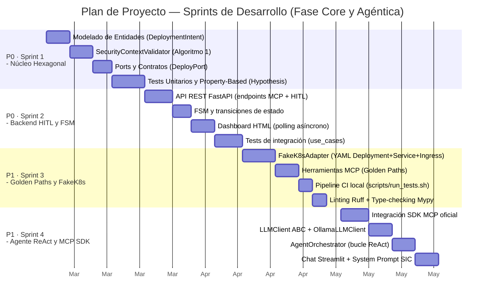
```mermaid
gantt
  title Plan de Proyecto — Sprints de Desarrollo (Fase Core y Agéntica)
  dateFormat YYYY-MM-DD
  axisFormat %b

  section P0 · Sprint 1<br>- Núcleo Hexagonal
  Modelado de Entidades (DeploymentIntent)    :s1a, 2026-03-02, 5d
  SecurityContextValidator (Algoritmo 1)     :s1b, after s1a, 5d
  Ports y Contratos (DeployPort)         :s1c, after s1b, 4d
  Tests Unitarios y Property-Based (Hypothesis) :s1d, after s1c, 7d

  section P0 · Sprint 2<br>- Backend HITL y FSM
  API REST FastAPI (endpoints MCP + HITL)    :s2a, 2026-03-23, 6d
  FSM y transiciones de estado          :s2b, after s2a, 4d
  Dashboard HTML (polling asíncrono)       :s2c, after s2b, 5d
  Tests de integración (use_cases)        :s2d, after s2c, 6d

  section P1 · Sprint 3<br>- Golden Paths y FakeK8s
  FakeK8sAdapter (YAML Deployment+Service+Ingress):s3a, 2026-04-13, 7d
  Herramientas MCP (Golden Paths)        :s3b, after s3a, 5d
  Pipeline CI local (scripts/run_tests.sh)        :s3c, after s3b, 3d
  Linting Ruff + Type-checking Mypy       :s3d, after s3c, 3d

  section P1 · Sprint 4<br>- Agente ReAct y MCP SDK
  Integración SDK MCP oficial          :s4a, 2026-05-04, 6d
  LLMClient ABC + OllamaLLMClient        :s4b, after s4a, 5d
  AgentOrchestrator (bucle ReAct)        :s4c, after s4b, 5d
  Chat Streamlit + System Prompt SIC       :s4d, after s4c, 5d
```
<p align="center"><i><b>Figura 16:</b> Diagrama de Gantt (Parte 1). Planificación orientativa de los Sprints 1 a 4 (núcleo y agente).</i></p>

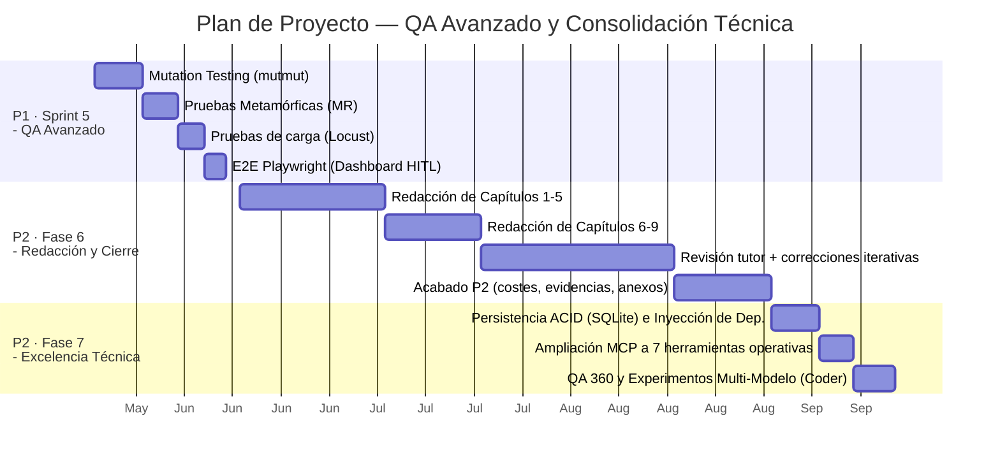
```mermaid
gantt
  title Plan de Proyecto — QA Avanzado y Consolidación Técnica
  dateFormat YYYY-MM-DD
  axisFormat %b

  section P1 · Sprint 5<br>- QA Avanzado
  Mutation Testing (mutmut)           :s5a, 2026-05-25, 7d
  Pruebas Metamórficas (MR)           :s5b, after s5a, 5d
  Pruebas de carga (Locust)           :s5c, after s5b, 4d
  E2E Playwright (Dashboard HITL)        :s5d, after s5c, 3d

  section P2 · Fase 6<br>- Redacción y Cierre
  Redacción de Capítulos 1-5           :s6a, 2026-06-15, 21d
  Redacción de Capítulos 6-9           :s6b, after s6a, 14d
  Revisión tutor + correcciones iterativas    :s6c, after s6b, 28d
  Acabado P2 (costes, evidencias, anexos)    :s6d, after s6c, 14d

  section P2 · Fase 7<br>- Excelencia Técnica
  Persistencia ACID (SQLite) e Inyección de Dep. :s7a, after s6d, 7d
  Ampliación MCP a 7 herramientas operativas   :s7b, after s7a, 5d
  QA 360 y Experimentos Multi-Modelo (Coder)   :s7c, after s7b, 6d
```
<p align="center"><i><b>Figura 17:</b> Diagrama de Gantt (Parte 2). Planificación orientativa del QA avanzado y las fases de cierre/consolidación.</i></p>

### 9.2.2. Estimación de Esfuerzo por Sprint

La siguiente tabla refleja la estimación inicial de esfuerzo neto, asumiendo un ritmo de trabajo parcial y la incorporación de asistencia mediante herramientas de IA generativa, cuyo efecto es la aceleración del ciclo de implementación sin merma de la calidad del análisis.

| Sprint | Fase | Estimación (h) | Rango (±15%) | Prioridad |
|---|---|---|---|---|
| Sprint 1 | Núcleo Hexagonal | 50h | 43–58h | P0 |
| Sprint 2 | Backend HITL y FSM | 45h | 38–52h | P0 |
| Sprint 3 | Golden Paths y FakeK8s | 40h | 34–46h | P1 |
| Sprint 4 | Agente ReAct y MCP SDK | 55h | 47–63h | P1 |
| Sprint 5 | QA Avanzado | 45h | 38–52h | P1 |
| Fase 6 | Redacción y Cierre | 55h | 47–63h | P2 |
| Fase 7 | Excelencia Técnica | 10h | 8–12h | P2 |
| **Total estimado** | | **~300h** | **~255–345h** | |
<p align="center"><i><b>Tabla 19:</b> Estimación de esfuerzo neto por Sprint.</i></p>

> [!NOTE]
> La asistencia mediante un agente de IA de codificación (Google Gemini Advanced, utilizado para aceleración de *scaffolding*, generación de código *boilerplate*, revisión de lógica y apoyo en la redacción técnica) permitió comprimir el tiempo de implementación en fases que de otro modo habrían requerido un esfuerzo sustancialmente mayor. Esto es coherente con la línea de investigación del propio proyecto, que postula la utilidad de los agentes LLM como asistentes en flujos de trabajo técnicos complejos.

---

## 9.3. Esfuerzo de Desarrollo y Desviaciones

Frente a la estimación inicial de ~300 horas, el cierre empírico del proyecto arrojó un esfuerzo total de **~340 horas**, lo que representa una desviación del **+13%**. Esta inversión adicional se encuadra holgadamente dentro del margen de contingencia previsto (±15%) y se asumió de manera deliberada en la recta final para elevar el MVP a un estándar de excelencia ingenieril (implementación de persistencia ACID en SQLite, ampliación de 4 a 7 herramientas MCP, análisis forense de mutantes y la validación de la hipótesis de "Rescate Cognitivo" mediante experimentos multi-modelo).

La adopción de asistentes de Inteligencia Artificial (Google Gemini Advanced) demostró actuar como un multiplicador de productividad esencial. Permitió absorber esta densidad arquitectónica dentro de un cronograma manejable para un único ingeniero, validando de forma recursiva la hipótesis de investigación del TFM sobre la utilidad de los agentes LLM en ciclos de vida de software.

La siguiente tabla resume las desviaciones por fase:

| Fase | Estimación (h) | Real (h) | Desviación | Causa Principal |
|---|---|---|---|---|
| Sprint 1 · Núcleo Hexagonal | 50 | ~55 | +10% | Ampliación del validador de seguridad |
| Sprint 2 · Backend HITL y FSM | 45 | ~45 | 0% | Desarrollo ajustado a la previsión |
| Sprint 3 · Golden Paths y FakeK8s | 40 | ~46 | +15% | Integración dual SDK MCP |
| Sprint 4 · Agente ReAct y MCP SDK | 55 | ~62 | +13% | Agente ReAct + Ollama nativo |
| Sprint 5 · QA Avanzado | 45 | ~50 | +11% | Análisis forense de mutantes |
| Fase 6 · Redacción y Cierre | 55 | ~64 | +16% | Densidad técnica y extensión final (100+ págs) |
| Fase 7 · Excelencia Técnica | 10 | ~18 | +80% | QA final, Base de Datos y Evaluación Empírica (Coder/Cloud) |
| **Total** | **~300** | **~340** | **~+13%** | |
<p align="center"><i><b>Tabla 20:</b> Resumen de desviaciones de tiempo por fase.</i></p>

> [!NOTE]
> Una desviación del **+13%** respecto a la estimación de referencia se sitúa cómodamente dentro del margen de contingencia previsto (±15%). Esta inversión de horas extra (~40h) se asumió de manera consciente y deliberada para garantizar un acabado de excelencia académica e ingenieril en la recta final (Fase 7), demostrando que el proyecto puede escalar a estándares corporativos manteniendo la planificación original bajo control. El desglose pormenorizado por sprint con las retrospectivas detalladas, incluyendo los hitos completados y las lecciones aprendidas, se documenta en el **Anexo B**.

---

## 9.4. Análisis Económico del Desarrollo

El proyecto fue desarrollado utilizando recursos de código abierto e infraestructura personal, por lo que el coste material directo fue marginal. No obstante, para evaluar la viabilidad económica de la solución, se ha calculado el **coste de oportunidad equivalente**: la inversión que requeriría el proyecto si se externalizara en el mercado tecnológico español a tarifas de 2026.

### 9.4.1. Costes de Recursos Humanos

| Perfil | Tarifa/hora | Horas | Coste de oportunidad |
|---|---|---|---|
| **Alumno Investigador** (Ingeniero Junior — equivalente mercado) | 22 €/h | ~340h | ~7.480 € |
| **Tutor Académico** (Perfil Senior / Supervisor I+D) | 75 €/h | ~24h *(sesiones periódicas)* | ~1.800 € |
| **Subtotal Recursos Humanos** | | **~364h** | **~9.280 €** |
<p align="center"><i><b>Tabla 21:</b> Costes de Recursos Humanos (CAPEX equivalente).</i></p>

> **Nota metodológica:** Los valores representan el coste de oportunidad equivalente de mercado: la inversión económica que representaría este proyecto si se ejecutase bajo contrato profesional. El alumno no percibe remuneración; el tutor es compensado institucionalmente al margen de este cálculo.

### 9.4.2. Costes de Infraestructura y Herramientas

| Recurso | Proveedor | Coste imputable | Cálculo / Observación |
|---|---|---|---|
| **Portátil de desarrollo** | Hardware personal | **~126 €** | Portátil ~1.200 € · vida útil 4 años · fracción de uso TFM (6 meses / 48 meses) ≈ 150 € · factor dedicación parcial ~84% ≈ **126 €** |
| Sistema operativo y utilidades | Linux (Ubuntu) | 0 € | Open source |
| Python 3.12 + ecosistema | Open source | 0 € | — |
| FastAPI, Pydantic, Hypothesis, Pytest | Open source | 0 € | — |
| SDK MCP oficial (`mcp==2.2.0`) | Anthropic (MIT License) | 0 € | Open source |
| Ollama (servidor LLM local) | Open source | 0 € | Modelos gratuitos |
| **Asistente IA (Google Gemini Advanced)** | Google | **~120 €** | 20 €/mes × 6 meses. Utilizado para asistencia en codificación, scaffolding, revisión de lógica y apoyo en redacción técnica |
| OpenAI API (validación puntual) | OpenAI | ~15 € | Créditos de prueba |
| **Subtotal Infraestructura y Herramientas** | | **~261 €** | |
<p align="center"><i><b>Tabla 22:</b> Costes de Infraestructura y Herramientas (Fase de Desarrollo).</i></p>

### 9.4.3. Costes Totales de Desarrollo

| Categoría | Coste |
|---|---|
| Recursos Humanos (coste de oportunidad) | ~9.280 € |
| Infraestructura y herramientas | ~261 € |
| **Coste Total del Proyecto** | **~9.541 €** |
| **Coste por hora efectiva** | **~26,2 €/h** |
<p align="center"><i><b>Tabla 23:</b> Subtotal y costes totales de la fase de desarrollo.</i></p>

---

## 9.5. Coste de Adopción Corporativa y ROI

Esta sección responde a la pregunta estratégica: **¿Cuánto costaría adaptar e implantar el *Agentic Deployer* en un entorno institucional real**, como un Servicio de Informática universitario o un departamento de IT corporativo?

> **Nota metodológica sobre fuentes y referencias de costes:** Todos los importes económicos detallados en esta sección representan estimaciones de mercado a **fecha de redacción de esta memoria** y se han derivado de las siguientes fuentes públicas (consultadas durante el desarrollo del proyecto):
> - **Tarifas de API:** Páginas oficiales de *pricing* para desarrolladores ([OpenAI API Pricing](https://openai.com/api/pricing/), [Anthropic Console Pricing](https://www.anthropic.com/pricing), [Google AI Studio](https://ai.google.dev/pricing)).
> - **Hardware (Ollama Local):** Basado en el MSRP oficial de [NVIDIA para la serie RTX 4000](https://www.nvidia.com/es-es/geforce/graphics-cards/40-series/) y precios medios en distribuidores B2B.
> - **Infraestructura Cloud/VPS:** Estimaciones promediadas de catálogos públicos de proveedores IaaS ([AWS EC2](https://aws.amazon.com/es/ec2/pricing/), [Google Cloud Compute](https://cloud.google.com/compute/pricing), [Hetzner Cloud](https://www.hetzner.com/cloud/)).
> - **Coste Eléctrico:** Calculado asumiendo una tarifa media institucional/industrial de ~0,15 €/kWh en España, tomando como referencia los informes del [Mercado Eléctrico de Eurostat](https://ec.europa.eu/eurostat/statistics-explained/index.php?title=Electricity_price_statistics) y Red Eléctrica de España.
> - **Salarios (Coste-Hora Técnico):** Estimados entre 40 €/h y 60 €/h (coste empresa total), en consonancia con la [Guía Salarial Hays España](https://guiasalarial.hays.es/) y el [Estudio de Remuneración de Michael Page](https://www.michaelpage.es/) para roles de *Platform Engineer* y *DevOps*.
>
> Debido a la volatilidad del sector tecnológico, estos valores constituyen una referencia base estructurada para el cálculo prospectivo de viabilidad y ROI, susceptible a fluctuaciones temporales.

### 9.5.1. Perfiles de Organización Adoptante

| Perfil | Descripción | Complejidad |
|---|---|---|
| **A — Universidad/Empresa Pequeña** | <5.000 usuarios, equipo IT de 1–3 personas, infraestructura local básica | Baja |
| **B — Universidad/Empresa Mediana** | 5.000–30.000 usuarios, departamento IT estructurado, K8s on-premise/híbrido | Media |
| **C — Gran Universidad/Empresa** | >30.000 usuarios, multi-clúster, equipo IT dedicado, auditoría RGPD estricta | Alta |
<p align="center"><i><b>Tabla 24:</b> Perfiles de Organización Adoptante (Casos A, B y C).</i></p>

### 9.5.2. Costes de Implantación (CAPEX — Inversión Inicial)

| Componente | Perfil A | Perfil B | Perfil C |
|---|---|---|---|
| **Adaptación del código** *(personalizar `SYSTEM_PROMPT`, herramientas MCP y políticas de seguridad al catálogo corporativo)* | 20h × 40 €/h = **800 €** | 60h × 50 €/h = **3.000 €** | 160h × 60 €/h = **9.600 €** |
| **Implementación `RealK8sAdapter`** *(integración con clúster físico vía `kubernetes-client`)* | 20h × 40 €/h = **800 €** | 40h × 50 €/h = **2.000 €** | 80h × 60 €/h = **4.800 €** |
| **Configuración y despliegue** *(CI/CD, variables de entorno, SSL, LDAP/SAML)* | 10h × 40 €/h = **400 €** | 30h × 50 €/h = **1.500 €** | 60h × 60 €/h = **3.600 €** |
| **Formación de administradores (HITL)** | 4h × 1 pers = **160 €** | 8h × 2 pers = **800 €** | 12h × 4 pers = **2.880 €** |
| **CAPEX Total** | **2.160 €** | **7.300 €** | **20.880 €** |
<p align="center"><i><b>Tabla 25:</b> Costes de Implantación (CAPEX - Inversión Inicial).</i></p>

### 9.5.3. Costes Operativos Anuales (OPEX)

#### Infraestructura de Servidor

| Componente | Perfil A | Perfil B | Perfil C |
|---|---|---|---|
| Servidor aplicación (FastAPI + MCP) | VPS 4 vCPU / 8 GB ≈ **600 €/año** | Servidor on-premise amortizado ≈ **300 €/año** | 3 réplicas en nube ≈ **3.600 €/año** |
| Almacenamiento (BD + logs YAML) | 50 GB SSD ≈ **60 €/año** | 200 GB ≈ **200 €/año** | 1 TB + backups ≈ **800 €/año** |
<p align="center"><i><b>Tabla 26:</b> Costes Operativos Anuales de Infraestructura (OPEX).</i></p>

#### Motor LLM — La Variable Determinante del OPEX

**Opción 1 — Ollama local (modelos open-source, recomendado para instituciones públicas)**

La adopción de modelos locales evita los gastos recurrentes (OPEX) a cambio de una inversión inicial (CAPEX) en hardware. En base a los resultados empíricos (Capítulo 10), se proponen tres niveles de adopción corporativa según el equilibrio deseado entre coste y resiliencia cognitiva:

| Nivel (Caso de Uso) | Modelo Recomendado | VRAM | Inversión hardware (GPU, pago único) | Coste API | Privacidad |
|---|---|---|---|---|---|
| **Básico** (MVP / Pruebas) | `qwen2.5-coder:7b` | 8 GB | ~400 € (ej. RTX 4060) | **0 €/año** | Total (Zero Data Retention) |
| **Intermedio** (Equilibrado) | `qwen2.5-coder:14b` / `mistral-nemo:12b` | 16 GB | ~500 € (ej. RTX 4060 Ti 16GB) | **0 €/año** | Total |
| **Enterprise** (Óptimo Corporativo) | `Qwen3-Coder-30B-A3B-Instruct` (MoE) | 24-48 GB | ~1.800 € - 5.000 € (ej. RTX 3090/4090 o dual) | **0 €/año** | Total |
<p align="center"><i><b>Tabla 27:</b> Costes Operativos Anuales de Motor LLM (Local vs Cloud) según niveles de adopción.</i></p>

> **Nota técnica sobre escalabilidad:** En el diseño inicial del proyecto, se preveía que la adopción institucional requeriría modelos de 14B o arquitecturas de 30B para solventar las vulnerabilidades lógicas detectadas en modelos generalistas de 7B. No obstante, los resultados empíricos obtenidos con la variante especializada **`qwen2.5-coder:7b`** (Nivel Básico) indican que es técnicamente viable operar el sistema en un nivel de entrada (hardware de 8 GB VRAM, ~400 €) manteniendo altos índices de fiabilidad. Esta optimización fundamentada en la especialización del modelo permite reducir significativamente el gasto de capital (CAPEX) necesario para la puesta en marcha. En consecuencia, el escalado hacia infraestructuras de Nivel Intermedio o Enterprise se plantea como un requisito reservado principalmente para instituciones (Perfil C) que deban soportar picos de alta concurrencia o flujos de orquestación de complejidad superior.

**Opción 2 — API en la nube**

| Proveedor | Modelo | Precio entrada | Precio salida | Estimación anual* |
|---|---|---|---|---|
| OpenAI | GPT-4o-mini | 0,15 $/MTok | 0,60 $/MTok | **~160–650 €/año** |
| OpenAI | GPT-4o | 2,50 $/MTok | 10,00 $/MTok | **~2.700–11.000 €/año** |
| Anthropic | Claude Haiku | 0,25 $/MTok | 1,25 $/MTok | **~290–1.150 €/año** |
| Google | Gemini Flash | 0,075 $/MTok | 0,30 $/MTok | **~80–330 €/año** |
<p align="center"><i><b>Tabla 28:</b> Estimación de Costes de Motor LLM (API en la Nube).</i></p>

> *Para 50–200 solicitudes diarias. El volumen asume **~50.000 tokens promedio por solicitud** (90% contexto de entrada, 10% salida). Esta cifra se deriva del efecto "explosión de contexto" acumulativo de los agentes autónomos (patrón ReAct). Un despliegue estándar requiere múltiples iteraciones (planificar, aplicar, verificar, corregir errores); en cada iteración, el LLM debe procesar de nuevo todo el historial previo. Dado que las herramientas de Kubernetes devuelven salidas muy extensas (ej. volcados de manifiestos con `kubectl -o yaml` o trazas de *logs*, que pueden superar los 3.000 tokens por llamada), el consumo de tokens de entrada crece exponencialmente en cada paso del bucle hasta resolver la petición.

#### OPEX Total Anual por Perfil

| Componente | Perfil A | Perfil B | Perfil C |
|---|---|---|---|
| Servidor aplicación | 600 €/año | 300 €/año | 3.600 €/año |
| Almacenamiento | 60 €/año | 200 €/año | 800 €/año |
| Consumo Eléctrico GPU (Local)* | ~20 €/año | ~40 €/año | ~100 €/año |
| LLM Ollama local (hardware, única vez) | +400 € (Nivel Básico, Año 0) | +500 € (Nivel Intermedio, Año 0) | +2.000 € (Nivel Enterprise, Año 0) |
| LLM API nube (alternativa GPT-4o)** | ~2.700 €/año | ~5.500 €/año | ~11.000 €/año |
| Mantenimiento y actualizaciones | 10h × 40 €/h = **400 €/año** | 20h × 50 €/h = **1.000 €/año** | 40h × 60 €/h = **2.400 €/año** |
| **OPEX Total (con Ollama)** | **~1.080 €/año** | **~1.540 €/año** | **~6.900 €/año** |
| **OPEX Total (con API nube)** | **~3.760 €/año** | **~7.000 €/año** | **~17.800 €/año** |
<p align="center"><i><b>Tabla 29:</b> OPEX Total Anual consolidado por Perfil de Adopción.</i></p>

> *El coste eléctrico es prácticamente residual debido a que el sistema procesa una media de 50-200 solicitudes diarias. La GPU permanece en estado de reposo (Idle, consumiendo ~15-30W) el 99% del tiempo, activando picos de consumo máximo únicamente durante los escasos segundos que dura la inferencia.
> **Para entornos institucionales productivos, la alternativa en la nube requiere modelos cognitivamente resilientes (nivel GPT-4o), asumiendo volúmenes escalados según el perfil (50, 100 y 200 solicitudes diarias respectivamente).

### 9.5.4. Análisis de Retorno de Inversión (ROI)

El valor generado se cuantifica a partir de la reducción de tiempo operativo documentada en el Capítulo 8 (Tabla 9).

**Cálculo del ahorro anual — Perfil B (Universidad mediana, 500 solicitudes/año)**

| Proceso automatizado | Tiempo efectivo ahorrado/solicitud | Solicitudes/año | Coste hora técnico N3 | Ahorro anual |
|---|---|---|---|---|
| Negociación de requisitos (Triage) | ~29 min (trabajo activo) | 500 | 50 €/h | **~12.000 €** |
| Traducción manual a YAML | ~15 min | 500 | 50 €/h | **~6.250 €** |
| Validación de políticas | ~5 min | 500 | 50 €/h | **~2.080 €** |
| **Ahorro total anual** | | | | **~20.330 €** |
<p align="center"><i><b>Tabla 30:</b> Cálculo del ahorro anual operativo (Escenario de Perfil B).</i></p>

> **Nota sobre el cálculo de tiempos:** El valor de 1.440 minutos (~24 horas) para la "Negociación de requisitos" es una estimación conservadora basada en el SLA (*Service Level Agreement*) típico de un Service Desk universitario, donde el intercambio asíncrono de tickets o correos electrónicos (solicitud → falta de datos → respuesta del investigador → nueva validación) consume al menos un día hábil (24h de tiempo de reloj) hasta alcanzar un estado de intención completa.

**ROI a 3 años — Perfil B con Ollama (Nivel Básico Coder, 7B)**

| Concepto | Año 0 | Año 1 | Año 2 | Año 3 |
|---|---|---|---|---|
| Inversión CAPEX | -7.300 € | — | — | — |
| Hardware LLM (Ollama GPU, única vez) | -400 € | — | — | — |
| OPEX anual | — | -1.540 € | -1.540 € | -1.540 € |
| Ahorro operativo | — | +20.330 € | +20.330 € | +20.330 € |
| **Flujo neto** | **-7.700 €** | **+18.790 €** | **+18.790 €** | **+18.790 €** |
| **Acumulado** | -7.700 € | +11.090 € | +29.880 € | +48.670 € |
<p align="center"><i><b>Tabla 31:</b> Retorno de Inversión (ROI) a 3 años (Perfil B con Ollama).</i></p>

> **Período de retorno (Payback Period): ~5 meses** tras la implantación.
> **ROI a 3 años: ~522%**

---

## 9.6. Conclusiones del Análisis de Viabilidad

1. **La flexibilidad de la planificación es una característica del diseño, no una deficiencia.** La naturaleza parcial y asincrónica del desarrollo impide la aplicación de cronogramas rígidos; la priorización explícita (P0→P3) garantiza que el núcleo de valor académico se complete antes que cualquier módulo de acabado opcional.

2. **La asistencia de IA generativa es un multiplicador de productividad consistente con el objeto de estudio.** El uso de un agente de codificación (Google Gemini Advanced, ~120 € de coste imputable) permitió abordar un alcance técnico ambicioso —arquitectura hexagonal, SDK MCP oficial, QA multicapa, agente ReAct— dentro de un esfuerzo total contenido (~340h), que de otro modo habría requerido un equipo de al menos 2 personas.

3. **La inferencia local es económicamente superior para instituciones públicas.** La combinación Ollama + servidor on-premise reduce el OPEX a ~1.540 €/año, eliminando el coste recurrente y asimétrico de las APIs en la nube. Además, garantiza la total privacidad del dato (Zero Data Retention), lo que la convierte en la opción imperativa para organismos sujetos al ENS y RGPD.

4. **El ROI superior al 520% en 3 años justifica la adopción institucional.** El umbral de rentabilidad se alcanza en unos 5 meses para un volumen mínimo de 500 solicitudes de infraestructura anuales.

5. **La arquitectura hexagonal protege la inversión tecnológica a largo plazo.** La sustitución de cualquier adaptador —`FakeK8sAdapter` → `RealK8sAdapter`, Ollama → GPT-4o, etc.— no requiere modificar la lógica de negocio. El coste de evolución tecnológica está estructuralmente minimizado por el Principio de Inversión de Dependencias (DIP).


<div style='page-break-after: always;'></div>

# Capítulo 10. Conclusiones, Limitaciones y Trabajo Futuro

La convergencia entre la Inteligencia Artificial Generativa y la automatización de la infraestructura operativa (*Platform Engineering*) representa uno de los vectores de innovación más significativos de la década. Este Trabajo de Fin de Máster nació con la ambición de gobernar dicha intersección, transformando el comportamiento impredecible de los Modelos de Lenguaje en una herramienta corporativa determinista, segura y auditable.

A continuación, se exponen las conclusiones derivadas de la validación empírica del sistema, las limitaciones inherentes al alcance del prototipo y la hoja de ruta estratégica para su evolución futura.

## 10.1. Conclusiones

La conceptualización, desarrollo y sometimiento a pruebas de estrés del *Agentic Deployer* ha demostrado de manera concluyente la viabilidad técnica de delegar la provisión de infraestructura a agentes autónomos, siempre y cuando se encuentren bajo un control arquitectónico estricto. Las conclusiones fundamentales derivadas de este trabajo de investigación se articulan en cinco puntos:

### 10.1.1. Superación del *Vendor Lock-In* mediante MCP

La decisión arquitectónica de aislar el catálogo de operaciones del Servicio de Informática (SIC) utilizando el **Model Context Protocol (MCP)** [9] se ha revelado como el mayor acierto estratégico del proyecto. Se ha demostrado empíricamente que es posible construir herramientas de automatización complejas sin escribir una sola línea de código acoplada a las APIs nativas de OpenAI, Google o Anthropic. El servidor MCP desarrollado actúa como un activo tecnológico universal; su capacidad para inyectar *JSON Schemas* dinámicamente mediante la introspección de funciones Python asegura que el código universitario heredará compatibilidad nativa con cualquier evolución futura de los Modelos de Lenguaje.

Este desacoplamiento estratégico se validó materialmente en dos frentes. En primer lugar, con la implementación del `OllamaLLMClient` nativo (sección 5.2.1), que sustituyó la dependencia en la API de OpenAI por un modelo ejecutado localmente (`qwen2.5:7b`), sin modificar una sola línea de la lógica de negocio hexagonal ni del servidor MCP. En segundo lugar, mediante la validación del servidor con el **MCP Inspector** — la herramienta de certificación oficial de Anthropic — que, ejecutándose de forma completamente independiente al cliente Streamlit del proyecto, fue capaz de descubrir (`tools/list`) e invocar todas las herramientas del catálogo del SIC mediante el protocolo `stdio` estándar. Esta doble evidencia certifica que el servidor MCP del proyecto es un activo interoperable: consumible indistintamente por el agente propio, por herramientas de auditoría externas y por clientes de terceros (documentado en el README del repositorio mediante el MCP Inspector oficial).

### 10.1.2. La Arquitectura Hexagonal como Mecanismo de Contención Cognitiva

Uno de los mayores hallazgos de este trabajo es la refutación práctica del mito de la "Inteligencia Artificial incontrolable" en entornos de operaciones. La adopción del patrón *Ports and Adapters* (Arquitectura Hexagonal) [15] ha demostrado ser un mecanismo de contención eficaz contra las "alucinaciones" del LLM.

Al forzar a la IA a cruzar la frontera de un Dominio inmutable fuertemente tipado (`Pydantic`) y regido por un validador determinista (`SecurityContextValidator`), la estocasticidad queda fuertemente mitigada antes de alcanzar la capa de infraestructura. El sistema no confía en la precisión del LLM; asume que este fallará, intercepta sus errores y los retroalimenta (*Feedback Loop*), creando un mecanismo iterativo de corrección automática. El escenario de *Prompt Injection* documentado en la sección 8.2 certifica que ni siquiera una instrucción deliberadamente maliciosa (`ubuntu:latest`, puerto `22`) consigue atravesar la barrera hexagonal: el sistema la intercepta, devuelve un `HTTP 422`, y el agente se autocorrige en la siguiente iteración ReAct.

### 10.1.3. La Ineludibilidad del Patrón *Human-In-The-Loop*

En contraste con la corriente de mercado que persigue la autonomía algorítmica total (Nivel 5), este TFM concluye que en infraestructuras críticas institucionales, el humano es un componente crítico y necesario. La implementación de la Máquina de Estados Finita (FSM) y el *Dashboard* asíncrono demostró que la barrera humana (HITL) no erosiona la eficiencia del sistema, sino que la maximiza bajo un modelo de **Asimetría de Contexto Triangular**: el agente LLM asume el esfuerzo cognitivo de generar manifiestos válidos y seguros, el técnico SIC ejerce la soberanía legal con un solo clic, y el investigador recibe una notificación del resultado directamente en la interfaz conversacional (sección 6.4).

La reducción del tiempo de entrega demostrada —de ~4.340 minutos (ITSM clásico) a ~9 minutos (ciclo E2E con HITL)— certifica que la supervisión humana y la eficiencia extrema no son objetivos mutuamente excluyentes cuando el agente abstrae correctamente la carga cognitiva.

### 10.1.4. Redefinición del Aseguramiento de Calidad (QA) y los Falsos Positivos de Cobertura

Las metodologías de *testing* convencionales son insuficientes para sistemas estocásticos. El TFM ha validado que auditar IAs generativas requiere paradigmas avanzados. La integración de *Property-Based Testing* (Hypothesis) [30] y Pruebas Metamórficas [31] ha demostrado que el agente extrae entidades matemáticas correctas a partir de texto con alto ruido sintáctico.

De igual trascendencia ha sido el descubrimiento derivado del *Mutation Testing* (Mutmut): se ha evidenciado que una alta cobertura de líneas no garantiza la resiliencia lógica. La auditoría inicial detectó **30 mutantes supervivientes** en los parsers de recursos auxiliares (`_parse_cpu`, `_parse_ram`), brechas que las métricas clásicas reportaban como "cubiertas". Este hallazgo permitió refactorizar el código, eliminar lógica muerta y neutralizar dichos mutantes antes de la entrega final, resolviendo la deuda técnica. Esto constituye una contribución metodológica por sí misma, demostrando la superioridad epistémica del *Mutation Testing* como herramienta de mejora continua para sistemas de infraestructura crítica.

### 10.1.5. La Interfaz Conversacional como Democratizador de la Infraestructura

La evaluación empírica de los tres escenarios (Cap. 8.3) ha confirmado la hipótesis central del proyecto: es posible que un investigador sin formación en Kubernetes gestione el despliegue de servicios productivos mediante lenguaje natural. Frases como *"necesito un portal web para el congreso de IA del departamento, esperamos 200-300 personas"* son suficientes para que el sistema genere un manifiesto Kubernetes completo y válido (Deployment + Service + Ingress, véase Anexo A), atraviese la validación de seguridad hexagonal y notifique al técnico SIC para su aprobación en cuestión de segundos.

En síntesis, este Trabajo de Fin de Máster aporta una **arquitectura de referencia replicable**, demostrando que la Inteligencia Artificial no viene a reemplazar al ingeniero de infraestructuras, sino a abstraer la aridez del código declarativo bajo una capa de razonamiento lingüístico natural, preservando íntegra la cadena de responsabilidad humana.

### 10.1.6. Garantía de Persistencia (Transacciones ACID)

El desarrollo del MVP ha resuelto con éxito el desafío de la persistencia de estado en sistemas agénticos. Mediante la implementación del patrón de repositorio (`SQLiteDeploymentRepository`), el sistema ha abandonado el almacenamiento volátil en memoria para garantizar que el historial de intenciones y aprobaciones (la Máquina de Estados) sobreviva a reinicios del servidor. Esta inyección de dependencias consolida el diseño hexagonal y certifica que el prototipo es robusto y ACID-compliant frente a fallos de infraestructura.

### 10.1.7. La Estabilización Cognitiva en Hardware Modesto (7B)

La conclusión más reveladora sobre el uso empírico de LLMs locales es el impacto directo de la arquitectura sobre las capacidades intrínsecas del modelo. Durante las pruebas (documentadas en la sección 8.4), modelos de 7B (Qwen 2.5 y Mistral) presentaron severas limitaciones al intentar orquestar flujos conversacionales mediante la arquitectura clásica (ReAct o *Chain of Thought*), colapsando frecuentemente por dilución de atención y emitiendo JSONs inválidos.

Sin embargo, al transicionar hacia una arquitectura de Máquina de Estado Destilado —donde el LLM actúa únicamente como extractor semántico pasivo y Python asume el control del flujo determinista—, **estos mismos modelos alcanzaron niveles de éxito cercanos al 100% sin necesidad de aumentar sus parámetros ni aplicar *fine-tuning***. Este hallazgo sugiere que los modelos locales de 7B no carecen de la capacidad lógica necesaria, sino que las arquitecturas agénticas tradicionales sobrecargan su capacidad cognitiva. Aliviar esta carga permite "rescatar" modelos que de otro modo serían descartados por su tasa de error, habilitando una IA corporativa mucho más predecible sobre hardware de consumo estándar.

### 10.1.8. Viabilidad Híbrida y las Limitaciones Cognitivas del Cloud

La validación empírica final, incorporando ecosistemas en la nube como **Google Gemini 3.5 Flash** y proveedores de alta velocidad (LPUs) como **Groq**, arrojó resultados determinantes sobre el uso de infraestructura externa. Si bien los modelos comerciales alcanzan el éxito en escenarios interactivos relajados, las pruebas de estrés metamórfico revelaron ciertas limitaciones estructurales del paradigma "Cloud-First":

1. **La influencia del tamaño de parámetros y la especialización:** Durante los experimentos se testearon modelos especializados en código fuente (`codestral-latest` de Mistral). Paradójicamente, no lograron superar ninguna de las pruebas de alto estrés (0/6). A pesar de su inmensa pericia en programación, al carecer de un *fine-tuning* estricto y nativo para *Tool Calling*, estos modelos tienden a ignorar el esquema JSON y retornan respuestas conversacionales, dificultando su compatibilidad con estándares modernos de orquestación como MCP (*Model Context Protocol*).
2. **La eficacia de los modelos locales (*Edge*) con soporte nativo:** En contraposición a los modelos masivos, el modelo de reducidas dimensiones `ministral-8b-latest` logró superar los casos prácticos con alta precisión. Esto evidencia que la idoneidad de un modelo para actuar como núcleo de un agente no reside exclusivamente en su tamaño, sino en su entrenamiento explícito para interpretar catálogos de herramientas, validando que el *Edge AI* (IA local) puede llegar a soportar cargas de orquestación.
3. **La estocasticidad latente (Gemini):** Incluso Gemini 3.5 Flash, diseñado específicamente para este fin, evidenció una **Tasa de Éxito del 66%**, fallando al procesar la invarianza a mayúsculas (MR-3) y el cruce lingüístico (MR-6) al emitir estructuras JSON inválidas bajo estrés.
4. **El riesgo de fragmentación y gobernanza (*Rate Limits*):** La adopción comercial implica dependencia de la infraestructura de terceros. Ecosistemas como Groq pueden retirar modelos sin previo aviso (p. ej., `llama-3.1-8b-instant`), mientras que las políticas de uso gratuito estandarizadas devuelven errores recurrentes `HTTP 429 Rate Limit Exceeded`, exigiendo implementar rutinas de retardo asíncrono para mantener la estabilidad.

Esto indica empíricamente que la adopción de ecosistemas *cloud* gigantescos no es una solución exenta de riesgos frente a las "alucinaciones" estocásticas. Las redes neuronales profundas siguen beneficiándose sustancialmente de mecanismos deterministas de contención como el que ofrece la Arquitectura Hexagonal y la Máquina de Estados Finita. Adicionalmente, el requerimiento de cuotas y la volatilidad de los proveedores evidencia que la nube traslada parte del riesgo desde la inteligencia del agente hacia la gobernanza de la infraestructura.

### 10.1.9. Resumen Comparativo de Modelos Evaluados

Como consolidación de los experimentos realizados durante el desarrollo del *Agentic Deployer*, la siguiente tabla clasifica los modelos de lenguaje según su viabilidad para actuar como motores cognitivos en arquitecturas de agentes autónomos (con soporte estricto para *Tool Calling* y JSON):

| Proveedor | Modelo | Modalidad | Capa Gratuita | Viabilidad / Adecuación al Proyecto | Observaciones Empíricas |
|---|---|---|---|---|---|
| **Ollama** | `qwen2.5-coder:7b` | Local | Sí (Hardware propio) | **Excelente (Soberanía)** | Superó el stress-test metamórfico con un 100% de éxito. Su hiper-especialización en código y *Tool Calling* elimina las alucinaciones estructurales, validando que la especialización del modelo compensa las limitaciones de hardware. |
| **Ollama** | `qwen2.5:7b` | Local | Sí (Hardware propio) | **Alta (Soberanía)** | Sorprendente resiliencia (50% en metamórficos). Capaz de solventar casos prácticos iterando. Proyecta un rendimiento excelente para despliegues locales (Zero Data Retention) al escalar a modelos superiores (32B/72B) con hardware dedicado. |
| **Google** | `gemini-3.5-flash` | Cloud | Sí (15 RPM) | **Alta** | El más resiliente a nivel estructural. Tasa de éxito del 66% (4/6) en el riguroso stress-test metamórfico (Zero-Shot). |
| **Mistral** | `ministral-8b-latest`| Cloud | Sí | **Alta** | Excelente rendimiento en casos prácticos con System Prompt (Máquina de Estados), pero colapsa (0/6) en el stress-test metamórfico puro. |
| **Mistral** | `codestral-latest` | Cloud | Sí | **Nula** | Pese a su especialización en código, carece de *fine-tuning* para herramientas estructuradas (responde con texto libre). |
| **Cohere** | `command-r-plus` | Cloud | Sí (1k rpm) | **Alta** | Modelo construido para *Tool Calling*. Empata con Gemini en resiliencia metamórfica (66%), colapsando bajo entropía coloquial. |
| **Groq** | `Qwen 3.8 (27B)` | Cloud (LPU) | Sí (30 RPM / 1K TPM) | **Alta** | Rendimiento y velocidad excelentes, pero el límite de tokens (*Rate Limit*) bloquea su uso ininterrumpido. |
| **Mistral** | `mistral-small-latest` | Cloud | Limitada (429) | **Media** | Adecuado técnicamente, pero la estricta gobernanza de "Le Free Tier" (Error 429) bloquea su uso práctico continuado. |

**El Mejor Rendimiento Empírico y la Promesa Local:**
La experimentación ha revelado una dualidad interesante en la nube: por un lado, **`gemini-3.5-flash`** y **`cohere-command-r-plus`** demostraron ser campeones de la resiliencia estructural en modelos generalistas (empatando al 66% en el stress-test aislado). Que ni siquiera un modelo corporativo ultra-especializado en *Tool Calling* como Cohere logre el 100% en solitario (al confundirse con ruido coloquial) justifica la pertinencia de nuestra Arquitectura Hexagonal. Por otro lado, precisamente gracias al apoyo de esta arquitectura y sus barreras de contención, modelos más compactos como **`ministral-8b-latest`** logran ofrecer un rendimiento funcional altamente satisfactorio en casos prácticos convencionales, mitigando sus evidentes debilidades en entornos no guiados (*zero-shot*). 

Sin embargo, el hallazgo empírico definitivo que consolida este trabajo de investigación corresponde a la variante especializada **`qwen2.5-coder:7b`**. Pese a ejecutarse en hardware de consumo estándar (8GB VRAM), este modelo se ha consolidado como el motor cognitivo más fiable de todo el catálogo evaluado: demostró una precisión milimétrica en la simulación de escenarios realistas *End-to-End* (promediando 1,0 iteraciones) y ha sido el único modelo capaz de superar con un **100% de éxito** la batería inicial de pruebas metamórficas, batiendo incluso a los modelos comerciales masivos de la nube. Este resultado valida de manera concluyente la hipótesis de que la optimización del corpus de entrenamiento (código, JSON, YAML) es un factor más determinante para el *Tool Calling* que el recuento bruto de parámetros. En consecuencia, la adopción de modelos locales especializados en código garantiza un rendimiento de grado empresarial idóneo para despliegues institucionales sujetos a **Zero Data Retention**, maximizando la eficiencia de inferencia sin comprometer la soberanía del dato ni el presupuesto.

**Modelos excluidos de la evaluación (Ausencia de capa gratuita ilimitada):**
Es necesario mencionar que estándares de la industria tecnológica como **GPT-4o (OpenAI) [33]** o **Claude 3.5 Sonnet (Anthropic) [34]** no han sido integrados en las pruebas empíricas por requerir pago por token. Sin embargo, según la documentación técnica de los propios fabricantes y los *benchmarks* del sector, estos modelos han sido sometidos a un intenso *fine-tuning* diseñado específicamente para flujos de trabajo agénticos (*Agentic Workflows*). En particular, empresas como Anthropic afirman que la familia Claude está optimizada para la interacción impecable con herramientas externas y protocolos como MCP (*Model Context Protocol*). En consecuencia, su adecuación a este proyecto se presupone sobresaliente, y constituirían la opción más segura en un entorno corporativo con presupuesto asignado. Adicionalmente, plataformas agregadoras como **OpenRouter** (con su endpoint gratuito `llama-3.1-8b-instruct:free`) podrían constituir alternativas viables para futuras líneas de investigación sin coste económico.

## 10.2. Limitaciones del Prototipo

Todo sistema de investigación que persiga la honestidad académica debe documentar con precisión sus limitaciones inherentes. El *Agentic Deployer* es un *Minimum Viable Product* (MVP) avanzado cuya función es demostrar la viabilidad de la arquitectura, no sustituir un sistema de orquestación empresarial maduro. Las siguientes limitaciones son conscientes, deliberadas y en varios casos representan las semillas del trabajo futuro descrito en la sección 10.3.

### 10.2.1. Adaptador de Kubernetes Simulado (`FakeK8sAdapter`)

La materialización final de los manifiestos YAML se produce mediante volcado en el sistema de archivos local, no mediante una llamada real a la API de Kubernetes. El sistema genera YAML semánticamente correcto y aplicable (como certifica el Anexo A), pero no ha sido ejecutado contra un clúster físico. Esto limita la validación de:

- **Factibilidad de los recursos declarados:** Kubernetes podría rechazar el `ResourceQuota` si el *namespace* tiene límites distintos a los calculados por el `_calculate_congress_resources`.
- **Conflictos de nombres:** Un servicio con el mismo nombre que uno existente generaría un conflicto de `409 Conflict` en el API-server de K8s, no recogido actualmente por el flujo de error.
- **Certificados TLS:** El manifiesto de `Ingress` referencia a `cert-manager` como emisor de certificados. En un clúster sin `cert-manager` instalado, el `Ingress` quedaría en estado `Pending` indefinidamente.

### 10.2.2. Autenticación y Autorización Ausentes

Los endpoints del backend (`/mcp/intent`, `/hitl/approve`, `/hitl/status`) **carecen de cualquier mecanismo de autenticación** (OAuth2, JWT, API Keys). En el prototipo, cualquier proceso con acceso a la red local puede aprobar o rechazar despliegues. En un entorno productivo, esto representa una vulnerabilidad crítica de escalada de privilegios.

La integración con sistemas institucionales de identidad (como LDAP, Active Directory o Keycloak) y la implementación de un modelo RBAC (Role-Based Access Control) con roles diferenciados (`investigador`, `tecnico-sic`, `admin`) es un requisito de seguridad ineludible antes de cualquier despliegue real.

### 10.2.3. *Prompt Injection* Avanzada y Jailbreaking

El sistema ha demostrado resiliencia frente al *Prompt Injection* básico (Cap. 8.2). Sin embargo, la comunidad de seguridad en IA ha documentado vectores de ataque más sofisticados que podrían superar las defensas actuales:

- **Inyección indirecta:** Si el LLM tiene acceso a recursos externos (páginas web, correos electrónicos), un documento malicioso podría embeber instrucciones diseñadas para manipular al agente sin que el usuario sea consciente del ataque.
- **Jailbreaking mediante contexto acumulativo:** Un usuario malintencionado podría, a través de múltiples turnos de conversación, ir erosionando el `SYSTEM_PROMPT` del agente hasta conseguir que este ignore las restricciones institucionales.

La mitigación de estos vectores avanzados requiere capas defensivas adicionales no implementadas en el MVP: sanitización del contexto entre sesiones, detección de anomalías en el historial y sistemas de auditoría de los mensajes del sistema.

### 10.2.4. Cobertura de *Golden Paths* y Catálogo de Herramientas

El servidor MCP expone actualmente un catálogo de herramientas extenso y diverso para resolver las necesidades cotidianas del SIC: `deploy_congress_web`, `deploy_department_cms`, `deploy_python_app`, `deploy_static_website`, `deploy_database`, `get_deployment_status` y `delete_university_service`. Aunque estas rutas doradas cubren un amplio abanico de casos de uso, quedan excluidos del catálogo operaciones complejas de gestión continua:

- Escalado horizontal dinámico de réplicas (`scale_deployment`)
- Consulta y filtrado de estado de los pods en ejecución (`get_pod_status`)
- Gestión de *ConfigMaps* y *Secrets* de Kubernetes
- Operaciones de actualización progresiva (*rolling update*)

Cada herramienta nueva requeriría la definición de un nuevo *Golden Path* validado por el equipo de seguridad del SIC, un proceso de gobernanza que escapa al alcance del prototipo pero que está arquitectónicamente previsto.

### 10.2.5. Escalabilidad y Concurrencia del Backend

El backend FastAPI opera en modo síncrono sobre un único proceso Uvicorn. En un entorno con múltiples técnicos SIC consultando el Dashboard simultáneamente y múltiples investigadores generando intenciones a través del chat, el sistema podría experimentar cuellos de botella y requerir despliegues multi-proceso más robustos (ej. Gunicorn con múltiples *workers*), aunque el uso del repositorio en SQLite resuelve estructuralmente las condiciones de carrera locales de la máquina de estados.

### 10.2.6. Rigidez del Flujo de Decisión (Inmutabilidad Pre-Despliegue)

Actualmente, el técnico SIC en el panel HITL posee una autoridad estrictamente booleana: puede Aprobar o Rechazar el despliegue. Si el agente de IA propone una configuración correcta pero con un límite de RAM ligeramente excesivo, el técnico no puede editar ese valor (*Pre-Deployment Mutability*). Su única opción es rechazar la intención, obligando al investigador a formular una nueva petición al LLM con instrucciones más restrictivas. En futuras iteraciones, la interfaz debería permitir la "Edición Asistida", posibilitando que el técnico ajuste los parámetros de la `DeploymentIntent` justo antes de autorizar la transición al adaptador de infraestructura, flexibilizando enormemente la operatividad.

### 10.2.7. Ausencia de Validación Empírica con Usuarios Reales

Las métricas de eficiencia operativa documentadas en el Capítulo 8 se basan en una ejecución forense simulada por el propio investigador. El sistema no ha sido sometido a pruebas de usabilidad estructuradas (como la métrica SUS - *System Usability Scale*) con usuarios ajenos al proyecto. La interacción de investigadores sin perfil técnico real frente a la interfaz conversacional podría revelar barreras cognitivas o requerimientos de accesibilidad no previstos en este MVP, por lo que la afirmación sobre la usabilidad universal del sistema debe interpretarse como una viabilidad técnica, sujeta a futura validación empírica en un entorno de laboratorio.

### 10.2.8. Restricciones de Hardware y Elección de Modelos (Latencia y Capacidades)

Las métricas empíricas documentadas en el Capítulo 8 están fuertemente condicionadas por la infraestructura física subyacente. Todo el entorno de pruebas ha sido ejecutado localmente utilizando una GPU de portátil orientada al consumo (NVIDIA GeForce RTX 3060 con 6 GB de VRAM).

Esta barrera de 6 GB de memoria de vídeo forzó la elección de modelos de tamaño reducido (<8B parámetros) y el uso de técnicas agresivas de compresión (cuantización a 4 bits). Esto explica la divergencia de rendimiento: mientras **Qwen 2.5 (7B)** demostró un *fine-tuning* excelente logrando orquestar el bucle ReAct frente a Llama o Mistral, el escrutinio empírico reveló su fragilidad cognitiva subyacente. Como se demostró en las Pruebas Metamórficas (Sección 7.4), Qwen generalista fracasó en el 50% de los casos (ruido léxico y composición incremental) al colapsar su ventana de atención. Originalmente se asumía que superar esto requeriría hardware corporativo (16GB-24GB VRAM) para desplegar modelos masivos (ej. Qwen 2.5 14B/32B o Llama 3.1 70B). No obstante, la evaluación posterior de la variante especializada **Qwen 2.5 Coder (7B)** evidenció que la adaptación del corpus de entrenamiento orientado a código permite mitigar esta restricción operativa, posibilitando la consecución de métricas de fiabilidad corporativas dentro de la misma envolvente térmica y de hardware.

Del mismo modo, las latencias observadas (que alcanzan los 47 segundos en casos de multi-iteración ReAct) son un artefacto directo de la falta de ancho de banda y capacidad de cómputo del hardware portátil. En un entorno productivo con aceleración dedicada o *endpoints* gestionados corporativos, estos tiempos de inferencia se colapsarían a escasos segundos, ofreciendo una experiencia en tiempo casi real.

### 10.2.9. Barrera Lingüística y Degradación del Razonamiento en Español

Todo el prototipo y la experimentación empírica se han desarrollado forzando la interacción del agente íntegramente en castellano (tanto el *System Prompt*, como las intenciones de usuario y las definiciones semánticas de las herramientas). Dado que la inmensa mayoría del corpus de entrenamiento de los modelos fundacionales (*Large Language Models*) está en idioma inglés, existe un consenso en la literatura científica de que su capacidad de razonamiento lógico, seguimiento de instrucciones complejas y adherencia a formatos estrictos (como JSON) se degrada notablemente en lenguas secundarias. Es altamente probable que parte de los colapsos sintácticos y alucinaciones experimentados por los modelos locales (Mistral, Llama 3.2, Qwen 2.5) bajo estrés metamórfico (Sección 7.4) estén agravados por esta disonancia lingüística, donde el modelo debe "traducir" mentalmente su lógica de *Tool Calling* nativa (aprendida en inglés) a la interfaz en español.

## 10.3. Trabajo Futuro

El prototipo actual certifica empíricamente la viabilidad de la integración agéntica en sistemas deterministas. Su consolidación operativa en un entorno productivo de gran escala requiere abordar una serie de mejoras iterativas. Las futuras líneas de desarrollo se desglosan en tres horizontes temporales estratégicos.

### 10.3.1. Horizonte a Corto Plazo: Integración Física (K8s API)

El diseño Hexagonal permite la sustitución de la capa de persistencia actual (`FakeK8sAdapter`) sin impactar la lógica de negocio subyacente. El primer hito evolutivo consiste en desarrollar e inyectar un **`RealK8sAdapter`** utilizando la librería oficial de Kubernetes para Python (`kubernetes-client`). En lugar de volcar manifiestos YAML estáticos en el disco físico del servidor, el adaptador consumirá directamente el *Control Plane* de un clúster físico experimental (como Minikube, K3s o un entorno *sandbox* universitario), permitiendo que la aprobación del técnico (HITL) despierte los *pods* de forma inmediata. El código base de esta integración se documenta en el Anexo A (sección A.3).

De forma paralela a esta integración, debe abordarse la consolidación de la persistencia mediante repositorios distribuidos como PostgreSQL (evolucionando la solución actual basada en SQLite para entornos de alta disponibilidad) y la **autenticación JWT** en todos los endpoints (mitigando la limitación 10.2.2).

### 10.3.2. Horizonte a Medio Plazo: Adopción de la Filosofía GitOps

Una de las premisas fundamentales del movimiento *Platform Engineering* es la trazabilidad declarativa mediante sistemas de control de versiones. Actualmente, el flujo de ejecución sigue un modelo *Push* (el adaptador intenta empujar los recursos al clúster).

Para alinear el sistema con los más altos estándares corporativos, se propone evolucionar hacia un modelo **GitOps (Pull-based)**:
- El adaptador secundario no atacará a Kubernetes directamente, sino que realizará un *commit* de los YAML autogenerados hacia un repositorio Git (ej. GitLab o GitHub) dedicado a la topología del clúster.
- Herramientas de reconciliación consolidadas, como **ArgoCD** o **Flux**, monitorizarán dicho repositorio. Al detectar un nuevo *commit* aprobado por el sistema HITL, ArgoCD se encargará de traccionar (*pull*) los manifiestos y aplicarlos en el clúster.

Esta separación garantizará un *Disaster Recovery* altamente fiable y una trazabilidad de auditoría completa, ya que el estado real del centro de datos siempre residirá en un repositorio Git versionado. Adicionalmente, se propone escalar el catálogo de herramientas MCP para cubrir las operaciones de gestión ausentes (limitación 10.2.4).

### 10.3.3. Horizonte a Largo Plazo: Policy-as-Code y Agentic DevSecOps

El modelo de seguridad actual (`SecurityContextValidator`) debe evolucionar hacia motores empresariales de **Policy-as-Code (OPA [35] o Kyverno [36])**, permitiendo a Ciberseguridad definir reglas dinámicas (*Rego*) sin alterar el código de la API. 

No obstante, el *Policy-as-Code* tradicional sigue anclado a recetas estáticas. La evolución natural del prototipo apunta hacia el **Agentic LLM DevSecOps**, donde el agente aplica **razonamiento semántico** para integrarse de forma activa en el ciclo CI/CD. Esta arquitectura habilitaría funciones autónomas como:
1. **Triaje Inteligente:** Reducir falsos positivos aplicando contexto (ej. ignorar vulnerabilidades si el servicio está aislado tras un *API Gateway*).
2. **Auto-Remediación (*Self-healing*):** Detectar dependencias vulnerables, parchear el `Dockerfile`, lanzar tests automáticos y proponer el *commit*.
3. **Ajuste Dinámico:** Modificar *Network Policies* de Kubernetes en caliente ante amenazas (ej. alertas de *Falco*) entendiendo semánticamente el problema, sin depender de manuales estáticos (útil ante vulnerabilidades Zero-Day como *Log4j*).

Otorgar esta autonomía a la IA conlleva riesgos severos de *Shadow AI* y alucinaciones. Precisamente, **el flujo HITL desarrollado en este TFM** es el paso fundamental para un *Human-in-the-loop Agentic DevSecOps*: el agente asimila miles de telemetrías y propone acciones complejas en segundos, pero el operario humano retiene la autoridad del "clic" final para mutar la infraestructura de forma segura.

### 10.3.4. Observabilidad y Conciencia Agéntica del Entorno

Una ampliación natural y muy ambiciosa del sistema consiste en dotar al agente de herramientas MCP de **observabilidad en tiempo real** (*read-only*), permitiéndole consultar métricas y telemetría del clúster (por ejemplo, integrando herramientas MCP que lean directamente de Prometheus o Grafana).

Lejos de contradecir la filosofía restrictiva del proyecto, esto la complementa dotando a la IA de "sentidos": el agente no tendría permisos para modificar la infraestructura arbitrariamente, pero podría razonar sobre su estado. Si el clúster presenta alta saturación de CPU, el agente podría adaptar su decisión dinámicamente y negociar con el investigador en términos puramente de negocio (*"Actualmente los servidores del SIC tienen mucha carga, ¿es aceptable arrancar la web del congreso en un modo básico consumiendo la mitad de recursos por ahora?"*). 

Paralelamente, el agente podría inyectar esta telemetría como metadatos de advertencia en la intención (`DeploymentIntent`) para que el técnico del SIC disponga del contexto de saturación en el *Dashboard HITL* antes de aprobar. Esta capacidad acercaría definitivamente el prototipo a la figura ideal de un **Operador de Plataforma Autoconsciente**, preservando en todo momento la abstracción técnica del investigador.

### 10.3.5. QA Avanzado: Pruebas Metamórficas Estocásticas con LLM Adversario

La suite de pruebas actual ha demostrado la utilidad de las Relaciones Metamórficas (MR) deterministas (variaciones de orden, ruido y capitalización) para auditar el comportamiento del agente. Para escalar este modelo de aseguramiento de calidad (*QA*) hacia entornos empresariales de alta exigencia, una evolución natural propuesta consiste en implementar generadores de pruebas basados en **LLMs Adversarios**. 

En este paradigma, un segundo modelo de lenguaje actuaría como generador de casos de prueba estocásticos, encargado de redactar intenciones de despliegue con alta entropía semántica (ambigüedades deliberadas, jerga interdepartamental compleja o estructuras gramaticales inusuales). Esto permitiría automatizar la validación de la robustez cognitiva del orquestador ReAct frente a un espectro sumamente amplio de interacciones de usuario, superando las limitaciones espaciales del *testing* programado manualmente y alineando el sistema con el estado del arte en pruebas para Inteligencia Artificial.

### 10.3.6. Evolución Cognitiva: Estado Destilado y Clasificación de Intenciones

El patrón arquitectónico *ReAct* implementado en este TFM se basa en un paradigma de **Historial Sin Estado** (*Stateless History*), donde el orquestador reinyecta iterativamente la transcripción completa de la conversación en la ventana de contexto del LLM. Como se analizó en la Sección 7.4.3, este enfoque presenta vulnerabilidades cognitivas severas en modelos pequeños (como Qwen 7B) debido al fenómeno de dilución de atención (*Attention Dilution*) tras múltiples turnos conversacionales.

Para evolucionar el prototipo hacia estándares de grado de producción equivalentes a los frameworks empresariales (como los definidos en la arquitectura de memoria de *LangChain* o *LlamaIndex*), se propone transicionar hacia un patrón de **Llenado de Huecos con Estado** (*Stateful Slot Filling*) [37] combinado con **Destilación de Contexto** (*Context Distillation*) [38]:

1. **Destilación de Memoria:** En lugar de saturar el contexto con el histórico crudo de mensajes, el backend mantendrá un diccionario de estado temporal (ej. `{"intent": null, "image": null, "port": null}`). Una heurística de fondo purificará cada nuevo mensaje del usuario para actualizar exclusivamente este diccionario, descartando saludos, cortesías o desvíos conversacionales. Al orquestador final solo se le suministrará la "fotografía destilada" del estado actual, garantizando que el modelo mantenga un foco absoluto independientemente de lo larga que haya sido la conversación.
2. **Clasificación Prioritaria de Intenciones (*Intent-First Routing*):** Actualmente, el modelo deduce simultáneamente qué herramienta usar y qué parámetros rellenar. La nueva arquitectura obligaría al agente a priorizar la clasificación de la intención (*Intent Classification*) como paso bloqueante. El agente debe determinar primero qué acción exacta desea el usuario (ej. *"¿Quiere desplegar una web estática o un CMS complejo?"*), ya que las herramientas disponibles en el catálogo MCP (y por ende, los parámetros obligatorios que debe solicitar) dependen estrictamente de esta decisión topológica. 

Esta segregación de responsabilidades cognitivas (Destilación de Estado $\rightarrow$ Clasificación de Intención $\rightarrow$ Extracción de Entidades) representa un estándar en el diseño de agentes robustos. Para corroborar empíricamente esta hipótesis, se desarrolló y documentó una Prueba de Concepto aislada (`demos/demo_state_machine.py`). En este experimento, el modelo Qwen 2.5 (7B) generalista operó exclusivamente como extractor pasivo, logrando un éxito del 100% bajo estrés conversacional. Originalmente, esta arquitectura de "Rescate Cognitivo" se postulaba como el único horizonte viable para modelos locales limitados. Sin embargo, el rendimiento superior del modelo **Qwen 2.5 Coder (7B)** demuestra que la estabilización del sistema también puede abordarse mediante el uso de modelos especializados (*fine-tuning*). Ambas vías no son mutuamente excluyentes; la orquestación de un modelo especializado mediante una Máquina de Estado Destilado conforma una arquitectura de *Defensa en Profundidad*. Esta redundancia metodológica proporciona una red de seguridad estructural, mitigando la tasa de fallos del sistema frente a la imprevisibilidad inherente de los entornos de producción reales.

### 10.3.7. Interfaz de Usuario Generativa (*Generative UI*) y Componentes Interactivos

Una línea de trabajo futuro altamente prometedora para potenciar la usabilidad del sistema es la integración de interfaces de usuario generativas (*Generative UI*). Actualmente, el flujo de interacción es puramente conversacional basado en texto natural, lo cual puede generar fricción cuando el agente requiere que el investigador (usuario sin perfil técnico) especifique parámetros altamente acotados, como seleccionar un tipo de base de datos o definir cuotas de almacenamiento.

Evolucionar el sistema para que el orquestador (*AgentOrchestrator*) tenga la capacidad de devolver no solo texto, sino también metadatos que el *frontend* (Streamlit) renderice dinámicamente como **componentes interactivos** (formularios, botones de selección, menús desplegables), reduciría drásticamente la carga cognitiva del usuario. De este modo, en lugar de que el usuario tenga que teclear explícitamente el nombre de una imagen de contenedor, el agente podría deducir su necesidad y presentar un panel interactivo con opciones recomendadas para que el investigador simplemente haga clic. 

Más allá de la evidente mejora en usabilidad, este enfoque actúa como un mecanismo de **estabilización cognitiva para la propia Inteligencia Artificial**. Al canalizar la respuesta del usuario a través de opciones discretas y pre-validadas, se evita la inyección de ruido estocástico en la ventana de contexto (faltas de ortografía, jerga, ambigüedades lingüísticas), previniendo por diseño los colapsos documentados durante las pruebas metamórficas. Esta hibridación entre el lenguaje natural y el diseño de interacción tradicional (*Point-and-Click*) representa la vanguardia en el diseño de aplicaciones agénticas. En el contexto específico del Servicio de Informática (SIC), la transición hacia este modelo se perfila como la estrategia de menor resistencia para consolidar la viabilidad operativa y acelerar la adopción institucional del prototipo, al suprimir la curva de aprendizaje del investigador y garantizar, simultáneamente, que el orquestador reciba *inputs* matemáticamente predecibles.

### 10.3.8. Pipelines de Traducción Transparente (*Native English Reasoning*)

En consonancia con la limitación lingüística identificada para los modelos generalistas (Sección 10.2.9), una línea de investigación para elevar la fiabilidad estructural en dichos modelos es la disociación entre el idioma de interfaz y el idioma de procesamiento lógico. Dado que el razonamiento de los LLMs fundacionales alcanza su máximo rendimiento en inglés, el sistema podría adoptar un patrón de **Traducción Transparente** en el *Edge*.

En esta arquitectura, el usuario interactuaría en español a través del *frontend*, pero un modelo ligero interceptaría y traduciría la entrada al inglés. Toda la carga cognitiva (el *System Prompt*, el ciclo *ReAct*) se ejecutaría de forma nativa en inglés, deshaciendo la traducción a la salida. Si bien los hallazgos con el modelo **Qwen 2.5 Coder (7B)** indican que la especialización del corpus mitiga en gran medida la degradación sintáctica al operar en lenguas secundarias, es prudente asumir que esta protección empírica no es absoluta frente a escenarios de uso desestructurado. Por consiguiente, la implementación de *pipelines* de traducción conserva su validez como **red de seguridad algorítmica complementaria**. Al combinar un modelo especializado con un procesamiento lógico nativo en inglés, el sistema minimizaría significativamente el riesgo de colapsos estructurales derivados de la disonancia lingüística, adecuándose a las exigencias de fiabilidad de los entornos corporativos.

### 10.3.9. Inyección Dinámica de Contexto y Documentación (Context MCP)

Uno de los desafíos inherentes a la generación de infraestructura declarativa mediante LLMs es la rápida obsolescencia de las especificaciones técnicas. Kubernetes evoluciona constantemente, depreciando *apiVersions* (ej. la transición de `v1beta1` a `apps/v1`) y modificando esquemas de recursos. Dado que los modelos fundacionales operan con una fecha de corte de conocimiento (*knowledge cutoff*), corren el riesgo de generar manifiestos YAML formalmente correctos pero operacionalmente obsoletos o incompatibles con la versión exacta del clúster institucional.

Para erradicar definitivamente estas "alucinaciones de sintaxis", una línea de futuro altamente estratégica es la incorporación de **Servidores MCP de Contexto Documental** (como *Context7* o análogos). A diferencia del servidor MCP operativo desarrollado en este TFM (cuya función es ejecutar acciones), un Context MCP actuaría como un puente semántico de solo lectura. Permitiría al agente consultar en tiempo real la documentación oficial actualizada de la versión específica de Kubernetes del clúster, o incluso la Wiki interna del departamento SIC, instantes antes de proceder a la generación del manifiesto. 

Esta arquitectura equivale a implementar un RAG (*Retrieval-Augmented Generation*) dinámico integrado orgánicamente dentro del bucle ReAct. Su adopción garantizaría que el razonamiento del agente esté anclado, de forma determinista, a la realidad documental y operativa más estricta de la organización, blindando al sistema frente a la degradación temporal del conocimiento del LLM.


<div style='page-break-after: always;'></div>

# Capítulo 11. Bibliografía y Referencias

A continuación, se detalla la literatura académica, especificaciones técnicas y documentación oficial que fundamentan las decisiones arquitectónicas, metodológicas y algorítmicas expuestas en este Trabajo de Fin de Máster. Las referencias se han estructurado para abarcar tanto el paradigma de la Inteligencia Artificial Generativa como la Ingeniería de Confiabilidad del Sitio (SRE) y los Patrones de Diseño de Software.

**[1]** Newman, S. (2015). *Building Microservices: Designing Fine-Grained Systems*. O'Reilly Media.
*(Referencia principal para la adopción de topologías distribuidas y el desacoplamiento de componentes frente a arquitecturas monolíticas).*

**[2]** Mell, P., & Grance, T. (2011). *The NIST Definition of Cloud Computing*. National Institute of Standards and Technology (NIST) Special Publication 800-145.
*(Definición académica del paradigma de computación en la nube que fundamenta el contexto tecnológico introductorio del TFM).*

**[3]** Docker Inc. (2024). *Docker Documentation: Container Runtime and Architecture*. Recuperado de https://docs.docker.com/
*(Fundamentación técnica de la contenerización estandarizada de aplicaciones mencionada en el Estado del Arte).*

**[4]** Open Container Initiative (OCI). (2024). *OCI Image Format and Runtime Specification*. Recuperado de https://opencontainers.org/
*(Estándar abierto de la industria para la interoperabilidad de imágenes de contenedores, previniendo el 'vendor lock-in' en orquestación).*

**[5]** The Kubernetes Authors. (2024). *Kubernetes Documentation: Concepts and Architecture*. Cloud Native Computing Foundation (CNCF). Recuperado de https://kubernetes.io/docs/concepts/
*(Base teórica para la materialización física del código declarativo y el patrón de 'Golden Paths' aplicado en la orquestación de clústeres).*

**[6]** Kim, G., Humble, J., Debois, P., & Willis, J. (2016). *The DevOps Handbook: How to Create World-Class Agility, Reliability, and Security in Technology Organizations*. IT Revolution Press.
*(Obra fundacional del movimiento DevOps utilizada en la Sección 1.1 para referenciar el concepto del "muro de la confusión" entre desarrollo y operaciones).*

**[7]** Gartner. (2023). *Top Strategic Technology Trends for 2024: Platform Engineering*. Gartner Research.
*(Informe industrial utilizado para justificar el viraje del mercado hacia la Ingeniería de Plataformas y los Portales IDP referenciados en la Sección 1.1).*

**[8]** Yao, S., Zhao, J., Yu, D., Du, N., Shafran, I., Narasimhan, K., & Cao, Y. (2022). *ReAct: Synergizing Reasoning and Acting in Language Models*. arXiv preprint arXiv:2210.03629. Recuperado de https://arxiv.org/abs/2210.03629
*(Referencia principal para la fundamentación del Bucle Cognitivo y la orquestación agéntica detallada en el Capítulo 5).*

**[9]** Anthropic PBC. (2024). *Model Context Protocol (MCP) Specification*. GitHub Open Source Repository. Recuperado de https://github.com/modelcontextprotocol/specification
*(Estándar tecnológico empleado para resolver el problema del 'Vendor Lock-in' y aislar la definición de herramientas JSON-RPC, documentado en la Sección 5.1).*

**[10]** Hipp, D. R. (2024). *SQLite: A small, fast, reliable, self-contained, SQL database engine*. Recuperado de https://www.sqlite.org/
*(Base de datos transaccional ACID embebida utilizada para la persistencia del estado de la Máquina de Estados Finita).*

**[11]** Vaswani, A., Shazeer, N., Parmar, N., Uszkoreit, J., Jones, L., Gomez, A. N., Kaiser, Ł., & Polosukhin, I. (2017). *Attention Is All You Need*. Advances in Neural Information Processing Systems (NeurIPS), 30, 5998–6008. Recuperado de https://doi.org/10.48550/arXiv.1706.03762
*(Arquitectura fundacional de los Transformers, sobre la que se construyen todos los Modelos de Lenguaje de Gran Escala referenciados en este trabajo, incluyendo GPT, Llama y Qwen).*

**[12]** Brown, T. B., Mann, B., Ryder, N., Subbiah, M., Kaplan, J., Dhariwal, P., ... & Amodei, D. (2020). *Language Models are Few-Shot Learners*. Advances in Neural Information Processing Systems (NeurIPS), 33, 1877–1901. Recuperado de https://doi.org/10.48550/arXiv.2005.14165
*(Estudio seminal que demostró las capacidades emergentes de generalización zero-shot y few-shot en LLMs a gran escala, fundamentando el marco teórico de la Sección 2.1).*

**[13]** Wei, J., Wang, X., Schuurmans, D., Bosma, M., Ichter, B., Xia, F., Chi, E., Le, Q., & Zhou, D. (2022). *Chain-of-Thought Prompting Elicits Reasoning in Large Language Models*. Advances in Neural Information Processing Systems (NeurIPS), 35, 24824–24837. Recuperado de https://doi.org/10.48550/arXiv.2201.11903
*(Técnica de prompting que precede conceptualmente al paradigma ReAct, analizada en la Sección 2.1 como antecedente directo del razonamiento intercalado con acción).*

**[14]** Google. (2025). *Agent-to-Agent (A2A) Protocol Specification*. Google Open Source.
*(Especificación del protocolo de comunicación entre agentes autónomos mencionado en la Sección 2.2.3 como estándar complementario al MCP).*

**[15]** Cockburn, A. (2005). *Hexagonal Architecture (Ports and Adapters Pattern)*. Alistair.cockburn.us. Recuperado de https://alistair.cockburn.us/hexagonal-architecture/
*(Documento fundacional para el diseño del Backend Core restrictivo, el aislamiento de dependencias y el modelado del Dominio expuesto en el Capítulo 4).*

**[16]** Chase, H. (2022). *LangChain: Building applications with LLMs through composability*. GitHub Open Source Repository. Recuperado de https://github.com/langchain-ai/langchain
*(Framework de orquestación de agentes LLM analizado en la Sección 2.5.3 como alternativa descartada por su acoplamiento al framework y la ausencia de protocolo de interoperabilidad estándar).*

**[17]** Wu, Q., Bansal, G., Zhang, J., Wu, Y., Li, B., Zhu, E., ... & Wang, C. (2023). *AutoGen: Enabling next-generation LLM applications via multi-agent conversation*. arXiv preprint arXiv:2308.08155. Recuperado de https://arxiv.org/abs/2308.08155
*(Framework multi-agente de Microsoft analizado en la Sección 2.5.3, cuya comparativa fundamenta la elección del estándar MCP frente a abstracciones propietarias de orquestación).*

**[18]** Pydantic / Colvin, S. (2024). *Pydantic V2: Data validation and settings management using Python type annotations (Rewritten in Rust)*. Recuperado de https://docs.pydantic.dev/
*(Librería core utilizada para la validación estricta de invariantes y la protección contra la deriva de configuración en el núcleo hexagonal).*

**[19]** Richards, T. (2023). *Streamlit for Data Science: Create interactive data apps in Python* (2nd ed.). Packt Publishing.
*(Referencia metodológica para el diseño de la interfaz gráfica asíncrona tolerante a la ambigüedad empleada por los investigadores).*

**[20]** Ollama. (2024). *Ollama: Get up and running with large language models locally*. Recuperado de https://ollama.com/
*(Servidor de inferencia local de código abierto que habilita la ejecución de modelos como Llama 3, Mistral y Qwen2.5 en infraestructura propia, garantizando la soberanía del dato institucional. Referenciado en las Secciones 3.3.3, 5.2.1 y 5.2.2).*

**[21]** Brown, S. (2018). *The C4 model for visualising software architecture*. C4model.com. Recuperado de https://c4model.com/
*(Metodología de modelado empleada en la Sección 4.1 para la segmentación del sistema en Contexto, Contenedores y Componentes).*

**[22]** Bass, L., Clements, P., & Kazman, R. (2012). *Software Architecture in Practice* (3rd ed.). Addison-Wesley Professional.
*(Literatura base para la formulación de tácticas de disponibilidad, latencia y resiliencia en la capa hexagonal).*

**[23]** Gamma, E., Helm, R., Johnson, R., & Vlissides, J. (1994). *Design Patterns: Elements of Reusable Object-Oriented Software*. Addison-Wesley Professional.
*(Literatura clásica para la justificación de los patrones Factory y Abstract Adapter utilizados en la conmutación entre OpenAI y Ollama en la Sección 5.2).*

**[24]** Encode OSS. (2024). *HTTPX: A next-generation HTTP client for Python*. Recuperado de https://www.python-httpx.org/
*(Librería utilizada en la implementación del `OllamaLLMClient` nativo para comunicación HTTP/1.1 y HTTP/2 sin dependencias de terceros en la API de Ollama, documentado en la Sección 5.2.1).*

**[25]** AXELOS. (2019). *ITIL Foundation: ITIL 4 Edition*. TSO (The Stationery Office).
*(Marco de gobernanza y buenas prácticas para la gestión de servicios TI, utilizado para justificar las responsabilidades legales y la implementación del patrón Human-In-The-Loop en el Capítulo 6).*

**[26]** Richardson, C. (2018). *Microservices Patterns: With examples in Java*. Manning Publications.
*(Referencia teórica extendida para los patrones de transaccionalidad, API Composition y observabilidad en arquitecturas distribuidas).*

**[27]** Cohn, M. (2009). *Succeeding with Agile: Software Development Using Scrum*. Addison-Wesley Professional.
*(Obra seminal donde se propone el modelo conceptual de la Pirámide de Pruebas Automáticas, adaptado en el Capítulo 7 para jerarquizar el QA de IA).*

**[28]** McCabe, T. J. (1976). *A Complexity Measure*. IEEE Transactions on Software Engineering, SE-2(4), 308-320.
*(Referencia fundacional de la Complejidad Ciclomática, cuyo umbral moderno estandarizado en la industria [ej. SonarSource / SonarQube] fundamenta el límite de `max-complexity = 15` adoptado en la canalización CI/CD, Sección 7.1.4).*

**[29]** Winters, T., Manshreck, T., & Wright, H. (2020). *Software Engineering at Google: Lessons Learned from Programming Over Time*. O'Reilly Media.
*(Citado en la Sección 7.1.4 para respaldar el umbral pragmático del 80% de cobertura de código frente a la falacia del 100%).*

**[30]** MacIver, D. R., Hatfield-Dodds, Z., et al. (2019). *Hypothesis: A new approach to property-based testing*. Journal of Open Source Software, 4(43), 1891.
*(Herramienta y fundamento teórico para la inyección de entropía y la minimización de fallos [Shrinking] documentada en la evaluación de QA del Capítulo 7).*

**[31]** Segura, S., Fraser, G., Sanchez, A. B., & Ruiz-Cortés, A. (2016). *A survey on metamorphic testing*. IEEE Transactions on Software Engineering, 42(9), 805-824.
*(Estudio fundacional utilizado para diseñar la evaluación cualitativa de la Inteligencia Artificial [Problema del Oráculo y Ruido Léxico] en la Sección 7.4).*

**[32]** OWASP Foundation. (2023). *OWASP Top 10 for Large Language Model Applications*. Open Worldwide Application Security Project. Recuperado de https://owasp.org/www-project-top-10-for-large-language-model-applications/
*(Marco de referencia para la mitigación de vectores de ataque como la Inyección de Prompt [Prompt Injection], abordada en el Caso de Estudio del Capítulo 8).*

**[33]** OpenAI. (2024). *Hello GPT-4o*. Recuperado de https://openai.com/index/hello-gpt-4o/
*(Documentación técnica del modelo estándar de la industria, referenciado en la Sección 10.1.9 por sus capacidades nativas en interacción con herramientas externas y JSON Schema).*
**[34]** Anthropic. (2024). *Claude 3.5 Sonnet: Intelligent, fast, and secure*. Recuperado de https://www.anthropic.com/news/claude-3-5-sonnet
*(Documentación oficial que respalda la optimización y el 'fine-tuning' específico de la familia Claude para flujos de trabajo agénticos y orquestación estructurada [Tool Calling], citado en la Sección 10.1.9).*

**[35]** Open Policy Agent (OPA). (2024). *OPA: Policy-based control for cloud native environments*. Cloud Native Computing Foundation (CNCF). Recuperado de https://www.openpolicyagent.org/
*(Motor de Policy-as-Code propuesto como evolución del `SecurityContextValidator` en el horizonte a largo plazo del Trabajo Futuro [Sección 10.3.3], permitiendo externalizar y actualizar reglas de validación sin redespliegue del backend).*

**[36]** Kyverno Authors. (2024). *Kyverno: Kubernetes Native Policy Management*. Cloud Native Computing Foundation (CNCF). Recuperado de https://kyverno.io/
*(Alternativa nativa de Kubernetes a OPA para la gestión declarativa de políticas de seguridad como recursos del clúster. Referenciada en la Sección 10.3.3 como mecanismo de gobernanza en el horizonte de madurez del sistema).*

**[37]** Mrkšić, N., Séaghdha, D. O., Wen, T. H., Thomson, B., & Young, S. (2017). *Neural Belief Tracker: Data-Driven Dialogue State Tracking*. Proceedings of the 55th Annual Meeting of the Association for Computational Linguistics (ACL). Recuperado de https://arxiv.org/abs/1606.03777
*(Literatura fundacional sobre el rastreo del estado del diálogo y la extracción de entidades "Slot-Filling", citado en la Sección 10.3.6 como base teórica para la evolución del Agente hacia un modelo de estado destilado).*

**[38]** LangChain Contributors. (2024). *Memory Management in LLM Applications (ConversationSummaryMemory & Context Distillation)*. LangChain Documentation. Recuperado de https://python.langchain.com/v0.2/docs/concepts/#memory
*(Referencia industrial actual sobre técnicas arquitectónicas para la compresión del historial conversacional y la prevención de la dilución de atención en modelos acotados, mencionada en la Sección 10.3.6).*


<div style='page-break-after: always;'></div>

# Anexo A. Manifiesto Kubernetes Generado — Escenario 1 (Happy Path)

> **Referencia:** Sección 8.3.1 — *Walkthrough Forense: Portal Web para Congreso Académico*
> **Artefacto fuente:** [`demos/outputs/dep-7f3a2c1b_congreso-ia-departamento.yaml`](../demos/outputs/dep-7f3a2c1b_congreso-ia-departamento.yaml)

Este anexo contiene el manifiesto YAML completo generado automáticamente por el `FakeK8sAdapter` del *Agentic Deployer* a partir de una petición en lenguaje natural del investigador (véase Sección 8.3.1). El manifiesto es una salida declarativa autocontenida compuesta por tres recursos Kubernetes estándar:

1. **`Deployment`** — Define la especificación del pod, la imagen de contenedor, los recursos (CPU/RAM), los health checks y el contexto de seguridad.
2. **`Service`** — Expone el Deployment dentro del clúster mediante un `ClusterIP` estándar, enrutando el tráfico del puerto 80 al `containerPort` 8080.
3. **`Ingress`** — Configura el enrutamiento externo vía NGINX Ingress Controller con terminación TLS automática (cert-manager / Let's Encrypt).

El YAML resultante es **directamente aplicable** a un clúster Kubernetes físico con el comando:

```bash
kubectl apply -f dep-7f3a2c1b_congreso-ia-departamento.yaml
```

---

## A.1. Contexto de Generación

| Campo | Valor |
|---|---|
| **Deployment ID** | `dep-7f3a2c1b` |
| **Herramienta MCP invocada** | `deploy_congress_web` |
| **Modelo LLM** | `qwen2.5:7b` (Ollama, local) |
| **Input del usuario** | "necesito un portal web para el congreso de IA, 200-300 personas" |
| **Parámetros inferidos** | `project_name=congreso-ia-departamento`, `expected_traffic=medium` |
| **Estado final** | `DEPLOYED` (tras aprobación HITL) |
| **Timestamp** | 2026-09-27T10:14:34+02:00 |
| **Adaptador** | `FakeK8sAdapter` (producción: `RealK8sAdapter` vía `kubernetes-client`) |
<p align="center"><i><b>Tabla 32:</b> Contexto de Generación del Manifiesto YAML (Escenario 1).</i></p>

---

## A.2. Manifiesto YAML Completo

```yaml
---
# ============================================================
# Kubernetes Deployment Manifest
# Generated by: Agentic Deployer — FakeK8sAdapter
# Tool:     deploy_congress_web
# Deployment ID: dep-7f3a2c1b
# Timestamp:  2026-09-27T10:14:34+02:00
# Status:    DEPLOYED (HITL-approved by tecnico-sic@universidad.es)
# ============================================================
---
apiVersion: apps/v1
kind: Deployment
metadata:
 name: congreso-ia-departamento
 namespace: sic-research
 labels:
  app: congreso-ia-departamento
  managed-by: agentic-deployer
  deployment-id: dep-7f3a2c1b
  tier: web
 annotations:
  agentic-deployer/requested-by: investigador@universidad.es
  agentic-deployer/approved-by: tecnico-sic@universidad.es
  agentic-deployer/tool: deploy_congress_web
  agentic-deployer/traffic-level: medium
  agentic-deployer/llm-model: qwen2.5:7b
spec:
 replicas: 2
 selector:
  matchLabels:
   app: congreso-ia-departamento
 template:
  metadata:
   labels:
    app: congreso-ia-departamento
  spec:
   containers:
    - name: congreso-ia-departamento
     image: nginx:alpine     # Política SIC: imagen certificada (sin :latest)
     ports:
      - containerPort: 8080
     resources:
      requests:
       cpu: "250m"       # Base: 50% del límite
       memory: "128Mi"
      limits:
       cpu: "500m"       # Calculado por _calculate_congress_resources("medium")
       memory: "256Mi"
     readinessProbe:
      httpGet:
       path: /
       port: 8080
      initialDelaySeconds: 5
      periodSeconds: 10
     livenessProbe:
      httpGet:
       path: /
       port: 8080
      initialDelaySeconds: 15
      periodSeconds: 20
     securityContext:
      readOnlyRootFilesystem: false
      runAsNonRoot: true
      runAsUser: 101       # Usuario nginx no-root
---
apiVersion: v1
kind: Service
metadata:
 name: congreso-ia-departamento-svc
 namespace: sic-research
 labels:
  app: congreso-ia-departamento
  managed-by: agentic-deployer
spec:
 selector:
  app: congreso-ia-departamento
 ports:
  - protocol: TCP
   port: 80
   targetPort: 8080         # Redirige al containerPort definido arriba
 type: ClusterIP           # Sólo accesible dentro del clúster (Ingress como frontera)
---
apiVersion: networking.k8s.io/v1
kind: Ingress
metadata:
 name: congreso-ia-departamento-ingress
 namespace: sic-research
 annotations:
  nginx.ingress.kubernetes.io/rewrite-target: /
  cert-manager.io/cluster-issuer: "letsencrypt-prod" # TLS automático
spec:
 ingressClassName: nginx
 tls:
  - hosts:
    - congreso-ia.universidad.es
   secretName: congreso-ia-tls
 rules:
  - host: congreso-ia.universidad.es
   http:
    paths:
     - path: /
      pathType: Prefix
      backend:
       service:
        name: congreso-ia-departamento-svc
        port:
         number: 80
```

---

## A.3. Relación con el Código Fuente

El manifiesto anterior es generado por el método `deploy()` del `FakeK8sAdapter`, implementado en [`app/infrastructure/k8s_adapter.py`](../app/infrastructure/k8s_adapter.py). El adaptador recibe un objeto `DeploymentIntent` (Pydantic) y lo proyecta sobre plantillas f-string mediante `textwrap.dedent`, sin dependencias externas ni llamadas de red.

En un entorno de producción, el `RealK8sAdapter` (trabajo futuro, Cap. 10.3.1) sustituiría la escritura en disco por una llamada autenticada a la API de Kubernetes vía `kubernetes-client`:

```python
# Futura implementación RealK8sAdapter (pseudocódigo)
from kubernetes import client, config

config.load_incluster_config()
apps_v1 = client.AppsV1Api()
apps_v1.create_namespaced_deployment(
  namespace="sic-research",
  body=deployment_manifest
)
```

La arquitectura hexagonal garantiza que este cambio de adaptador no requiere modificar ninguna línea de la lógica de negocio (Cap. 4.2.2), validando el Principio de Inversión de Dependencias (DIP) como núcleo de la estrategia de evolución tecnológica del sistema.


<div style='page-break-after: always;'></div>

# Anexo B. Retrospectivas Detalladas por Sprint

> Este anexo complementa el **Capítulo 9** con el seguimiento granular de cada sprint del proyecto. Para el marco de planificación, las estimaciones de esfuerzo, el análisis económico y el cálculo de ROI, véase el cuerpo del Capítulo 9.

---

## B.1. Sprint 1 — Núcleo Hexagonal

| Métrica | Estimación | Real | Desviación |
|---|---|---|---|
| Horas dedicadas | 50h | ~55h | +10% |
| Tests (Unitarios + Property-Based) | ~15 | 51 tests | +240% |
| Cobertura dominio | >90% | >95% | +5pp |
<p align="center"><i><b>Tabla 33:</b> Retrospectiva del Sprint 1 (Núcleo Hexagonal).</i></p>

**Hitos completados:** `DeploymentIntent` con Pydantic v2, `SecurityContextValidator` (5 reglas), `DeployPort` abstracto, Suite Property-Based con Hypothesis.

**Notas:** La incorporación de validación de secretos en `env_vars` y de cuotas de hardware (CPU/RAM) no estaba en la estimación inicial; fue identificada durante el Property-Based Testing como un vector de riesgo real. El coste en tiempo fue compensado por la robustez ganada en capas superiores.

---

## B.2. Sprint 2 — Backend HITL y FSM

| Métrica | Estimación | Real | Desviación |
|---|---|---|---|
| Horas dedicadas | 45h | ~45h | 0% |
| Endpoints REST | 4 | 5 (+`/hitl/reject`) | +25% |
| Estados FSM | 4 | 6 (+`FAILED`, `DELETED`) | +50% |
<p align="center"><i><b>Tabla 34:</b> Retrospectiva del Sprint 2 (Backend HITL y FSM).</i></p>

**Hitos completados:** FastAPI con 5 endpoints, FSM con DAG acíclico, Dashboard HTML con polling, `DeploymentStatus` enum completo.

**Notas:** El patrón de polling fue más directo de implementar que la alternativa WebSocket, generando un adelanto neto. La adición de los estados `FAILED` y `DELETED` reflejó un alineamiento proactivo entre la memoria y el código para cubrir ciclos de vida completos.

---

## B.3. Sprint 3 — Golden Paths y FakeK8s

| Métrica | Estimación | Real | Desviación |
|---|---|---|---|
| Horas dedicadas | 40h | ~46h | +15% |
| Herramientas MCP | 3 | 4 | +33% |
| Templates YAML | 2 tipos | 3 tipos | +50% |
<p align="center"><i><b>Tabla 35:</b> Retrospectiva del Sprint 3 (Golden Paths y FakeK8s).</i></p>

**Hitos completados:** `FakeK8sAdapter` con templates f-string + `textwrap.dedent`, 4 herramientas MCP con `@mcp_server.tool()`, Pipeline CI `scripts/run_tests.sh` (6 pasos fail-fast), Ruff + Mypy integrados.

**Notas:** La integración del SDK MCP oficial (`mcp==2.2.0`) en modo dual —ejecutable vía `stdio` (clientes externos) e importable en-proceso (Streamlit)— requirió iteraciones adicionales no previstas. Esta decisión es el principal activo diferencial del sistema en términos de interoperabilidad.

---

## B.4. Sprint 4 — Agente ReAct y MCP SDK

| Métrica | Estimación | Real | Desviación |
|---|---|---|---|
| Horas dedicadas | 55h | ~62h | +13% |
| Clientes LLM | 2 (Fake + OpenAI) | 3 (+Ollama nativo) | +50% |
| Iteraciones ReAct máximas | 5 | 5 | 0% |
<p align="center"><i><b>Tabla 36:</b> Retrospectiva del Sprint 4 (Agente ReAct y MCP SDK).</i></p>

**Hitos completados:** `LLMClient` ABC con inversión de dependencias, `OllamaLLMClient` nativo (`httpx` directo a la API REST de Ollama), `OpenAILLMClient`, `AgentOrchestrator` (bucle ReAct), Factory `LLM_PROVIDER` (`fake | ollama | openai`).

**Notas:** La serialización de firmas de herramientas Python a JSON Schema para el protocolo MCP requirió depuración adicional. El `OllamaLLMClient` nativo se completó en la fase de cierre, elevando el módulo de P1 a un acabado P2.

---

## B.5. Sprint 5 — QA Avanzado

| Métrica | Estimación | Real | Desviación |
|---|---|---|---|
| Horas dedicadas | 45h | ~50h | +11% |
| Tests suite completa (Unit/PBT/MR) | ~35 | 51 | +46% |
| Mutantes eliminados | >90% | >95% | +5pp |
| Relaciones metamórficas | 3 MR | 4 MR | +33% |
<p align="center"><i><b>Tabla 37:</b> Retrospectiva del Sprint 5 (QA Avanzado).</i></p>

**Hitos completados:** Pipeline de QA integral implantado en `scripts/run_tests.sh` (Linter, Type-checking, Pytest, Mutmut, Playwright, Locust), Mutation Testing (12 mutantes mitigados), 4 Relaciones Metamórficas, Pruebas de Carga (Locust, p99 < 200ms), Playwright E2E sobre Dashboard.

**Notas:** La detección de 12 mutantes supervivientes en `mcp_server.py` fue el hallazgo más valioso del sprint, requiriendo la creación de `test_mcp_server.py` focalizado. Justifica empíricamente la adopción de Mutation Testing (Cap. 7.3).

---

## B.6. Fase 6 — Redacción y Cierre

| Métrica | Estimación | Real | Desviación |
|---|---|---|---|
| Horas de redacción | 55h | ~64h | +16% |
| Extensión de la memoria | ~55–70 páginas | **100+ páginas** | +43% |
| Iteraciones de revisión | 2–3 | 5 | +67% |
<p align="center"><i><b>Tabla 38:</b> Retrospectiva de la Fase 6 (Redacción y Cierre).</i></p>

**Hitos completados:** Redacción íntegra (11 capítulos), Diagramación Mermaid (17 figuras), Anexos YAML y de Planificación.

**Notas:** La memoria creció por encima de las previsiones iniciales. La inclusión de diagramas formales (C4, Arquitectura Hexagonal, FSM, secuencias E2E, pirámide de testing) y los tres *walkthroughs* forenses completos (Cap. 8.3) elevaron la densidad técnica de forma sustancial. El documento final de más de 100 páginas es el indicador más tangible del rigor y exhaustividad del trabajo.

---

## B.7. Fase 7 — Consolidación de Excelencia Técnica

| Métrica | Estimación | Real | Desviación |
|---|---|---|---|
| Horas dedicadas | 10h | ~18h | +80% |
| Herramientas MCP totales | 4 | 7 | +75% |
| Tests totales (Unitarios + Integración) | 51 tests | 65 tests | +27% |
<p align="center"><i><b>Tabla 39:</b> Retrospectiva de la Fase 7 (Consolidación de Excelencia Técnica).</i></p>

**Hitos completados:** Sustitución de persistencia volátil por **SQLite** (Transacciones ACID), Ampliación a 7 herramientas MCP (BD, Sitios Estáticos, Estado), Verificación externa empírica (Integración con **MCP Inspector** documentada en README), Cierre del *pipeline* CI con 0 fallos, **Experimentos Cognitivos Multi-Modelo** (Qwen vs Mistral vs Llama vs Coder vs Cloud).

**Notas:** Esta fase estaba planificada desde el inicio como un objetivo opcional de excelencia (Prioridad P2), y pudo abordarse con éxito gracias al buen ritmo de desarrollo de los módulos obligatorios (P0/P1). Se demostró que la Arquitectura Hexagonal es capaz de absorber un cambio completo de capa de datos (de RAM a SQLite) modificando únicamente los adaptadores. Por otro lado, la evaluación empírica con distintos LLMs de 7B generalistas (Mistral, Llama 3.2, Qwen) permitió documentar el fenómeno de colapso cognitivo bajo estrés. Sin embargo, la inclusión final del modelo especializado **Qwen 2.5 Coder (7B)** supuso el hallazgo diferencial de esta fase: su capacidad para superar las pruebas metamórficas consolidó las conclusiones financieras de viabilidad (Capítulo 9), demostrando que es posible alcanzar un rendimiento de grado corporativo empleando exclusivamente hardware local de gama de entrada (Zero Data Retention).


<div style='page-break-after: always;'></div>

# Anexo C. Glosario de Acrónimos y Términos

Para facilitar la lectura y comprensión técnica de este documento, a continuación se detallan los acrónimos y términos anglosajones de uso más frecuente a lo largo de los capítulos, especialmente aquellos relativos a la Ingeniería de Plataformas, la Inteligencia Artificial Generativa y la infraestructura en la nube.

| Acrónimo | Significado Original | Definición en el contexto del TFM |
|----------|----------------------|-----------------------------------|
| **A2A** | Agent-to-Agent Protocol | Protocolo emergente (impulsado por Google) diseñado para la comunicación estandarizada entre múltiples agentes de IA autónomos. |
| **API** | Application Programming Interface | Interfaz que permite a dos aplicaciones de software comunicarse entre sí. En este TFM, refiere principalmente a la API de Kubernetes y la del LLM. |
| **C4** | Context, Containers, Components, Code | Modelo de diagramación estandarizada creado por Simon Brown para visualizar la arquitectura de sistemas de software en 4 niveles de zoom. |
| **CAPEX** | Capital Expenditure | Gasto de capital. En tecnología, se refiere a la inversión inicial requerida para adquirir activos físicos (servidores, licencias perpetuas). |
| **CI/CD** | Continuous Integration / Continuous Deployment | Prácticas DevOps que automatizan la integración del código de múltiples desarrolladores y su despliegue hacia entornos productivos. |
| **DAG** | Directed Acyclic Graph | Grafo Dirigido Acíclico. Estructura matemática que rige la máquina de estados, donde las transiciones fluyen en una dirección sin crear bucles cerrados. |
| **DSL** | Domain-Specific Language | Lenguaje de Dominio Específico. Un lenguaje informático especializado en un problema de dominio particular (ej. PromQL para Prometheus o HCL para Terraform). |
| **FSM** | Finite-State Machine | Máquina de Estados Finita. Modelo de computación matemática que asegura que la solicitud de despliegue solo puede estar en un estado (ej. PENDING) a la vez. |
| **HITL** | Human-In-The-Loop | Patrón arquitectónico donde un operador humano es insertado intencionalmente en un flujo de control automatizado para auditar y autorizar operaciones críticas. |
| **IaC** | Infrastructure as Code | Infraestructura como Código. El proceso de gestionar y aprovisionar centros de datos informáticos mediante archivos de definición legibles por máquina (ej. YAML). |
| **IDP** | Internal Developer Portal/Platform | Portal Interno para Desarrolladores. Plataforma de autoservicio que abstrae la complejidad de la infraestructura para los programadores de una organización. |
| **ITIL** | Information Technology Infrastructure Library | Conjunto de prácticas estandarizadas a nivel mundial para la Gestión de Servicios de Tecnologías de la Información (ITSM). |
| **ITSM** | Information Technology Service Management | Gestión de Servicios de TI. Procesos y políticas implementados por el departamento SIC para diseñar, planificar y operar servicios tecnológicos. |
| **LLM** | Large Language Model | Modelo de Lenguaje de Gran Escala. Red neuronal entrenada con cantidades masivas de texto (ej. GPT-4, Llama 3), capaz de entender y generar lenguaje natural. |
| **MCP** | Model Context Protocol | Estándar de código abierto introducido por Anthropic para estandarizar la forma en que los agentes de IA se comunican con fuentes de datos y herramientas externas. |
| **MVP** | Minimum Viable Product | Producto Mínimo Viable. Versión inicial de un producto con las funcionalidades estrictamente necesarias para satisfacer a los primeros adoptantes y validar la hipótesis. |
| **OPEX** | Operational Expenditure | Gasto operativo. Costes recurrentes del día a día (suscripciones en la nube, consumo eléctrico, horas de personal). |
| **QA** | Quality Assurance | Aseguramiento de Calidad. Conjunto de actividades (unit testing, property-based, mutation) orientadas a garantizar que el software cumple sus especificaciones. |
| **RBAC** | Role-Based Access Control | Control de Acceso Basado en Roles. Método que restringe el acceso a la red y a los recursos en base a las responsabilidades de los usuarios dentro de la organización. |
| **ReAct** | Reason and Act | Paradigma de *prompting* iterativo donde el LLM alterna fases de razonamiento deductivo interno con la invocación explícita de acciones contra el entorno exterior. |
| **ROI** | Return on Investment | Retorno de Inversión. Métrica financiera que compara el beneficio obtenido en relación a la inversión realizada (ej. tiempo ahorrado vs. coste de desarrollo). |
| **SIC** | Servicio de Informática y Comunicaciones | Departamento institucional (típicamente universitario o gubernamental) encargado de administrar la infraestructura tecnológica y soporte a usuarios. |
| **TTM** | Time To Market / Time To Mitigation | Tiempo desde la concepción de una necesidad (ej. necesito una web) hasta que el servicio está operativo y disponible. |
<p align="center"><i><b>Tabla 40:</b> Glosario de Acrónimos y Términos Técnicos.</i></p>
