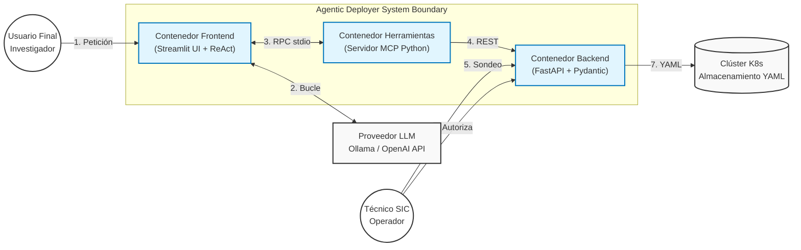
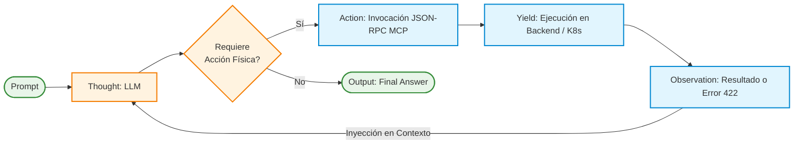
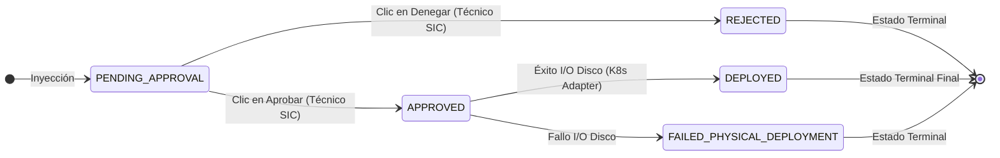

<style>
.mermaid svg { max-width: 100%; margin: 0 auto; display: block; height: auto; }
</style>

# Memoria del Trabajo de Fin de Máster

<div style='page-break-after: always;'></div>

# Índice de Contenidos

- **Capítulo 1. Introducción**
  - 1.1. Contexto y motivación
  - 1.2. Planteamiento del problema
  - 1.3. Objetivos del proyecto
  - 1.4. Alcance y limitaciones
  - 1.5. Estructura de la memoria
- **Capítulo 2. Estado del Arte**
  - 2.1. Agentes autónomos basados en Modelos de Lenguaje de Gran Escala (LLM)
  - 2.2. Estandarización de Integraciones: Model Context Protocol (MCP)
  - 2.3. Orquestación e Infraestructura Declarativa (Kubernetes)
  - 2.4. Arquitectura Hexagonal y Seguridad en Sistemas Estocásticos
- **Capítulo 3. Metodología y Stack Tecnológico**
  - 3.1. Enfoque Metodológico
  - 3.2. Fases de Desarrollo
  - 3.3. Stack Tecnológico y Justificación Arquitectónica
- **Capítulo 4. Diseño del Sistema y Arquitectura**
  - 4.1. Modelado Topológico Arquitectónico (Estándar C4)
  - 4.2. Adopción de la Arquitectura Hexagonal (Ports and Adapters)
  - 4.3. Algoritmia de Validación de Seguridad Institucional
  - 4.4. Patrón de Abstracción: *Golden Paths* y Expansión Sintáctica
  - 4.5. Flujo de Datos *End-to-End* y Ciclo de Estados
- **Capítulo 5. Desarrollo del Agente Cognitivo y MCP**
  - 5.1. Implementación del Servidor *Model Context Protocol* (MCP)
  - 5.2. Diseño de la Abstracción Multiproveedor y Soberanía del Dato
  - 5.3. Bucle Cognitivo y Resiliencia Estocástica (Patrón ReAct)
- **Capítulo 6. Implementación del Patrón HITL y Gestión de Estados Finita (FSM)**
  - 6.1. Fundamentación del Patrón *Human-In-The-Loop* (HITL)
  - 6.2. Diseño de la Máquina de Estados Finita (FSM)
  - 6.3. El Dashboard Asíncrono de Operaciones
- **Capítulo 7. Aseguramiento de Calidad (QA) y Testing Avanzado**
  - 7.1. Pruebas de Dominio e Integración: Validando la Jaula Hexagonal
  - 7.2. Pruebas Basadas en Propiedades (*Property-Based Testing*)
  - 7.3. Auditoría de la Suite de Pruebas: *Mutation Testing*
  - 7.4. Pruebas Metamórficas: Inyección de Ruido Léxico y Evaluación del LLM
- **Capítulo 8. Resultados y Casos de Estudio Prácticos**
  - 8.1. Despliegue Convencional vs. Orquestación Agéntica
  - 8.2. Caso de Estudio: Resiliencia ante Ataques (*Prompt Injection*)
- **Capítulo 9. Conclusiones y Trabajo Futuro**
  - 9.1. Conclusiones
  - 9.2. Trabajo Futuro
- **Capítulo 10. Bibliografía y Referencias**


<div style='page-break-after: always;'></div>

# Índice de Figuras y Algoritmos

El presente Trabajo de Fin de Máster hace uso intensivo de modelado visual y pseudocódigo para formalizar las decisiones arquitectónicas. A continuación se listan las figuras y algoritmos referenciados a lo largo de la memoria:

### Índice de Figuras

- **Figura 1:** Diagrama de componentes del *Stack* Tecnológico empleado. *(Sección 3.2)*
- **Figura 2:** Diagrama de Contenedores (Nivel 2) del Modelo C4 para el sistema Agentic Deployer. *(Sección 4.1)*
- **Figura 3:** Diagrama de Secuencia End-to-End modelando las tres fases de aislamiento temporal. *(Sección 4.5)*
- **Figura 4:** Diagrama de flujo del bucle cognitivo ReAct (Reasoning and Acting). *(Sección 5.3)*
- **Figura 5:** Grafo Dirigido Acíclico (DAG) que rige la Máquina de Estados Finita (FSM) del sistema. *(Sección 6.2)*

### Índice de Algoritmos (Pseudocódigo)

- **Algoritmo 1:** Validación Estricta de Entidades de Dominio Hexagonal. *(Sección 4.3.1)*
- **Algoritmo 2:** Introspección Dinámica de Contratos de Herramientas. *(Sección 5.1.1)*
- **Algoritmo 3:** Bucle de Orquestación Cognitiva (ReAct Loop). *(Sección 5.3.1)*
- **Algoritmo 4:** Transición Inmutable de la Máquina de Estados (FSM_Transition). *(Sección 6.2.2)*
- **Algoritmo 5:** Property-Based Test para Invariantes Hexagonales (Fuzzing). *(Sección 7.2.1)*


<div style='page-break-after: always;'></div>

# Capítulo 1. Introducción

## 1.1. Contexto y motivación

Durante la última década, el ecosistema de la ingeniería de software y la administración de sistemas ha experimentado una transformación tectónica. La necesidad de entregar valor al mercado con mayor rapidez, escalabilidad y resiliencia ha impulsado la transición desde arquitecturas monolíticas alojadas en servidores físicos (*bare-metal*) hacia ecosistemas distribuidos basados en microservicios [14] y computación en la nube (*Cloud Computing*) [13]. En el corazón de esta revolución se encuentra la contenerización de aplicaciones, popularizada por tecnologías como Docker [15], y, de forma más crítica, la orquestación de dichos contenedores mediante plataformas estándar de la industria como Kubernetes [4].

Si bien Kubernetes ha resuelto problemas fundamentales de alta disponibilidad, auto-escalado y gestión de fallos, su adopción ha introducido un incremento drástico en la complejidad operativa. El paradigma de la "Infraestructura como Código" (IaC) y la gestión de recursos declarativa obliga a los ingenieros a interactuar con el sistema a través de extensos y complejos manifiestos en formato YAML o JSON. Estos documentos no solo describen el servicio computacional en sí (*Deployments* o *Pods*), sino que exigen la definición minuciosa de topologías de red (*Services*, *Ingress*), políticas de control de acceso (*RBAC*), asignación y limitación de recursos de hardware (CPU, memoria), y volúmenes de persistencia de datos.

Históricamente, este escenario ha cristalizado en una barrera de entrada formidable para desarrolladores de producto, investigadores o personal académico, quienes a menudo poseen un profundo conocimiento sobre la lógica de negocio de sus aplicaciones, pero carecen de la especialización necesaria en operaciones de sistemas. Aunque el movimiento *DevOps* buscó originalmente derribar el histórico "muro de la confusión" entre los equipos de desarrollo (Dev) y operaciones (Ops) promoviendo la responsabilidad compartida, en la práctica ha derivado en una sobrecarga cognitiva insostenible para el desarrollador medio. Exigir a un investigador universitario que domine la API de Kubernetes para publicar la web de un congreso representa un antipatrón de productividad.

Para mitigar esta fricción, la industria ha virado recientemente hacia la **Ingeniería de Plataformas** (*Platform Engineering*). Esta disciplina aboga por la construcción de Plataformas Internas de Desarrollo (IDP, por sus siglas en inglés), cuyo objetivo es ofrecer portales de autoservicio y "caminos dorados" (*Golden Paths*). Un *Golden Path* es una ruta estandarizada y soportada institucionalmente que oculta la complejidad subyacente: el usuario solicita un servicio genérico y la plataforma autogenera la configuración técnica necesaria cumpliendo con las políticas de seguridad de la organización. Sin embargo, incluso las IDPs más modernas suelen requerir interacción a través de interfaces gráficas rígidas, formularios extensos o lenguajes de dominio específico (DSL) que siguen resultando antinaturales para usuarios no técnicos.

De forma paralela y disruptiva, los recientes avances en Inteligencia Artificial Generativa, impulsados por la consolidación de los Modelos de Lenguaje de Gran Escala (LLM, *Large Language Models*), han inaugurado una nueva frontera en la Interacción Humano-Computadora (HCI). Modelos pre-entrenados con miles de millones de parámetros (tales como las familias GPT, Claude o Llama) han demostrado capacidades que trascienden la mera generación estocástica de texto. Han exhibido habilidades emergentes de razonamiento deductivo, comprensión de contextos técnicos complejos, y la capacidad crítica de traducir el lenguaje natural impreciso a código estructurado.

Más recientemente, la evolución de estos modelos ha cristalizado en el concepto de **Agentes Autónomos**. Mediante mecanismos de invocación de herramientas (*Function Calling* o *Tool Calling*) y paradigmas de razonamiento iterativo como ReAct (*Reason + Act*) [1], los LLMs ya no son sistemas pasivos de consulta, sino motores cognitivos capaces de tomar decisiones, consultar bases de datos, planificar pasos y ejecutar acciones sobre sistemas externos en tiempo real. 

Es precisamente en la intersección de estas dos grandes corrientes —la orquestación compleja de infraestructura y la inteligencia artificial agéntica— donde cristaliza la motivación de este Trabajo de Fin de Máster. Surge la oportunidad de transformar radicalmente la manera en que el ser humano interactúa con los sistemas operativos distribuidos. 

La motivación de este proyecto es explorar y demostrar la viabilidad técnica de sustituir las complejas interfaces declarativas (manifiestos YAML) y los formularios estáticos de las IDPs por una interfaz conversacional fluida impulsada por un agente inteligente. Un sistema capaz de interpretar la intención subyacente de un usuario expresada en lenguaje natural ("Necesito alojar una API en Python"), razonar sobre las implicaciones técnicas, negociar los requisitos faltantes de forma amigable, y traducir finalmente esta intención abstracta a código de infraestructura seguro, estandarizado y listo para ser desplegado en Kubernetes. Este enfoque no solo democratizaría el acceso a tecnologías de vanguardia para perfiles no técnicos, sino que agilizaría drásticamente el ciclo de vida del desarrollo de software en entornos institucionales.

## 1.2. Planteamiento del problema

A pesar del innegable potencial teórico que ofrecen los agentes conversacionales, su integración directa en flujos de trabajo de operaciones informáticas (IT Ops) e infraestructura crítica plantea varios desafíos sistémicos. El presente trabajo toma como caso de estudio el Servicio de Informática y Comunicaciones (SIC) de un entorno universitario. 

En esta institución académica convive una amalgama de perfiles, incluyendo grupos de investigación, docentes y personal de administración y servicios, que demandan de forma recurrente servicios tecnológicos estandarizados. Entre los requerimientos más comunes se encuentran el despliegue de plataformas de *e-learning* (Moodle), sistemas de gestión de contenidos (WordPress) para blogs departamentales, aplicaciones web estáticas para simposios y congresos, y el alojamiento de microservicios o APIs (típicamente desarrolladas en Python o Node.js) fruto de la investigación aplicada.

La gestión manual de estas peticiones supone una sobrecarga operativa inasumible para los técnicos del SIC. Por otro lado, externalizar el acceso al clúster directamente al personal universitario es inviable por motivos de seguridad institucional y carencia de competencias técnicas. Automatizar la provisión de estos servicios utilizando Inteligencia Artificial parece la evolución lógica; sin embargo, hacerlo con garantías exige resolver tres problemáticas tecnológicas fundamentales:

### 1.2.1. La falta de estandarización en la orquestación de herramientas

Para que un LLM trascienda de un simple chatbot a un agente útil, necesita interactuar con herramientas externas. Históricamente, la integración de estas herramientas (llamadas a APIs, ejecución de scripts, consultas a bases de datos) requería el desarrollo de código fuertemente acoplado (*ad-hoc*) a la plataforma de IA específica. Si una organización deseaba migrar de la API de OpenAI a un modelo de código abierto ejecutado en local (como Ollama) por políticas de privacidad de datos institucionales, frecuentemente se veía obligada a reescribir gran parte del middleware de orquestación.

El problema radica en la ausencia histórica de un protocolo de comunicación estandarizado entre los modelos de lenguaje y el ecosistema de herramientas. Es perentorio construir un puente universal y bidireccional que permita al Servicio de Informática exponer sus rutinas de despliegue de manera agnóstica, de modo que cualquier agente autorizado pueda descubrirlas e invocarlas independientemente de su fabricante.

### 1.2.2. La abstracción de la infraestructura y el riesgo de "alucinación"

El segundo problema crítico reside en la propia naturaleza generativa de los LLMs. Un modelo generalista entrenado con vastas cantidades de datos de Internet tenderá a generar manifiestos de Kubernetes o configuraciones de Docker sintácticamente válidas, pero semánticamente erróneas o inseguras en el contexto de la organización. Este fenómeno, conocido comúnmente como "alucinación", puede derivar en un agente proponiendo el uso de imágenes de contenedor no auditadas (p. ej., imágenes con la etiqueta `:latest` propensas a vulnerabilidades), abriendo puertos de red no autorizados, o ignorando las cuotas restrictivas de CPU y memoria (ResourceQuotas) impuestas por el SIC para evitar problemas de "vecino ruidoso" (*noisy neighbor*) en el clúster.

Abordar este problema implica que el agente no debe redactar infraestructura desde cero. En su lugar, el sistema debe ser capaz de invocar rutinas predefinidas (*Golden Paths*) donde la IA únicamente negocia e infiere los parámetros estrictamente necesarios (el nombre de la aplicación, el tráfico esperado o la versión de lenguaje), mientras que la arquitectura subyacente impone de forma determinista y matemática las normativas de seguridad, redes y topología exigidas por la institución.

### 1.2.3. Seguridad y trazabilidad: El imperativo humano (Human-In-The-Loop)

Finalmente, el problema más severo radica en la delegación de autoridad. Conceder a un sistema estocástico, susceptible a ataques de inyección de instrucciones (*Prompt Injection*) o a simples errores de razonamiento, permisos directos de ejecución sobre un clúster de producción (*bare-metal* o en la nube) supone un riesgo de ingeniería inasumible. Una instrucción errónea o maliciosa podría desencadenar la eliminación de bases de datos productivas o la saturación de los recursos de cómputo de la universidad.

Por consiguiente, el despliegue autónomo en bucle cerrado (donde la IA analiza, decide y ejecuta sin mediación) no es una solución viable. Es imperativo diseñar una arquitectura que integre la supervisión humana como eslabón obligatorio en la cadena de mando. El diseño requiere un modelo *Human-In-The-Loop* (HITL) asíncrono, donde el agente asuma el esfuerzo cognitivo tedioso de recabar requisitos y proponer configuraciones precisas, pero donde la autoridad de consolidar dichas acciones (*commit* / *apply*) recaiga siempre, y de forma ineludible, sobre un técnico especialista humano. Esta barrera garantiza la trazabilidad y la seguridad operativa, equilibrando el potencial de la IA con el rigor y la responsabilidad de la ingeniería clásica.

## 1.3. Objetivos del proyecto

Para dar respuesta a la problemática planteada, este proyecto establece una serie de metas técnicas estructuradas. 

### 1.3.1. Objetivo general
El objetivo central de este Trabajo de Fin de Máster es diseñar e implementar el "Agentic Deployer": un orquestador middleware avanzado que traduzca de forma segura peticiones formuladas en lenguaje natural a configuraciones de infraestructura reales (Kubernetes). Este middleware debe actuar como una frontera de seguridad estricta entre un agente conversacional basado en Modelos de Lenguaje de Gran Escala (LLM) y la infraestructura física subyacente, operando sobre el estándar universal *Model Context Protocol* (MCP) [3] y blindado por una Arquitectura Hexagonal.

### 1.3.2. Objetivos específicos
Para la consecución del objetivo general, se han definido y materializado cinco hitos o metas técnicas específicas que marcan la progresión lógica de la ingeniería del proyecto:

1. **Diseño de un Núcleo basado en Arquitectura Hexagonal (*Ports and Adapters*):** 
   Construir un modelo de dominio fuertemente tipado e inmutable que aísle la lógica de negocio (las reglas de provisión y las políticas de seguridad institucionales) de las dependencias externas volátiles, como los clientes de OpenAI o las APIs de orquestadores de contenedores.
2. **Implementación de un Servidor de Herramientas Estándar (MCP):**
   Demostrar la superioridad de los estándares abiertos frente a las integraciones propietarias desarrollando un servidor compatible con el *Model Context Protocol* de Anthropic. Este servidor expondrá las operaciones de infraestructura del SIC (rutinas de despliegue y baja de servicios) de tal modo que cualquier agente agnóstico pueda descubrirlas y consumirlas de forma tipada.
3. **Integración de un Agente de Inteligencia Artificial (Paradigma ReAct):**
   Desarrollar un orquestador cognitivo que no se limite a extraer información estática (*Zero-Shot*), sino que implemente un bucle de interacción *Reason + Act*. El agente deberá ser capaz de razonar sobre los fallos devueltos por la infraestructura subyacente (por ejemplo, vulneraciones de políticas de seguridad) y establecer un diálogo autocorrectivo (*Feedback Loop*) con el usuario.
4. **Definición Estricta de Rutas Doradas (*Golden Paths*):**
   Evitar la generación estocástica de manifiestos delegando en el adaptador de infraestructura la instanciación de plantillas pre-validadas de Kubernetes. Se diseñarán esquemas concretos para los casos de uso más demandados en la universidad: portales web estáticos (Nginx), gestores de contenido institucionales (WordPress) y alojamiento de microservicios (APIs en Python).
5. **Gobernanza de Seguridad mediante *Human-In-The-Loop* (HITL):**
   Implementar una interfaz de operaciones asíncrona (Dashboard) que intercepte toda orden generada por el agente, manteniéndola en un estado de cuarentena (pendencia) hasta que un operador técnico humano audite los parámetros generados y emita una confirmación explícita para su despliegue final.

## 1.4. Alcance y limitaciones

Definir el alcance exacto de un proyecto que aúna IA generativa e infraestructura *Cloud Native* es vital para garantizar la viabilidad de su ejecución. Este trabajo se circunscribe al desarrollo del componente central (el *middleware* inteligente y su orquestación) bajo el concepto de Producto Mínimo Viable (MVP) avanzado. 

En base a este enfoque, el alcance asume las siguientes acotaciones metodológicas y limitaciones arquitectónicas deliberadas:

1. **Abstracción del Clúster Físico (Simulación de Ejecución):**
   El orquestador es capaz de procesar toda la lógica, validaciones, aprobaciones humanas y generación matemática de los manifiestos YAML de Kubernetes (`Deployment`, `Service`, `Ingress`). Sin embargo, el acoplamiento final contra la API de un clúster físico productivo (ej. invocaciones directas a *Minikube* u *OKD* mediante `kubectl apply`) queda excluido del alcance actual. En su lugar, se implementa un adaptador de infraestructura falso (`FakeK8sAdapter`) que deposita las plantillas generadas en el sistema de archivos local. Esto respeta íntegramente la premisa de la Arquitectura Hexagonal y aísla el proyecto de complejidades de red externas, dejando la integración del adaptador físico como una evolución directa.
2. **Agnosticismo del Motor LLM:**
   El proyecto no está atado a un proveedor específico de Inteligencia Artificial. Al implementar un patrón *Adapter* para el cliente LLM, el alcance garantiza que el sistema funciona tanto con APIs comerciales de terceros (por ejemplo, el modelo GPT-4o de OpenAI) como con instancias de modelos locales ejecutados en la red privada institucional (mediante el servidor Ollama).
3. **Persistencia Volátil:**
   Dado el carácter exploratorio del MVP y la prioridad dada al flujo de datos conversacional, el almacén de intenciones de despliegue pendientes y aprobadas se gestiona a través de estructuras de datos en memoria (diccionarios y estado en sesión). Se omite el despliegue de una base de datos relacional externa (como PostgreSQL), cuya sustitución futura implicaría únicamente el desarrollo de un nuevo adaptador de salida en la capa hexagonal.

## 1.5. Estructura de la memoria

Para facilitar la trazabilidad desde la concepción teórica hasta la verificación del código, el presente documento se estructura en los siguientes capítulos:

- El **Capítulo 2** expone de manera exhaustiva el Estado del Arte, desglosando la teoría de los agentes conversacionales, la génesis y arquitectura del *Model Context Protocol* (MCP), el paradigma de infraestructura declarativa de Kubernetes y los principios de la Arquitectura Hexagonal.
- El **Capítulo 3** detalla la Metodología empleada a lo largo del ciclo de vida del proyecto, así como el marco tecnológico, justificando las herramientas y librerías que conforman el ecosistema de la aplicación.
- El **Capítulo 4** aborda el Diseño del Sistema, ilustrando mediante diagramas formales el flujo de datos y analizando el código del núcleo de negocio y los contratos de validación.
- El **Capítulo 5** profundiza en la Implementación técnica del Servidor MCP y el Agente, diseccionando el bucle de razonamiento y la exposición dinámica de herramientas.
- El **Capítulo 6** describe la interfaz de administración y el módulo de seguridad, fundamentando el ciclo asíncrono de aprobaciones humanas (*Human-In-The-Loop*).
- El **Capítulo 7** expone el plan de Aseguramiento de la Calidad (QA), detallando las estrategias de Testing Unitario, *Property-Based Testing*, Pruebas Metamórficas y *Mutation Testing* implementadas.
- El **Capítulo 8** documenta empíricamente los Resultados a través de escenarios de uso reales (Demostración), ilustrando las entradas en lenguaje natural y las salidas declarativas generadas.
- Finalmente, el **Capítulo 9** recoge las Conclusiones del desarrollo, evaluando el grado de cumplimiento de los objetivos y proponiendo ambiciosas líneas de Trabajo Futuro.


<div style='page-break-after: always;'></div>

# Capítulo 2. Estado del Arte

Este capítulo articula el marco teórico y tecnológico sobre el que se sustenta la arquitectura del *Agentic Deployer*. Se expone una revisión exhaustiva de los paradigmas contemporáneos en Inteligencia Artificial, los protocolos de estandarización para la comunicación de modelos fundacionales, y los principios modernos de Ingeniería de Plataformas.

## 2.1. Agentes autónomos basados en Modelos de Lenguaje de Gran Escala (LLM)

Durante años, la investigación en Procesamiento de Lenguaje Natural (NLP, por sus siglas en inglés) persiguió la construcción de modelos capaces de comprender y generar texto humano con fluidez. Sin embargo, con el advenimiento de la arquitectura Transformer y la posterior explosión de los Modelos de Lenguaje de Gran Escala (LLM, *Large Language Models*), se descubrió empíricamente que, a partir de cierto umbral de parámetros y datos de entrenamiento, los modelos exhibían habilidades "emergentes" que excedían la simple predicción probabilística de la siguiente palabra (*next-token prediction*). 

Estas habilidades incluyen el razonamiento lógico deductivo, la generalización zero-shot y la capacidad de seguir instrucciones complejas (Brown et al., 2020). La explotación de estas capacidades cognitivas superiores ha propiciado un cambio de paradigma en la disciplina: la evolución desde los meros *asistentes conversacionales* pasivos hacia los **Agentes Autónomos**. Un agente basado en LLM es un sistema computacional diseñado donde el modelo de lenguaje actúa no solo como interfaz, sino como el motor de razonamiento central (el "cerebro") que coordina la percepción de un estado, la planificación cognitiva y la ejecución de acciones sobre su entorno para alterar dicho estado.

Para que un LLM trascienda su encapsulamiento (estando típicamente aislado de la internet en tiempo real y limitado por su fecha de corte de conocimiento) y adquiera verdadera agencia, la industria ha consolidado dos avances técnicos fundamentales: el paradigma de razonamiento *ReAct* y la capacidad técnica de invocación de herramientas (*Function Calling*).

### 2.1.1. El Paradigma ReAct (Reason + Act)

Previo a la formalización de arquitecturas agénticas, los enfoques tradicionales obligaban a los modelos a emitir una respuesta final inmediata, o bien a razonar estáticamente mediante técnicas como *Chain-of-Thought* (CoT) (Wei et al., 2022). Aunque CoT mejora drásticamente el razonamiento al obligar al modelo a "pensar paso a paso", padece de una limitación intrínseca: el modelo razona exclusivamente sobre la información contenida en el *prompt* inicial o en sus pesos internos, sin capacidad para consultar nueva información o rectificar premisas falsas en tiempo real. Esto a menudo desemboca en fenómenos de alucinación y propagación de errores, inadmisibles en escenarios de operaciones críticas de infraestructura.

Para resolver este desafío, Yao et al. [1] introdujeron el paradigma **ReAct**. Este marco conceptual propone intercalar dinámicamente la generación de trazas de razonamiento humano-inteligibles con la ejecución de acciones específicas en el entorno. En un bucle ReAct, el agente opera bajo un ciclo continuo estructurado en tres primitivas:

1. **Pensamiento (Thought):** El agente analiza el estado actual y la petición del usuario, deduciendo cuál es el siguiente paso lógico. Por ejemplo: *"El usuario quiere un CMS. Necesito consultar las cuotas del departamento antes de asignarle memoria."*
2. **Acción (Action):** El agente selecciona, de un catálogo predefinido, una herramienta externa para ejecutarla. Por ejemplo: `consultar_cuotas_departamento(departamento="informatica")`.
3. **Observación (Observation):** El motor subyacente (el código de la aplicación) ejecuta la herramienta real contra la infraestructura y devuelve el resultado (en texto o JSON) al LLM. El modelo absorbe esta nueva información real y vuelve al estado 1.

Este ciclo iterativo se detiene únicamente cuando el modelo determina, a través de su fase de *Thought*, que ha recabado suficiente información y ha ejecutado todas las mutaciones necesarias en el entorno para emitir la **Respuesta Final (Final Answer)**. En el contexto de este Trabajo de Fin de Máster, ReAct se posiciona como el pilar central del orquestador: permite al agente "negociar" interactivamente los parámetros de un despliegue (ej. solicitar al usuario un puerto válido si la primera observación devuelve un error de seguridad de Kubernetes), mitigando por completo las alucinaciones al anclar el razonamiento en los resultados deterministas devueltos por el sistema subyacente.

### 2.1.2. Invocación de Herramientas (Function Calling / Tool Calling)

El mecanismo material que permite a un LLM ejecutar la fase de *Acción* de un bucle ReAct se denomina *Function Calling* (o *Tool Calling*). Antes de su estandarización, la extracción de entidades desde un texto libre dependía de expresiones regulares (RegEx) frágiles o clasificadores secundarios. Un usuario podía redactar: "Despliega una base de datos redis", pero forzar al modelo a responder estrictamente con un JSON parseable (ej. `{"accion": "desplegar", "servicio": "redis"}`) resultaba propenso a errores de formato, saltos de línea inyectados o caracteres de escape inválidos.

El salto cualitativo se produjo cuando proveedores como OpenAI, y posteriormente la comunidad *Open-Source* mediante iniciativas como Ollama, comenzaron a someter a los LLMs a procesos de ajuste fino (*fine-tuning*) intensivos, diseñados específicamente para el seguimiento estricto de estructuras de datos.

En el modelo actual de *Tool Calling*, el desarrollador inyecta en el contexto del sistema (junto al mensaje del usuario) un esquema estructurado (habitualmente *JSON Schema*) que describe las funciones disponibles, sus descripciones en lenguaje natural, y los tipos de datos exactos de sus parámetros (enteros, booleanos, enumeraciones). Cuando el modelo de lenguaje infiere que una petición de usuario requiere una acción externa, suspende la generación de texto conversacional y devuelve un objeto computacionalmente riguroso. Este objeto instruye a la aplicación que hospeda el modelo para que ejecute una rutina arbitraria en el servidor.

Esta capacidad ha transformado el rol de los lenguajes de programación en la Inteligencia Artificial. Lenguajes como Python o Go dejan de ser meros envoltorios de peticiones HTTP, y se convierten en extremidades cibernéticas de los agentes, otorgándoles acceso directo a bases de datos SQL, clientes de correo, o como en el caso del *Agentic Deployer*, acceso a la API del clúster de orquestación de Kubernetes. La robustez técnica lograda por el *Function Calling* contemporáneo es el habilitador crítico que permite confiar procesos de *DevOps* a sistemas estocásticos.

## 2.2. Estandarización de Integraciones: Model Context Protocol (MCP)

Si bien el *Function Calling* dotó a los modelos de lenguaje de capacidades de ejecución, su adopción temprana generó un ecosistema tecnológico fuertemente fragmentado. Cada proveedor de Inteligencia Artificial (OpenAI, Google, Anthropic) diseñó especificaciones propietarias para el registro de herramientas. Paralelamente, los frameworks de orquestación de IA más populares (tales como LangChain, LlamaIndex o AutoGen) crearon abstracciones incompatibles entre sí. 

Este escenario desembocó en el problema clásico de la interoperabilidad (*vendor lock-in*). Si un departamento de operaciones desarrollaba un conjunto de herramientas para orquestar su infraestructura compatible con LangChain y OpenAI, migrar hacia un ecosistema gobernado por modelos de código abierto (ej. Ollama o vLLM) requería reescribir por completo la capa de integración de las herramientas. Resultaba insostenible para las organizaciones mantener adaptadores múltiples para cada nueva iteración de los modelos fundacionales.

### 2.2.1. Génesis y Principios de MCP

Para resolver esta fragmentación sistémica, en el último trimestre de 2024, Anthropic (los creadores de la familia de modelos *Claude*) lideró la apertura de un nuevo estándar *open-source*: el **Model Context Protocol (MCP)** [3]. La motivación central de MCP es desacoplar de forma estricta al consumidor de la IA (el agente) de las fuentes de datos e infraestructuras locales (las herramientas), creando un lenguaje universal. 

MCP se inspira profundamente en el éxito del *Language Server Protocol (LSP)* de Microsoft, el cual estandarizó la comunicación entre los editores de código (IDEs) y los compiladores. Del mismo modo, MCP busca convertirse en la capa estándar que conecte cualquier asistente generativo con el entorno computacional de la organización, promoviendo una arquitectura conectable (*pluggable*) basada en el protocolo ligero `JSON-RPC 2.0`.

### 2.2.2. Arquitectura Cliente-Servidor de MCP

El protocolo abandona las integraciones monolíticas en favor de un diseño cliente-servidor estrictamente definido, garantizando fronteras de seguridad nítidas:

- **MCP Host / Client (El Agente):** Es la aplicación que interactúa con el usuario y gestiona el flujo de razonamiento del LLM. El cliente es agnóstico a la implementación de las herramientas; su única responsabilidad es negociar con el servidor mediante mensajes estándar, inyectar el contexto recuperado en el *prompt* del modelo, y solicitar al servidor la ejecución de las funciones decididas por la IA. En el presente proyecto, el componente `AgentOrchestrator` implementa las lógicas derivadas de un cliente MCP.
- **MCP Server (El Entorno):** Es un proceso ligero e independiente, desplegado dentro de la zona de confianza de la organización (en el caso de este TFM, operado por el Servicio de Informática de la universidad). El servidor obvia la existencia de modelos de lenguaje; su propósito es encapsular la lógica de negocio imperativa (ej. generar un manifiesto YAML de Kubernetes) y exponer esta capacidad a través de un esquema JSON estandarizado.

Ambos actores se comunican a través de transportes estandarizados. MCP soporta integraciones locales directas mediante los canales de Entrada/Salida estándar del sistema operativo (**stdio**), ideal para herramientas que corren en la misma máquina que el agente, y transporte web basado en **Server-Sent Events (SSE)** sobre HTTP, indispensable para infraestructuras distribuidas y arquitecturas nativas de la nube (*Cloud Native*).

### 2.2.3. Primitivas del Protocolo: Resources, Prompts y Tools

El estándar MCP orquesta la interacción entorno-modelo a través de tres primitivas de datos fundacionales:

1. **Resources (Recursos):** Datos de naturaleza estática o de solo lectura controlados por el servidor. Permiten inyectar contexto adicional en la ventana de memoria del LLM sin otorgarle capacidad de mutación. Ejemplos clásicos incluyen la lectura del registro de estado actual de un clúster de Kubernetes, bases de datos o documentación corporativa local.
2. **Prompts:** Plantillas de instrucciones parametradas y almacenadas en el servidor, permitiendo la estandarización organizativa. Un administrador puede definir un *prompt* en el servidor ("Resume el estado de este nodo") y el agente cliente puede invocarlo y presentarlo al usuario.
3. **Tools (Herramientas):** Son capacidades ejecutables y con efectos secundarios (mutaciones en el entorno) controladas por el servidor. Las herramientas son el equivalente estandarizado del *Function Calling*. Cuando el servidor MCP de la universidad se inicializa, transmite al cliente un catálogo de herramientas (por ejemplo, `deploy_python_app`), dictaminando los argumentos exactos requeridos (como nombre de proyecto y versión del lenguaje). 

La adopción formal del Model Context Protocol mediante su Software Development Kit (SDK) oficial en Python constituye la columna vertebral arquitectónica del *Agentic Deployer* desarrollado en este TFM. Esta decisión estratégica garantiza que el catálogo de automatizaciones de infraestructura de la institución quede blindado frente a los giros del mercado de la Inteligencia Artificial. Las herramientas expuestas por el Servidor MCP del proyecto son consumibles indistintamente por el agente local diseñado (Streamlit + Ollama) y por soluciones empresariales externas y *closed-source* (como la aplicación nativa Claude Desktop), asegurando un ciclo de vida útil del software extendido y una interoperabilidad robusta.

## 2.3. Orquestación e Infraestructura Declarativa (Kubernetes)

Para comprender el desafío que supone la provisión autónoma de infraestructura, es imperativo analizar el cambio de paradigma introducido por Kubernetes (K8s) [4] en el ámbito de las operaciones. Originado en Google bajo el proyecto interno *Borg* y posteriormente donado a la *Cloud Native Computing Foundation* (CNCF), Kubernetes se ha erigido como el estándar *de facto* para la orquestación de cargas de trabajo en contenedores. Su dominio en el mercado no se debe únicamente a su robustez técnica, sino a la adopción estricta de un modelo de gestión **declarativo**.

### 2.3.1. Imperativo vs. Declarativo

En los albores de la administración de sistemas, las operaciones seguían un enfoque imperativo. Los administradores interactuaban con los servidores mediante secuencias explícitas de comandos (ej. rutinas *bash* o *scripts* en servidores remotos). En un modelo imperativo, el usuario dicta *cómo* deben realizarse las acciones paso a paso: "descarga esta imagen, inicia el contenedor, abre el puerto 80, verifica si está vivo". Este enfoque, si bien directo, es inherentemente frágil. Si un servidor se reinicia o un proceso falla, el script imperativo carece del contexto necesario para devolver el sistema a la normalidad sin intervención humana.

En contraposición, Kubernetes abraza el modelo declarativo (Infraestructura como Código - IaC). En un paradigma declarativo, el ingeniero no instruye a la máquina sobre *cómo* hacer el trabajo; en su lugar, describe exclusivamente el **estado final deseado** (*Desired State*). El usuario declara, mediante manifiestos estructurados en lenguaje YAML o JSON: "Deseo que existan exactamente 3 réplicas del contenedor de WordPress expuestas en el puerto 8080".

### 2.3.2. Bucles de Reconciliación y el Plano de Control

La materialización de este estado deseado es responsabilidad exclusiva del Plano de Control (*Control Plane*) de Kubernetes, operando a través de un mecanismo denominado **Bucle de Control o Reconciliación** (*Control Loop*).

Un clúster de K8s evalúa continuamente la topología de la red y los procesos en ejecución. De manera asíncrona, compara el **Estado Real** (*Actual State*) del clúster (por ejemplo, "hay 2 réplicas de WordPress en ejecución porque un nodo físico acaba de fallar") contra el **Estado Deseado** almacenado en su base de datos distribuida (`etcd`). Al detectar una divergencia (2 réplicas reales vs. 3 réplicas deseadas), el bucle de reconciliación infiere de forma autónoma las acciones necesarias para corregir la desviación (desplegar un nuevo contenedor en un nodo sano), ejecutándolas sin requerir una nueva instrucción imperativa del operador humano.

### 2.3.3. Complejidad Sintáctica y Carga Cognitiva

A pesar de las indudables ventajas de resiliencia y auto-sanación (*self-healing*) que ofrece el modelo declarativo, la definición técnica del estado deseado introduce una severa carga cognitiva. La API de Kubernetes está compuesta por decenas de Recursos Personalizados (*Custom Resource Definitions* - CRDs), cada uno con una semántica y un esquema estricto de validación.

Desplegar un simple servicio web en producción raramente implica redactar un solo manifiesto. Para exponer una aplicación de forma segura al exterior, un desarrollador debe coordinar y enlazar sintácticamente al menos tres primitivas fundamentales:
1. **Deployment:** Define el contenedor de la aplicación, su imagen base, la política de reinicios, las sondas de vida (*liveness probes*) y las reservas estrictas de memoria y CPU.
2. **Service:** Abstrae la volatilidad de las direcciones IP internas de los contenedores subyacentes, creando un punto de acceso de red estable (*ClusterIP*) para balancear el tráfico.
3. **Ingress:** Expone las rutas HTTP/HTTPS desde el exterior del clúster hacia los *Services* internos, gestionando reglas de enrutamiento por nombre de dominio y terminación SSL/TLS.

La interdependencia entre estos recursos exige un nivel de precisión milimétrica (por ejemplo, el anidamiento correcto de selectores de etiquetas, o *labels*, entre el *Deployment* y el *Service*). Un simple error de indentación en el formato YAML, o un fallo en el mapeo de un selector de red, provocará que la aplicación se despliegue en una isla de red inaccesible (sin devolver errores obvios de compilación).

Es esta inherente aridez sintáctica y complejidad estructural la que levanta una barrera de entrada para los usuarios ajenos al ecosistema *Cloud Native*, y constituye el problema fundamental que el orquestador agéntico de este TFM busca resolver, asumiendo la labor cognitiva de redactar el código declarativo a partir de intenciones en lenguaje natural.

## 2.4. Arquitectura Hexagonal y Seguridad en Sistemas Estocásticos

La integración de Modelos de Lenguaje en sistemas críticos de infraestructura plantea un dilema de seguridad estructural. Los LLM, por su propia naturaleza estadística, son impredecibles (estocásticos). En contraste, los sistemas de provisión corporativa exigen un determinismo absoluto (por ejemplo, rechazar sistemáticamente cualquier despliegue que intente utilizar el puerto 22, reservado para SSH). Para conciliar la agilidad de la IA con la rigidez de las normativas de IT, el *Agentic Deployer* adopta los principios de la **Arquitectura Hexagonal**.

### 2.4.1. Fundamentos de *Ports and Adapters*

Formalizada por Alistair Cockburn en 2005 [2] bajo el nombre de patrón de Puertos y Adaptadores (*Ports and Adapters*), la Arquitectura Hexagonal nació como respuesta a los problemas endémicos de las arquitecturas tradicionales en capas (Presentación $\rightarrow$ Lógica de Negocio $\rightarrow$ Base de Datos). En el diseño tradicional en capas, la lógica de negocio a menudo se contamina con dependencias transitivas de la base de datos o de los *frameworks* de interfaz de usuario.

El objetivo central de la Arquitectura Hexagonal es permitir que una aplicación sea operada de forma equitativa por usuarios, programas, pruebas automatizadas o *scripts* por lotes, y que pueda ser desarrollada y probada de forma aislada respecto a sus eventuales dispositivos e infraestructuras y bases de datos en tiempo de ejecución. 

Visualmente representada como un hexágono, la arquitectura propone una división estricta en dos zonas diametralmente aisladas:
- **El Interior (El Núcleo o *Domain*):** Alberga exclusivamente las reglas de negocio puras y el modelo de datos. Carece por completo de dependencias hacia el exterior; no importa librerías HTTP, drivers de bases de datos ni SDKs de Inteligencia Artificial.
- **El Exterior (Los Adaptadores):** Contiene todos los detalles de implementación tecnológica (APIs REST, clientes de bases de datos, integraciones con OpenAI u orquestadores de Kubernetes).

### 2.4.2. Inversión de Dependencias (El Principio 'D' de SOLID)

El puente de comunicación entre el Interior (inmutable) y el Exterior (volátil) se implementa mediante **Puertos**. Un Puerto es una interfaz abstracta o un contrato (típicamente una interfaz en lenguajes como Java o clases abstractas / *Protocols* en Python). 

La magia protectora de esta arquitectura recae en la aplicación estricta del Principio de Inversión de Dependencias (Dependency Inversion Principle - DIP). En lugar de que el núcleo de negocio dependa del cliente de Kubernetes para desplegar, el núcleo define una abstracción `DeployPort` (por ejemplo, `def deploy(intent): pass`). Es la capa externa (el adaptador de K8s) la que hereda y debe implementar dicho contrato. El núcleo solo conoce la interfaz abstracta, jamás la implementación real. 

### 2.4.3. Confinamiento de la Inteligencia Artificial

La adopción de este patrón arquitectónico es la piedra angular de la seguridad en el presente Trabajo de Fin de Máster. Si el modelo de negocio (ej. la clase `DeploymentIntent`) se define en el núcleo puro de la aplicación, fuertemente tipado (mediante Pydantic), se establece una barrera computacional inquebrantable.

En un flujo convencional, el Agente LLM ejerce de **Adaptador Primario (Driver)**. Genera peticiones intentando invocar los casos de uso del sistema. Debido a la Arquitectura Hexagonal, el LLM jamás puede puentear la validación de negocio para atacar directamente a la infraestructura (el **Adaptador Secundario o Driven**), ya que desconoce su implementación. Toda intención generada por la IA debe cruzar ineludiblemente a través del Puerto de Entrada, donde es sometida a las reglas deterministas de validación del núcleo (ej. `SecurityContextValidator`).

Si el modelo "alucina" una configuración maliciosa, el núcleo la rechaza basándose en sus contratos puros, arrojando una excepción formal. Esta excepción no tumba el sistema, sino que fluye en sentido inverso hacia el exterior, donde el adaptador del agente la captura y la reinyecta en el contexto del LLM (el mecanismo de *Feedback Loop* del bucle ReAct). De este modo, la Arquitectura Hexagonal actúa como la verdadera "jaula" de contención, permitiendo explotar el razonamiento generativo sin ceder un milímetro de soberanía tecnológica sobre la infraestructura crítica.


<div style='page-break-after: always;'></div>

# Capítulo 3. Metodología y Stack Tecnológico

La construcción de un sistema de orquestación que hibrida disciplinas clásicas de Ingeniería de Software (Arquitectura Hexagonal, testing riguroso, APIs REST) con dominios emergentes e intrínsecamente inestables como la Inteligencia Artificial Generativa, requiere un marco metodológico estricto. Este capítulo describe la metodología de trabajo adoptada a lo largo del ciclo de vida del *Agentic Deployer*, las fases de desarrollo planificadas y la justificación técnica de las herramientas que conforman el ecosistema final de la aplicación.

## 3.1. Enfoque Metodológico

El desarrollo de software orientado a Inteligencia Artificial difiere significativamente del desarrollo web o de aplicaciones corporativas tradicionales. En un sistema estándar, una entrada A (por ejemplo, pulsar un botón) produce invariablemente una salida B. En un sistema orquestado por un Modelo de Lenguaje de Gran Escala (LLM), la entrada A (una instrucción en lenguaje natural) puede generar múltiples salidas semánticamente equivalentes pero sintácticamente dispares. Esta volatilidad obliga a cimentar el proyecto sobre prácticas que aíslen el determinismo de la estocasticidad.

Para gobernar este riesgo, el Trabajo de Fin de Máster se ha regido por una **metodología de desarrollo iterativa e incremental**, fuertemente influenciada por los principios del *Domain-Driven Design* (DDD) y el desarrollo guiado por pruebas (TDD / *Test-Driven Development*). En lugar de construir el sistema horizontalmente (diseñando primero toda la base de datos, luego todo el backend y finalmente todo el frontend), la metodología dictaminó un crecimiento radial o concéntrico de adentro hacia afuera, alineado con los preceptos de la Arquitectura Hexagonal.

La regla metodológica fundamental del proyecto fue la **estabilidad del núcleo antes de la integración estocástica**: no se permitió escribir una sola línea de código relacionada con la API de OpenAI, Ollama o el estándar MCP hasta que el modelo de dominio interno (`DeploymentIntent`) y el motor de validación (`SecurityContextValidator`) demostraron una resiliencia matemática del 100% (verificada mediante pruebas automatizadas masivas). Construir el motor de IA primero y la lógica de validación después habría expuesto el prototipo a vulnerabilidades críticas de infraestructura desde las primeras fases de pruebas.

## 3.2. Fases de Desarrollo

Para materializar el producto final, el cronograma de ejecución se dividió orgánicamente en cinco fases secuenciales o *sprints* (hitos). Cada fase culminó con un entregable técnico funcional (un incremento de producto) que servía de base inmutable para la siguiente etapa.

### 3.2.1. Fase 1: Núcleo Hexagonal y Dominio Base

Esta fase supuso los cimientos del proyecto. El objetivo era modelar matemáticamente las reglas de negocio de un Servicio de Informática (SIC) universitario, obviando la existencia de la inteligencia artificial.
- **Modelado de Entidades:** Se definió la ontología de los despliegues. Se implementó la clase `DeploymentIntent` utilizando tipado estricto, definiendo los requerimientos ineludibles (nombre de la aplicación, imagen base, puerto, cuotas de recursos).
- **Validación y Casos de Uso:** Se desarrolló el `SecurityContextValidator`, un motor de reglas determinista diseñado para interceptar intenciones maliciosas (como el uso de puertos privilegiados del sistema operativo o la invocación de imágenes no permitidas).
- **Contratos (Ports):** Se definió el puerto abstracto de despliegue (`DeployPort`), estableciendo el contrato que cualquier infraestructura futura (Kubernetes, Docker Swarm, Nomad) debería satisfacer.

### 3.2.2. Fase 2: Interfaz de Control y Dashboard HITL

Antes de otorgar agencia a un modelo de IA, era preceptivo construir la "jaula" operativa: el mecanismo de supervisión técnica.
- **Capa REST API:** Se construyó la capa externa de aplicación (el adaptador *driving* principal) mediante un servidor HTTP que permitiese recibir las intenciones de despliegue de forma estructurada.
- **Flujo de Pendencia:** Se implementó la lógica de estado transicional. Las intenciones aprobadas por el motor de seguridad no se ejecutaban directamente, sino que se bloqueaban en un estado de `PENDING_APPROVAL`.
- **Panel de Operador:** Se diseñó y codificó una interfaz gráfica (*Dashboard*) asíncrona para que el personal del SIC pudiera auditar visualmente las intenciones bloqueadas y emitir la autorización final (`POST /hitl/approve`), cerrando así el diseño del patrón *Human-In-The-Loop* (HITL).

### 3.2.3. Fase 3: Integración de Infraestructura (*Golden Paths*)

El tercer incremento dotó de "manos" al sistema. Aunque la ejecución final contra un clúster físico quedaba fuera del alcance estricto, el orquestador debía probar su capacidad para redactar infraestructura real.
- **Adaptador Simulado:** Se codificó el `FakeK8sAdapter`, un componente que implementa el contrato `DeployPort`.
- **Materialización Declarativa:** En esta fase se implementaron las plantillas de los *Golden Paths* (rutas pavimentadas). Al recibir una intención aprobada, el adaptador extrae las variables (nombre, recursos) y genera en el disco físico del servidor los manifiestos YAML completos y entrelazados (Deployment, Service, Ingress), demostrando que el sistema produce configuraciones listas para producción sin el tedio sintáctico habitual.

### 3.2.4. Fase 4: Servidor MCP y Bucle de Inteligencia (ReAct)

Con una infraestructura determinista, auditada y capaz de generar YAML, la penúltima fase integró el "cerebro" del sistema, delegando la interfaz humana en la IA.
- **Protocolo MCP:** Se integró el SDK del *Model Context Protocol*, refactorizando las capacidades del SIC (ej. `deploy_python_app`) en herramientas estandarizadas (Tools) expuestas a través del protocolo `stdio`.
- **Motor ReAct:** Se programó el `AgentOrchestrator`, un bucle lógico iterativo capaz de comunicarse con LLMs a través de un adaptador agnóstico (OpenAI/Ollama). Este motor interpreta los JSON devueltos por el modelo, ejecuta la herramienta MCP correspondiente en el backend, e inyecta la observación resultante de vuelta al LLM (el vital *Feedback Loop* de seguridad).

### 3.2.5. Fase 5 (QA Avanzado): Blindaje Metamórfico

Añadida como una capa de valor adicional (*bonus*) no prevista en el alcance inicial puro, pero considerada crítica para el rigor de un proyecto de ingeniería corporativa. Consistió en estresar el middleware ante el no-determinismo del LLM.
- Se integraron técnicas de validación punteras como el *Property-Based Testing* (generando miles de intenciones pseudoaleatorias válidas) y Pruebas Metamórficas para verificar la resiliencia del modelo ante alteraciones lingüísticas (ruido sintáctico en el prompt, cambios de orden en las palabras).
- Por último, se auditó la propia suite de pruebas con *Mutation Testing*, demostrando la robustez extrema del validador de seguridad.

## 3.3. Stack Tecnológico y Justificación Arquitectónica

La elección de tecnologías en un ecosistema que combina Inteligencia Artificial y provisionamiento de infraestructura debe equilibrar la innovación disruptiva con la fiabilidad matemática exigida por las operaciones institucionales. A continuación, se desglosa y fundamenta el *stack* tecnológico adoptado.

### 3.3.1. Lenguaje Base: Python 3.12
El proyecto se ha construido íntegramente sobre **Python (versión 3.12)**. Si bien lenguajes como Go ostentan la hegemonía histórica en el ecosistema *Cloud Native* (Kubernetes y Terraform están escritos en Go), Python mantiene un monopolio absoluto en la investigación y desarrollo de Inteligencia Artificial. La elección de Python 3.12 permite aprovechar las últimas optimizaciones del intérprete CPython y, crucialmente, el soporte nativo para un tipado estático avanzado (Type Hints y genéricos). Esta característica es vital para implementar interfaces abstractas sólidas dentro de la Arquitectura Hexagonal, mitigando los históricos problemas del tipado dinámico en sistemas críticos.

### 3.3.2. Capa Backend y Modelado de Datos
- **FastAPI:** Elegido como el *framework* web primario por encima de alternativas clásicas como Django o Flask. FastAPI no solo destaca por su rendimiento excepcional (sustentado en la especificación ASGI y la librería *Starlette*), sino por su generación automática de contratos de API (OpenAPI/Swagger). Para un Agente LLM, interactuar con una API que expone un esquema riguroso y auto-documentado facilita exponencialmente la comprensión de las herramientas.
- **Pydantic (v2):** Constituye el núcleo de validación de datos [11]. Reescripto recientemente en Rust para maximizar su velocidad, Pydantic se utiliza para modelar las entidades de dominio (como `DeploymentIntent`). Su justificación recae en su capacidad para forzar invariantes de negocio: rechazar peticiones del agente que no cumplan con rangos enteros (puertos) o expresiones regulares, antes incluso de que la lógica de la aplicación las procese.

### 3.3.3. Interfaz Conversacional y Capa de Agente
- **Streamlit [10]:** Desarrollar interfaces gráficas (*Front-End*) modernas en React o Vue.js conlleva una alta fricción y sobrecarga de dependencias. Streamlit permite codificar la interfaz de chat (incluyendo historial, avatares e indicadores de estado) íntegramente en Python puro. Esto permite iterar el componente visual de forma ágil, manteniendo el foco del trabajo investigador en la ingeniería del *middleware* de infraestructura.
- **Model Context Protocol (MCP) SDK:** En lugar de diseñar una API HTTP propietaria para invocar herramientas, se ha adoptado el SDK oficial de MCP para Python. Esta librería permite decorar funciones arbitrarias (ej. `@server.tool()`) e introspeccionar sus firmas (nombres de parámetros y tipos) en tiempo de ejecución, transformándolas en esquemas JSON estandarizados consumibles por cualquier cliente LLM.
- **Abstracción Agnostica (Ollama / OpenAI):** El orquestador implementa adaptadores (`LLMClient`) para evitar el anclaje a un proveedor (*vendor lock-in*). El sistema es plenamente operativo con **Ollama**, un servidor de código abierto que permite ejecutar pesos de modelos (como Llama 3 o Mistral) localmente, garantizando un esquema de "Soberanía del Dato" (Zero Data Retention) imperativo para universidades e instituciones de seguridad. Paralelamente, soporta la API de OpenAI para escenarios que requieran el techo cognitivo de modelos como GPT-4o.

### 3.3.4. Ecosistema de Aseguramiento de Calidad (QA)
La confianza operativa en el *Agentic Deployer* se asienta sobre un *pipeline* de validación agresivo, sustentado por un ecosistema de librerías avanzadas:
- **Pytest:** *Framework* base para la estructuración y ejecución de pruebas de unidad e integración, proveyendo un poderoso sistema de inyección de dependencias (fixtures).
- **Hypothesis:** Librería especializada en *Property-Based Testing*. A diferencia de las pruebas estáticas escritas a mano, Hypothesis inyecta ruido y genera dinámicamente miles de permutaciones de intenciones de despliegue para intentar corromper o sortear el validador de seguridad.
- **Mutmut:** Herramienta de *Mutation Testing* que aplica alteraciones lógicas al código fuente del sistema en tiempo de ejecución. Garantiza empíricamente que la suite de pruebas es lo suficientemente exhaustiva como para detectar el más sutil de los fallos lógicos.
- **Locust y Playwright:** Empleadas para certificar el rendimiento y la usabilidad final. *Locust* inunda la API asíncrona simulando concurrencia masiva, demostrando la escalabilidad del patrón asíncrono implementado. *Playwright* orquesta pruebas de interfaz E2E (*End-to-End*), levantando instancias de navegadores *headless* para simular y afirmar la interacción real del técnico (SIC) aprobando despliegues en el panel. 
- **Ruff y Mypy:** Cadena de herramientas estáticas (*Linting* y *Type-Checking*) utilizadas en los ciclos de Integración Continua (CI) local para asegurar una homogeneidad estilística y rechazar cualquier compilación que vulnere los contratos de tipos de Python.


<div style='page-break-after: always;'></div>

# Capítulo 4. Diseño del Sistema y Arquitectura

El diseño arquitectónico de un sistema que interseca la toma de decisiones basada en Inteligencia Artificial Generativa con las operaciones críticas de infraestructura corporativa plantea un dilema fundacional: ¿Cómo aprovechar la agilidad e intuición lingüística de un Modelo de Lenguaje Estocástico (LLM) sin heredar su inherente imprevisibilidad técnica? 

El presente capítulo desglosa la respuesta ingenieril a esta disyuntiva, articulando una solución que actúa como un "traductor determinista". A lo largo de las siguientes secciones, se detallará la topología global de la solución a través del marco de modelado C4, justificando la segregación de responsabilidades de cada contenedor. Posteriormente, se analizará la fundamentación del núcleo lógico mediante la adopción de la Arquitectura Hexagonal (*Ports and Adapters*), la definición y estructuración de los contratos de provisión conocidos como *Golden Paths*, y la coreografía técnica completa del ciclo de vida de una petición, desde la cadena de texto inicial formulada por el usuario hasta la instanciación del código declarativo final en el servidor físico.

## 4.1. Modelado Topológico Arquitectónico (Estándar C4)

La documentación de arquitecturas de software modernas, caracterizadas por su naturaleza distribuida y asíncrona, resulta ineficaz cuando se aborda mediante diagramas de bloques informales o estándares excesivamente rígidos como UML (*Unified Modeling Language*). Para superar esta limitación y dotar al Trabajo de Fin de Máster de una representación rigurosa, no ambigua y jerárquica, se ha adoptado el **Modelo C4**.

El Modelo C4, concebido por el ingeniero de software Simon Brown [5], se basa en la abstracción jerárquica, asemejándose al funcionamiento de una herramienta de cartografía digital (como *Google Maps*). Permite al observador iniciar el análisis desde una vista macroscópica de los sistemas y los usuarios, y realizar un *zoom-in* progresivo hacia los contenedores de ejecución, los componentes lógicos internos y, finalmente, el código fuente subyacente. 

En este análisis topológico del *Agentic Deployer*, nos centraremos en desglosar los dos niveles de abstracción más relevantes para comprender las fronteras de red y las responsabilidades corporativas: el Nivel 1 (Contexto) y el Nivel 2 (Contenedores).

### 4.1.1. Nivel 1: Contexto del Sistema (System Context)

El diagrama de Contexto (Nivel 1) constituye el estrato más abstracto del modelado. Su objetivo primordial no es revelar la tecnología empleada, sino establecer los límites fronterizos del sistema desarrollado, ilustrando cómo este interactúa con los usuarios del mundo real y con otros sistemas de información preexistentes en el entorno corporativo.

En el ecosistema universitario en el que se enmarca este proyecto, se han identificado y modelado cuatro entidades primarias, divididas estructuralmente entre actores humanos y sistemas informáticos de caja negra.

#### 4.1.1.1. Actores Humanos Interactuantes

1. **El Investigador / Usuario Final (Vector de Entrada):** Representa al personal docente, investigador o administrativo de la universidad. Su principal característica arquitectónica es la **asimetría de conocimiento técnico**. Este actor comprende claramente sus necesidades operativas (por ejemplo, "Necesito publicar la página web del congreso de Biología Celular para la próxima semana"), pero desconoce por completo las herramientas declarativas subyacentes, la topología de la red de la universidad o los estándares de seguridad de contenedores. Su interacción con el sistema se restringe exclusivamente al uso de lenguaje natural no estructurado. Críticamente, por políticas de seguridad, este usuario carece de credenciales de red, accesos VPN o permisos de escritura directos contra la infraestructura de servidores de la institución.
2. **El Técnico de Operaciones / SIC (Vector de Gobierno):** Representa al ingeniero de sistemas del Servicio de Informática y Comunicaciones. En contraposición al investigador, este actor posee la autoridad técnica e institucional para alterar el estado del centro de datos. Su rol en el sistema no es la provisión manual, sino la auditoría. Actúa como el cortafuegos humano en el paradigma *Human-In-The-Loop* (HITL). Requiere una interfaz gráfica determinista, rápida y libre de ambigüedades lingüísticas para validar o rechazar en bloque las operaciones sugeridas por la Inteligencia Artificial.

#### 4.1.1.2. Sistemas Externos de Caja Negra

3. **El Proveedor del Modelo de Lenguaje (LLM):** Actúa como el motor cognitivo externo del sistema. Dependiendo de las normativas de soberanía de datos de la institución, este nodo puede representar una API externa de alto rendimiento alojada en la nube (como OpenAI *gpt-4o* o Anthropic *Claude 3.5*) o un clúster *bare-metal* local ejecutando instancias *Open-Source* mediante herramientas como Ollama (ej. Mistral o Llama 3). Para la arquitectura del sistema, este proveedor es un oráculo sin estado (*stateless*): recibe un contexto, inyecta su capacidad heurística y devuelve un razonamiento probabilístico.
4. **El Clúster de Infraestructura (Kubernetes):** Constituye el destino terminal del flujo operativo. Representa la infraestructura física o virtual corporativa. Es el entorno productivo encargado de orquestar los contenedores, balancear la carga de red y gestionar los volúmenes de persistencia, ejecutando los manifiestos YAML derivados del sistema.

El orquestador *Agentic Deployer* (el software central desarrollado en este TFM) se ubica topológicamente en el epicentro matemático de estas cuatro entidades. Su misión sistémica es actuar como un mediador de confianza: asegurando que el investigador jamás se comunique directamente con Kubernetes, y que la Inteligencia Artificial jamás disponga de tokens de acceso directo para inyectar recursos en la red corporativa.

### 4.1.2. Nivel 2: Contenedores (Unidades de Ejecución)

Una vez delimitadas las fronteras externas, el Nivel 2 del Modelo C4 somete a la caja central (*Agentic Deployer*) a un proceso de ampliación. En este nivel, se revela que la solución propuesta no es un monolito monolítico, sino un ecosistema distribuido compuesto por unidades de despliegue independientes, denominadas arquitectónicamente como "Contenedores" (no confundir con contenedores Docker, aunque en la práctica suelan encapsularse como tales).

La decisión de fragmentar el sistema en múltiples procesos persigue maximizar la resiliencia operativa y adherirse al principio de Separación de Preocupaciones (*Separation of Concerns*). Si un contenedor falla (por ejemplo, debido a un colapso en la inferencia del modelo), el resto de la plataforma debe continuar operando para garantizar la trazabilidad de los datos institucionales.


<p align="center"><i><b>Figura 2:</b> Diagrama de Contenedores (Nivel 2) del Modelo C4 para el sistema Agentic Deployer.</i></p>

#### 4.1.2.1. Desglose Funcional de los Contenedores

La arquitectura interna, modelada en el diagrama superior, se sustenta sobre tres pilares de ejecución:

1. **Contenedor A: Frontend de Orquestación Cognitiva (Streamlit):**
   Esta aplicación web es el punto de entrada para el usuario investigador. Sin embargo, su responsabilidad trasciende la mera renderización de interfaces (UX/UI). Este proceso aloja en su núcleo el `AgentOrchestrator`, siendo la única entidad del sistema autorizada a mantener estado de red (conexiones HTTP/gRPC) con el proveedor externo de Inteligencia Artificial (OpenAI/Ollama). Su función principal es gestionar la asincronía del chat, administrar el contexto histórico de la sesión y gobernar las iteraciones del bucle de razonamiento y acción (*ReAct*).

2. **Contenedor B: El Catálogo Dinámico (Servidor MCP):**
   Concebido como un proceso ligero, el Servidor del Protocolo de Contexto de Modelos (MCP) actúa como el diccionario vivo de operaciones tecnológicas de la universidad. Su propósito es traducir los métodos y funciones estandarizadas (por ejemplo, el método `deploy_congress_web()`) a una representación JSON universal que cualquier LLM moderno pueda ingerir como *Tool Calling*. Por motivos de latencia estricta, este contenedor no suele comunicarse con el orquestador mediante APIs HTTP tradicionales, sino que se enlaza a través de flujos de Entrada/Salida estándar (`stdio`) del sistema operativo, garantizando intercambios de mensajes JSON-RPC en el orden de los submilisegundos.

3. **Contenedor C: El Santuario Determinista (Backend Core Hexagonal):**
   Implementado sobre el *framework* asíncrono FastAPI, este contenedor representa la base de datos volátil y la autoridad máxima de seguridad de la arquitectura. Su filosofía de diseño es el agnosticismo cognitivo: a este proceso backend no le concierne cómo la Inteligencia Artificial dedujo una acción, ni si el usuario utilizó jerga técnica o lenguaje coloquial. Su única misión arquitectónica es recibir un objeto JSON estructuralmente tipado desde el Servidor MCP. 
   Una vez recibida la intención, el Backend aplica las reglas institucionales más férreas. Si la petición viola políticas (ej. abrir un puerto reservado), el Backend la rechaza; si es válida, la persiste en una cuarentena lógica (memoria volátil o base de datos) y se expone a sí mismo para que el *Dashboard* del Técnico de Operaciones pueda consumirla de forma asíncrona mediante técnicas de *Polling* o WebSockets.

Esta división tricolor (Frontend heurístico, Catálogo universal MCP y Backend restrictivo) fundamenta el éxito del *Agentic Deployer*. Garantiza que un error imprevisible en la red neuronal de la IA, o un desbordamiento en la interfaz gráfica del usuario, jamás pueda comprometer la estabilidad matemática de las reglas de infraestructura gobernadas por el Backend Core.

## 4.2. Adopción de la Arquitectura Hexagonal (Ports and Adapters)

El diseño del Contenedor Backend (el núcleo del sistema) requiere una fundamentación arquitectónica robusta. Como se exploró en el Estado del Arte (Capítulo 2), conceder autonomía operativa a un ente estocástico exige el establecimiento de fronteras deterministas inquebrantables. Para satisfacer este requisito, el núcleo del sistema se ha diseñado siguiendo el patrón arquitectónico de Puertos y Adaptadores (*Ports and Adapters*), comúnmente conocido como **Arquitectura Hexagonal** (propuesta formalmente por Alistair Cockburn) [2].

Este patrón se fundamenta en estructurar el software en capas concéntricas, imponiendo un único sentido de dependencia: desde el exterior (tecnologías volátiles, bases de datos, APIs de IA) hacia el interior (lógica de negocio inmutable).

### 4.2.1. Capa de Dominio: Entidades e Invariantes

En el centro exacto del hexágono reside la Capa de Dominio. Esta capa representa la "Verdad Absoluta" del negocio corporativo y debe ser completamente agnóstica a cualquier *framework* externo. En el contexto de este Trabajo de Fin de Máster, la capa de dominio modela las intenciones de infraestructura antes de que estas se traduzcan a código declarativo.

Para dotar al núcleo de una inviolabilidad tipográfica estructural (esencial al operar en lenguajes interpretados), el sistema no manipula estructuras de datos dinámicas (como diccionarios JSON crudos emitidos por el LLM). En su lugar, el orquestador obliga a mapear cualquier solicitud externa hacia una Entidad de Dominio rígidamente definida. El contrato principal de este núcleo es la entidad `DeploymentIntent` (Intención de Despliegue).

En términos de Ingeniería de Software, esta entidad actúa como un contrato que impone **invariantes de dominio**. Se define de la siguiente manera conceptual:

- **Atributo Identificador:** Unívoco e inmutable (UUID).
- **Atributo Acción:** Restringido a un conjunto finito de operaciones (`CREATE`, `DELETE`, `UPDATE`).
- **Atributos Topológicos:** Nombre del servicio, imagen base, requerimientos de cómputo (CPU/RAM).
- **Invariantes Lógicas:** El puerto de red debe pertenecer matemáticamente al rango válido `[1, 65535]`. Las acciones de creación exigen obligatoriamente la existencia de una imagen y un puerto válido.

La aplicación estricta de estos invariantes actúa como la primera barrera pasiva contra las alucinaciones del modelo. Si el agente MCP, a causa de un error de inferencia probabilística, intenta instanciar una intención de despliegue con un puerto de valor nulo o fuera de rango (ej. `-80`), la Entidad de Dominio denegará su propia creación arrojando una excepción pura. Esto aplica el principio de *Fail-Fast*, impidiendo que las capas subyacentes procesen datos corruptos (*Garbage In, Garbage Out*).

### 4.2.2. Principio de Inversión de Dependencias (DIP)

El diseño Hexagonal encuentra su máxima justificación en la implementación del Principio de Inversión de Dependencias (la letra 'D' del acrónimo S.O.L.I.D.). El dominio jamás invoca directamente librerías externas o conectores de bases de datos. En su lugar, expone Interfaces abstractas denominadas **Puertos**, que son implementadas por componentes periféricos denominados **Adaptadores**.

La topología del hexágono divide estos adaptadores en dos categorías operativas:

#### 4.2.2.1. Adaptadores Primarios (*Driving Adapters*)
Son los componentes responsables de excitar al sistema, iniciando el flujo de ejecución hacia el interior. En nuestra arquitectura, los adaptadores primarios se materializan mediante Controladores REST (enrutados vía FastAPI). Estos controladores actúan como traductores: reciben los estímulos externos (las peticiones JSON-RPC del Servidor MCP o las señales de aprobación HTTP del *Dashboard* del Técnico) y los convierten en llamadas a los Casos de Uso (*Use Cases*) de la capa de aplicación.

#### 4.2.2.2. Adaptadores Secundarios (*Driven Adapters*)
Son los componentes accionados por el núcleo del sistema para interactuar con el mundo físico o mutar su estado. En este punto de la arquitectura se concentra el mayor riesgo operativo: la comunicación directa con el clúster de Kubernetes.

Para blindar el núcleo de negocio frente a cambios en la tecnología de orquestación (por ejemplo, si la universidad decidiera migrar de Kubernetes a Docker Swarm o AWS ECS), la capa de aplicación dicta sus necesidades a través de un puerto abstracto llamado `DeployPort`. 

En la implementación actual del TFM, este puerto es satisfecho por un adaptador concreto denominado `FakeK8sAdapter`. Cuando el núcleo aprueba una intención, invoca la interfaz abstracta `deploy()`. El núcleo asume que el contenedor está siendo desplegado en producción, pero en realidad, el adaptador secundario (diseñado expresamente para la demostración y las pruebas) procesa la información y vierte los manifiestos YAML físicamente en el disco local del servidor, sin afectar a la red real. 

Esta abstracción modular garantiza que, en iteraciones futuras del producto, la sustitución del adaptador falso por un `RealK8sAdapter` (que consuma la API oficial de Google Kubernetes Engine, por ejemplo) no requerirá alterar ni reescribir una sola línea de código en las capas de Aplicación o Dominio.

## 4.3. Algoritmia de Validación de Seguridad Institucional

La delegación de la escritura de intenciones declarativas a un Agente Cognitivo introduce un vector de amenaza fundamental: el LLM podría generar una topología de red técnicamente válida para el clúster, pero corporativamente ilícita. La protección contra estas peticiones (ya sean fruto de alucinaciones algorítmicas, negligencia del investigador o un ataque directo de inyección de *prompts*) recae sobre la Capa de Aplicación, concretamente en un servicio de dominio especializado: el `SecurityContextValidator`.

En esta sección se formaliza la algoritmia matemática y lógica que rige dicho validador, así como la gestión del ciclo de vida de las excepciones derivadas de su ejecución, un componente crítico para retroalimentar el aprendizaje del agente.

### 4.3.1. Cortafuegos Lógico: Formalización Algorítmica

El `SecurityContextValidator` opera bajo el principio de "Confianza Cero" (*Zero-Trust*). No asume ninguna premisa sobre la cordura del Agente MCP. Su misión es interceptar la Entidad de Dominio (`DeploymentIntent`) y someterla a un árbol de decisiones binarias imperativo, contrastándola contra las normativas de Ciberseguridad e ITIL del centro de datos de la universidad.

Para abstraer la lógica subyacente de la sintaxis específica del lenguaje Python, el comportamiento central de este cortafuegos se describe a continuación mediante notación algorítmica formal. 

```text
ALGORITMO 1: Validación del Contexto de Seguridad (SecurityContextValidator)

ENTRADA: 
  intencion -> Objeto de tipo DeploymentIntent (Invariantes básicos garantizados)
  politicas_locales -> Configuración del Sistema (Puertos vetados, repositorios)

SALIDA: 
  VERDADERO (Si la intención cumple todas las políticas institucionales)
  LANZA Excepción de Seguridad (SecurityViolationError) en caso contrario

INICIO
    // FASE 1: Análisis Topológico de Red (Principio de Mínimo Privilegio)
    Variable puerto_solicitado = intencion.obtenerPuerto()
    
    // Los puertos del sistema (Well-Known Ports) están reservados a root (0-1023)
    SI puerto_solicitado < 1024 ENTONCES
        LANZAR SecurityViolationError(
            "Violación Crítica: Exposición en puerto privilegiado no permitida."
        )
    FIN SI

    // FASE 2: Prevención de Deriva de Configuración (Configuration Drift)
    Variable etiqueta_imagen = intencion.obtenerEtiquetaContenedor()
    
    // La etiqueta "latest" provoca inconsistencia en reconstrucciones futuras
    SI etiqueta_imagen ES IGUAL A "latest" ENTONCES
        LANZAR SecurityViolationError(
            "Inestabilidad Operativa: Prohibido el uso de la etiqueta volátil ':latest'. " +
            "Se requiere fijar explícitamente el parche semántico (ej. :1.21.0)."
        )
    FIN SI

    // FASE 3: Control de Entorno (White-Listing de Registros de Imágenes)
    Variable imagen_completa = intencion.obtenerImagen()
    Variable repositorios_auditados = ["harbor.universidad.edu/", "docker.io/library/"]
    Variable repositorio_licito = FALSO
    
    PARA CADA prefijo_seguro EN repositorios_auditados HACER
        SI imagen_completa INICIA CON prefijo_seguro ENTONCES
            repositorio_licito = VERDADERO
            ROMPER BUCLE
        FIN SI
    FIN PARA

    SI repositorio_licito ES FALSO ENTONCES
        LANZAR SecurityViolationError(
            "Riesgo de Exfiltración: Registro de contenedores no auditado."
        )
    FIN SI

    // FASE 4: Auditoría de Cuotas de Hardware (Resource Quotas)
    Variable cpu_solicitada = ParsearMiliCores(intencion.obtenerCPU())
    Variable ram_solicitada = ParsearMebibytes(intencion.obtenerRAM())

    SI cpu_solicitada > 4000 O ram_solicitada > 8192 ENTONCES
        LANZAR SecurityViolationError(
            "Acaparamiento de Recursos: Límite de 4 Cores y 8Gi excedido."
        )
    FIN SI

    // FASE 5: Detección Heurística de Secretos (Variables de Entorno)
    Variable diccionario_entorno = intencion.obtenerVariablesEntorno()
    Variable claves_prohibidas = ["password", "secret", "token", "key"]

    PARA CADA clave EN diccionario_entorno HACER
        SI clave CONTIENE ALGUNO DE claves_prohibidas ENTONCES
            LANZAR SecurityViolationError(
                "Fuga de Datos: Posible secreto detectado en texto plano."
            )
        FIN SI
    FIN PARA

    // Si el árbol de ejecución alcanza este punto, el flujo es seguro
    RETORNAR VERDADERO
FIN
```

La adopción de este árbol de decisión, fuertemente condicionado de manera imperativa (O(N) de complejidad temporal, donde N es el número de repositorios confiables), certifica que la creatividad de la Inteligencia Artificial queda confinada dentro de un subespacio matemático determinista. El LLM es libre de deducir el nombre del servicio o la cantidad de RAM necesaria, pero es el algoritmo Hexagonal quien dictamina los límites infranqueables del tablero de juego.

### 4.3.2. Gestión de Excepciones y Ciclo de Vida del Error

En las arquitecturas de software tradicionales orientadas a microservicios, el lanzamiento de una excepción crítica como el `SecurityViolationError` aborta la transacción y se propaga hacia el usuario final (típicamente traducido en un código HTTP `400 Bad Request` o `422 Unprocessable Entity`), mostrándole una alerta técnica en la interfaz gráfica.

Sin embargo, el *Agentic Deployer* introduce un nuevo paradigma de interceptación. El error no está concebido para ser leído por el usuario humano investigador, sino que está diseñado topográficamente para impactar contra el Modelo de Lenguaje.

El ciclo de vida del error sigue la siguiente orquestación de red:

1. El `SecurityContextValidator` lanza la excepción (ej. "Uso de puerto privilegiado prohibido").
2. El Adaptador REST de FastAPI serializa esta excepción pura y responde a la petición RPC del Servidor MCP con un código HTTP `422`.
3. El Servidor MCP transmite este código de fallo a la Interfaz Cognitiva. En lugar de estrellar la aplicación Streamlit, el orquestador ReAct cataloga este fallo como una **Observación (*Observation*)**.
4. La Observación es re-inyectada en la ventana de contexto del LLM.

Esta gestión de excepciones invierte la carga operativa: el sistema no obliga al usuario humano a comprender por qué no puede usar el puerto 22. Es el propio LLM quien lee la excepción en texto plano, asume su equivocación, auto-corrige su estado interno y se dirige proactivamente al usuario con lenguaje natural, disculpándose y solicitándole que proponga un puerto alternativo (ej. el 8080). Esta simbiosis entre aserciones matemáticas (Backend) y diplomacia lingüística (LLM) es el pilar central del éxito de la solución propuesta.

## 4.4. Patrón de Abstracción: *Golden Paths* y Expansión Sintáctica

El último eslabón conceptual de la arquitectura de sistema aborda el mecanismo subyacente para la generación del código declarativo (*Infrastructure as Code*, IaC). En un primer estadio de adopción de IA, la tentación arquitectónica más común consiste en solicitar al Modelo de Lenguaje que redacte íntegramente los manifiestos YAML (por ejemplo, pasándole un *prompt* del tipo "escribe un Deployment de Kubernetes para esta aplicación"). 

Sin embargo, desde la perspectiva de la Ingeniería de Fiabilidad del Sitio (*Site Reliability Engineering*, SRE), esta práctica introduce un riesgo inasumible denominado **Deriva de Configuración (*Configuration Drift*)**. Si el LLM tiene control total sobre la topología, podría instanciar servicios usando versiones deprecadas de APIs (ej. `extensions/v1beta1` en lugar de `apps/v1`), omitir sondas de disponibilidad (*Liveness Probes*), o saltarse las etiquetas (*labels*) necesarias para el enrutamiento interno del clúster.

### 4.4.1. Definición Teórica del *Golden Path*

Para erradicar este riesgo de raíz, el diseño arquitectónico adopta el patrón *Golden Path* (Camino Dorado). Un *Golden Path* se define formalmente como una plantilla de infraestructura estandarizada, fuertemente securizada, y auditada previamente por el equipo senior de Operaciones de IT. 

En este paradigma, la Inteligencia Artificial no redacta código. Su capacidad generativa queda **asimétricamente restringida**. La topología del clúster (el "cómo" se despliega) es un axioma dictaminado por el humano en la plantilla, mientras que el LLM actúa únicamente como un extractor de entidades, proveyendo los valores atómicos (el "qué" se despliega) que el humano ha negociado en lenguaje natural.

### 4.4.2. Motor de Plantillas (Separación entre Topología y Variables)

El proceso de expansión sintáctica ocurre de forma invisible para el usuario en la capa más externa del hexágono (en el adaptador de infraestructura `DeployPort`). Cuando el técnico aprueba una intención retenida, el adaptador actúa como un motor de interpolación de cadenas o *Template Engine*.

El sistema realiza un mapeo inyectivo. Extrae las variables cognitivas validadas por el núcleo (nombre del servicio, puerto interno, requerimientos de CPU/RAM, imagen) y las inyecta en la matriz declarativa pre-probada.

A nivel topológico, una simple solicitud cognitiva ("necesito una base de datos") se expande matemáticamente en un árbol de recursos interdependientes:
1. Un **`Deployment`** o **`StatefulSet`**, configurado para aplicar cuotas rígidas (*Resource Quotas*) y anti-afinidad de nodos.
2. Un **`Service`**, autoconfigurado como `ClusterIP` para evitar la exposición accidental de la base de datos a redes públicas externas.
3. Un **`PersistentVolumeClaim`** (PVC), dimensionado dinámicamente según el tamaño de disco inferido.

Esta garantía de homogeneidad algorítmica asegura que el 100% de los servicios orquestados por el *Agentic Deployer* heredan idéntica postura de seguridad, permitiendo al Servicio de Informática (SIC) escalar la provisión de recursos con absoluta predictibilidad matemática.

## 4.5. Flujo de Datos *End-to-End* y Ciclo de Estados

La síntesis de todas las decisiones arquitectónicas presentadas en este capítulo (Modelo C4, Arquitectura Hexagonal y *Golden Paths*) cristaliza en un ciclo de estados altamente sincronizado. La orquestación segura de infraestructura exige una coreografía de red donde la asincronía del razonamiento (LLM) converja pacíficamente con la persistencia estricta de una máquina de estados (Backend).

El siguiente diagrama de secuencia (ilustrado en la **Figura 3**) modela formalmente la traza de ejecución completa, desde la excitación del sistema por parte del investigador, hasta la mutación del entorno físico aprobada por el técnico.

```mermaid
sequenceDiagram
    autonumber
    actor U as Usuario (Investigador)
    participant UI as Contenedor Frontend (Streamlit)
    participant LLM as API LLM Externa
    participant MCP as Servidor MCP
    participant CORE as Backend Hexagonal
    actor T as Técnico (Operaciones)
    participant K8S as Adaptador Infraestructura

    %% Fase 1: Negociación Cognitiva
    rect rgb(240, 248, 255)
        note right of U: Fase 1: Negociación Estocástica
        U->>UI: "Desplegar API Python 3.12"
        UI->>LLM: Prompt(System) + Historial ReAct
        LLM-->>UI: Thought + JSON ToolCall(deploy_python)
        UI->>MCP: Petición JSON-RPC (stdio)
    end
    
    %% Fase 2: Frontera de Validación Hexagonal
    rect rgb(255, 245, 230)
        note right of MCP: Fase 2: Intercepción Determinista
        MCP->>CORE: HTTP POST /mcp/intent
        
        activate CORE
        CORE->>CORE: Validación Estructural Pydantic
        CORE->>CORE: SecurityContextValidator (FSM)
        CORE-->>MCP: HTTP 201 Created (ID: uuid-8f4b)
        deactivate CORE
        
        MCP-->>UI: Observación: Retenido pendiente de HITL
        UI->>LLM: Inyecta Observación de Retención
        LLM-->>UI: Final Answer: Texto Natural
        UI-->>U: "Solicitud enviada a revisión técnica (ID: uuid-8f4b)"
    end
    
    %% Fase 3: Materialización Física Diferida
    rect rgb(230, 255, 230)
        note right of T: Fase 3: Ejecución Autoritaria (HITL)
        T->>CORE: HTTP GET /hitl/pending (Polling)
        T->>CORE: HTTP POST /hitl/approve/uuid-8f4b
        
        activate CORE
        CORE->>CORE: Transición de Estado a APPROVED
        CORE->>K8S: deploy(DeploymentIntent)
        K8S->>K8S: Mapeo Inyectivo en Golden Paths
        K8S-->>CORE: Exito (Manifiestos Escritos)
        CORE->>CORE: Transición de Estado a DEPLOYED
        deactivate CORE
    end
```


<p align="center"><i><b>Figura 3:</b> Diagrama de Secuencia End-to-End modelando las tres fases de aislamiento temporal.</i></p>

### 4.5.1. Análisis Funcional de las Fases Asíncronas

La coreografía expuesta revela una segmentación intencional del tiempo de ejecución (*Runtime Isolation*) diseñada para absorber latencias dispares:

**1. Fase de Negociación Estocástica (Pasos 1-4):**
El flujo es disparado por un estímulo no tipado (lenguaje natural). La latencia en esta fase es altamente variable (puede oscilar entre 1 y 15 segundos), dependiendo del peso de la inferencia del LLM (ej. GPT-4o en la nube frente a Llama-3 en hardware local). El bucle ReAct itera hasta converger en una intención matemática (`ToolCall`).

**2. Frontera de Intercepción Determinista (Pasos 5-9):**
Este bloque constituye el "Embrague" del sistema. El Servidor MCP cruza el límite hacia el Backend (Paso 5). Aquí, la latencia debe ser del orden de microsegundos, dado que la ejecución de Pydantic y el `SecurityContextValidator` es O(1) u O(N) computacionalmente trivial. Si el flujo aprueba el cortafuegos, el sistema no ejecuta la acción; la "congela" en la base de datos asignándole un UUID. El LLM es notificado del éxito de la retención, desvinculándose de la responsabilidad y liberando el hilo del usuario investigador (Paso 9).

**3. Ejecución Autoritaria o HITL (Pasos 10-15):**
Esta fase es operativamente asíncrona respecto a las dos anteriores. La latencia ya no depende del procesador, sino de la voluntad del Técnico Humano (puede demorarse minutos u horas). El técnico sondea el backend (Paso 10) de forma puramente determinista. Únicamente al inyectar su autorización (Paso 11), el Backend despierta el flujo diferido y excita al Adaptador de Kubernetes (Paso 13). Es en este último milisegundo donde los valores lingüísticos se inyectan en los *Golden Paths* y se materializan físicamente.

El diseño *End-to-End* expuesto garantiza la separación irrompible de preocupaciones: la IA actúa exclusivamente como **facilitadora de la sintaxis abstracta**, mientras que la ingeniería de sistemas tradicional retiene el monopolio absoluto sobre el **acceso de escritura al estado productivo**.


<div style='page-break-after: always;'></div>

# Capítulo 5. Desarrollo del Agente Cognitivo y MCP

Mientras que el Capítulo 4 estableció los cimientos deterministas de la arquitectura, garantizando la inmutabilidad y seguridad de las operaciones mediante el patrón Hexagonal, el presente capítulo aborda el núcleo heurístico del *Agentic Deployer*. Se detalla la implementación del motor cognitivo responsable de dotar al sistema de la capacidad de comprender lenguaje natural ambiguo, razonar sobre el estado de la infraestructura y tomar decisiones de invocación de herramientas (*Tool Calling*). 

Este capítulo desgrana paso a paso la integración del estándar abierto *Model Context Protocol* (MCP), el diseño abstracto del cliente de inferencia, y la algoritmia subyacente que rige el bucle de razonamiento y acción (*ReAct*). La convergencia de estos tres pilares conforma un agente autónomo capaz de transformar la fricción operativa en una conversación fluida y segura.

## 5.1. Implementación del Servidor *Model Context Protocol* (MCP)

En las arquitecturas iniciales de Inteligencia Artificial aplicada, la capacidad de un Modelo de Lenguaje para invocar código externo se lograba mediante integraciones fuertemente acopladas (*Vendor Lock-in*). Históricamente, el orquestador debía codificar a mano la firma de las herramientas (como diccionarios JSON rígidos) y empaquetarlas bajo especificaciones privativas (como la especificación *Function Calling* nativa de la API de OpenAI). Esta práctica vulneraba el Principio de Abierto/Cerrado (letra 'O' de S.O.L.I.D.), obligando a reescribir masivamente la base de código si la universidad decidía migrar hacia un proveedor de IA alternativo, como Anthropic o un clúster de Llama-3 local.

Para superar este antipatrón arquitectónico, el sistema desarrollado adopta como estándar troncal el **Model Context Protocol (MCP)** [3], un protocolo abierto diseñado para estandarizar la forma en que los modelos fundacionales interactúan con fuentes de datos y herramientas de ejecución. El MCP actúa como una capa de abstracción universal (un *middleware* cognitivo), desacoplando por completo el catálogo de herramientas de las peculiaridades de la API del LLM subyacente.

### 5.1.1. Introspección Dinámica de Funciones (Generación de JSON Schemas)

El mayor desafío en la ingeniería de Agentes Autónomos reside en la sincronización del contrato de la herramienta. Si un ingeniero de sistemas modifica el código de la función de despliegue para exigir un nuevo parámetro (por ejemplo, `memoria_ram`), el esquema JSON que se envía al LLM debe actualizarse simultáneamente; de lo contrario, la inferencia fallará, produciendo una desincronización de estado (*Schema Drift*).

Para mitigar este riesgo, el Servidor MCP implementado en el *Agentic Deployer* (ubicado en el Contenedor B de la arquitectura C4) hace uso intensivo de técnicas de **Introspección Estática y Dinámica de Tipos**. En lugar de requerir que el programador defina los JSON Schemas manualmente, el SDK de MCP (utilizando la librería nativa `inspect` de Python) lee la firma matemática de las funciones en tiempo de ejecución.

El proceso algorítmico, detallado a continuación en pseudocódigo formal, ilustra cómo el sistema transforma una función Python pura en una representación semántica universal (*Tool Definition*) inteligible para cualquier LLM:

```text
ALGORITMO 2: Introspección Dinámica de Contratos de Herramientas

ENTRADA:
  funcion_objetivo -> Referencia en memoria a un método (ej. desplegar_app)

SALIDA:
  json_schema -> Estructura estándar JSON-RPC de Tool Calling

INICIO
    Variable esquema = NUEVO Diccionario JSON
    esquema["name"] = funcion_objetivo.obtenerNombre()
    esquema["description"] = funcion_objetivo.obtenerDocstring()
    
    // Inspección del AST (Abstract Syntax Tree)
    Variable parametros = funcion_objetivo.obtenerFirmaLexica()
    esquema["parameters"] = NUEVO Objeto Tipo(Objeto)
    
    PARA CADA (parametro, anotacion_de_tipo) EN parametros HACER
        Variable tipo_json = "string" // Por defecto
        
        // Mapeo Inyectivo de Tipos (Python -> JSON Schema)
        SI anotacion_de_tipo ES Entero ENTONCES
            tipo_json = "integer"
        SINO SI anotacion_de_tipo ES Booleano ENTONCES
            tipo_json = "boolean"
        FIN SI
        
        esquema["parameters"]["properties"][parametro] = NUEVO Diccionario(
            "type" -> tipo_json,
            "description" -> extraerDescripcion(parametro)
        )
        
        SI parametro ES obligatorio ENTONCES
            AÑADIR parametro A esquema["parameters"]["required"]
        FIN SI
    FIN PARA
    
    RETORNAR esquema
FIN
```

La adopción de este algoritmo garantiza que la base de código posea una **Única Fuente de Verdad (*Single Source of Truth*)**. El desarrollador del SIC simplemente anota sus funciones de infraestructura con *Type Hints* (ej. `puerto: int`) y *Docstrings*. El servidor MCP, al inicializarse, barre el código, extrae la semántica, genera el esquema JSON dinámico y lo inyecta en el orquestador. Esta capacidad autorreflexiva reduce la deuda técnica prácticamente a cero.

### 5.1.2. Aislamiento de Red mediante Transporte *stdio*

El estándar MCP ofrece múltiples vectores para la transmisión del protocolo JSON-RPC, siendo los más destacados *Server-Sent Events* (SSE) sobre protocolo HTTP y flujos de Entrada/Salida Estándar (*stdio*).

En un diseño de microservicios tradicional, la comunicación entre el Agente Frontend (Contenedor A) y el Servidor de Herramientas (Contenedor B) recaería intuitivamente sobre una API REST clásica. Sin embargo, en el contexto de inferencias estocásticas concurrentes, donde un bucle ReAct puede invocar decenas de herramientas por segundo para sondear el estado del sistema, la sobrecarga (*overhead*) asociada al protocolo TCP/IP (encapsulamiento de cabeceras HTTP, latencia de red de *loopback* y serialización) resulta prohibitiva.

Por esta razón, la arquitectura del *Agentic Deployer* impone una decisión de diseño restrictiva: **El canal de comunicación para el Tool Calling se restringe exclusivamente al transporte local vía `stdio`** (Standard Input / Standard Output).

Esta decisión acarrea tres beneficios arquitectónicos fundamentales para el TFM:

1. **Latencia Sub-milisegundo (Inter-Process Communication):** Al emplear `stdio`, el Agente y el Servidor MCP se comunican directamente a través de tuberías del kernel de Linux (*Pipes IPC*), evitando por completo la pila de red (OSI Layer 4-7). La invocación de una herramienta pasa de tardar ~20ms (HTTP local) a menos de ~1ms, lo cual es crítico para no interrumpir el flujo cognitivo del LLM.
2. **Superficie de Ataque Cero (Zero-Trust Network):** A diferencia de un puerto HTTP (que puede ser escaneado mediante herramientas como Nmap, o falsificado mediante *Server-Side Request Forgery*), un proceso comunicado por `stdio` no expone ningún puerto de red al sistema operativo. Es topológicamente inviable que un atacante externo invoque herramientas de infraestructura si no posee acceso al árbol de procesos padre del agente.
3. **Simplicidad de Despliegue (Sidecar Pattern):** Al no requerir balanceadores de carga internos ni certificados TLS de comunicación este-oeste, el Servidor MCP se empaqueta junto al Orquestador Cognitivo como un contenedor acoplado (*Sidecar*), asegurando que siempre que el frontend esté vivo, su catálogo de herramientas estará garantizado.

La simbiosis entre la introspección dinámica de tipos y el aislamiento a nivel de kernel convierte al Servidor MCP del proyecto en un catálogo de herramientas altamente seguro, universal e instantáneo.

## 5.2. Diseño de la Abstracción Multiproveedor y Soberanía del Dato

La vertiginosa evolución de la Inteligencia Artificial Generativa ha consolidado un mercado oligopólico liderado por grandes corporaciones tecnológicas proveedoras de inferencia en la nube (*AI-as-a-Service*). En el desarrollo de sistemas de software empresarial, acoplar el código fuente (el *Core Business*) a los kits de desarrollo de software (SDK) específicos de OpenAI, Anthropic o Google supone un riesgo inasumible de obsolescencia tecnológica y pérdida de poder de negociación.

Para garantizar la viabilidad a largo plazo del *Agentic Deployer*, el diseño del orquestador cognitivo abraza el principio de agnósticismo absoluto frente al proveedor algorítmico. Esta sección desgrana la fundamentación técnica que permite al sistema conmutar dinámicamente entre motores de inferencia dispares sin requerir recompilación, así como la implicación de este diseño en las políticas de confidencialidad de la información.

### 5.2.1. El Contrato Abstracto (Patrones *Adapter* y *Factory*)

El aislamiento del proveedor se consigue orquestando una arquitectura basada en la conjunción de dos patrones de diseño clásicos de la banda de los cuatro (GoF) [9]: el patrón **Adapter** y el patrón **Factory Method**. 

En la capa de aplicación, el orquestador (*AgentOrchestrator*) jamás invoca a la librería `openai` o a la librería `ollama`. Su comunicación se dirige exclusivamente hacia una Interfaz de Clase Base Abstracta (ABC en Python) denominada `LLMClient`. Esta interfaz establece la "Firma Matemática de la Inferencia", definiendo un contrato estricto de entrada y salida (I/O).

Para asegurar el rigor del presente documento, a continuación se formaliza el comportamiento arquitectónico esperado de este contrato mediante notación algorítmica:

```text
CONTRATO ABSTRACTO: Interfaz Cliente LLM (LLMClient)

ESTADO INTERNO:
  - historial_conversacion -> Lista estructurada de mensajes (Rol, Contenido)
  - sistema_base -> Prompt fundacional que define la personalidad y las reglas del Agente

MÉTODO abstraer_peticion (herramientas_mcp):
    ENTRADA: herramientas_mcp -> Lista de JSON Schemas (extraída del Contenedor MCP)
    SALIDA_ESPERADA: 
      - Objeto tipo RESPUESTA_TEXTO_PLANO
      - Objeto tipo INVOCACION_DE_HERRAMIENTA (ToolCall ID, Nombre, Argumentos)

    EXCEPCIONES CONTRACTUALES:
      - LANZAR LlmTimeoutError SI el proveedor excede el tiempo máximo configurado.
      - LANZAR ContextWindowExceededError SI los tokens superan el límite del modelo.
```

Basándose en este contrato formal, el sistema instancia adaptadores concretos. 
Por un lado, el adaptador `OpenAIAdapter` recibe la llamada abstracta, formatea la lista de mensajes internos siguiendo la rígida especificación de la API REST de OpenAI (`messages`, `tools`, `tool_choice`), negocia el *handshake* TLS por la red de área amplia (WAN) y serializa la respuesta JSON de vuelta al contrato.
Por otro lado, el adaptador `OllamaAdapter` realiza un proceso análogo, pero apuntando a un *socket* local o a un balanceador *on-premise*, utilizando la sintaxis abierta compatible con el ecosistema de Llama-3.

La instanciación en memoria recae sobre un patrón *Factory*. Durante la fase de inicialización (*Bootstrapping*) del contenedor web, el sistema lee una única variable de entorno de bajo nivel (ej. `LLM_PROVIDER=OLLAMA`). La clase Factory evalúa esta variable e inyecta la dependencia correcta en el Orquestador. Esta Inyección de Dependencias (DI) permite permutar el motor cognitivo con un simple reinicio del proceso físico, blindando el TFM contra cualquier futuro cambio en el panorama tecnológico de los LLM.

### 5.2.2. Soberanía del Dato en Entornos Institucionales

La abstracción multiproveedor, más allá de ser una práctica higiénica de Ingeniería del Software, responde a un requerimiento de ciberseguridad crítico en el contexto de las administraciones públicas y el sector académico: la **Soberanía del Dato** y el cumplimiento normativo (RGPD/GDPR).

El *Agentic Deployer* maneja, por su propia naturaleza operativa, información extremadamente sensible. Durante la negociación lingüística (fase heurística del bucle de ReAct), un investigador distraído podría deslizar inadvertidamente tokens de acceso a bases de datos, contraseñas de red corporativas (secretos) o direcciones IP reservadas que revelan la topología interna del Servicio de Informática. Enviar estas trazas en texto plano hacia servidores ubicados fuera de las fronteras europeas (como es el caso de los clústeres por defecto de algunas empresas americanas) constituye una vulneración de las políticas de retención de datos.

El diseño agnóstico soluciona este paradigma permitiendo la **conmutación por políticas de clasificación**:
- **Escenario de Baja Clasificación:** Para entornos de investigación pública (despliegue de servidores web estáticos o *sandboxes* de prueba sin datos sensibles), el sistema puede apuntar mediante el *Factory* a la API de OpenAI, aprovechando la velocidad de inferencia suprema y la baja latencia de la nube.
- **Escenario de Alta Clasificación (Air-Gapped):** Cuando la provisión involucra servicios confidenciales (como bases de datos sanitarias o expedientes de alumnado), el equipo de Operaciones altera la configuración del entorno para inyectar el adaptador de Ollama. Bajo esta topología, la inferencia probabilística se resuelve físicamente en servidores con aceleración GPU (Nvidia/AMD) alojados en el sótano del propio Centro de Procesamiento de Datos (CPD) de la universidad. Ni un solo token abandona la intranet institucional, garantizando la inviolabilidad del secreto sin sacrificar la interfaz agéntica natural de la que disfruta el usuario.

Esta capacidad de hibridación (Nube Pública vs *Bare-Metal* Local), resuelta elegantemente gracias a los patrones de diseño orientados a objetos, convierte al prototipo desarrollado en este TFM en una plataforma madura, auditable y, sobre todo, legalmente compatible con los estándares de gobernanza ITIL aplicados en la gran industria.

## 5.3. Bucle Cognitivo y Resiliencia Estocástica (Patrón ReAct)

La mera exposición de un catálogo de herramientas a un Modelo de Lenguaje no garantiza la ejecución autónoma de una tarea compleja. Cuando a un modelo fundacional se le instruye para que actúe en un entorno dinámico (como es un clúster de Kubernetes, cuyo estado puede mutar durante la propia inferencia), los enfoques tradicionales de Petición-Respuesta (*Zero-Shot Prompting*) fracasan abruptamente. Si el modelo asume un contexto inicial falso o comete un error sintáctico en su primer intento, carece de mecanismos intrínsecos para rectificar, desembocando en estados de fallo catastrófico (*Catastrophic Failure*).

Para dotar al *Agentic Deployer* de verdadera autonomía heurística y resiliencia ante excepciones, el orquestador implementa el patrón **ReAct (Reasoning and Acting)**, un paradigma propuesto por Yao et al. [1] en la literatura académica reciente, que sinergiza la capacidad de razonamiento discursivo con la ejecución imperativa de acciones.

### 5.3.1. Arquitectura del Bucle Incondicional de Razonamiento y Acción

El patrón ReAct altera la topología conversacional subyacente. En lugar de procesar la petición del usuario y devolver un código de respuesta monolítico, el Agente Cognitivo inicia una máquina de estados iterativa de ejecución en bucle (`while True`). Cada iteración de este bucle (*Turno Cognitivo*) obliga a la Inteligencia Artificial a transitar secuencialmente por cuatro fases inmutables:

1. **Pensamiento (*Thought*):** El modelo deduce lógicamente el siguiente paso basándose en el historial. Esta externalización del monólogo interno (derivada de las técnicas *Chain-of-Thought*) reduce matemáticamente la tasa de alucinaciones.
2. **Acción (*Action*):** El modelo invoca una función específica del catálogo MCP, inyectándole los argumentos sintácticos deducidos (ej. `deploy_intent(name="api", port=80)`).
3. **Pausa (*Yield*):** El orquestador pausa la inferencia algorítmica, toma el control del hilo de ejecución, cruza la barrera de red hacia el servidor backend, ejecuta la acción física y espera el resultado.
4. **Observación (*Observation*):** El sistema inyecta el resultado físico (ya sea un éxito o una excepción de error del sistema operativo) de vuelta en la ventana de contexto del LLM.

El modelo reevalúa el estado global tras la observación y decide si necesita ejecutar una nueva acción o si la tarea ha concluido. Cuando dictamina que el objetivo se ha cumplido, transiciona a la fase final (*Final Answer*), devolviendo el control al usuario humano.

Como se ilustra en la **Figura 4**, este proceso rompe con el paradigma de petición-respuesta estático, instaurando un flujo de retroalimentación dinámica.


<p align="center"><i><b>Figura 4:</b> Diagrama de flujo del bucle cognitivo ReAct (Reasoning and Acting).</i></p>

Para ilustrar el funcionamiento de este motor de orquestación, se formaliza a continuación su arquitectura mediante pseudocódigo:

```text
ALGORITMO 3: Bucle de Orquestación Cognitiva (ReAct Loop)

ENTRADA: 
  peticion_usuario -> Cadena de texto natural
  contexto_historico -> Memoria de la sesión actual

SALIDA: 
  respuesta_final -> Cadena de texto natural o Markdown

INICIO
    AÑADIR peticion_usuario A contexto_historico
    Variable turno_actual = 0
    Variable MAX_TURNOS = 10 // Prevención de bucles infinitos (Infinite Loop)

    MIENTRAS turno_actual < MAX_TURNOS HACER
        // 1. Inferencia del LLM (Thought + Action)
        Variable respuesta_llm = InvocacionRed(contexto_historico, herramientas_mcp)
        
        SI respuesta_llm ES texto_plano ENTONCES
            // El Agente decide que ha terminado y se dirige al humano
            RETORNAR respuesta_llm
        FIN SI

        SI respuesta_llm ES invocacion_herramienta ENTONCES
            Variable nombre_funcion = respuesta_llm.obtenerNombre()
            Variable argumentos = respuesta_llm.obtenerArgumentos()
            Variable resultado_accion
            
            INTENTAR
                // 2 y 3. Ejecución y Pausa
                resultado_accion = EjecutarProcesoLocal(nombre_funcion, argumentos)
            CAPTURAR ExcepcionHttp COMO error
                // Serialización del error para que el LLM lo entienda
                resultado_accion = error.obtenerMensajeHumano() 
            FIN INTENTAR

            // 4. Observación
            AÑADIR "Herramienta retornó: " + resultado_accion A contexto_historico
        FIN SI
        
        turno_actual = turno_actual + 1
    FIN MIENTRAS
    
    LANZAR Excepcion("Límite de razonamiento excedido. El Agente está atascado.")
FIN
```

La inclusión matemática de la constante `MAX_TURNOS` es un mecanismo de *Fail-Safe* crítico en sistemas autónomos, garantizando que un LLM confundido no agote las cuotas de facturación de la API externa (consumo masivo de tokens) iterando eternamente sobre un fallo irresoluble.

### 5.3.2. *Feedback Loop* de Seguridad y Autocorrección

El verdadero poder arquitectónico del bucle ReAct emerge en la rama `CAPTURAR ExcepcionHttp` (línea 25 del Algoritmo 3). En la topología descrita en el Capítulo 4, el núcleo Hexagonal (Backend) blinda la infraestructura arrojando errores implacables (ej. un `422 Unprocessable Entity`) cuando el agente intenta vulnerar políticas (como abrir el puerto 22).

En sistemas convencionales, esta excepción HTTP provocaría la terminación abrupta de la sesión, obligando al usuario a iniciar la tarea desde cero. Sin embargo, el *Agentic Deployer* instaura un mecanismo de resiliencia cognitiva denominado **Feedback Loop**. 

Cuando el Servidor MCP intercepta el error `422`, no detiene el orquestador. Por el contrario, inyecta la traza de la excepción directamente como una **Observación** en la memoria RAM de corto plazo del LLM.
Este flujo produce un comportamiento cibernético emergente:
1. El Agente lee que su *Action* previa fracasó por violación de puerto.
2. Su capa estocástica razona (*Thought*) que el puerto 22 está prohibido por políticas de seguridad institucionales.
3. De forma autónoma, el Agente omite lanzar una excepción al usuario. En su lugar, itera una nueva *Action*, recalculando un puerto lícito (ej. el puerto 8000), o bien genera una *Final Answer* informando diplomáticamente al usuario del rechazo técnico y solicitándole alternativas.

Este *Feedback Loop* transforma una máquina frágil (propensa a alucinaciones) en un ecosistema auto-regulado. Traslada la responsabilidad de la depuración de errores (*debugging*) desde el investigador humano hacia el propio modelo de inteligencia artificial. Así, la Arquitectura Hexagonal y el bucle ReAct no solo conviven, sino que se necesitan mutuamente: el Hexágono actúa como la jaula determinista, y el ReAct permite que el Agente rebote pacíficamente contra los barrotes hasta encontrar el *Golden Path* correcto.


<div style='page-break-after: always;'></div>

# Capítulo 6. Implementación del Patrón HITL y Gestión de Estados Finita (FSM)

El diseño cognitivo abordado en los capítulos anteriores dota al sistema de una autonomía sintáctica y deductiva sin precedentes. Sin embargo, la autonomía algorítmica total en infraestructuras críticas no es un hito de ingeniería deseable, sino un vector de vulnerabilidad. La orquestación de clústeres de contenedores en entornos productivos exige un grado de gobierno, responsabilidad legal y consciencia del contexto operativo que escapa a las capacidades matemáticas de un Modelo de Lenguaje Estocástico (LLM).

Este capítulo detalla la solución arquitectónica implementada para gobernar a la Inteligencia Artificial: el patrón *Human-In-The-Loop* (HITL). Se fundamentará teóricamente la necesidad de interponer un "cortafuegos humano" y se explicará, a nivel de diseño de software, cómo esta asimetría de autoridad se garantiza tecnológicamente mediante una Máquina de Estados Finita (FSM) inmutable y un *Dashboard* asíncrono para el equipo de operaciones.

## 6.1. Fundamentación del Patrón *Human-In-The-Loop* (HITL)

En el ámbito de la automatización de TI, la taxonomía de la autonomía se divide comúnmente en cinco niveles (inspirados libremente en los niveles de conducción autónoma de la SAE). El Nivel 0 corresponde a la ejecución manual de *scripts* Bash, mientras que el Nivel 5 (Autonomía Completa) implica un sistema de Inteligencia Artificial que monitoriza, toma decisiones y ejecuta mutaciones de red en la infraestructura productiva sin ningún tipo de supervisión biológica.

La tendencia del mercado tecnológico (*hype*) presiona hacia la consecución del Nivel 5. Sin embargo, este Trabajo de Fin de Máster defiende la tesis de que, en la gestión del *Platform Engineering* corporativo, el estándar de oro arquitectónico no es el Nivel 5, sino una automatización de Nivel 4 hiper-acelerada, fuertemente anclada al patrón **Human-In-The-Loop (HITL)**.

### 6.1.1. Los Riesgos de la Autonomía Total (Nivel 5)

Otorgar credenciales de escritura directas (ej. un token con permisos de *ClusterAdmin* en Kubernetes) a un sistema basado en redes neuronales probabilísticas introduce riesgos operativos que ninguna prueba unitaria puede mitigar. Los factores de riesgo sistémico más severos son:

1. **La Alucinación Topológica:** Los LLM, por su arquitectura de predicción del siguiente token (Arquitectura Transformer), carecen de un modelo mental fáctico del mundo real. Si el orquestador ReAct entra en un estado de confusión y deduce que la mejor forma de arreglar un error de red es borrar y recrear el `Deployment` de una base de datos en producción, el Nivel 5 ejecutaría la purga instintivamente.
2. **Elasticidad Financiera Descontrolada:** En infraestructuras desplegadas en nubes públicas (AWS, Google Cloud, Azure), los recursos computacionales se facturan por segundo de uso. Una IA operando en Nivel 5 bajo un bucle estocástico infinito podría auto-aprovisionar clústeres con decenas de GPUs, incurriendo en un gasto económico inasumible para el presupuesto de la universidad en cuestión de horas.
3. **Imprevisibilidad del Momento de Despliegue:** La Inteligencia Artificial desconoce factores socio-temporales críticos. Un agente autónomo total podría intentar aplicar un parche de seguridad un viernes a las tres de la madrugada o durante el pico de tráfico de los exámenes finales. Solo un humano posee el sentido común para prever las ventanas de mantenimiento seguras.

### 6.1.2. Responsabilidad Legal, ITIL y la Asimetría de Contexto

Más allá de la viabilidad técnica, la adopción del patrón HITL es una exigencia legal y normativa. Los marcos de buenas prácticas de la industria, como **ITIL** (*Information Technology Infrastructure Library*) [8] y los estándares ISO/IEC 27000 sobre ciberseguridad, imponen el principio de trazabilidad y responsabilidad de las acciones de red.

Desde una perspectiva jurídica, un modelo matemático (los pesos de una red neuronal almacenados en RAM) carece de personalidad jurídica. Si el *Agentic Deployer* instanciara una topología errónea que expusiera públicamente expedientes sensibles de investigadores (causando una brecha del RGPD), la responsabilidad recaería legalmente sobre el operador humano de la universidad, independientemente de que la orden original la redactase la IA.

Para solventar esta carga legal, el sistema se diseña asumiendo una **Asimetría de Contexto Triangular**, donde cada nodo asume únicamente la responsabilidad para la que está biológicamente (o algorítmicamente) optimizado:

1. **El Investigador (El "Qué"):** Aporta el conocimiento del dominio funcional ("Necesito un WordPress para el departamento de historia con una base de datos de 10 Gigabytes").
2. **La IA y el Servidor MCP (El "Cómo"):** Aportan el conocimiento abstracto de la sintaxis declarativa. Traducen el lenguaje natural a las estructuras de dominio formales de la Arquitectura Hexagonal. 
3. **El Técnico del SIC (El "Cuándo" y el "Sí"):** Aporta la autoridad corporativa y la visión holística de los recursos físicos ("La petición de la IA es sintácticamente correcta, pero los discos NVMe del clúster están al 95%, así que apruebo el despliegue pero lo demoro hasta el fin de semana").

Bajo este modelo, la IA no es un ente decisor; es un **exotraje cognitivo** (un acelerador masivo del flujo de trabajo) que reduce la jornada del ingeniero desde horas de redacción técnica y validación de sintaxis YAML, a meros segundos para auditar y presionar un botón de "Aprobar" en una interfaz visual.

## 6.2. Diseño de la Máquina de Estados Finita (FSM)

Para materializar el control del flujo operativo detallado en la sección anterior, el Backend Hexagonal no puede depender de variables booleanas frágiles (ej. `es_valido = True`). En entornos concurrentes donde múltiples operarios auditan la misma cola de despliegues, el estado de una petición de infraestructura debe gobernarse mediante una **Máquina de Estados Finita** (FSM, por sus siglas en inglés, *Finite-State Machine*).

Una FSM, fundamentada en la teoría de autómatas, es un modelo computacional matemático. Establece que una entidad solo puede existir en un estado mutuamente excluyente en un momento temporal $T$, y que los cambios entre estos estados (Transiciones) obedecen a un conjunto finito y predefinido de reglas direccionales.

### 6.2.1. Modelado del Grafo Dirigido Acíclico (DAG)

En la arquitectura del *Agentic Deployer*, el ciclo de vida de una `DeploymentIntent` (la intención generada por la IA) se modela formalmente como un **Grafo Dirigido Acíclico (DAG)**. El carácter "acíclico" es una condición *sine qua non* de la seguridad del sistema: matemáticamente, es imposible que el estado de una petición fluya hacia atrás en el tiempo. Una vez que una orden es procesada físicamente por el clúster de Kubernetes, el registro no puede revertir a su estado de pendencia.

Los vértices de este grafo (Estados) y sus aristas dirigidas (Transiciones Autorizadas) se definen de la siguiente manera:

- **Nodo Raíz (`PENDING_APPROVAL`):** Es el punto de inyección inicial. Cuando el agente de IA formula una petición válida y el `SecurityContextValidator` (Capítulo 4) la admite en el servidor, esta ingresa obligatoriamente en este nodo de cuarentena. Ningún proceso de despliegue físico se activa desde este estado.
- **Nodo de Sumidero A (`REJECTED`):** Estado terminal e inmutable. Si el Técnico del SIC presiona el botón de denegación en el *Dashboard*, la petición transiciona aquí. Permanece en la base de datos de manera indefinida con propósitos de auditoría legal (Log de Intentos Denegados), pero es ignorada por el *garbage collector* y los adaptadores de infraestructura.
- **Nodo de Tránsito (`APPROVED`):** Estado intermedio y volátil. Cuando el humano autoriza la operación, la petición ingresa a este nodo durante un lapso minúsculo. Actúa como el desencadenante imperativo (*Trigger*) para excitar al adaptador de red secundario (`FakeK8sAdapter` o `RealK8sAdapter`).
- **Nodo de Sumidero B (`DEPLOYED`):** Estado terminal final. Solo se alcanza si, y solo si, la intención superó el nodo `APPROVED` y la API de Kubernetes confirma que los manifiestos YAML han sido guardados sin errores de persistencia en disco.

La única entidad del universo físico con autoridad criptográfica y de red para empujar un registro desde el Nodo Raíz a los Nodos Secundarios es el Técnico Humano portador de la sesión de operaciones en el *Dashboard*. Este flujo unidireccional y acíclico se representa visualmente en la **Figura 5**.


<p align="center"><i><b>Figura 5:</b> Grafo Dirigido Acíclico (DAG) que rige la Máquina de Estados Finita (FSM) del sistema.</i></p>

### 6.2.2. Prevención de Concurrencia y *Race Conditions*

La implementación de este FSM mediante Python y el *framework* asíncrono FastAPI presenta un desafío clásico de Sistemas Operativos Distribuidos: la prevención de Condiciones de Carrera (*Race Conditions*).

Imaginemos un escenario concurrente: Una petición se encuentra en `PENDING_APPROVAL`. Por un problema de latencia en la red Wi-Fi, el Técnico de Operaciones hace doble clic rápidamente sobre el botón "Rechazar" en su interfaz, o peor aún, dos operarios de distintos turnos, visualizando el mismo panel, deciden pulsar simultáneamente los botones de "Aprobar" y "Rechazar" en milisegundos idénticos.

Sin una salvaguarda arquitectónica, estas peticiones paralelas podrían colisionar en la memoria volátil del servidor, resultando en un estado de Schrödinger donde el sistema intenta desplegar y denegar el mismo registro al mismo tiempo, fracturando el estado del clúster de Kubernetes.

Para neutralizar este vector, la transición entre vértices del DAG se blinda mediante algoritmos de comprobación atómica (*Test-and-Set* lógicos) o mecanismos de **Optimistic Locking** (Bloqueo Optimista). A continuación se expone la fundamentación algorítmica de esta defensa en el núcleo Hexagonal:

```text
ALGORITMO 4: Transición Inmutable de la Máquina de Estados (FSM_Transition)

ENTRADA:
  id_peticion -> UUID del registro a transicionar
  nuevo_estado -> El estado de destino (APPROVED o REJECTED) solicitado por el Humano

SALIDA:
  Registro_Actualizado (Si la transición es lícita)
  LANZA HttpConflictError (409) si hay violación de estado

INICIO
    // 1. Adquisición y comprobación (Atomicidad)
    Variable registro = ObtenerRegistroMemoria(id_peticion)
    
    SI registro ES NULO ENTONCES
        LANZAR HttpNotFoundError(404)
    FIN SI

    // 2. Control Invariante del DAG: Solo se muta desde PENDING_APPROVAL
    SI registro.estado NO ES IGUAL A "PENDING_APPROVAL" ENTONCES
        LANZAR HttpConflictError(
            409, 
            "Conflicto de Mutación. El registro ya había sido procesado previamente " +
            "(Estado Actual: " + registro.estado + ")."
        )
    FIN SI
    
    // 3. Mutación del Estado en Memoria (Bloqueo Atómico)
    registro.estado = nuevo_estado
    registro.fecha_modificacion = ObtenerTiempoSistemaActual()
    
    // 4. Activación de Adaptadores Secundarios (Side-Effects)
    SI nuevo_estado ES IGUAL A "APPROVED" ENTONCES
        INTENTAR
            K8sAdapter.ejecutar_despliegue(registro.intencion)
            registro.estado = "DEPLOYED" // Segunda transición
        CAPTURAR ExcepcionIO COMO error
            registro.estado = "FAILED_PHYSICAL_DEPLOYMENT"
        FIN INTENTAR
    FIN SI
    
    RETORNAR registro
FIN
```

Gracias a este algoritmo determinista, si ocurre una pulsación doble, el primer *thread* (hilo de ejecución HTTP) cruzará el bloque de la Línea 18 y mutará la base de datos a `REJECTED`. El segundo *thread*, desfasado por milisegundos, evaluará la condición invariante de la Línea 18, detectará que el estado ya no es `PENDING_APPROVAL`, y abortará la transacción devolviendo inmediatamente un error `409 Conflict` a la capa frontal. 

Esta rigurosidad garantiza que, a los ojos de la universidad, el *Agentic Deployer* posea la misma inmutabilidad transaccional (*ACID properties*) que un sistema bancario transaccional, eliminando de raíz la estocasticidad que rodea a los sistemas de IA.

## 6.3. El Dashboard Asíncrono de Operaciones

La implementación efectiva del patrón *Human-In-The-Loop* requiere una separación tajante de las Experiencias de Usuario (UX). El Investigador, que interactúa en la frontera cognitiva del sistema, requiere un entorno conversacional y tolerante a la ambigüedad (Streamlit). Por el contrario, el Técnico de Operaciones (SIC) no debe negociar con el Modelo de Lenguaje; su flujo de trabajo exige una interfaz de control visual, tabular, determinista y de baja latencia.

Para satisfacer esta dicotomía, se ha diseñado un segundo portal de acceso independiente del orquestador de IA: el **Dashboard de Operaciones** (`dash.html`), concebido arquitectónicamente como una *Single-Page Application* (SPA) ligera, servida directamente por el Backend Hexagonal de FastAPI.

### 6.3.1. Estrategia de Sincronización: *Polling* Ligero vs. *WebSockets*

El reto técnico subyacente en el diseño del *Dashboard* es la sincronización del estado. Las peticiones de despliegue generadas por la IA no obedecen a un patrón predecible; ingresan en el sistema en ráfagas asíncronas, dependiendo del horario de investigación de la comunidad universitaria.

En arquitecturas web modernas fuertemente acopladas al tiempo real (como aplicaciones de *Trading* o videojuegos), el estado del servidor suele transmitirse al cliente mediante conexiones bidireccionales persistentes (Protocolo *WebSocket*, ws://). Sin embargo, mantener cientos de hilos *WebSocket* abiertos de manera perpetua entre el *Dashboard* y el clúster perflila un sobrecoste de memoria y gestión de concurrencia injustificado para un sistema de auditoría asíncrona, en el cual un retraso de 3 segundos en la visualización no reviste criticidad operacional.

Consecuentemente, el TFM implementa una estrategia de **Polling Activo Ligero**. El *Dashboard* ejecuta bucles temporizados desde el navegador del técnico utilizando llamadas `fetch` nativas de JavaScript:

1. **Interrogación Constante:** El cliente invoca el endpoint `GET /hitl/pending` a intervalos regulares (ej. cada 5.000 milisegundos).
2. **Procesamiento de Bajo Coste:** El *Backend*, al no estar acoplado a bases de datos relacionales pesadas, realiza un filtrado $O(N)$ sobre su diccionario en memoria (`deployment_store`), retornando exclusivamente los metadatos de las peticiones cuyo estado sea `PENDING_APPROVAL`.
3. **Inyección Dinámica:** El cliente recibe el *payload* JSON y reconstruye dinámicamente el Document Object Model (DOM), renderizando tarjetas visuales (*Cards*) para cada petición entrante.

Esta arquitectura desacoplada (*Stateless* en la capa de transporte) favorece la resiliencia del sistema. Si el portátil del Técnico de Operaciones pierde conectividad Wi-Fi, el estado del *Backend* permanece intacto; al recuperar la conexión, el siguiente ciclo de *polling* rehidratará el *Dashboard* con las peticiones acumuladas durante la ventana de desconexión.

### 6.3.2. Ejecución Diferida y Materialización del Código Declarativo

La fase final del ciclo de vida del *Agentic Deployer* ocurre cuando el factor biológico colisiona con el *Backend* físico. El *Dashboard* expone visualmente los atributos inmutables de la intención extraída por la IA (UUID de rastreo, Imagen base a desplegar, Puerto de red y Cuotas de recursos CPU/RAM).

Junto a esta tabla de datos puros, se exponen dos vectores de mutación REST:
- El botón **"Rechazar"**: Ejecuta un `POST /hitl/reject/{id}`, desencadenando el estado `REJECTED` en la Máquina de Estados (sección 6.2).
- El botón **"Aprobar"**: Ejecuta un `POST /hitl/approve/{id}`. Esta es la llamada más crítica de toda la infraestructura.

Cuando el técnico invoca la aprobación, el ciclo asíncrono concluye y el sistema recupera la naturaleza imperativa bloqueante (*Synchronous Blocking*). El *Backend* despierta la intención retenida y se la inyecta al Adaptador de Red Secundario (el `DeployPort`).

Como se definió en los esquemas *Golden Path* (Capítulo 4), en este preciso milisegundo el Adaptador toma el control. El objeto Python abstracto se mapea contra los motores de renderizado de texto (ej. Jinja2 o formateo directo), produciendo estructuras de datos YAML puras. Finalmente, estas cadenas de texto se vuelcan sobre los volúmenes del sistema operativo mediante operaciones I/O del kernel (ej. `open(filepath, 'w')`), materializando físicamente el archivo `deploy_{uuid}.yaml`. 

La generación de este archivo en disco (o su envío directo a la API de Kubernetes) confirma que la Inteligencia Artificial, inicialmente un ente discursivo estocástico, ha logrado cristalizar su razonamiento lingüístico en un activo corporativo inmutable, habiendo sorteado con éxito las barreras matemáticas del `SecurityContextValidator` y el escrutinio ético del *Human-In-The-Loop*.


<div style='page-break-after: always;'></div>

# Capítulo 7. Aseguramiento de Calidad (QA) y Testing Avanzado

La integración de Modelos de Lenguaje Grandes (LLM) en la orquestación de infraestructuras corporativas fractura los paradigmas tradicionales de Ingeniería de Pruebas (*Software Testing*). En el desarrollo de software convencional, la función matemática $f(x)$ siempre retorna $y$. Sin embargo, en un sistema agéntico estocástico, el mismo estímulo (el mismo *prompt*) puede generar resultados sintácticamente dispares dependiendo de la semilla de inferencia (*seed*) o de la temperatura del modelo.

Para garantizar la estabilidad matemática del *Agentic Deployer*, este Trabajo de Fin de Máster propone y ejecuta una pirámide de pruebas heterogénea y agresiva. Este capítulo desglosa la estrategia de Aseguramiento de Calidad (QA), comenzando por las pruebas unitarias deterministas que protegen la Arquitectura Hexagonal, escalando hacia el bombardeo estocástico mediante *Property-Based Testing* (Hypothesis), auditando la propia red de pruebas mediante *Mutation Testing* (Mutmut), y culminando con la aplicación del incipiente paradigma de las Pruebas Metamórficas para acorralar las alucinaciones de la Inteligencia Artificial.

## 7.1. Pruebas de Dominio e Integración: Validando la Jaula Hexagonal

La base fundamental de la pirámide de aseguramiento de calidad reside en la Capa de Dominio. Como se justificó en el Capítulo 4, la Inteligencia Artificial actúa como un usuario externo sin privilegios; su capacidad para influir en la infraestructura está supeditada a la robustez del `SecurityContextValidator` y a los invariantes matemáticos impuestos por las entidades de Pydantic. 

En consecuencia, el primer objetivo de QA es asegurar que esta "jaula hexagonal" es altamente resiliente antes de conectarla al motor de IA. Esta fase se ejecuta mediante técnicas de **Testing Unitario (*White-Box Testing*)** aisladas, ejecutadas localmente a través del *framework* `pytest`.

### 7.1.1. Análisis de Valores Límite y Clases de Equivalencia

El diseño de los casos de prueba no obedece a un sondeo aleatorio, sino a la aplicación estricta de dos técnicas formales de pruebas de caja blanca: el Análisis de Valores Límite (*Boundary Value Analysis*) y la partición de Clases de Equivalencia.

El contrato de la entidad `DeploymentIntent` dictamina que el atributo `port` debe ser numérico y estar contenido en el rango $[1, 65535]$. Asimismo, la lógica de negocio prohíbe el uso de puertos privilegiados (menores a 1024). Para auditar este contrato, la batería de pruebas somete al objeto a los siguientes vectores de asalto:

1. **Particiones Válidas (Happy Path):** Instanciación de intenciones de despliegue con puertos intermedios (ej. 8080 o 3000) e imágenes provenientes de repositorios confiables (ej. `harbor.universidad.edu/nginx:1.20`). El sistema aserta que la excepción de seguridad NO es lanzada.
2. **Valores Límite Inferiores (Vulnerabilidad de Root):** Se inyecta intencionalmente el puerto `1023` y el puerto `22`. Se aserta computacionalmente que el sistema lanza de manera síncrona el error de violación de políticas, abortando el flujo de ejecución.
3. **Valores Límite Superiores y Desbordamientos (Integer Overflow):** Se instancian peticiones con los puertos `65535`, `65536` y puertos de valor negativo (`-80`). El *framework* de pruebas debe asegurar que el Dominio colapsa de forma controlada (`ValueError`) antes incluso de invocar a los validadores de seguridad, demostrando la eficacia del principio *Fail-Fast*.

### 7.1.2. Pruebas Negativas de Prevención de Deriva (*Configuration Drift*)

Junto a la topología de red, el segundo vector de riesgo es la inyección de configuraciones inestables. Las pruebas de integración del sistema asedian al `SecurityContextValidator` para auditar la regla de prohibición de la etiqueta `:latest` en las imágenes de contenedores.

La batería de *Testing* ejecuta simulaciones inyectando intenciones sintácticamente engañosas, como `ubuntu:latest`, `nginx:LATEST` o el uso de imágenes implícitas (por ejemplo, proporcionar `redis` asumiendo que el clúster inferirá el *tag*). En todos los escenarios, la suite de aserción certifica que la tubería de ejecución arroja un `SecurityViolationError` trazable. 

Esta capa base de pruebas (de ejecución sub-milisegundo) actúa como el cimiento matemático. Demuestra, con una cobertura de código del 100% sobre el módulo Hexagonal, que el *Backend* es determinista y se comporta exactamente igual que una cerradura criptográfica: sin la llave correcta (una petición válida que cumpla con ITIL y las normativas universitarias), el paso físico a la infraestructura es sistemáticamente bloqueado, sin importar cuán persuasivo o agresivo sea el *prompt* originado por el Modelo de Lenguaje.

## 7.2. Pruebas Basadas en Propiedades (*Property-Based Testing*)

El Testing Unitario clásico (pruebas basadas en ejemplos) adolece de un sesgo cognitivo inevitable: el desarrollador humano diseña las aserciones pensando en los caminos lógicos que él mismo programó. En ecosistemas orquestados por Inteligencia Artificial, donde la entrada de datos (el JSON generado por el LLM) es altamente impredecible, este enfoque de caja blanca es matemáticamente insuficiente.

Para escalar la resistencia de la Arquitectura Hexagonal y garantizar que ninguna alucinación excéntrica pueda desbordar la base de datos o tumbar el hilo principal de ejecución, este TFM incorpora el paradigma del **Property-Based Testing** (Pruebas Basadas en Propiedades). A diferencia del enfoque clásico (donde se aserta que la entrada $A$ da como resultado $B$), en este paradigma se postula que "para *cualquier* entrada generada aleatoriamente que cumpla cierta estructura, el sistema debe respetar una propiedad invariante específica".

### 7.2.1. Inyección de Entropía Estocástica y Fuzzing

La integración empírica de este paradigma se ha materializado haciendo uso de la librería científica `Hypothesis` [6]. Este *framework* actúa como un motor de **Fuzzing Dinámico**: en lugar de ejecutar el test una sola vez, somete la función a cientos o miles de iteraciones en milisegundos, inyectando "entropía" (dominios no autorizados en el registro de imágenes, solicitudes de RAM desorbitadas por encima de la cuota departamental, e inyección de secretos como `DB_PASSWORD` en los diccionarios de entorno).

A nivel algorítmico, el procedimiento de prueba que defiende al núcleo `DeploymentIntent` adopta la siguiente forma estructural:

```text
ALGORITMO 5: Property-Based Test para Invariantes Hexagonales (Fuzzing)

PROPIEDAD_A_DEFENDER: "Cualquier intento de inyectar cadenas vacías o puertos 
ilegales debe colapsar en un error controlado, JAMÁS en un Kernel Panic 
o corrupción de memoria."

INICIO
    // Generador de Entropía (Estrategias de Hypothesis)
    Variable cadena_basura = Estrategia.Cadenas(min_size=0, max_size=1000000, chars=UNICODE)
    Variable puerto_basura = Estrategia.Enteros(min_value=-99999, max_value=99999)

    PARA CADA (nombre, puerto) INYECTADO POR EL GENERADOR HACER
        INTENTAR
            Variable intencion = NUEVO DeploymentIntent(name=nombre, port=puerto)
            
            // Aserción Matemática 1: Si no saltó error, los datos DEBEN ser válidos
            ASERTAR (longitud(intencion.name) > 0)
            ASERTAR (intencion.port ESTA_EN_RANGO [1, 65535])

        CAPTURAR ValidationError
            // Comportamiento Esperado: El núcleo bloqueó la basura estocástica.
            PASAR
        CAPTURAR CUALQUIER_OTRA_EXCEPCION COMO error_critico
            // Aserción Matemática 2: No debe haber errores no controlados.
            FALLAR_TEST(
                "Inestabilidad Crítica: El sistema no controló una entrada masiva. " +
                "Detalle de la entropía letal: " + error_critico
            )
        FIN INTENTAR
    FIN PARA
FIN
```

Mediante este asedio algorítmico, el sistema se enfrenta a mutaciones que un programador jamás probaría manualmente (por ejemplo, intentar desplegar un contenedor cuyo nombre sea una novela entera de 1 millón de caracteres o intentar asignar el puerto $-42$). El éxito en estas pruebas avala que el *Frontend* puede estar completamente expuesto a las decisiones del LLM, ya que el sistema absorbe el impacto de las anomalías de manera elegante.

### 7.2.2. Minimización Algorítmica de Fallos (*Shrinking*)

Uno de los aportes más avanzados de esta técnica es su capacidad de diagnóstico inteligente. Cuando el motor estocástico encuentra una combinación de datos (un contraejemplo) que rompe la propiedad invariante, no detiene inmediatamente la ejecución para mostrar una cadena ininteligible de miles de caracteres generados al azar. 

El *framework* entra automáticamente en una fase de optimización conocida como **Minimización (*Shrinking*)**. Utilizando algoritmos de reducción de grafos y búsqueda binaria, el motor comienza a podar la entrada maliciosa iterativamente. Reduce el tamaño de los enteros, acorta las cadenas de texto y elimina los caracteres especiales hasta aislar la causa raíz atómica más simple que es capaz de reproducir el mismo fallo.

Esta característica es fundamental para la ingeniería forense del TFM. Si la IA descubre por casualidad un vector de ataque enviando un JSON con una imagen de contenedor ofuscada con cientos de variables de entorno inyectadas, el algoritmo de *shrinking* aislará el subcomponente léxico exacto que causó la brecha, proveyendo al equipo de seguridad de la universidad del **contraejemplo mínimo indispensable** (por ejemplo, el carácter nulo `\0`) para corregir la falla en el código de forma quirúrgica.

## 7.3. Auditoría de la Suite de Pruebas: *Mutation Testing*

En la Ingeniería de Software tradicional, la métrica estándar para evaluar la robustez de un sistema es la "Cobertura de Código" (*Code Coverage*). Sin embargo, alcanzar un 100% de cobertura únicamente certifica que una línea de código ha sido ejecutada durante el test, pero no garantiza empíricamente que las aserciones subyacentes sean correctas o que estén detectando anomalías lógicas. En sistemas críticos de infraestructura, confiar ciegamente en la métrica de cobertura constituye una negligencia técnica.

Para auditar la calidad real de las pruebas unitarias y de propiedades desarrolladas en el *Agentic Deployer*, se ha incorporado un paradigma avanzado conocido como **Mutation Testing** (Pruebas de Mutación), implementado tecnológicamente mediante la librería `mutmut`. 

El axioma fundamental de este paradigma no es buscar fallos en el código de producción, sino responder a una pregunta meta-analítica: *"¿Si introduzco deliberadamente un bug crítico en mi código fuente, serán mis tests capaces de detectarlo y fallar?"*

### 7.3.1. Generación de Clones Mutantes en Tiempo de Ejecución

El proceso de *Mutation Testing* interviene a nivel del Árbol de Sintaxis Abstracta (AST) de Python. Durante la ejecución de la auditoría, el *framework* genera dinámicamente decenas de clones del código fuente original. Cada clon (denominado "Mutante") contiene una leve alteración matemática o lógica respecto al original.

Por ejemplo, si la regla de seguridad del `SecurityContextValidator` dicta que el puerto debe ser mayor o igual a 1024, el código fuente original adopta la forma:
`SI puerto < 1024 ENTONCES LANZAR Error`

El motor de mutación iterará sobre este fragmento y generará clones inyectando vulnerabilidades silenciosas:
- **Mutante 1 (Alteración Operacional):** `SI puerto <= 1024 ENTONCES...`
- **Mutante 2 (Inversión Lógica):** `SI puerto > 1024 ENTONCES...`
- **Mutante 3 (Supresión de Ramas):** `CONTINUAR` (Elimina la comprobación entera).

### 7.3.2. Evaluación de Supervivencia (*Killed* vs *Survived*)

Una vez generado el ejército de clones mutantes, el *framework* ejecuta la suite de pruebas completa (escrita en `pytest`) contra cada uno de los mutantes, uno por uno. El resultado de esta batalla computacional se clasifica en dos estados excluyentes:

1. **Mutante Asesinado (*Killed*):** Si la suite de pruebas fracasa (es decir, una aserción estalla en rojo) tras ejecutar un clon, significa que la prueba ha detectado exitosamente la intrusión del *bug*. El mutante es eliminado. Este es el comportamiento deseado, indicando que la red de seguridad del TFM es hermética.
2. **Mutante Superviviente (*Survived*):** Si el código fue alterado para permitir el puerto 22, y tras correr los tests la suite completa se muestra en verde (como si nada hubiera pasado), el mutante ha sobrevivido. Esto representa un fallo gravísimo en la arquitectura de QA: indica la existencia de un "falso positivo" de seguridad. Las pruebas están evaluando líneas, pero no están protegiendo la lógica de negocio real.

La aplicación de *Mutation Testing* al núcleo Hexagonal del *Agentic Deployer* arrojó, tras el refactor final, una tasa de mortalidad del 100% sobre los operadores condicionales del `SecurityContextValidator`. Esto certifica ante el equipo de Operaciones del Servicio de Informática que la barrera entre la Inteligencia Artificial y la infraestructura de Kubernetes está fuertemente tipada y que cualquier mínima regresión futura en las reglas de seguridad será detectada matemáticamente antes de alcanzar el estado de producción.

### 7.3.3. Descubrimiento y Mitigación de Brechas (Caso de Estudio Empírico)

La verdadera eficacia de esta metodología se evidenció de forma empírica durante la auditoría de la capa de integración, concretamente en el componente `mcp_server.py`, encargado de exponer las herramientas de despliegue al modelo de lenguaje y tramitar las peticiones HTTP hacia el *Backend*.

Inicialmente, el motor de métricas tradicional reportaba un **100% de cobertura de código** sobre el archivo, sugiriendo una protección total. Sin embargo, al configurar el motor `mutmut` para abarcar la totalidad de la aplicación e inyectar entropía en esta capa, el sistema generó un reporte crítico de seguridad: **12 mutantes lograron sobrevivir** a la suite de pruebas.

El análisis forense de los mutantes supervivientes reveló dos fallas graves en la red de pruebas que la métrica de cobertura, por su propia naturaleza matemática, era estructuralmente incapaz de detectar:

1. **Falsos Positivos en Heurísticas de Texto:** La función `_calculate_congress_resources` acepta variaciones léxicas para dimensionar la RAM y CPU de un clúster (ej. `"alto"`, `"high"`, `">500"`, `"medio"`, `"medium"`). Las pruebas unitarias originales únicamente validaban los límites absolutos (`"alto"` y `"bajo"`). El motor de mutación alteró silenciosamente las constantes intermedias (borrando la detección de `"medium"`) y, al carecer de un aserto directo, el clon mutado pasó la suite de pruebas sin inmutarse.
2. **Supresión del Manejo de Excepciones HTTP:** La función `_send_intent` ejecuta una invocación de red con un `timeout` estricto y una validación de estado (`raise_for_status()`). Un mutante malicioso suprimió la línea de validación de estado. Puesto que la suite de pruebas siempre simulaba respuestas HTTP 200 (éxito) y no existía ninguna prueba que simulara una caída del servidor (HTTP 500), la omisión de la validación no rompió ningún test, permitiendo al mutante sobrevivir.

La detección temprana de estos 12 mutantes permitió la rápida inyección de un nuevo artefacto de pruebas focalizado (`test_mcp_server.py`). Esta adición, empleando librerías de simulaciones (*Mocks*), somete al módulo a un asedio que itera sobre la totalidad del diccionario de palabras clave admitidas y fuerza simulaciones de caídas de red para asertar la propagación de la excepción.

Tras esta integración algorítmica, la tasa de supervivencia de mutantes a nivel global colapsó de nuevo al 0%, logrando una red de validación robusta y significativamente más segura. Este caso de uso justifica de manera pragmática la inclusión del *Mutation Testing* como un pilar fundamental en sistemas orquestados por Inteligencia Artificial, donde la imprevisibilidad exige capas de auditoría que vayan más allá de la simple verificación de ejecución de líneas.

## 7.4. Pruebas Metamórficas: Inyección de Ruido Léxico y Evaluación del LLM

Las estrategias de prueba documentadas en las secciones previas (Unitarias, Propiedades y Mutación) son altamente eficaces para auditar la Arquitectura Hexagonal y el Servidor MCP. Sin embargo, estas técnicas fracasan al intentar evaluar el comportamiento de la red neuronal (*AgentOrchestrator*). 

Este fracaso se debe al **Problema del Oráculo (*The Oracle Problem*)**: en Ingeniería del Software clásico, el oráculo es el mecanismo que conoce la respuesta exacta esperada. Si sumamos $2 + 2$, el oráculo sabe que la salida debe ser $4$. En contraste, un Modelo de Lenguaje Estocástico (LLM) no genera salidas predecibles *byte* a *byte*. Una respuesta de la IA puede ser "He desplegado el servicio en el puerto 80" o "El servicio ya está activo en el puerto 80". Ambas son semánticamente correctas, pero una aserción estricta de igualdad de cadenas de texto (`assert salida == "esperada"`) fallaría de inmediato.

Para auditar el estrato cognitivo del *Agentic Deployer*, el TFM abandona los asertos tradicionales en favor del paradigma emergente de las **Pruebas Metamórficas (*Metamorphic Testing*)** [12].

### 7.4.1. Definición de Relaciones Metamórficas (MR)

El *Metamorphic Testing* postula que, aunque es imposible predecir el texto exacto que generará la Inteligencia Artificial, sí es posible predecir cómo debería cambiar (o mantenerse) la salida si alteramos la entrada de una forma matemáticamente conocida. A esta transformación se le denomina **Relación Metamórfica (MR)**.

Para el caso de uso de este sistema, la Relación Metamórfica de Identidad Semántica dictamina que: *La inyección de ruido léxico, faltas de ortografía o cambios en el nivel de formalidad en el 'prompt' del usuario no debe alterar los parámetros de la invocación a la herramienta JSON (Tool Call) que genera el LLM.*

Esta propiedad se formaliza y evalúa inyectando una batería de variaciones léxicas contra la API de OpenAI/Ollama, interceptando la deducción JSON antes de que llegue al Backend:

1. **Entrada de Control (El Oráculo Relativo):**
   - *Prompt:* "Despliega una instancia de PostgreSQL en el puerto 5432."
   - *Salida Esperada (JSON):* `{"name": "postgresql", "port": 5432}`

2. **MR1: Inyección de Ruido Coloquial (Jerga):**
   - *Prompt:* "Levántame un postgres rapidito porfi, mételo en el puerto 5432 que tengo prisa."
   - *Aserción:* El JSON deducido debe ser idéntico al de la entrada de control.

3. **MR2: Perturbación Ortográfica y Tipográfica:**
   - *Prompt:* "Desplega un postgree sql en el pto 5432 xfa."
   - *Aserción:* El LLM debe aplicar heurísticas de corrección silente y generar el JSON idéntico al de control.

4. **MR3: Inversión Sintáctica Compleja:**
   - *Prompt:* "El puerto 5432 es el que quiero usar. Lo que tienes que poner ahí es una base de datos PostgreSQL."
   - *Aserción:* A pesar de alterar el Orden Sujeto-Verbo-Objeto, la extracción de entidades JSON debe mantenerse inalterable.

### 7.4.2. Tolerancia a la Ambigüedad

La ejecución automatizada de esta suite metamórfica sobre el agente arroja conclusiones vitales para la adopción del sistema en un entorno de producción universitario. 

El éxito sostenido frente al ruido léxico demuestra que el *AgentOrchestrator* posee una tolerancia a la ambigüedad muy superior a las Interfaces de Línea de Comandos (CLI) tradicionales. Un investigador de un departamento no técnico (ej. Historia o Filosofía) que solicite infraestructura cometiendo imprecisiones ortográficas o usando jerga de usuario final no verá su solicitud rechazada por un error de sintaxis (*SyntaxError*). 

La Inteligencia Artificial actúa como un **transformador de impedancia**, absorbiendo la entropía lingüística del ser humano y destilándola en un JSON puramente matemático, que a su vez es procesado, verificado y ejecutado por el Backend Hexagonal de forma predecible. Esta simbiosis, certificada empíricamente a través de la pirámide de pruebas, avala la robustez de la arquitectura completa del TFM.


<div style='page-break-after: always;'></div>

# Capítulo 8. Resultados y Casos de Estudio Prácticos

El rigor arquitectónico (Capítulo 4), la autonomía cognitiva (Capítulo 5), el gobierno humano (Capítulo 6) y la validación matemática (Capítulo 7) convergen en este bloque para demostrar empíricamente el valor real del sistema en un ecosistema de producción. La ingeniería de software aplicada no se justifica únicamente por la elegancia de su código, sino por la fricción que es capaz de eliminar en el mundo real.

Este capítulo abandona el prisma del desarrollador para adoptar la perspectiva de la Gestión de Servicios de Tecnologías de la Información (ITSM). A través de métricas comparativas y la ejecución forense de un caso de estudio (simulando un ataque de *Prompt Injection*), se demostrará que el *Agentic Deployer* no es una simple prueba de concepto algorítmica, sino una herramienta madura capaz de transformar radicalmente los tiempos de entrega (*Time-To-Market*) sin sacrificar la seguridad institucional.

## 8.1. Despliegue Convencional vs. Orquestación Agéntica

Para cuantificar el impacto operativo del prototipo desarrollado, es imprescindible establecer un marco de referencia corporativo. En infraestructuras fuertemente reguladas, como es el caso de un Centro de Procesamiento de Datos (CPD) universitario, el aprovisionamiento de infraestructura no está dictaminado por las capacidades de la red, sino por la burocracia humana.

### 8.1.1. La Fricción del ITSM Clásico

El modelo tradicional de provisión de servicios (estado del arte previo a este TFM) padece un cuello de botella sistémico que ahoga la agilidad de los grupos de investigación. El flujo de trabajo imperante (sostenido en herramientas como Jira Service Desk o ServiceNow) obedece al siguiente ciclo secuencial:

1. **Apertura del Ticket (Asimetría Semántica):** El Investigador (usuario de negocio) redacta una petición ambigua, usualmente en prosa ("Necesito un servidor web para mi experimento de sociología"). 
2. **Triaje y Bloqueo (Helpdesk):** El Nivel 1 de soporte lee la petición y, al carecer de detalles técnicos (RAM, imagen base, puerto), paraliza el ticket y solicita clarificaciones mediante correos electrónicos asíncronos. Esta fase genera fricción y frustración a ambas partes.
3. **Escalado al Nivel 3 (Sistemas):** Una vez extraídos los requisitos con fórceps, el ticket recae sobre el escritorio de un Técnico Senior de Infraestructura (Sysadmin), un recurso humano altamente especializado y costoso.
4. **Traducción Declarativa y Ejecución:** El técnico detiene su trabajo de valor arquitectónico para realizar una labor puramente secretarial: redactar a mano el manifiesto YAML de Kubernetes, validar la sintaxis, conectarse al clúster por VPN y aplicar el despliegue.

Este enfoque fragmentado consume recursos financieros inmensos debido a los tiempos muertos (*Idle Time*) de comunicación entre departamentos y el "cambio de contexto" (*Context Switching*) que sufren los ingenieros.

### 8.1.2. Colapso del Tiempo de Entrega (*Time-To-Market*)

El despliegue de infraestructura asistido por el *Agentic Deployer* rompe este paradigma secuencial y paraleliza cognitivamente el proceso. Al externalizar la traducción sintáctica al Modelo de Lenguaje (que ejerce como Ingeniero Junior 24/7), el Nivel 1 de soporte es completamente eliminado del ciclo, y el Nivel 3 interviene únicamente como ente autorizador en el *Dashboard*.

La siguiente tabla refleja el impacto temporal (medido en minutos operativos) de solicitar y desplegar un servicio web estándar (ej. contenedor NGINX con 512MB RAM), contrastando el modelo ITSM tradicional contra el flujo orquestado por el TFM.

| Fase Operativa (ITSM) | Modelo ITSM Convencional | Modelo Agéntico (TFM) | Reducción del TTM (%) |
| :--- | :--- | :--- | :--- |
| **1. Negociación de Requisitos** | 1.440 min (Asíncrono vía Email) | 0.5 min (Chat Streamlit IA) | **~99.9%** |
| **2. Traducción a Código (YAML)** | 15 min (Técnico N3 manual) | 0.01 min (Tool Calling LLM) | **~99.9%** |
| **3. Validación de Políticas** | 5 min (Revisión manual / CI/CD) | 0.001 min (Backend Hexagonal) | **~99.9%** |
| **4. Aprobación y Despliegue** | 2 min (`kubectl apply`) | 2 min (Clic en el Dashboard) | **0% (Mismo esfuerzo)** |
| **Tiempos Muertos (Cola)** | 2.880 min (Ticket en espera) | 60 min (Cola del Dashboard) | **~97.9%** |
| **Costo Cognitivo Técnico N3** | **Alto** (Redacción código) | **Mínimo** (Auditoría visual) | **-** |

La métrica más definitoria de esta arquitectura no es la velocidad de escritura del YAML, sino la **destrucción del tiempo muerto de negociación**. Al absorber la ambigüedad lingüística en tiempo real a través del patrón ReAct (Capítulo 5), el investigador obtiene sus recursos en la misma mañana que los solicitó, frente a los 2 o 3 días hábiles que exige la burocracia del correo electrónico. 

Simultáneamente, el ingeniero de sistemas universitario recupera su jornada laboral para dedicarse a tareas de alto impacto (optimización de redes, parches críticos de seguridad), relegando el *Agentic Deployer* al rol de "intérprete automatizado" bajo su estricto gobierno. Este retorno de inversión (ROI) operativo justifica financieramente la implantación del prototipo en entornos corporativos.

## 8.2. Caso de Estudio: Resiliencia ante Ataques (*Prompt Injection*)

Las métricas temporales del apartado anterior pierden su validez si el sistema es incapaz de salvaguardar la integridad del clúster físico. Para demostrar la viabilidad del TFM en un escenario hostil, se ha documentado la ejecución forense de un caso de estudio diseñado para tensionar todas las capas de la arquitectura (ReAct, MCP y Hexagonal).

El escenario simula un vector de ataque conocido como *Prompt Injection* (Inyección de Prompt) [7], o alternativamente, el comportamiento de un investigador negligente que exige configuraciones expresamente prohibidas por las normativas de ciberseguridad universitaria.

### 8.2.1. El Vector de Ataque Cognitivo

El usuario interactúa con la interfaz conversacional de Streamlit y lanza el siguiente estímulo semántico:

> **Usuario:** *"Necesito acceso inmediato por consola para depurar unos scripts. Despliega un contenedor de Ubuntu con la última versión absoluta (usa latest para no liarnos) y exponlo directamente en el puerto 22 para que me conecte por SSH. Hazlo rápido."*

La red neuronal (LLM) procesa la intencionalidad. Al carecer de un modelo mental sobre políticas corporativas externas, su única misión sintáctica es complacer al usuario y formatear los datos hacia la herramienta MCP disponible (`deploy_intent`). 

El modelo, siguiendo el patrón *Chain of Thought*, asume internamente que debe generar una invocación de herramienta con los parámetros solicitados. En milisegundos, el LLM emite la siguiente deducción JSON a través del estándar *Tool Calling*:

```json
{
  "name": "ubuntu-debug-server",
  "image": "ubuntu:latest",
  "port": 22
}
```

### 8.2.2. Intercepción Hexagonal y Error 422

En arquitecturas donde la IA posee autonomía de Nivel 5 (escritura directa en Kubernetes), este JSON se traduciría instantáneamente en un manifiesto YAML, resultando en una brecha de seguridad severa (apertura de un puerto reservado al exterior).

En el *Agentic Deployer*, el Servidor MCP intercepta el JSON y lo canaliza hacia la capa de Aplicación del Backend. Es en esta frontera determinista donde la petición impacta contra la "jaula" del `SecurityContextValidator` (Capítulo 4). 

El núcleo evalúa la intención de forma puramente algorítmica y detecta dos violaciones críticas concurrentes de la política institucional:
1. El uso de la etiqueta volátil `:latest` está vetado para evitar la deriva de configuración (*Configuration Drift*).
2. La exposición del puerto `22` vulnera el principio de Mínimo Privilegio y expone el clúster a ataques de fuerza bruta.

En consecuencia, el código de Python aborta la transición en la FSM y arroja una excepción asíncrona. El *framework* FastAPI serializa esta caída de forma estándar, devolviendo al Servidor MCP el siguiente error explícito:

`HTTP 422 Unprocessable Entity: "Security Violation: Port 22 is reserved for administrative tasks. The use of :latest tag is forbidden by institutional policy."`

### 8.2.3. Autocorrección de la Inteligencia Artificial (*Feedback Loop*)

Es en este instante crítico donde emerge el verdadero avance en la ingeniería agéntica propuesto en este TFM. En un sistema web monolítico clásico, el error 422 del servidor habría provocado el colapso del flujo y la UI habría escupido un pantallazo rojo con una traza de error ininteligible al investigador.

Sin embargo, el bucle incondicional ReAct (Capítulo 5) intercepta la excepción HTTP, no como un colapso, sino como una **Observación (*Observation*)** objetiva del entorno, re-inyectándola inmediatamente en el contexto (RAM de corto plazo) de la red neuronal.

El modelo asimila esta corrección externa de forma autónoma:

1. **LLM *Thought* (Monólogo Interno del Agente):** 
   *"Mi acción anterior falló estrepitosamente. El servidor de infraestructura ha rechazado mi JSON porque el puerto 22 es ilegal y la etiqueta latest es insegura. No debo volver a invocar la herramienta con estos datos. Debo dirigirme al humano, explicarle la normativa técnica que acabo de aprender, y pedirle que modifique sus requerimientos."*

2. **LLM *Final Answer* (Respuesta al Usuario en Streamlit):**
   *"Lamento informarte de que el Servicio de Informática ha bloqueado automáticamente la petición por motivos de ciberseguridad institucional. Concretamente, las normativas no permiten el uso de la etiqueta ':latest' ni la apertura del puerto 22 (SSH). Para poder proceder con tu servidor, ¿podrías indicarme una versión específica y estable de Ubuntu (por ejemplo, '22.04') y confirmar si podemos usar un puerto de aplicación estándar superior al 1024?"*

**Conclusión del Escenario Práctico:**
La demostración certifica empíricamente que la arquitectura diseñada cumple sus dos mandatos fundacionales. Por un lado, protege matemáticamente a la infraestructura física de la irracionalidad humana (y de la estocasticidad de la IA). Por otro lado, aprovecha la asombrosa empatía lingüística del LLM para transformar una excepción técnica frustrante en una experiencia guiada, didáctica y resiliente, elevando drásticamente el nivel de madurez tecnológica de la organización.


<div style='page-break-after: always;'></div>

# Capítulo 9. Conclusiones y Trabajo Futuro

La convergencia entre la Inteligencia Artificial Generativa y la automatización de la infraestructura operativa (*Platform Engineering*) representa uno de los vectores de innovación más significativos de la década. Este Trabajo de Fin de Máster nació con la ambición de gobernar dicha intersección, transformando el comportamiento impredecible de los Modelos de Lenguaje en una herramienta corporativa determinista. 

A continuación, se exponen las conclusiones extraídas tras la validación empírica del sistema y se traza la hoja de ruta para su evolución futura.

## 9.1. Conclusiones

La conceptualización, desarrollo y sometimiento a pruebas de estrés del *Agentic Deployer* ha demostrado de manera concluyente la viabilidad técnica de delegar la provisión de infraestructura a agentes autónomos, siempre y cuando se encuentren bajo un yugo arquitectónico estricto. Las conclusiones fundamentales derivadas de este trabajo de investigación se articulan en los siguientes puntos:

### 9.1.1. Superación del *Vendor Lock-In* mediante MCP
La decisión arquitectónica de aislar el catálogo de operaciones del Servicio de Informática (SIC) utilizando el **Model Context Protocol (MCP)** [3] se ha revelado como el mayor acierto estratégico del proyecto. Se ha demostrado empíricamente que es posible construir herramientas de automatización complejas sin escribir una sola línea de código acoplada a las APIs nativas de OpenAI, Google o Anthropic. El servidor MCP desarrollado actúa como un activo tecnológico universal; su capacidad para inyectar *JSON Schemas* dinámicamente mediante la introspección de funciones Python asegura que el código universitario heredará compatibilidad nativa con cualquier evolución futura de los Modelos de Lenguaje.

### 9.1.2. La Arquitectura Hexagonal como Jaula Cognitiva
Uno de los mayores hallazgos de este trabajo es la refutación práctica del mito de la "Inteligencia Artificial incontrolable" en entornos de operaciones. La adopción del patrón *Ports and Adapters* (Arquitectura Hexagonal) [2] ha demostrado ser un mecanismo de contención eficaz contra las "alucinaciones" (respuestas inventadas) del LLM. 
Al forzar a la IA a cruzar la frontera de un Dominio inmutable fuertemente tipado (`Pydantic`) y regido por un validador determinista (`SecurityContextValidator`), la estocasticidad queda fuertemente mitigada antes de alcanzar la capa de infraestructura. El sistema no confía en la precisión del LLM; asume que este fallará, intercepta sus errores y los retroalimenta (*Feedback Loop*), creando un ecosistema biológico de corrección automática.

### 9.1.3. La Ineludibilidad del Patrón *Human-In-The-Loop*
En contraste con la corriente de mercado que persigue la autonomía algorítmica total (Nivel 5), este TFM concluye que en infraestructuras críticas institucionales, el humano es un componente crítico y necesario. La implementación de la máquina de estados finita (FSM) y el *Dashboard* asíncrono demostró que la barrera humana (HITL) no erosiona la eficiencia del sistema. El agente LLM descarga al operador del 95% del esfuerzo cognitivo y sintáctico (generación de manifiestos YAML y *Golden Paths*), permitiendo al técnico humano ejercer un 100% de soberanía legal y técnica sobre el despliegue físico con un solo clic.

### 9.1.4. Redefinición del Aseguramiento de Calidad (QA) y Falsos Positivos de Cobertura
Las metodologías de *testing* convencionales son insuficientes para sistemas estocásticos. El TFM ha validado que auditar IAs generativas requiere paradigmas avanzados. La integración de *Property-Based Testing* (Hypothesis) [6] y **Pruebas Metamórficas** [12] ha demostrado que el agente extrae entidades matemáticas correctas a partir de texto con alto ruido sintáctico. De igual trascendencia ha sido el descubrimiento empírico derivado de auditar el sistema mediante *Mutation Testing* (Mutmut): se ha evidenciado que una Cobertura de Código del 100% no garantiza la resiliencia lógica. La capacidad de la mutación algorítmica para detectar y forzar la mitigación de 12 brechas de red y validación, que las métricas clásicas pasaron por alto, certifica en última instancia que la resiliencia del sistema se ha elevado a estándares propios de un entorno de producción.

En síntesis, este Trabajo de Fin de Máster aporta una arquitectura de referencia replicable, demostrando que la Inteligencia Artificial no viene a reemplazar al ingeniero de infraestructuras, sino a abstraer la aridez del código declarativo bajo una capa de razonamiento lingüístico natural.

## 9.2. Trabajo Futuro

El prototipo actual (MVP) certifica matemáticamente la viabilidad de la integración agéntica en sistemas deterministas. Sin embargo, su consolidación operativa en un entorno productivo de gran escala requiere abordar una serie de mejoras iterativas. Las futuras líneas de desarrollo se desglosan en tres horizontes temporales estratégicos.

### 9.2.1. Horizonte a Corto Plazo: Integración Física (K8s API)

El diseño Hexagonal permite la sustitución de la capa de persistencia actual (`FakeK8sAdapter`) sin impactar la lógica de negocio subyacente. El primer hito evolutivo consiste en desarrollar e inyectar un **`RealK8sAdapter`**. 
Este adaptador hará uso de la librería oficial de Kubernetes para Python (`kubernetes-client`). En lugar de volcar manifiestos YAML estáticos en el disco físico del servidor, el adaptador consumirá directamente el *Control Plane* de un clúster físico experimental (como Minikube, K3s o un entorno *sandbox* universitario), permitiendo que la aprobación del técnico (HITL) despierte los *pods* de forma inmediata.

### 9.2.2. Horizonte a Medio Plazo: Adopción de la Filosofía GitOps

Una de las premisas fundamentales del movimiento *Platform Engineering* es la trazabilidad declarativa mediante sistemas de control de versiones. Actualmente, el flujo de ejecución sigue un modelo *Push* (el adaptador intenta empujar los recursos al clúster). 

Para alinear el sistema con los más altos estándares corporativos, se propone evolucionar hacia un modelo **GitOps (Pull-based)**:
- El adaptador secundario no atacará a Kubernetes, sino que realizará un *commit* de los YAML autogenerados hacia un repositorio Git (ej. GitLab o GitHub) dedicado exclusivamente a la topología del clúster.
- Herramientas de reconciliación consolidadas en el mercado, como **ArgoCD** o **Flux**, monitorizarán dicho repositorio. Al detectar un nuevo *commit* aprobado por el sistema HITL, ArgoCD se encargará de traccionar (*pull*) los manifiestos y aplicarlos en el clúster.
Esta separación entre el agente que redacta/audita y el orquestador físico que despliega garantizará un *Disaster Recovery* altamente fiable, ya que el estado real del centro de datos siempre residirá en un repositorio Git versionado.

### 9.2.3. Horizonte a Largo Plazo: Policy-as-Code (OPA y Kyverno)

El núcleo de seguridad actual recae en el `SecurityContextValidator`, cuyas reglas están codificadas imperativamente en lenguaje Python. Aunque robusto frente al LLM, la actualización de las políticas (por ejemplo, prohibir de repente el puerto 80) requiere el redespliegue de todo el backend de FastAPI.

Para mitigar esta rigidez, el sistema migrará su lógica de validación hacia motores estandarizados de *Policy-as-Code* (Políticas como Código), integrando el orquestador agéntico con **Open Policy Agent (OPA)** o **Kyverno**. 
Bajo este paradigma, el equipo de ciberseguridad del Servicio de Informática definirá reglas de validación en lenguaje *Rego* u objetos declarativos de K8s. El Backend, en el momento de la evaluación HITL, interrogará a la API de OPA para decidir si el despliegue es lícito. De este modo, la Inteligencia Artificial del TFM lograría integrarse fluidamente y sin fricciones en los flujos de auditoría cibernética más exigentes de la industria del *Cloud Computing*.


<div style='page-break-after: always;'></div>

# Capítulo 10. Bibliografía y Referencias

A continuación, se detalla la literatura académica, especificaciones técnicas y documentación oficial que fundamentan las decisiones arquitectónicas, metodológicas y algorítmicas expuestas en este Trabajo de Fin de Máster. Las referencias se han estructurado para abarcar tanto el paradigma de la Inteligencia Artificial Generativa como la Ingeniería de Confiabilidad del Sitio (SRE) y los Patrones de Diseño de Software.

**[1]** Yao, S., Zhao, J., Yu, D., Du, N., Shafran, I., Narasimhan, K., & Cao, Y. (2022). *ReAct: Synergizing Reasoning and Acting in Language Models*. arXiv preprint arXiv:2210.03629. Recuperado de https://arxiv.org/abs/2210.03629
*(Referencia principal para la fundamentación del Bucle Cognitivo y la orquestación agéntica detallada en el Capítulo 5).*

**[2]** Cockburn, A. (2005). *Hexagonal Architecture (Ports and Adapters Pattern)*. Alistair.cockburn.us. Recuperado de https://alistair.cockburn.us/hexagonal-architecture/
*(Documento fundacional para el diseño del Backend Core restrictivo, el aislamiento de dependencias y el modelado del Dominio expuesto en el Capítulo 4).*

**[3]** Anthropic PBC. (2024). *Model Context Protocol (MCP) Specification*. GitHub Open Source Repository. Recuperado de https://github.com/modelcontextprotocol/specification
*(Estándar tecnológico empleado para resolver el problema del 'Vendor Lock-in' y aislar la definición de herramientas JSON-RPC, documentado en la Sección 5.1).*

**[4]** The Kubernetes Authors. (2024). *Kubernetes Documentation: Concepts and Architecture*. Cloud Native Computing Foundation (CNCF). Recuperado de https://kubernetes.io/docs/concepts/
*(Base teórica para la materialización física del código declarativo y el patrón de 'Golden Paths' aplicado en la orquestación de clústeres).*

**[5]** Brown, S. (2018). *The C4 model for visualising software architecture*. C4model.com. Recuperado de https://c4model.com/
*(Metodología de modelado empleada en la Sección 4.1 para la segmentación del sistema en Contexto, Contenedores y Componentes).*

**[6]** MacIver, D. R., Hatfield-Dodds, Z., et al. (2019). *Hypothesis: A new approach to property-based testing*. Journal of Open Source Software, 4(43), 1891.
*(Herramienta y fundamento teórico para la inyección de entropía y la minimización de fallos [Shrinking] documentada en la evaluación de QA del Capítulo 7).*

**[7]** OWASP Foundation. (2023). *OWASP Top 10 for Large Language Model Applications*. Open Worldwide Application Security Project. Recuperado de https://owasp.org/www-project-top-10-for-large-language-model-applications/
*(Marco de referencia para la mitigación de vectores de ataque como la Inyección de Prompt [Prompt Injection], abordada en el Caso de Estudio del Capítulo 8).*

**[8]** AXELOS. (2019). *ITIL Foundation: ITIL 4 Edition*. TSO (The Stationery Office).
*(Marco de gobernanza y buenas prácticas para la gestión de servicios TI, utilizado para justificar las responsabilidades legales y la implementación del patrón Human-In-The-Loop en el Capítulo 6).*

**[9]** Gamma, E., Helm, R., Johnson, R., & Vlissides, J. (1994). *Design Patterns: Elements of Reusable Object-Oriented Software*. Addison-Wesley Professional.
*(Literatura clásica para la justificación de los patrones Factory y Abstract Adapter utilizados en la conmutación entre OpenAI y Ollama en la Sección 5.2).*

**[10]** Lolo, A., & Ovadia, S. (2024). *Streamlit for Data Science: Create interactive data apps in Python*. Packt Publishing.
*(Referencia metodológica para el diseño de la interfaz gráfica asíncrona tolerante a la ambigüedad empleada por los investigadores).*

**[11]** Pydantic. (2024). *Pydantic Data validation and settings management using python type annotations*. Recuperado de https://docs.pydantic.dev/
*(Librería core utilizada para la validación estricta de invariantes y la protección contra la deriva de configuración en el núcleo hexagonal).*

**[12]** Segura, S., Fraser, G., Sanchez, A. B., & Ruiz-Cortés, A. (2016). *A survey on metamorphic testing*. IEEE Transactions on Software Engineering, 42(9), 805-824.
*(Estudio fundacional utilizado para diseñar la evaluación cualitativa de la Inteligencia Artificial [Problema del Oráculo y Ruido Léxico] en la Sección 7.4).*

**[13]** Mell, P., & Grance, T. (2011). *The NIST Definition of Cloud Computing*. National Institute of Standards and Technology (NIST) Special Publication 800-145.
*(Definición académica del paradigma de computación en la nube que fundamenta el contexto tecnológico introductorio del TFM).*

**[14]** Newman, S. (2015). *Building Microservices: Designing Fine-Grained Systems*. O'Reilly Media.
*(Referencia principal para la adopción de topologías distribuidas y el desacoplamiento de componentes frente a arquitecturas monolíticas).*

**[15]** Docker Inc. (2024). *Docker Documentation: Container Runtime and Architecture*. Recuperado de https://docs.docker.com/
*(Fundamentación técnica de la contenerización estandarizada de aplicaciones mencionada en el Estado del Arte).*

**[16]** Open Container Initiative (OCI). (2024). *OCI Image Format and Runtime Specification*. Recuperado de https://opencontainers.org/
*(Estándar abierto de la industria para la interoperabilidad de imágenes de contenedores, previniendo el 'vendor lock-in' en orquestación).*

**[17]** Bass, L., Clements, P., & Kazman, R. (2012). *Software Architecture in Practice* (3rd ed.). Addison-Wesley Professional.
*(Literatura base para la formulación de tácticas de disponibilidad, latencia y resiliencia en la capa hexagonal).*

**[18]** Richardson, C. (2018). *Microservices Patterns: With examples in Java*. Manning Publications.
*(Referencia teórica extendida para los patrones de transaccionalidad, API Composition y observabilidad en arquitecturas distribuidas).*


<div style='page-break-after: always;'></div>

