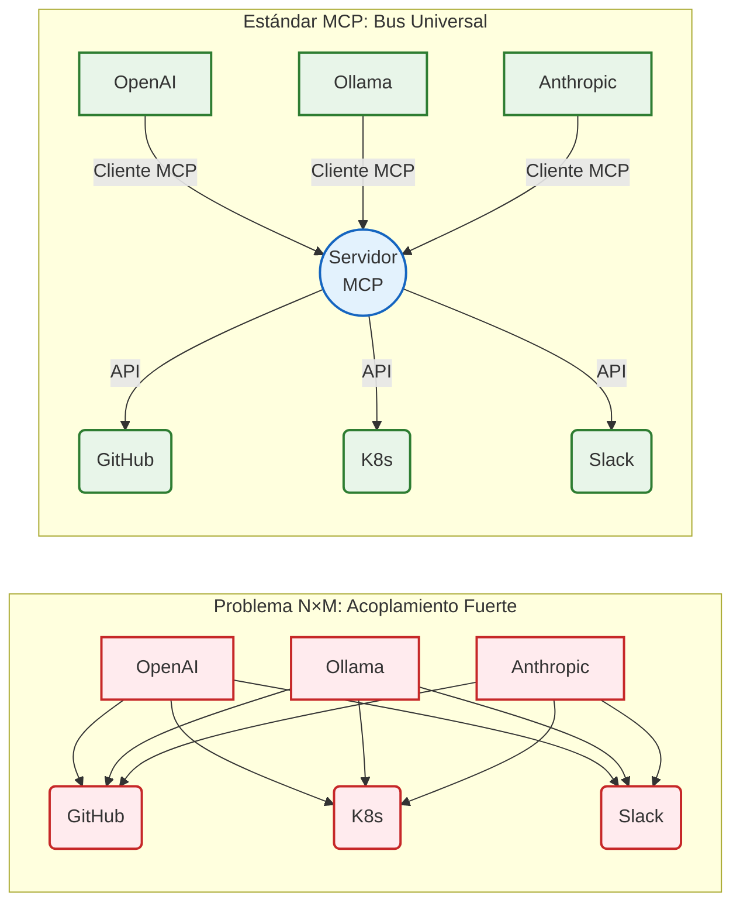

# Capítulo 2. Estado del Arte

Este capítulo articula el marco teórico y tecnológico sobre el que se sustenta la arquitectura del *Agentic Deployer*. Se expone una revisión exhaustiva de los paradigmas contemporáneos en Inteligencia Artificial, los protocolos de estandarización para la comunicación de modelos fundacionales, y los principios modernos de Ingeniería de Plataformas.

## 2.1. Agentes autónomos basados en Modelos de Lenguaje de Gran Escala (LLM)

Durante años, la investigación en Procesamiento de Lenguaje Natural (NLP, por sus siglas en inglés) persiguió la construcción de modelos capaces de comprender y generar texto humano con fluidez. Sin embargo, con el advenimiento de la arquitectura Transformer [28] y la posterior explosión de los Modelos de Lenguaje de Gran Escala (LLM, *Large Language Models*), se descubrió empíricamente que, a partir de cierto umbral de parámetros y datos de entrenamiento, los modelos exhibían habilidades "emergentes" que excedían la simple predicción probabilística de la siguiente palabra (*next-token prediction*). 

Estas habilidades incluyen el razonamiento lógico deductivo, la generalización zero-shot y la capacidad de seguir instrucciones complejas (Brown et al., 2020) [29]. La explotación de estas capacidades cognitivas superiores ha propiciado un cambio de paradigma en la disciplina: la evolución desde los meros *asistentes conversacionales* pasivos hacia los **Agentes Autónomos**. Un agente basado en LLM es un sistema computacional diseñado donde el modelo de lenguaje actúa no solo como interfaz, sino como el motor de razonamiento central (el "cerebro") que coordina la percepción de un estado, la planificación cognitiva y la ejecución de acciones sobre su entorno para alterar dicho estado.

Para que un LLM trascienda su encapsulamiento (estando típicamente aislado de la internet en tiempo real y limitado por su fecha de corte de conocimiento) y adquiera verdadera agencia, la industria ha consolidado dos avances técnicos fundamentales: el paradigma de razonamiento *ReAct* y la capacidad técnica de invocación de herramientas (*Function Calling*).

### 2.1.1. El Paradigma ReAct (Reason + Act)

Previo a la formalización de arquitecturas agénticas, los enfoques tradicionales obligaban a los modelos a emitir una respuesta final inmediata, o bien a razonar estáticamente mediante técnicas como *Chain-of-Thought* (CoT) (Wei et al., 2022) [30]. Aunque CoT mejora drásticamente el razonamiento al obligar al modelo a "pensar paso a paso", padece de una limitación intrínseca: el modelo razona exclusivamente sobre la información contenida en el *prompt* inicial o en sus pesos internos, sin capacidad para consultar nueva información o rectificar premisas falsas en tiempo real. Esto a menudo desemboca en fenómenos de alucinación y propagación de errores, inadmisibles en escenarios de operaciones críticas de infraestructura.

Para resolver este desafío, Yao et al. [1] introdujeron el paradigma **ReAct**. Este marco conceptual propone intercalar dinámicamente la generación de trazas de razonamiento humano-inteligibles con la ejecución de acciones específicas en el entorno. En un bucle ReAct, el agente opera bajo un ciclo continuo estructurado en tres primitivas:

1. **Pensamiento (Thought):** El agente analiza el estado actual y la petición del usuario, deduciendo cuál es el siguiente paso lógico. Por ejemplo: *"El usuario quiere un CMS. Necesito consultar las cuotas del departamento antes de asignarle memoria."*
2. **Acción (Action):** El agente selecciona, de un catálogo predefinido, una herramienta externa para ejecutarla. Por ejemplo: `consultar_cuotas_departamento(departamento="informatica")`.
3. **Observación (Observation):** El motor subyacente (el código de la aplicación) ejecuta la herramienta real contra la infraestructura y devuelve el resultado (en texto o JSON) al LLM. El modelo absorbe esta nueva información real y vuelve al estado 1.

Este ciclo iterativo se detiene únicamente cuando el modelo determina, a través de su fase de *Thought*, que ha recabado suficiente información y ha ejecutado todas las mutaciones necesarias en el entorno para emitir la **Respuesta Final (Final Answer)**. En el contexto de este Trabajo de Fin de Máster, ReAct se posiciona como el pilar central del orquestador: permite al agente "negociar" interactivamente los parámetros de un despliegue (ej. solicitar al usuario un puerto válido si la primera observación devuelve un error de seguridad de Kubernetes), mitigando por completo las alucinaciones al anclar el razonamiento en los resultados deterministas devueltos por el sistema subyacente.

### 2.1.2. Invocación de Herramientas (Function Calling / Tool Calling)

El mecanismo material que permite a un LLM ejecutar la fase de *Acción* de un bucle ReAct se denomina *Function Calling* (o *Tool Calling*). Antes de su estandarización, la extracción de entidades desde un texto libre dependía de expresiones regulares (RegEx) frágiles o clasificadores secundarios. Un usuario podía redactar: "Despliega una base de datos redis", pero forzar al modelo a responder estrictamente con un JSON parseable (ej. `{"accion": "desplegar", "servicio": "redis"}`) resultaba propenso a errores de formato, saltos de línea inyectados o caracteres de escape inválidos.

El salto cualitativo se produjo cuando proveedores como OpenAI, y posteriormente la comunidad *Open-Source* mediante iniciativas como Ollama, comenzaron a someter a los LLMs a procesos de ajuste fino (*fine-tuning*) intensivos, diseñados específicamente para el seguimiento estricto de estructuras de datos.

En el modelo actual de *Tool Calling*, el desarrollador inyecta en el contexto del sistema (junto al mensaje del usuario) un esquema estructurado (habitualmente *JSON Schema*) que describe las funciones disponibles, sus descripciones en lenguaje natural, y los tipos de datos exactos de sus parámetros (enteros, booleanos, enumeraciones). Cuando el modelo de lenguaje infiere que una petición de usuario requiere una acción externa, suspende la generación de texto conversacional y devuelve un objeto computacionalmente riguroso. Este objeto instruye a la aplicación que hospeda el modelo para que ejecute una rutina arbitraria en el servidor.

Esta capacidad ha transformado el rol de los lenguajes de programación en la Inteligencia Artificial. Lenguajes como Python o Go dejan de ser meros envoltorios de peticiones HTTP, y se convierten en extremidades cibernéticas de los agentes, otorgándoles acceso directo a bases de datos SQL, clientes de correo, o como en el caso del *Agentic Deployer*, acceso a la API del clúster de orquestación de Kubernetes. La robustez técnica lograda por el *Function Calling* contemporáneo es el habilitador crítico que permite confiar procesos de *DevOps* a sistemas estocásticos.

## 2.2. Estandarización de Integraciones: Model Context Protocol (MCP)

Si bien el *Function Calling* dotó a los modelos de lenguaje de capacidades de ejecución, su adopción temprana generó un ecosistema tecnológico fuertemente fragmentado. Cada proveedor de Inteligencia Artificial (OpenAI, Google, Anthropic) diseñó especificaciones propietarias para el registro de herramientas. Paralelamente, los frameworks de orquestación de IA más populares (tales como LangChain, LlamaIndex o AutoGen) crearon abstracciones incompatibles entre sí. 

Este escenario desembocó en el problema clásico de la interoperabilidad (*vendor lock-in*). Si un departamento de operaciones desarrollaba un conjunto de herramientas para orquestar su infraestructura compatible con LangChain y OpenAI, migrar hacia un ecosistema gobernado por modelos de código abierto (ej. Ollama o vLLM) requería reescribir por completo la capa de integración de las herramientas. Resultaba insostenible para las organizaciones mantener adaptadores múltiples para cada nueva iteración de los modelos fundacionales.

<i><b>Figura 1:</b> Contraste arquitectónico entre el problema de integración N×M (acoplamiento propietario) y la topología de Bus Universal propuesta por el protocolo MCP.</i>

### 2.2.1. Génesis y Principios de MCP

Para resolver esta fragmentación sistémica, en el último trimestre de 2024, Anthropic (los creadores de la familia de modelos *Claude*) lideró la apertura de un nuevo estándar *open-source*: el **Model Context Protocol (MCP)** [3]. La motivación central de MCP es desacoplar de forma estricta al consumidor de la IA (el agente) de las fuentes de datos e infraestructuras locales (las herramientas), creando un lenguaje universal. 

MCP se inspira profundamente en el éxito del *Language Server Protocol (LSP)* de Microsoft, el cual estandarizó la comunicación entre los editores de código (IDEs) y los compiladores. Del mismo modo, MCP busca convertirse en la capa estándar que conecte cualquier asistente generativo con el entorno computacional de la organización, promoviendo una arquitectura conectable (*pluggable*) basada en el protocolo ligero `JSON-RPC 2.0`.

### 2.2.2. Arquitectura Cliente-Servidor de MCP

El protocolo abandona las integraciones monolíticas en favor de un diseño cliente-servidor estrictamente definido, garantizando fronteras de seguridad nítidas:

- **MCP Host / Client (El Agente):** Es la aplicación que interactúa con el usuario y gestiona el flujo de razonamiento del LLM. El cliente es agnóstico a la implementación de las herramientas; su única responsabilidad es negociar con el servidor mediante mensajes estándar, inyectar el contexto recuperado en el *prompt* del modelo, y solicitar al servidor la ejecución de las funciones decididas por la IA. En el presente proyecto, el componente `AgentOrchestrator` implementa las lógicas derivadas de un cliente MCP.
- **MCP Server (El Entorno):** Es un proceso ligero e independiente, desplegado dentro de la zona de confianza de la organización (en el caso de este TFM, operado por el Servicio de Informática de la universidad). El servidor obvia la existencia de modelos de lenguaje; su propósito es encapsular la lógica de negocio imperativa (ej. generar un manifiesto YAML de Kubernetes) y exponer esta capacidad a través de un esquema JSON estandarizado.

Ambos actores se comunican a través de transportes estandarizados. MCP soporta integraciones locales directas mediante los canales de Entrada/Salida estándar del sistema operativo (**stdio**), ideal para herramientas que corren en la misma máquina que el agente, y transporte web basado en **Server-Sent Events (SSE)** sobre HTTP, indispensable para infraestructuras distribuidas y arquitecturas nativas de la nube (*Cloud Native*).

### 2.2.3. Primitivas del Protocolo: Resources, Prompts y Tools

El estándar MCP orquesta la interacción entorno-modelo a través de tres primitivas de datos fundacionales:

1. **Resources (Recursos):** Datos de naturaleza estática o de solo lectura controlados por el servidor. Permiten inyectar contexto adicional en la ventana de memoria del LLM sin otorgarle capacidad de mutación. Ejemplos clásicos incluyen la lectura del registro de estado actual de un clúster de Kubernetes, bases de datos o documentación corporativa local.
2. **Prompts:** Plantillas de instrucciones parametradas y almacenadas en el servidor, permitiendo la estandarización organizativa. Un administrador puede definir un *prompt* en el servidor ("Resume el estado de este nodo") y el agente cliente puede invocarlo y presentarlo al usuario.
3. **Tools (Herramientas):** Son capacidades ejecutables y con efectos secundarios (mutaciones en el entorno) controladas por el servidor. Las herramientas son el equivalente estandarizado del *Function Calling*. Cuando el servidor MCP de la universidad se inicializa, transmite al cliente un catálogo de herramientas (por ejemplo, `deploy_python_app`), dictaminando los argumentos exactos requeridos (como nombre de proyecto y versión del lenguaje). 

La adopción formal del Model Context Protocol mediante su Software Development Kit (SDK) oficial en Python constituye la columna vertebral arquitectónica del *Agentic Deployer* desarrollado en este TFM. Esta decisión estratégica garantiza que el catálogo de automatizaciones de infraestructura de la institución quede blindado frente a los giros del mercado de la Inteligencia Artificial. Las herramientas expuestas por el Servidor MCP del proyecto son consumibles indistintamente por el agente local diseñado (Streamlit + Ollama) y por soluciones empresariales externas y *closed-source* (como el Inspector oficial o aplicaciones de terceros), asegurando un ciclo de vida útil del software extendido y una interoperabilidad robusta.

## 2.3. Orquestación e Infraestructura Declarativa (Kubernetes)

Para comprender el desafío que supone la provisión autónoma de infraestructura, es imperativo analizar el cambio de paradigma introducido por Kubernetes (K8s) [4] en el ámbito de las operaciones. Originado en Google bajo el proyecto interno *Borg* y posteriormente donado a la *Cloud Native Computing Foundation* (CNCF), Kubernetes se ha erigido como el estándar *de facto* para la orquestación de cargas de trabajo en contenedores. Su dominio en el mercado no se debe únicamente a su robustez técnica, sino a la adopción estricta de un modelo de gestión **declarativo**.

### 2.3.1. Imperativo vs. Declarativo

En los albores de la administración de sistemas, las operaciones seguían un enfoque imperativo. Los administradores interactuaban con los servidores mediante secuencias explícitas de comandos (ej. rutinas *bash* o *scripts* en servidores remotos). En un modelo imperativo, el usuario dicta *cómo* deben realizarse las acciones paso a paso: "descarga esta imagen, inicia el contenedor, abre el puerto 80, verifica si está vivo". Este enfoque, si bien directo, es inherentemente frágil. Si un servidor se reinicia o un proceso falla, el script imperativo carece del contexto necesario para devolver el sistema a la normalidad sin intervención humana.

En contraposición, Kubernetes abraza el modelo declarativo (Infraestructura como Código - IaC). En un paradigma declarativo, el ingeniero no instruye a la máquina sobre *cómo* hacer el trabajo; en su lugar, describe exclusivamente el **estado final deseado** (*Desired State*). El usuario declara, mediante manifiestos estructurados en lenguaje YAML o JSON: "Deseo que existan exactamente 3 réplicas del contenedor de WordPress expuestas en el puerto 8080".

### 2.3.2. Bucles de Reconciliación y el Plano de Control

La materialización de este estado deseado es responsabilidad exclusiva del Plano de Control (*Control Plane*) de Kubernetes, operando a través de un mecanismo denominado **Bucle de Control o Reconciliación** (*Control Loop*).

Un clúster de K8s evalúa continuamente la topología de la red y los procesos en ejecución. De manera asíncrona, compara el **Estado Real** (*Actual State*) del clúster (por ejemplo, "hay 2 réplicas de WordPress en ejecución porque un nodo físico acaba de fallar") contra el **Estado Deseado** almacenado en su base de datos distribuida (`etcd`). Al detectar una divergencia (2 réplicas reales vs. 3 réplicas deseadas), el bucle de reconciliación infiere de forma autónoma las acciones necesarias para corregir la desviación (desplegar un nuevo contenedor en un nodo sano), ejecutándolas sin requerir una nueva instrucción imperativa del operador humano.

### 2.3.3. Complejidad Sintáctica y Carga Cognitiva

A pesar de las indudables ventajas de resiliencia y auto-sanación (*self-healing*) que ofrece el modelo declarativo, la definición técnica del estado deseado introduce una severa carga cognitiva. La API de Kubernetes está compuesta por decenas de Recursos Personalizados (*Custom Resource Definitions* - CRDs), cada uno con una semántica y un esquema estricto de validación.

Desplegar un simple servicio web en producción raramente implica redactar un solo manifiesto. Para exponer una aplicación de forma segura al exterior, un desarrollador debe coordinar y enlazar sintácticamente al menos tres primitivas fundamentales:
1. **Deployment:** Define el contenedor de la aplicación, su imagen base, la política de reinicios, las sondas de vida (*liveness probes*) y las reservas estrictas de memoria y CPU.
2. **Service:** Abstrae la volatilidad de las direcciones IP internas de los contenedores subyacentes, creando un punto de acceso de red estable (*ClusterIP*) para balancear el tráfico.
3. **Ingress:** Expone las rutas HTTP/HTTPS desde el exterior del clúster hacia los *Services* internos, gestionando reglas de enrutamiento por nombre de dominio y terminación SSL/TLS.

La interdependencia entre estos recursos exige un nivel de precisión milimétrica (por ejemplo, el anidamiento correcto de selectores de etiquetas, o *labels*, entre el *Deployment* y el *Service*). Un simple error de indentación en el formato YAML, o un fallo en el mapeo de un selector de red, provocará que la aplicación se despliegue en una isla de red inaccesible (sin devolver errores obvios de compilación).

Es esta inherente aridez sintáctica y complejidad estructural la que levanta una barrera de entrada para los usuarios ajenos al ecosistema *Cloud Native*, y constituye el problema fundamental que el orquestador agéntico de este TFM busca resolver, asumiendo la labor cognitiva de redactar el código declarativo a partir de intenciones en lenguaje natural.

## 2.4. Arquitectura Hexagonal y Seguridad en Sistemas Estocásticos

La integración de Modelos de Lenguaje en sistemas críticos de infraestructura plantea un dilema de seguridad estructural. Los LLM, por su propia naturaleza estadística, son impredecibles (estocásticos). En contraste, los sistemas de provisión corporativa exigen un determinismo absoluto (por ejemplo, rechazar sistemáticamente cualquier despliegue que intente utilizar el puerto 22, reservado para SSH). Para conciliar la agilidad de la IA con la rigidez de las normativas de IT, el *Agentic Deployer* adopta los principios de la **Arquitectura Hexagonal**.

### 2.4.1. Fundamentos de *Ports and Adapters*

Formalizada por Alistair Cockburn en 2005 [2] bajo el nombre de patrón de Puertos y Adaptadores (*Ports and Adapters*), la Arquitectura Hexagonal nació como respuesta a los problemas endémicos de las arquitecturas tradicionales en capas (Presentación $\rightarrow$ Lógica de Negocio $\rightarrow$ Base de Datos). En el diseño tradicional en capas, la lógica de negocio a menudo se contamina con dependencias transitivas de la base de datos o de los *frameworks* de interfaz de usuario.

El objetivo central de la Arquitectura Hexagonal es permitir que una aplicación sea operada de forma equitativa por usuarios, programas, pruebas automatizadas o *scripts* por lotes, y que pueda ser desarrollada y probada de forma aislada respecto a sus eventuales dispositivos e infraestructuras y bases de datos en tiempo de ejecución. 

Visualmente representada como un hexágono, la arquitectura propone una división estricta en dos zonas diametralmente aisladas:
- **El Interior (El Núcleo o *Domain*):** Alberga exclusivamente las reglas de negocio puras y el modelo de datos. Carece por completo de dependencias hacia el exterior; no importa librerías HTTP, drivers de bases de datos ni SDKs de Inteligencia Artificial.
- **El Exterior (Los Adaptadores):** Contiene todos los detalles de implementación tecnológica (APIs REST, clientes de bases de datos, integraciones con OpenAI u orquestadores de Kubernetes).

### 2.4.2. Inversión de Dependencias (El Principio 'D' de SOLID)

El puente de comunicación entre el Interior (inmutable) y el Exterior (volátil) se implementa mediante **Puertos**. Un Puerto es una interfaz abstracta o un contrato (típicamente una interfaz en lenguajes como Java o clases abstractas / *Protocols* en Python). 

La magia protectora de esta arquitectura recae en la aplicación estricta del Principio de Inversión de Dependencias (Dependency Inversion Principle - DIP). En lugar de que el núcleo de negocio dependa del cliente de Kubernetes para desplegar, el núcleo define una abstracción `DeployPort` (por ejemplo, `def deploy(intent): pass`). Es la capa externa (el adaptador de K8s) la que hereda y debe implementar dicho contrato. El núcleo solo conoce la interfaz abstracta, jamás la implementación real. 

### 2.4.3. Confinamiento de la Inteligencia Artificial

La adopción de este patrón arquitectónico es la piedra angular de la seguridad en el presente Trabajo de Fin de Máster. Si el modelo de negocio (ej. la clase `DeploymentIntent`) se define en el núcleo puro de la aplicación, fuertemente tipado (mediante Pydantic), se establece una barrera computacional inquebrantable.

En un flujo convencional, el Agente LLM ejerce de **Adaptador Primario (Driver)**. Genera peticiones intentando invocar los casos de uso del sistema. Debido a la Arquitectura Hexagonal, el LLM jamás puede puentear la validación de negocio para atacar directamente a la infraestructura (el **Adaptador Secundario o Driven**), ya que desconoce su implementación. Toda intención generada por la IA debe cruzar ineludiblemente a través del Puerto de Entrada, donde es sometida a las reglas deterministas de validación del núcleo (ej. `SecurityContextValidator`).

Si el modelo "alucina" una configuración maliciosa, el núcleo la rechaza basándose en sus contratos puros, arrojando una excepción formal. Esta excepción no tumba el sistema, sino que fluye en sentido inverso hacia el exterior, donde el adaptador del agente la captura y la reinyecta en el contexto del LLM (el mecanismo de *Feedback Loop* del bucle ReAct). De este modo, la Arquitectura Hexagonal actúa como la verdadera "jaula" de contención, permitiendo explotar el razonamiento generativo sin ceder un milímetro de soberanía tecnológica sobre la infraestructura crítica.

## 2.5. Trabajos Relacionados y Posicionamiento Diferencial

La intersección entre agentes conversacionales y automatización de infraestructura ha generado una serie de iniciativas académicas e industriales en los últimos dos años. Esta sección analiza los enfoques más relevantes y posiciona el *Agentic Deployer* respecto a ellos, identificando las contribuciones diferenciales de este trabajo.

### 2.5.1. Enfoques Industriales: Copilots y Asistentes Cloud Propietarios

Los grandes proveedores de nube han lanzado asistentes conversacionales integrados en sus plataformas. Microsoft dispone de **GitHub Copilot for Azure** y el **Azure AI Assistant** integrado en el portal web, que permiten consultar el estado de los recursos desplegados mediante lenguaje natural. Google ofrece capacidades similares mediante **Gemini for Google Cloud**, y AWS con **Amazon Q Developer**.

Sin embargo, estas soluciones presentan limitaciones estructurales significativas para entornos institucionales:

| Dimensión | Asistentes Cloud Propietarios | Agentic Deployer |
|---|---|---|
| **Proveedor** | Monoproveedor (Azure, GCP, AWS) | Agnóstico (Ollama, OpenAI, cualquier LLM) |
| **Soberanía del dato** | Datos en servidores del proveedor | Zero Data Retention (Ollama local) |
| **HITL obligatorio** | No — ejecución directa posible | Sí — barrera FSM inmutable |
| **Coste** | Pago por uso | Infraestructura propia (OPEX predecible) |
| **Personalización** | Limitada a la consola del proveedor | Golden Paths propios del SIC |
| **Auditabilidad** | Logs del proveedor | Logs propios + FSM con estados inmutables |

El *Agentic Deployer* sacrifica la conveniencia del SaaS en favor de la soberanía tecnológica, una prioridad crítica en entornos académicos regulados por legislación de protección de datos (RGPD, LOPDGDD).

### 2.5.2. Enfoques de Investigación: LLMs para IaC (*Infrastructure as Code*)

En el ámbito académico, varios trabajos han explorado el uso de modelos de lenguaje para generar código de infraestructura. Entre los más relevantes se encuentran:

- **"Automatic Terraform Generation with GPT-4"** (trabajos preliminares, 2023-2024): Proponen usar LLMs para generar ficheros Terraform a partir de especificaciones en lenguaje natural. Sin embargo, estos enfoques delegan la corrección semántica y de seguridad al propio LLM, sin una capa de validación formal determinista. El modelo puede generar código de IaC sintácticamente válido pero semánticamente inseguro (puertos abiertos, imágenes sin auditar), sin mecanismo de interceptación.

- **"ChatOps and LLMs for DevOps Automation"** (diversas publicaciones 2023-2024): Exploran la integración de chatbots en plataformas de comunicación empresarial (Slack, Teams) para trigger de pipelines CI/CD. La aproximación es pragmática pero superficial desde el punto de vista arquitectónico: los LLMs invocan comandos de forma directa sin modelo de dominio intermedio ni patrón HITL formal.

La contribución diferencial de este TFM respecto a estos trabajos es la **separación formal entre el plano de razonamiento (LLM) y el plano de ejecución (Hexagonal)**, implementada mediante un protocolo estándar abierto (MCP) y reforzada por una barrera de supervisión humana basada en una FSM inmutable.

### 2.5.3. Frameworks de Orquestación: LangChain y AutoGen

Los frameworks de código abierto más populares para la construcción de agentes son **LangChain** (Harrison Chase, 2022) y **AutoGen** (Microsoft, 2023). Ambos ofrecen abstracciones de alto nivel para la construcción de cadenas de razonamiento y sistemas multi-agente.

No obstante, su aplicación directa al dominio de operaciones de infraestructura crítica presenta tres riesgos no resueltos:

1. **Acoplamiento al framework:** El código de negocio queda embebido en las abstracciones de LangChain (`Chains`, `Agents`, `Tools`). Una migración futura a otro framework requiere reescribir la lógica de dominio, violando el principio de inversión de dependencias.
2. **Ausencia de modelo de dominio formal:** LangChain no impone un modelo de datos tipado para las herramientas. Un `tool` incorrecto puede devolver texto libre, imposibilitando la validación determinista de las intenciones generadas.
3. **Ausencia de protocolo estándar:** Las herramientas de LangChain no son consumibles por clientes distintos al propio framework. Dos organizaciones usando LangChain con herramientas distintas no pueden compartir ni federar su catálogo de capacidades.

El *Agentic Deployer* aborda los tres problemas mediante el trío MCP (estandarización) + Arquitectura Hexagonal (aislamiento del dominio) + FSM (gobierno del ciclo de vida). La ausencia de dependencias en LangChain o AutoGen es, por tanto, una decisión de diseño deliberada y no una omisión.

### 2.5.4. Posicionamiento del Agentic Deployer

La siguiente tabla sintetiza el posicionamiento del sistema desarrollado respecto al estado del arte. El objetivo no es establecer una superioridad absoluta, sino evidenciar cómo el *Agentic Deployer* cubre una intersección de requisitos corporativos que los *frameworks* de propósito general delegan al desarrollador:

| Capacidad Arquitectónica | LangChain / AutoGen | Soluciones Cloud (Copilots) | **Agentic Deployer** |
|---|---|---|---|
| **Soberanía de Datos (On-Premise)** | Sí (Soportan modelos locales) | No (SaaS propietario) | **Sí (Ollama Nativo)** |
| **Interoperabilidad de Herramientas** | No (Acoplamiento a librerías propias) | Cerrada (Ecosistema del proveedor) | **Sí (Estándar abierto MCP)** |
| **Flujo de Aprobación Humana (HITL)** | Sí (Interrupción de consola / *Callbacks*) | Parcial (Depende de la plataforma) | **Sí (Panel asíncrono con máquina de estados)** |
| **Validación de Seguridad Estricta** | Parcial (Requiere implementación ad-hoc) | Sí (Barreras propietarias del Cloud) | **Sí (Arquitectura Hexagonal con validación estática)** |
| **Flexibilidad de Integración** | Alta (Librerías generalistas masivas) | Baja (Agnosticismo nulo) | **Media (Enfocado estrictamente a infraestructura)** |

Como se observa, *frameworks* como AutoGen o LangChain poseen capacidades de *Human-in-the-Loop* o ejecución local, pero están diseñados como librerías de propósito general para desarrolladores. La aportación diferencial del *Agentic Deployer* reside en empaquetar estas necesidades en una topología arquitectónica de nivel empresarial (Hexagonal + FSM) gobernada por el estándar unificador MCP.

En definitiva, el *Agentic Deployer* no compite en el espacio de los asistentes conversacionales generalistas, sino que ocupa un nicho específico y de alta relevancia práctica: la **gobernanza segura y auditable de infraestructura declarativa mediante agentes conversacionales en entornos institucionales con requisitos de soberanía del dato**.
