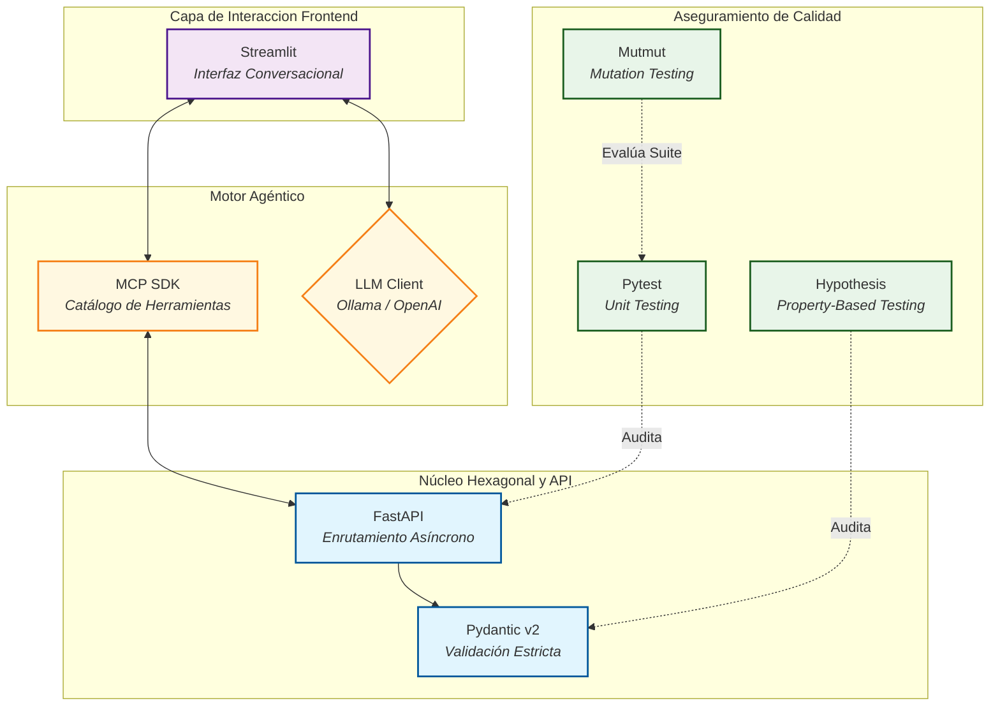

# Capítulo 3. Metodología y Stack Tecnológico

La construcción de un sistema de orquestación que hibrida disciplinas clásicas de Ingeniería de Software (Arquitectura Hexagonal, testing riguroso, APIs REST) con dominios emergentes e intrínsecamente inestables como la Inteligencia Artificial Generativa, requiere un marco metodológico estricto. Este capítulo describe la metodología de trabajo adoptada a lo largo del ciclo de vida del *Agentic Deployer*, las fases de desarrollo planificadas y la justificación técnica de las herramientas que conforman el ecosistema final de la aplicación.

## 3.1. Enfoque Metodológico

El desarrollo de software orientado a Inteligencia Artificial difiere significativamente del desarrollo web o de aplicaciones corporativas tradicionales. En un sistema estándar, una entrada A (por ejemplo, pulsar un botón) produce invariablemente una salida B. En un sistema orquestado por un Modelo de Lenguaje de Gran Escala (LLM), la entrada A (una instrucción en lenguaje natural) puede generar múltiples salidas semánticamente equivalentes pero sintácticamente dispares. Esta volatilidad obliga a cimentar el proyecto sobre prácticas que aíslen el determinismo de la estocasticidad.

Para gobernar este riesgo, el Trabajo de Fin de Máster se ha regido por una **metodología de desarrollo iterativa e incremental**, fuertemente influenciada por los principios del *Domain-Driven Design* (DDD) y el desarrollo guiado por pruebas (TDD / *Test-Driven Development*). En lugar de construir el sistema horizontalmente (diseñando primero toda la base de datos, luego todo el backend y finalmente todo el frontend), la metodología dictaminó un crecimiento radial o concéntrico de adentro hacia afuera, alineado con los preceptos de la Arquitectura Hexagonal.

La regla metodológica fundamental del proyecto fue la **estabilidad del núcleo antes de la integración estocástica**: no se permitió escribir una sola línea de código relacionada con la API de OpenAI, Ollama o el estándar MCP hasta que el modelo de dominio interno (`DeploymentIntent`) y el motor de validación (`SecurityContextValidator`) demostraron una resiliencia matemática del 100% (verificada mediante pruebas automatizadas masivas). Construir el motor de IA primero y la lógica de validación después habría expuesto el prototipo a vulnerabilidades críticas de infraestructura desde las primeras fases de pruebas.

## 3.2. Fases de Desarrollo

Para materializar el producto final, el cronograma de ejecución se dividió orgánicamente en **cinco *sprints* de desarrollo** más dos fases transversales de consolidación y cierre (Fases 6 y 7, detalladas en la Sección 9.2 y el Anexo B). Cada sprint culminó con un entregable técnico funcional (un incremento de producto) que servía de base inmutable para la siguiente etapa.

> *Nota metodológica: si bien la planificación inicial establece una secuencia ordenada de sprints, la naturaleza del trabajo académico y los compromisos paralelos inherentes al contexto universitario exigen reconocer que la asignación temporal de cada fase puede solaparse o reordenarse según disponibilidad. La planificación se concibe, por tanto, como un marco de referencia flexible y no como una secuencia rígida de Gantt. Los detalles de esta retrospectiva se documentan en el Capítulo 10.*

### 3.2.1. Sprint 1: Núcleo Hexagonal y Dominio Base

Esta fase supuso los cimientos del proyecto. El objetivo era modelar matemáticamente las reglas de negocio de un Servicio de Informática (SIC) universitario, obviando la existencia de la inteligencia artificial.
- **Modelado de Entidades:** Se definió la ontología de los despliegues. Se implementó la clase `DeploymentIntent` utilizando tipado estricto, definiendo los requerimientos ineludibles (nombre de la aplicación, imagen base, puerto, cuotas de recursos).
- **Validación y Casos de Uso:** Se desarrolló el `SecurityContextValidator`, un motor de reglas determinista diseñado para interceptar intenciones maliciosas (como el uso de puertos privilegiados del sistema operativo o la invocación de imágenes no permitidas).
- **Contratos (Ports):** Se definió el puerto abstracto de despliegue (`DeployPort`), estableciendo el contrato que cualquier infraestructura futura (Kubernetes, Docker Swarm, Nomad) debería satisfacer.

### 3.2.2. Sprint 2: Backend HITL y FSM

Antes de otorgar agencia a un modelo de IA, era preceptivo construir el perímetro operativo: el mecanismo de supervisión técnica.
- **Capa REST API:** Se construyó la capa externa de aplicación (el adaptador *driving* principal) mediante un servidor HTTP que permitiese recibir las intenciones de despliegue de forma estructurada.
- **Flujo de Pendencia:** Se implementó la lógica de estado transicional. Las intenciones aprobadas por el motor de seguridad no se ejecutaban directamente, sino que se bloqueaban en un estado de `PENDING_APPROVAL`.
- **Panel de Operador:** Se diseñó y codificó una interfaz gráfica (*Dashboard*) asíncrona para que el personal del SIC pudiera auditar visualmente las intenciones bloqueadas y emitir la autorización final (`POST /hitl/approve`), cerrando así el diseño del patrón *Human-In-The-Loop* (HITL).

### 3.2.3. Sprint 3: Golden Paths y FakeK8s

El tercer incremento dotó de "manos" al sistema. Aunque la ejecución final contra un clúster físico quedaba fuera del alcance estricto, el orquestador debía probar su capacidad para redactar infraestructura real.
- **Adaptador Simulado:** Se codificó el `FakeK8sAdapter`, un componente que implementa el contrato `DeployPort`.
- **Materialización Declarativa:** En esta fase se implementaron las plantillas de los *Golden Paths* (rutas pavimentadas). Al recibir una intención aprobada, el adaptador extrae las variables (nombre, recursos) y genera en el disco físico del servidor los manifiestos YAML completos y entrelazados (Deployment, Service, Ingress), demostrando que el sistema produce configuraciones listas para producción sin el tedio sintáctico habitual.

### 3.2.4. Sprint 4: Agente ReAct y MCP SDK

Con una infraestructura determinista, auditada y capaz de generar YAML, la penúltima fase integró el núcleo de razonamiento del sistema, delegando la interfaz humana en la IA.
- **Protocolo MCP:** Se integró el SDK del *Model Context Protocol*, refactorizando las capacidades del SIC (ej. `deploy_python_app`) en herramientas estandarizadas (Tools) expuestas a través del protocolo `stdio`.
- **Motor ReAct:** Se programó el `AgentOrchestrator`, un bucle lógico iterativo capaz de comunicarse con LLMs a través de un adaptador agnóstico (OpenAI/Ollama). Este motor interpreta los JSON devueltos por el modelo, ejecuta la herramienta MCP correspondiente en el backend, e inyecta la observación resultante de vuelta al LLM (el vital *Feedback Loop* de seguridad).

### 3.2.5. Sprint 5: QA Avanzado (Validación Metamórfica)

Añadida como una capa de valor adicional (*bonus*) no prevista en el alcance inicial puro, pero considerada crítica para el rigor de un proyecto de ingeniería corporativa. Consistió en estresar el middleware ante el no-determinismo del LLM.
- Se integraron técnicas de validación punteras como el *Property-Based Testing* (generando miles de intenciones pseudoaleatorias válidas) y Pruebas Metamórficas para verificar la resiliencia del modelo ante alteraciones lingüísticas (ruido sintáctico en el prompt, cambios de orden en las palabras).
- Por último, se auditó la propia suite de pruebas con *Mutation Testing*, demostrando la robustez extrema del validador de seguridad.

### 3.2.6. Fase 6: Redacción y Cierre (Robustez y Ciclo HITL)

Tras la consolidación del MVP, se abordaron una serie de mejoras de calidad y usabilidad que elevan el sistema a un nivel de referencia académica:
- **Cliente Ollama Nativo (`OllamaLLMClient`):** Eliminación de la dependencia en la librería `openai` para comunicaciones con el servidor Ollama local, sustituyéndola por peticiones `httpx` directas a la API REST nativa. Esta refactorización garantiza un esquema de *Zero Data Retention* sin dependencias de terceros.
- **Canal de Retorno al Investigador:** Implementación del endpoint `GET /hitl/status/{id}` y el panel de notificaciones en el chat (` Mis Solicitudes Pendientes`), cerrando el ciclo de comunicación bidireccional del patrón HITL (sección 6.4).
- **Ampliación de Evidencias Empíricas:** Creación del directorio `demos/` con transcripciones forenses de las sesiones de ejecución real y el manifiesto YAML generado por el `FakeK8sAdapter` (Anexo A).

### 3.2.7. Fase 7: Excelencia Técnica y Experimentos Multi-Modelo

Como esfuerzo final fuera del alcance inicial (Prioridad P2), se elevó el estándar del prototipo mediante tres hitos arquitectónicos:
- **Persistencia Transaccional:** Migración del almacenamiento de memoria volátil a una base de datos **SQLite**, dotando a la Máquina de Estados de robustez ACID.
- **Escalado del Catálogo MCP:** Ampliación del servidor de 4 a 7 herramientas operativas, integrando capacidades complejas como gestión de bases de datos o borrado de servicios institucionales.
- **Validación Empírica Extendida:** Ejecución de pruebas comparativas sobre un espectro amplio de modelos, tanto Cloud (Gemini, Cohere, Groq) como Locales especializados (Qwen Coder), consolidando definitivamente las conclusiones de viabilidad del proyecto.

## 3.3. Stack Tecnológico y Justificación Arquitectónica

La elección de tecnologías en un ecosistema que combina Inteligencia Artificial y provisionamiento de infraestructura debe equilibrar la innovación disruptiva con la fiabilidad matemática exigida por las operaciones institucionales. A continuación, se desglosa y fundamenta el *stack* tecnológico adoptado.

### 3.3.1. Lenguaje Base: Python 3.12
El proyecto se ha construido íntegramente sobre **Python (versión 3.12)**. Si bien lenguajes como Go ostentan la hegemonía histórica en el ecosistema *Cloud Native* (Kubernetes y Terraform están escritos en Go), Python mantiene un monopolio absoluto en la investigación y desarrollo de Inteligencia Artificial. La elección de Python 3.12 permite aprovechar las últimas optimizaciones del intérprete CPython y, crucialmente, el soporte nativo para un tipado estático avanzado (Type Hints y genéricos). Esta característica es vital para implementar interfaces abstractas sólidas dentro de la Arquitectura Hexagonal, mitigando los históricos problemas del tipado dinámico en sistemas críticos.

### 3.3.2. Capa Backend y Modelado de Datos
- **FastAPI:** Elegido como el *framework* web primario por encima de alternativas clásicas como Django o Flask. FastAPI no solo destaca por su rendimiento excepcional (sustentado en la especificación ASGI y la librería *Starlette*), sino por su generación automática de contratos de API (OpenAPI/Swagger). Para un Agente LLM, interactuar con una API que expone un esquema riguroso y auto-documentado facilita exponencialmente la comprensión de las herramientas.
- **Pydantic (v2):** Constituye el núcleo de validación de datos [20]. Reescripto recientemente en Rust para maximizar su velocidad, Pydantic se utiliza para modelar las entidades de dominio (como `DeploymentIntent`). Su justificación recae en su capacidad para forzar invariantes de negocio: rechazar peticiones del agente que no cumplan con rangos enteros (puertos) o expresiones regulares, antes incluso de que la lógica de la aplicación las procese.

### 3.3.3. Interfaz Conversacional y Capa de Agente
- **Streamlit [21]:** Desarrollar interfaces gráficas (*Front-End*) modernas en React o Vue.js conlleva una alta fricción y sobrecarga de dependencias. Streamlit permite codificar la interfaz de chat (incluyendo historial, avatares, indicadores de estado y el panel de notificaciones HITL) íntegramente en Python puro. Esto permite iterar el componente visual de forma ágil, manteniendo el foco del trabajo investigador en la ingeniería del *middleware* de infraestructura.
- **Model Context Protocol (MCP) SDK:** En lugar de diseñar una API HTTP propietaria para invocar herramientas, se ha adoptado el SDK oficial de MCP para Python. Esta librería permite decorar funciones arbitrarias (ej. `@server.tool()`) e introspeccionar sus firmas (nombres de parámetros y tipos) en tiempo de ejecución, transformándolas en esquemas JSON estandarizados consumibles por cualquier cliente LLM.
- **Abstracción Agnóstica de Proveedor LLM:** El orquestador implementa un contrato abstracto (`LLMClient`) con dos implementaciones concretas:
 - **`OllamaLLMClient`**: Cliente nativo implementado con `httpx` que se comunica directamente con la API REST de Ollama [22] (`POST /api/chat`), sin dependencias externas adicionales. Permite ejecutar modelos especializados como **`qwen2.5-coder:7b`** o generalistas en la red privada institucional, garantizando un esquema de **Soberanía del Dato** (*Zero Data Retention*) imperativo para administraciones públicas. No envía ningún token de texto del investigador a servidores externos.
 - **`OpenAILLMClient`**: Adaptador que implementa el protocolo estándar de OpenAI. Su diseño agnóstico permitió utilizarlo como puente (*proxy*) para evaluar empíricamente ecosistemas *cloud* de terceros (Google Gemini, Cohere Command-R, Mistral, Llama 3) sin acoplar el sistema a una única corporación. La selección del cliente (Local o Cloud) se realiza exclusivamente mediante la variable de entorno `LLM_PROVIDER`, sin requerir modificaciones al código de dominio.

### 3.3.4. Ecosistema de Aseguramiento de Calidad (QA)
La confianza operativa en el *Agentic Deployer* se asienta sobre un *pipeline* de validación agresivo, sustentado por un ecosistema de librerías avanzadas:
- **Pytest:** *Framework* base para la estructuración y ejecución de pruebas de unidad e integración, proveyendo un robusto sistema de inyección de dependencias (fixtures).
- **Hypothesis:** Librería especializada en *Property-Based Testing*. A diferencia de las pruebas estáticas escritas a mano, Hypothesis inyecta ruido y genera dinámicamente miles de permutaciones de intenciones de despliegue para intentar corromper o sortear el validador de seguridad.
- **Mutmut:** Herramienta de *Mutation Testing* que aplica alteraciones lógicas al código fuente del sistema en tiempo de ejecución. Garantiza empíricamente que la suite de pruebas es lo suficientemente exhaustiva como para detectar el más sutil de los fallos lógicos.
- **Locust y Playwright:** Empleadas para certificar el rendimiento y la usabilidad final. *Locust* inunda la API asíncrona simulando concurrencia masiva, demostrando la escalabilidad del patrón asíncrono implementado. *Playwright* orquesta pruebas de interfaz E2E (*End-to-End*), levantando instancias de navegadores *headless* para simular y afirmar la interacción real del técnico (SIC) aprobando despliegues en el panel. 
- **Ruff y Mypy:** Cadena de herramientas estáticas (*Linting* y *Type-Checking*) utilizadas en los ciclos de Integración Continua (CI) local para asegurar una homogeneidad estilística y rechazar cualquier compilación que vulnere los contratos de tipos de Python.

<i><b>Figura 2:</b> Diagrama de componentes del Stack Tecnológico empleado, evidenciando la segregación entre las capas de interfaz, razonamiento cognitivo, backend restrictivo y las herramientas de validación de calidad continua.</i>

