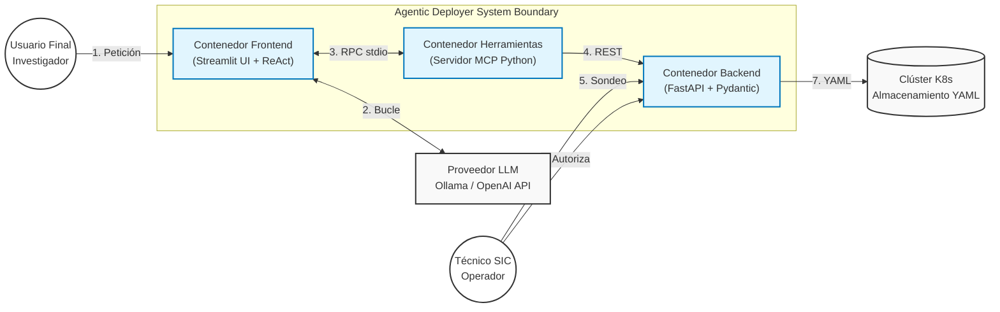
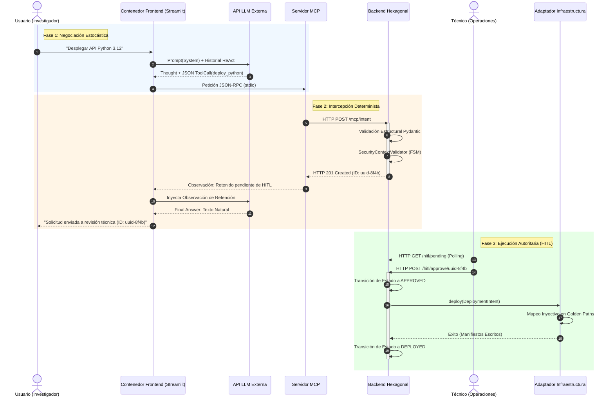

# Capítulo 4. Diseño del Sistema y Arquitectura

El diseño arquitectónico de un sistema que interseca la toma de decisiones basada en Inteligencia Artificial Generativa con las operaciones críticas de infraestructura corporativa plantea un dilema fundacional: ¿Cómo aprovechar la agilidad e intuición lingüística de un Modelo de Lenguaje Estocástico (LLM) sin heredar su inherente imprevisibilidad técnica? 

El presente capítulo desglosa la respuesta ingenieril a esta disyuntiva, articulando una solución que actúa como un "traductor determinista". A lo largo de las siguientes secciones, se detallará la topología global de la solución a través del marco de modelado C4, justificando la segregación de responsabilidades de cada contenedor. Posteriormente, se analizará la fundamentación del núcleo lógico mediante la adopción de la Arquitectura Hexagonal (*Ports and Adapters*), la definición y estructuración de los contratos de provisión conocidos como *Golden Paths*, y la coreografía técnica completa del ciclo de vida de una petición, desde la cadena de texto inicial formulada por el usuario hasta la instanciación del código declarativo final en el servidor físico.

## 4.1. Modelado Topológico Arquitectónico (Estándar C4)

La documentación de arquitecturas de software modernas, caracterizadas por su naturaleza distribuida y asíncrona, resulta ineficaz cuando se aborda mediante diagramas de bloques informales o estándares excesivamente rígidos como UML (*Unified Modeling Language*). Para superar esta limitación y dotar al Trabajo de Fin de Máster de una representación rigurosa, no ambigua y jerárquica, se ha adoptado el **Modelo C4**.

El Modelo C4, concebido por el ingeniero de software Simon Brown [5], se basa en la abstracción jerárquica, asemejándose al funcionamiento de una herramienta de cartografía digital (como *Google Maps*). Permite al observador iniciar el análisis desde una vista macroscópica de los sistemas y los usuarios, y realizar un *zoom-in* progresivo hacia los contenedores de ejecución, los componentes lógicos internos y, finalmente, el código fuente subyacente. 

En este análisis topológico del *Agentic Deployer*, nos centraremos en desglosar los dos niveles de abstracción más relevantes para comprender las fronteras de red y las responsabilidades corporativas: el Nivel 1 (Contexto) y el Nivel 2 (Contenedores).

### 4.1.1. Nivel 1: Contexto del Sistema (System Context)

El diagrama de Contexto (Nivel 1) constituye el estrato más abstracto del modelado. Su objetivo primordial no es revelar la tecnología empleada, sino establecer los límites fronterizos del sistema desarrollado, ilustrando cómo este interactúa con los usuarios del mundo real y con otros sistemas de información preexistentes en el entorno corporativo.

En el ecosistema universitario en el que se enmarca este proyecto, se han identificado y modelado cuatro entidades primarias, divididas estructuralmente entre actores humanos y sistemas informáticos de caja negra.

#### 4.1.1.1. Actores Humanos Interactuantes

1. **El Investigador / Usuario Final (Vector de Entrada):** Representa al personal docente, investigador o administrativo de la universidad. Su principal característica arquitectónica es la **asimetría de conocimiento técnico**. Este actor comprende claramente sus necesidades operativas (por ejemplo, "Necesito publicar la página web del congreso de Biología Celular para la próxima semana"), pero desconoce por completo las herramientas declarativas subyacentes, la topología de la red de la universidad o los estándares de seguridad de contenedores. Su interacción con el sistema se restringe exclusivamente al uso de lenguaje natural no estructurado. Críticamente, por políticas de seguridad, este usuario carece de credenciales de red, accesos VPN o permisos de escritura directos contra la infraestructura de servidores de la institución.
2. **El Técnico de Operaciones / SIC (Vector de Gobierno):** Representa al ingeniero de sistemas del Servicio de Informática y Comunicaciones. En contraposición al investigador, este actor posee la autoridad técnica e institucional para alterar el estado del centro de datos. Su rol en el sistema no es la provisión manual, sino la auditoría. Actúa como el cortafuegos humano en el paradigma *Human-In-The-Loop* (HITL). Requiere una interfaz gráfica determinista, rápida y libre de ambigüedades lingüísticas para validar o rechazar en bloque las operaciones sugeridas por la Inteligencia Artificial.

#### 4.1.1.2. Sistemas Externos de Caja Negra

3. **El Proveedor del Modelo de Lenguaje (LLM):** Actúa como el motor cognitivo externo del sistema. Dependiendo de las normativas de soberanía de datos de la institución, este nodo puede representar una API externa de alto rendimiento alojada en la nube (como OpenAI *gpt-4o* o Anthropic *Claude 3.5*) o un clúster *bare-metal* local ejecutando instancias *Open-Source* mediante herramientas como Ollama (ej. Mistral o Llama 3). Para la arquitectura del sistema, este proveedor es un oráculo sin estado (*stateless*): recibe un contexto, inyecta su capacidad heurística y devuelve un razonamiento probabilístico.
4. **El Clúster de Infraestructura (Kubernetes):** Constituye el destino terminal del flujo operativo. Representa la infraestructura física o virtual corporativa. Es el entorno productivo encargado de orquestar los contenedores, balancear la carga de red y gestionar los volúmenes de persistencia, ejecutando los manifiestos YAML derivados del sistema.

El orquestador *Agentic Deployer* (el software central desarrollado en este TFM) se ubica topológicamente en el epicentro matemático de estas cuatro entidades. Su misión sistémica es actuar como un mediador de confianza: asegurando que el investigador jamás se comunique directamente con Kubernetes, y que la Inteligencia Artificial jamás disponga de tokens de acceso directo para inyectar recursos en la red corporativa.

### 4.1.2. Nivel 2: Contenedores (Unidades de Ejecución)

Una vez delimitadas las fronteras externas, el Nivel 2 del Modelo C4 somete a la caja central (*Agentic Deployer*) a un proceso de ampliación. En este nivel, se revela que la solución propuesta no es un monolito monolítico, sino un ecosistema distribuido compuesto por unidades de despliegue independientes, denominadas arquitectónicamente como "Contenedores" (no confundir con contenedores Docker, aunque en la práctica suelan encapsularse como tales).

La decisión de fragmentar el sistema en múltiples procesos persigue maximizar la resiliencia operativa y adherirse al principio de Separación de Preocupaciones (*Separation of Concerns*). Si un contenedor falla (por ejemplo, debido a un colapso en la inferencia del modelo), el resto de la plataforma debe continuar operando para garantizar la trazabilidad de los datos institucionales.


<p align="center"><i><b>Figura 2:</b> Diagrama de Contenedores (Nivel 2) del Modelo C4 para el sistema Agentic Deployer.</i></p>

#### 4.1.2.1. Desglose Funcional de los Contenedores

La arquitectura interna, modelada en el diagrama superior, se sustenta sobre tres pilares de ejecución:

1. **Contenedor A: Frontend de Orquestación Cognitiva (Streamlit):**
   Esta aplicación web es el punto de entrada para el usuario investigador. Sin embargo, su responsabilidad trasciende la mera renderización de interfaces (UX/UI). Este proceso aloja en su núcleo el `AgentOrchestrator`, siendo la única entidad del sistema autorizada a mantener estado de red (conexiones HTTP/gRPC) con el proveedor externo de Inteligencia Artificial (OpenAI/Ollama). Su función principal es gestionar la asincronía del chat, administrar el contexto histórico de la sesión y gobernar las iteraciones del bucle de razonamiento y acción (*ReAct*).

2. **Contenedor B: El Catálogo Dinámico (Servidor MCP):**
   Concebido como un proceso ligero, el Servidor del Protocolo de Contexto de Modelos (MCP) actúa como el diccionario vivo de operaciones tecnológicas de la universidad. Su propósito es traducir los métodos y funciones estandarizadas (por ejemplo, el método `deploy_congress_web()`) a una representación JSON universal que cualquier LLM moderno pueda ingerir como *Tool Calling*. Por motivos de latencia estricta, este contenedor no suele comunicarse con el orquestador mediante APIs HTTP tradicionales, sino que se enlaza a través de flujos de Entrada/Salida estándar (`stdio`) del sistema operativo, garantizando intercambios de mensajes JSON-RPC en el orden de los submilisegundos.

3. **Contenedor C: El Santuario Determinista (Backend Core Hexagonal):**
   Implementado sobre el *framework* asíncrono FastAPI, este contenedor representa la base de datos volátil y la autoridad máxima de seguridad de la arquitectura. Su filosofía de diseño es el agnosticismo cognitivo: a este proceso backend no le concierne cómo la Inteligencia Artificial dedujo una acción, ni si el usuario utilizó jerga técnica o lenguaje coloquial. Su única misión arquitectónica es recibir un objeto JSON estructuralmente tipado desde el Servidor MCP. 
   Una vez recibida la intención, el Backend aplica las reglas institucionales más férreas. Si la petición viola políticas (ej. abrir un puerto reservado), el Backend la rechaza; si es válida, la persiste en una cuarentena lógica (memoria volátil o base de datos) y se expone a sí mismo para que el *Dashboard* del Técnico de Operaciones pueda consumirla de forma asíncrona mediante técnicas de *Polling* o WebSockets.

Esta división tricolor (Frontend heurístico, Catálogo universal MCP y Backend restrictivo) fundamenta el éxito del *Agentic Deployer*. Garantiza que un error imprevisible en la red neuronal de la IA, o un desbordamiento en la interfaz gráfica del usuario, jamás pueda comprometer la estabilidad matemática de las reglas de infraestructura gobernadas por el Backend Core.

## 4.2. Adopción de la Arquitectura Hexagonal (Ports and Adapters)

El diseño del Contenedor Backend (el núcleo del sistema) requiere una fundamentación arquitectónica robusta. Como se exploró en el Estado del Arte (Capítulo 2), conceder autonomía operativa a un ente estocástico exige el establecimiento de fronteras deterministas inquebrantables. Para satisfacer este requisito, el núcleo del sistema se ha diseñado siguiendo el patrón arquitectónico de Puertos y Adaptadores (*Ports and Adapters*), comúnmente conocido como **Arquitectura Hexagonal** (propuesta formalmente por Alistair Cockburn) [2].

Este patrón se fundamenta en estructurar el software en capas concéntricas, imponiendo un único sentido de dependencia: desde el exterior (tecnologías volátiles, bases de datos, APIs de IA) hacia el interior (lógica de negocio inmutable).

### 4.2.1. Capa de Dominio: Entidades e Invariantes

En el centro exacto del hexágono reside la Capa de Dominio. Esta capa representa la "Verdad Absoluta" del negocio corporativo y debe ser completamente agnóstica a cualquier *framework* externo. En el contexto de este Trabajo de Fin de Máster, la capa de dominio modela las intenciones de infraestructura antes de que estas se traduzcan a código declarativo.

Para dotar al núcleo de una inviolabilidad tipográfica estructural (esencial al operar en lenguajes interpretados), el sistema no manipula estructuras de datos dinámicas (como diccionarios JSON crudos emitidos por el LLM). En su lugar, el orquestador obliga a mapear cualquier solicitud externa hacia una Entidad de Dominio rígidamente definida. El contrato principal de este núcleo es la entidad `DeploymentIntent` (Intención de Despliegue).

En términos de Ingeniería de Software, esta entidad actúa como un contrato que impone **invariantes de dominio**. Se define de la siguiente manera conceptual:

- **Atributo Identificador:** Unívoco e inmutable (UUID).
- **Atributo Acción:** Restringido a un conjunto finito de operaciones (`CREATE`, `DELETE`, `UPDATE`).
- **Atributos Topológicos:** Nombre del servicio, imagen base, requerimientos de cómputo (CPU/RAM).
- **Invariantes Lógicas:** El puerto de red debe pertenecer matemáticamente al rango válido `[1, 65535]`. Las acciones de creación exigen obligatoriamente la existencia de una imagen y un puerto válido.

La aplicación estricta de estos invariantes actúa como la primera barrera pasiva contra las alucinaciones del modelo. Si el agente MCP, a causa de un error de inferencia probabilística, intenta instanciar una intención de despliegue con un puerto de valor nulo o fuera de rango (ej. `-80`), la Entidad de Dominio denegará su propia creación arrojando una excepción pura. Esto aplica el principio de *Fail-Fast*, impidiendo que las capas subyacentes procesen datos corruptos (*Garbage In, Garbage Out*).

### 4.2.2. Principio de Inversión de Dependencias (DIP)

El diseño Hexagonal encuentra su máxima justificación en la implementación del Principio de Inversión de Dependencias (la letra 'D' del acrónimo S.O.L.I.D.). El dominio jamás invoca directamente librerías externas o conectores de bases de datos. En su lugar, expone Interfaces abstractas denominadas **Puertos**, que son implementadas por componentes periféricos denominados **Adaptadores**.

La topología del hexágono divide estos adaptadores en dos categorías operativas:

#### 4.2.2.1. Adaptadores Primarios (*Driving Adapters*)
Son los componentes responsables de excitar al sistema, iniciando el flujo de ejecución hacia el interior. En nuestra arquitectura, los adaptadores primarios se materializan mediante Controladores REST (enrutados vía FastAPI). Estos controladores actúan como traductores: reciben los estímulos externos (las peticiones JSON-RPC del Servidor MCP o las señales de aprobación HTTP del *Dashboard* del Técnico) y los convierten en llamadas a los Casos de Uso (*Use Cases*) de la capa de aplicación.

#### 4.2.2.2. Adaptadores Secundarios (*Driven Adapters*)
Son los componentes accionados por el núcleo del sistema para interactuar con el mundo físico o mutar su estado. En este punto de la arquitectura se concentra el mayor riesgo operativo: la comunicación directa con el clúster de Kubernetes.

Para blindar el núcleo de negocio frente a cambios en la tecnología de orquestación (por ejemplo, si la universidad decidiera migrar de Kubernetes a Docker Swarm o AWS ECS), la capa de aplicación dicta sus necesidades a través de un puerto abstracto llamado `DeployPort`. 

En la implementación actual del TFM, este puerto es satisfecho por un adaptador concreto denominado `FakeK8sAdapter`. Cuando el núcleo aprueba una intención, invoca la interfaz abstracta `deploy()`. El núcleo asume que el contenedor está siendo desplegado en producción, pero en realidad, el adaptador secundario (diseñado expresamente para la demostración y las pruebas) procesa la información y vierte los manifiestos YAML físicamente en el disco local del servidor, sin afectar a la red real. 

Esta abstracción modular garantiza que, en iteraciones futuras del producto, la sustitución del adaptador falso por un `RealK8sAdapter` (que consuma la API oficial de Google Kubernetes Engine, por ejemplo) no requerirá alterar ni reescribir una sola línea de código en las capas de Aplicación o Dominio.

## 4.3. Algoritmia de Validación de Seguridad Institucional

La delegación de la escritura de intenciones declarativas a un Agente Cognitivo introduce un vector de amenaza fundamental: el LLM podría generar una topología de red técnicamente válida para el clúster, pero corporativamente ilícita. La protección contra estas peticiones (ya sean fruto de alucinaciones algorítmicas, negligencia del investigador o un ataque directo de inyección de *prompts*) recae sobre la Capa de Aplicación, concretamente en un servicio de dominio especializado: el `SecurityContextValidator`.

En esta sección se formaliza la algoritmia matemática y lógica que rige dicho validador, así como la gestión del ciclo de vida de las excepciones derivadas de su ejecución, un componente crítico para retroalimentar el aprendizaje del agente.

### 4.3.1. Cortafuegos Lógico: Formalización Algorítmica

El `SecurityContextValidator` opera bajo el principio de "Confianza Cero" (*Zero-Trust*). No asume ninguna premisa sobre la cordura del Agente MCP. Su misión es interceptar la Entidad de Dominio (`DeploymentIntent`) y someterla a un árbol de decisiones binarias imperativo, contrastándola contra las normativas de Ciberseguridad e ITIL del centro de datos de la universidad.

Para abstraer la lógica subyacente de la sintaxis específica del lenguaje Python, el comportamiento central de este cortafuegos se describe a continuación mediante notación algorítmica formal. 

```text
ALGORITMO 1: Validación del Contexto de Seguridad (SecurityContextValidator)

ENTRADA: 
  intencion -> Objeto de tipo DeploymentIntent (Invariantes básicos garantizados)
  politicas_locales -> Configuración del Sistema (Puertos vetados, repositorios)

SALIDA: 
  VERDADERO (Si la intención cumple todas las políticas institucionales)
  LANZA Excepción de Seguridad (SecurityViolationError) en caso contrario

INICIO
    // FASE 1: Análisis Topológico de Red (Principio de Mínimo Privilegio)
    Variable puerto_solicitado = intencion.obtenerPuerto()
    
    // Los puertos del sistema (Well-Known Ports) están reservados a root (0-1023)
    SI puerto_solicitado < 1024 ENTONCES
        LANZAR SecurityViolationError(
            "Violación Crítica: Exposición en puerto privilegiado no permitida."
        )
    FIN SI

    // FASE 2: Prevención de Deriva de Configuración (Configuration Drift)
    Variable etiqueta_imagen = intencion.obtenerEtiquetaContenedor()
    
    // La etiqueta "latest" provoca inconsistencia en reconstrucciones futuras
    SI etiqueta_imagen ES IGUAL A "latest" ENTONCES
        LANZAR SecurityViolationError(
            "Inestabilidad Operativa: Prohibido el uso de la etiqueta volátil ':latest'. " +
            "Se requiere fijar explícitamente el parche semántico (ej. :1.21.0)."
        )
    FIN SI

    // FASE 3: Control de Entorno (White-Listing de Registros de Imágenes)
    Variable imagen_completa = intencion.obtenerImagen()
    Variable repositorios_auditados = ["harbor.universidad.edu/", "docker.io/library/"]
    Variable repositorio_licito = FALSO
    
    PARA CADA prefijo_seguro EN repositorios_auditados HACER
        SI imagen_completa INICIA CON prefijo_seguro ENTONCES
            repositorio_licito = VERDADERO
            ROMPER BUCLE
        FIN SI
    FIN PARA

    SI repositorio_licito ES FALSO ENTONCES
        LANZAR SecurityViolationError(
            "Riesgo de Exfiltración: Registro de contenedores no auditado."
        )
    FIN SI

    // FASE 4: Auditoría de Cuotas de Hardware (Resource Quotas)
    Variable cpu_solicitada = ParsearMiliCores(intencion.obtenerCPU())
    Variable ram_solicitada = ParsearMebibytes(intencion.obtenerRAM())

    SI cpu_solicitada > 4000 O ram_solicitada > 8192 ENTONCES
        LANZAR SecurityViolationError(
            "Acaparamiento de Recursos: Límite de 4 Cores y 8Gi excedido."
        )
    FIN SI

    // FASE 5: Detección Heurística de Secretos (Variables de Entorno)
    Variable diccionario_entorno = intencion.obtenerVariablesEntorno()
    Variable claves_prohibidas = ["password", "secret", "token", "key"]

    PARA CADA clave EN diccionario_entorno HACER
        SI clave CONTIENE ALGUNO DE claves_prohibidas ENTONCES
            LANZAR SecurityViolationError(
                "Fuga de Datos: Posible secreto detectado en texto plano."
            )
        FIN SI
    FIN PARA

    // Si el árbol de ejecución alcanza este punto, el flujo es seguro
    RETORNAR VERDADERO
FIN
```

La adopción de este árbol de decisión, fuertemente condicionado de manera imperativa (O(N) de complejidad temporal, donde N es el número de repositorios confiables), certifica que la creatividad de la Inteligencia Artificial queda confinada dentro de un subespacio matemático determinista. El LLM es libre de deducir el nombre del servicio o la cantidad de RAM necesaria, pero es el algoritmo Hexagonal quien dictamina los límites infranqueables del tablero de juego.

### 4.3.2. Gestión de Excepciones y Ciclo de Vida del Error

En las arquitecturas de software tradicionales orientadas a microservicios, el lanzamiento de una excepción crítica como el `SecurityViolationError` aborta la transacción y se propaga hacia el usuario final (típicamente traducido en un código HTTP `400 Bad Request` o `422 Unprocessable Entity`), mostrándole una alerta técnica en la interfaz gráfica.

Sin embargo, el *Agentic Deployer* introduce un nuevo paradigma de interceptación. El error no está concebido para ser leído por el usuario humano investigador, sino que está diseñado topográficamente para impactar contra el Modelo de Lenguaje.

El ciclo de vida del error sigue la siguiente orquestación de red:

1. El `SecurityContextValidator` lanza la excepción (ej. "Uso de puerto privilegiado prohibido").
2. El Adaptador REST de FastAPI serializa esta excepción pura y responde a la petición RPC del Servidor MCP con un código HTTP `422`.
3. El Servidor MCP transmite este código de fallo a la Interfaz Cognitiva. En lugar de estrellar la aplicación Streamlit, el orquestador ReAct cataloga este fallo como una **Observación (*Observation*)**.
4. La Observación es re-inyectada en la ventana de contexto del LLM.

Esta gestión de excepciones invierte la carga operativa: el sistema no obliga al usuario humano a comprender por qué no puede usar el puerto 22. Es el propio LLM quien lee la excepción en texto plano, asume su equivocación, auto-corrige su estado interno y se dirige proactivamente al usuario con lenguaje natural, disculpándose y solicitándole que proponga un puerto alternativo (ej. el 8080). Esta simbiosis entre aserciones matemáticas (Backend) y diplomacia lingüística (LLM) es el pilar central del éxito de la solución propuesta.

## 4.4. Patrón de Abstracción: *Golden Paths* y Expansión Sintáctica

El último eslabón conceptual de la arquitectura de sistema aborda el mecanismo subyacente para la generación del código declarativo (*Infrastructure as Code*, IaC). En un primer estadio de adopción de IA, la tentación arquitectónica más común consiste en solicitar al Modelo de Lenguaje que redacte íntegramente los manifiestos YAML (por ejemplo, pasándole un *prompt* del tipo "escribe un Deployment de Kubernetes para esta aplicación"). 

Sin embargo, desde la perspectiva de la Ingeniería de Fiabilidad del Sitio (*Site Reliability Engineering*, SRE), esta práctica introduce un riesgo inasumible denominado **Deriva de Configuración (*Configuration Drift*)**. Si el LLM tiene control total sobre la topología, podría instanciar servicios usando versiones deprecadas de APIs (ej. `extensions/v1beta1` en lugar de `apps/v1`), omitir sondas de disponibilidad (*Liveness Probes*), o saltarse las etiquetas (*labels*) necesarias para el enrutamiento interno del clúster.

### 4.4.1. Definición Teórica del *Golden Path*

Para erradicar este riesgo de raíz, el diseño arquitectónico adopta el patrón *Golden Path* (Camino Dorado). Un *Golden Path* se define formalmente como una plantilla de infraestructura estandarizada, fuertemente securizada, y auditada previamente por el equipo senior de Operaciones de IT. 

En este paradigma, la Inteligencia Artificial no redacta código. Su capacidad generativa queda **asimétricamente restringida**. La topología del clúster (el "cómo" se despliega) es un axioma dictaminado por el humano en la plantilla, mientras que el LLM actúa únicamente como un extractor de entidades, proveyendo los valores atómicos (el "qué" se despliega) que el humano ha negociado en lenguaje natural.

### 4.4.2. Motor de Plantillas (Separación entre Topología y Variables)

El proceso de expansión sintáctica ocurre de forma invisible para el usuario en la capa más externa del hexágono (en el adaptador de infraestructura `DeployPort`). Cuando el técnico aprueba una intención retenida, el adaptador actúa como un motor de interpolación de cadenas o *Template Engine*.

El sistema realiza un mapeo inyectivo. Extrae las variables cognitivas validadas por el núcleo (nombre del servicio, puerto interno, requerimientos de CPU/RAM, imagen) y las inyecta en la matriz declarativa pre-probada.

A nivel topológico, una simple solicitud cognitiva ("necesito una base de datos") se expande matemáticamente en un árbol de recursos interdependientes:
1. Un **`Deployment`** o **`StatefulSet`**, configurado para aplicar cuotas rígidas (*Resource Quotas*) y anti-afinidad de nodos.
2. Un **`Service`**, autoconfigurado como `ClusterIP` para evitar la exposición accidental de la base de datos a redes públicas externas.
3. Un **`PersistentVolumeClaim`** (PVC), dimensionado dinámicamente según el tamaño de disco inferido.

Esta garantía de homogeneidad algorítmica asegura que el 100% de los servicios orquestados por el *Agentic Deployer* heredan idéntica postura de seguridad, permitiendo al Servicio de Informática (SIC) escalar la provisión de recursos con absoluta predictibilidad matemática.

## 4.5. Flujo de Datos *End-to-End* y Ciclo de Estados

La síntesis de todas las decisiones arquitectónicas presentadas en este capítulo (Modelo C4, Arquitectura Hexagonal y *Golden Paths*) cristaliza en un ciclo de estados altamente sincronizado. La orquestación segura de infraestructura exige una coreografía de red donde la asincronía del razonamiento (LLM) converja pacíficamente con la persistencia estricta de una máquina de estados (Backend).

El siguiente diagrama de secuencia (ilustrado en la **Figura 3**) modela formalmente la traza de ejecución completa, desde la excitación del sistema por parte del investigador, hasta la mutación del entorno físico aprobada por el técnico.


<p align="center"><i><b>Figura 3:</b> Diagrama de Secuencia End-to-End modelando las tres fases de aislamiento temporal.</i></p>

### 4.5.1. Análisis Funcional de las Fases Asíncronas

La coreografía expuesta revela una segmentación intencional del tiempo de ejecución (*Runtime Isolation*) diseñada para absorber latencias dispares:

**1. Fase de Negociación Estocástica (Pasos 1-4):**
El flujo es disparado por un estímulo no tipado (lenguaje natural). La latencia en esta fase es altamente variable (puede oscilar entre 1 y 15 segundos), dependiendo del peso de la inferencia del LLM (ej. GPT-4o en la nube frente a Llama-3 en hardware local). El bucle ReAct itera hasta converger en una intención matemática (`ToolCall`).

**2. Frontera de Intercepción Determinista (Pasos 5-9):**
Este bloque constituye el "Embrague" del sistema. El Servidor MCP cruza el límite hacia el Backend (Paso 5). Aquí, la latencia debe ser del orden de microsegundos, dado que la ejecución de Pydantic y el `SecurityContextValidator` es O(1) u O(N) computacionalmente trivial. Si el flujo aprueba el cortafuegos, el sistema no ejecuta la acción; la "congela" en la base de datos asignándole un UUID. El LLM es notificado del éxito de la retención, desvinculándose de la responsabilidad y liberando el hilo del usuario investigador (Paso 9).

**3. Ejecución Autoritaria o HITL (Pasos 10-15):**
Esta fase es operativamente asíncrona respecto a las dos anteriores. La latencia ya no depende del procesador, sino de la voluntad del Técnico Humano (puede demorarse minutos u horas). El técnico sondea el backend (Paso 10) de forma puramente determinista. Únicamente al inyectar su autorización (Paso 11), el Backend despierta el flujo diferido y excita al Adaptador de Kubernetes (Paso 13). Es en este último milisegundo donde los valores lingüísticos se inyectan en los *Golden Paths* y se materializan físicamente.

El diseño *End-to-End* expuesto garantiza la separación irrompible de preocupaciones: la IA actúa exclusivamente como **facilitadora de la sintaxis abstracta**, mientras que la ingeniería de sistemas tradicional retiene el monopolio absoluto sobre el **acceso de escritura al estado productivo**.
