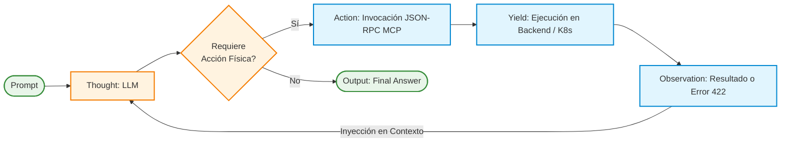

# Capítulo 5. Desarrollo del Agente Cognitivo y MCP

Mientras que el Capítulo 4 estableció los cimientos deterministas de la arquitectura, garantizando la inmutabilidad y seguridad de las operaciones mediante el patrón Hexagonal, el presente capítulo aborda el núcleo heurístico del *Agentic Deployer*. Se detalla la implementación del motor cognitivo responsable de dotar al sistema de la capacidad de comprender lenguaje natural ambiguo, razonar sobre el estado de la infraestructura y tomar decisiones de invocación de herramientas (*Tool Calling*). 

Este capítulo desgrana paso a paso la integración del estándar abierto *Model Context Protocol* (MCP), el diseño abstracto del cliente de inferencia, y la algoritmia subyacente que rige el bucle de razonamiento y acción (*ReAct*). La convergencia de estos tres pilares conforma un agente autónomo capaz de transformar la fricción operativa en una conversación fluida y segura.

## 5.1. Implementación del Servidor *Model Context Protocol* (MCP)

En las arquitecturas iniciales de Inteligencia Artificial aplicada, la capacidad de un Modelo de Lenguaje para invocar código externo se lograba mediante integraciones fuertemente acopladas (*Vendor Lock-in*). Históricamente, el orquestador debía codificar a mano la firma de las herramientas (como diccionarios JSON rígidos) y empaquetarlas bajo especificaciones privativas (como la especificación *Function Calling* nativa de la API de OpenAI). Esta práctica vulneraba el Principio de Abierto/Cerrado (letra 'O' de S.O.L.I.D.), obligando a reescribir masivamente la base de código si la universidad decidía migrar hacia un proveedor de IA alternativo, como Anthropic o un clúster de Llama-3 local.

Para superar este antipatrón arquitectónico, el sistema desarrollado adopta como estándar troncal el **Model Context Protocol (MCP)** [3], un protocolo abierto diseñado para estandarizar la forma en que los modelos fundacionales interactúan con fuentes de datos y herramientas de ejecución. El MCP actúa como una capa de abstracción universal (un *middleware* cognitivo), desacoplando por completo el catálogo de herramientas de las peculiaridades de la API del LLM subyacente.

### 5.1.1. Introspección Dinámica de Funciones (Generación de JSON Schemas)

El mayor desafío en la ingeniería de Agentes Autónomos reside en la sincronización del contrato de la herramienta. Si un ingeniero de sistemas modifica el código de la función de despliegue para exigir un nuevo parámetro (por ejemplo, `memoria_ram`), el esquema JSON que se envía al LLM debe actualizarse simultáneamente; de lo contrario, la inferencia fallará, produciendo una desincronización de estado (*Schema Drift*).

Para mitigar este riesgo, el Servidor MCP implementado en el *Agentic Deployer* (ubicado en el Contenedor B de la arquitectura C4) hace uso intensivo de técnicas de **Introspección Estática y Dinámica de Tipos**. En lugar de requerir que el programador defina los JSON Schemas manualmente, el SDK de MCP (utilizando la librería nativa `inspect` de Python) lee la firma matemática de las funciones en tiempo de ejecución.

El proceso algorítmico, detallado a continuación en pseudocódigo formal, ilustra cómo el sistema transforma una función Python pura en una representación semántica universal (*Tool Definition*) inteligible para cualquier LLM:

```text
ALGORITMO 2: Introspección Dinámica de Contratos de Herramientas

ENTRADA:
  funcion_objetivo -> Referencia en memoria a un método (ej. desplegar_app)

SALIDA:
  json_schema -> Estructura estándar JSON-RPC de Tool Calling

INICIO
    Variable esquema = NUEVO Diccionario JSON
    esquema["name"] = funcion_objetivo.obtenerNombre()
    esquema["description"] = funcion_objetivo.obtenerDocstring()
    
    // Inspección del AST (Abstract Syntax Tree)
    Variable parametros = funcion_objetivo.obtenerFirmaLexica()
    esquema["parameters"] = NUEVO Objeto Tipo(Objeto)
    
    PARA CADA (parametro, anotacion_de_tipo) EN parametros HACER
        Variable tipo_json = "string" // Por defecto
        
        // Mapeo Inyectivo de Tipos (Python -> JSON Schema)
        SI anotacion_de_tipo ES Entero ENTONCES
            tipo_json = "integer"
        SINO SI anotacion_de_tipo ES Booleano ENTONCES
            tipo_json = "boolean"
        FIN SI
        
        esquema["parameters"]["properties"][parametro] = NUEVO Diccionario(
            "type" -> tipo_json,
            "description" -> extraerDescripcion(parametro)
        )
        
        SI parametro ES obligatorio ENTONCES
            AÑADIR parametro A esquema["parameters"]["required"]
        FIN SI
    FIN PARA
    
    RETORNAR esquema
FIN
```

La adopción de este algoritmo garantiza que la base de código posea una **Única Fuente de Verdad (*Single Source of Truth*)**. El desarrollador del SIC simplemente anota sus funciones de infraestructura con *Type Hints* (ej. `puerto: int`) y *Docstrings*. El servidor MCP, al inicializarse, barre el código, extrae la semántica, genera el esquema JSON dinámico y lo inyecta en el orquestador. Esta capacidad autorreflexiva reduce la deuda técnica prácticamente a cero.

### 5.1.2. Aislamiento de Red mediante Transporte *stdio*

El estándar MCP ofrece múltiples vectores para la transmisión del protocolo JSON-RPC, siendo los más destacados *Server-Sent Events* (SSE) sobre protocolo HTTP y flujos de Entrada/Salida Estándar (*stdio*).

En un diseño de microservicios tradicional, la comunicación entre el Agente Frontend (Contenedor A) y el Servidor de Herramientas (Contenedor B) recaería intuitivamente sobre una API REST clásica. Sin embargo, en el contexto de inferencias estocásticas concurrentes, donde un bucle ReAct puede invocar decenas de herramientas por segundo para sondear el estado del sistema, la sobrecarga (*overhead*) asociada al protocolo TCP/IP (encapsulamiento de cabeceras HTTP, latencia de red de *loopback* y serialización) resulta prohibitiva.

Por esta razón, la arquitectura del *Agentic Deployer* impone una decisión de diseño restrictiva: **El canal de comunicación para el Tool Calling se restringe exclusivamente al transporte local vía `stdio`** (Standard Input / Standard Output).

Esta decisión acarrea tres beneficios arquitectónicos fundamentales para el TFM:

1. **Latencia Sub-milisegundo (Inter-Process Communication):** Al emplear `stdio`, el Agente y el Servidor MCP se comunican directamente a través de tuberías del kernel de Linux (*Pipes IPC*), evitando por completo la pila de red (OSI Layer 4-7). La invocación de una herramienta pasa de tardar ~20ms (HTTP local) a menos de ~1ms, lo cual es crítico para no interrumpir el flujo cognitivo del LLM.
2. **Superficie de Ataque Cero (Zero-Trust Network):** A diferencia de un puerto HTTP (que puede ser escaneado mediante herramientas como Nmap, o falsificado mediante *Server-Side Request Forgery*), un proceso comunicado por `stdio` no expone ningún puerto de red al sistema operativo. Es topológicamente inviable que un atacante externo invoque herramientas de infraestructura si no posee acceso al árbol de procesos padre del agente.
3. **Simplicidad de Despliegue (Sidecar Pattern):** Al no requerir balanceadores de carga internos ni certificados TLS de comunicación este-oeste, el Servidor MCP se empaqueta junto al Orquestador Cognitivo como un contenedor acoplado (*Sidecar*), asegurando que siempre que el frontend esté vivo, su catálogo de herramientas estará garantizado.

La simbiosis entre la introspección dinámica de tipos y el aislamiento a nivel de kernel convierte al Servidor MCP del proyecto en un catálogo de herramientas altamente seguro, universal e instantáneo.

## 5.2. Diseño de la Abstracción Multiproveedor y Soberanía del Dato

La vertiginosa evolución de la Inteligencia Artificial Generativa ha consolidado un mercado oligopólico liderado por grandes corporaciones tecnológicas proveedoras de inferencia en la nube (*AI-as-a-Service*). En el desarrollo de sistemas de software empresarial, acoplar el código fuente (el *Core Business*) a los kits de desarrollo de software (SDK) específicos de OpenAI, Anthropic o Google supone un riesgo inasumible de obsolescencia tecnológica y pérdida de poder de negociación.

Para garantizar la viabilidad a largo plazo del *Agentic Deployer*, el diseño del orquestador cognitivo abraza el principio de agnósticismo absoluto frente al proveedor algorítmico. Esta sección desgrana la fundamentación técnica que permite al sistema conmutar dinámicamente entre motores de inferencia dispares sin requerir recompilación, así como la implicación de este diseño en las políticas de confidencialidad de la información.

### 5.2.1. El Contrato Abstracto (Patrones *Adapter* y *Factory*)

El aislamiento del proveedor se consigue orquestando una arquitectura basada en la conjunción de dos patrones de diseño clásicos de la banda de los cuatro (GoF) [9]: el patrón **Adapter** y el patrón **Factory Method**. 

En la capa de aplicación, el orquestador (*AgentOrchestrator*) jamás invoca a la librería `openai` o a la librería `ollama`. Su comunicación se dirige exclusivamente hacia una Interfaz de Clase Base Abstracta (ABC en Python) denominada `LLMClient`. Esta interfaz establece la "Firma Matemática de la Inferencia", definiendo un contrato estricto de entrada y salida (I/O).

Para asegurar el rigor del presente documento, a continuación se formaliza el comportamiento arquitectónico esperado de este contrato mediante notación algorítmica:

```text
CONTRATO ABSTRACTO: Interfaz Cliente LLM (LLMClient)

ESTADO INTERNO:
  - historial_conversacion -> Lista estructurada de mensajes (Rol, Contenido)
  - sistema_base -> Prompt fundacional que define la personalidad y las reglas del Agente

MÉTODO abstraer_peticion (herramientas_mcp):
    ENTRADA: herramientas_mcp -> Lista de JSON Schemas (extraída del Contenedor MCP)
    SALIDA_ESPERADA: 
      - Objeto tipo RESPUESTA_TEXTO_PLANO
      - Objeto tipo INVOCACION_DE_HERRAMIENTA (ToolCall ID, Nombre, Argumentos)

    EXCEPCIONES CONTRACTUALES:
      - LANZAR LlmTimeoutError SI el proveedor excede el tiempo máximo configurado.
      - LANZAR ContextWindowExceededError SI los tokens superan el límite del modelo.
```

Basándose en este contrato formal, el sistema instancia adaptadores concretos. 
Por un lado, el adaptador `OpenAIAdapter` recibe la llamada abstracta, formatea la lista de mensajes internos siguiendo la rígida especificación de la API REST de OpenAI (`messages`, `tools`, `tool_choice`), negocia el *handshake* TLS por la red de área amplia (WAN) y serializa la respuesta JSON de vuelta al contrato.
Por otro lado, el adaptador `OllamaAdapter` realiza un proceso análogo, pero apuntando a un *socket* local o a un balanceador *on-premise*, utilizando la sintaxis abierta compatible con el ecosistema de Llama-3.

La instanciación en memoria recae sobre un patrón *Factory*. Durante la fase de inicialización (*Bootstrapping*) del contenedor web, el sistema lee una única variable de entorno de bajo nivel (ej. `LLM_PROVIDER=OLLAMA`). La clase Factory evalúa esta variable e inyecta la dependencia correcta en el Orquestador. Esta Inyección de Dependencias (DI) permite permutar el motor cognitivo con un simple reinicio del proceso físico, blindando el TFM contra cualquier futuro cambio en el panorama tecnológico de los LLM.

### 5.2.2. Soberanía del Dato en Entornos Institucionales

La abstracción multiproveedor, más allá de ser una práctica higiénica de Ingeniería del Software, responde a un requerimiento de ciberseguridad crítico en el contexto de las administraciones públicas y el sector académico: la **Soberanía del Dato** y el cumplimiento normativo (RGPD/GDPR).

El *Agentic Deployer* maneja, por su propia naturaleza operativa, información extremadamente sensible. Durante la negociación lingüística (fase heurística del bucle de ReAct), un investigador distraído podría deslizar inadvertidamente tokens de acceso a bases de datos, contraseñas de red corporativas (secretos) o direcciones IP reservadas que revelan la topología interna del Servicio de Informática. Enviar estas trazas en texto plano hacia servidores ubicados fuera de las fronteras europeas (como es el caso de los clústeres por defecto de algunas empresas americanas) constituye una vulneración de las políticas de retención de datos.

El diseño agnóstico soluciona este paradigma permitiendo la **conmutación por políticas de clasificación**:
- **Escenario de Baja Clasificación:** Para entornos de investigación pública (despliegue de servidores web estáticos o *sandboxes* de prueba sin datos sensibles), el sistema puede apuntar mediante el *Factory* a la API de OpenAI, aprovechando la velocidad de inferencia suprema y la baja latencia de la nube.
- **Escenario de Alta Clasificación (Air-Gapped):** Cuando la provisión involucra servicios confidenciales (como bases de datos sanitarias o expedientes de alumnado), el equipo de Operaciones altera la configuración del entorno para inyectar el adaptador de Ollama. Bajo esta topología, la inferencia probabilística se resuelve físicamente en servidores con aceleración GPU (Nvidia/AMD) alojados en el sótano del propio Centro de Procesamiento de Datos (CPD) de la universidad. Ni un solo token abandona la intranet institucional, garantizando la inviolabilidad del secreto sin sacrificar la interfaz agéntica natural de la que disfruta el usuario.

Esta capacidad de hibridación (Nube Pública vs *Bare-Metal* Local), resuelta elegantemente gracias a los patrones de diseño orientados a objetos, convierte al prototipo desarrollado en este TFM en una plataforma madura, auditable y, sobre todo, legalmente compatible con los estándares de gobernanza ITIL aplicados en la gran industria.

## 5.3. Bucle Cognitivo y Resiliencia Estocástica (Patrón ReAct)

La mera exposición de un catálogo de herramientas a un Modelo de Lenguaje no garantiza la ejecución autónoma de una tarea compleja. Cuando a un modelo fundacional se le instruye para que actúe en un entorno dinámico (como es un clúster de Kubernetes, cuyo estado puede mutar durante la propia inferencia), los enfoques tradicionales de Petición-Respuesta (*Zero-Shot Prompting*) fracasan abruptamente. Si el modelo asume un contexto inicial falso o comete un error sintáctico en su primer intento, carece de mecanismos intrínsecos para rectificar, desembocando en estados de fallo catastrófico (*Catastrophic Failure*).

Para dotar al *Agentic Deployer* de verdadera autonomía heurística y resiliencia ante excepciones, el orquestador implementa el patrón **ReAct (Reasoning and Acting)**, un paradigma propuesto por Yao et al. [1] en la literatura académica reciente, que sinergiza la capacidad de razonamiento discursivo con la ejecución imperativa de acciones.

### 5.3.1. Arquitectura del Bucle Incondicional de Razonamiento y Acción

El patrón ReAct altera la topología conversacional subyacente. En lugar de procesar la petición del usuario y devolver un código de respuesta monolítico, el Agente Cognitivo inicia una máquina de estados iterativa de ejecución en bucle (`while True`). Cada iteración de este bucle (*Turno Cognitivo*) obliga a la Inteligencia Artificial a transitar secuencialmente por cuatro fases inmutables:

1. **Pensamiento (*Thought*):** El modelo deduce lógicamente el siguiente paso basándose en el historial. Esta externalización del monólogo interno (derivada de las técnicas *Chain-of-Thought*) reduce matemáticamente la tasa de alucinaciones.
2. **Acción (*Action*):** El modelo invoca una función específica del catálogo MCP, inyectándole los argumentos sintácticos deducidos (ej. `deploy_intent(name="api", port=80)`).
3. **Pausa (*Yield*):** El orquestador pausa la inferencia algorítmica, toma el control del hilo de ejecución, cruza la barrera de red hacia el servidor backend, ejecuta la acción física y espera el resultado.
4. **Observación (*Observation*):** El sistema inyecta el resultado físico (ya sea un éxito o una excepción de error del sistema operativo) de vuelta en la ventana de contexto del LLM.

El modelo reevalúa el estado global tras la observación y decide si necesita ejecutar una nueva acción o si la tarea ha concluido. Cuando dictamina que el objetivo se ha cumplido, transiciona a la fase final (*Final Answer*), devolviendo el control al usuario humano.

Como se ilustra en la **Figura 4**, este proceso rompe con el paradigma de petición-respuesta estático, instaurando un flujo de retroalimentación dinámica.


<p align="center"><i><b>Figura 4:</b> Diagrama de flujo del bucle cognitivo ReAct (Reasoning and Acting).</i></p>

Para ilustrar el funcionamiento de este motor de orquestación, se formaliza a continuación su arquitectura mediante pseudocódigo:

```text
ALGORITMO 3: Bucle de Orquestación Cognitiva (ReAct Loop)

ENTRADA: 
  peticion_usuario -> Cadena de texto natural
  contexto_historico -> Memoria de la sesión actual

SALIDA: 
  respuesta_final -> Cadena de texto natural o Markdown

INICIO
    AÑADIR peticion_usuario A contexto_historico
    Variable turno_actual = 0
    Variable MAX_TURNOS = 10 // Prevención de bucles infinitos (Infinite Loop)

    MIENTRAS turno_actual < MAX_TURNOS HACER
        // 1. Inferencia del LLM (Thought + Action)
        Variable respuesta_llm = InvocacionRed(contexto_historico, herramientas_mcp)
        
        SI respuesta_llm ES texto_plano ENTONCES
            // El Agente decide que ha terminado y se dirige al humano
            RETORNAR respuesta_llm
        FIN SI

        SI respuesta_llm ES invocacion_herramienta ENTONCES
            Variable nombre_funcion = respuesta_llm.obtenerNombre()
            Variable argumentos = respuesta_llm.obtenerArgumentos()
            Variable resultado_accion
            
            INTENTAR
                // 2 y 3. Ejecución y Pausa
                resultado_accion = EjecutarProcesoLocal(nombre_funcion, argumentos)
            CAPTURAR ExcepcionHttp COMO error
                // Serialización del error para que el LLM lo entienda
                resultado_accion = error.obtenerMensajeHumano() 
            FIN INTENTAR

            // 4. Observación
            AÑADIR "Herramienta retornó: " + resultado_accion A contexto_historico
        FIN SI
        
        turno_actual = turno_actual + 1
    FIN MIENTRAS
    
    LANZAR Excepcion("Límite de razonamiento excedido. El Agente está atascado.")
FIN
```

La inclusión matemática de la constante `MAX_TURNOS` es un mecanismo de *Fail-Safe* crítico en sistemas autónomos, garantizando que un LLM confundido no agote las cuotas de facturación de la API externa (consumo masivo de tokens) iterando eternamente sobre un fallo irresoluble.

### 5.3.2. *Feedback Loop* de Seguridad y Autocorrección

El verdadero poder arquitectónico del bucle ReAct emerge en la rama `CAPTURAR ExcepcionHttp` (línea 25 del Algoritmo 3). En la topología descrita en el Capítulo 4, el núcleo Hexagonal (Backend) blinda la infraestructura arrojando errores implacables (ej. un `422 Unprocessable Entity`) cuando el agente intenta vulnerar políticas (como abrir el puerto 22).

En sistemas convencionales, esta excepción HTTP provocaría la terminación abrupta de la sesión, obligando al usuario a iniciar la tarea desde cero. Sin embargo, el *Agentic Deployer* instaura un mecanismo de resiliencia cognitiva denominado **Feedback Loop**. 

Cuando el Servidor MCP intercepta el error `422`, no detiene el orquestador. Por el contrario, inyecta la traza de la excepción directamente como una **Observación** en la memoria RAM de corto plazo del LLM.
Este flujo produce un comportamiento cibernético emergente:
1. El Agente lee que su *Action* previa fracasó por violación de puerto.
2. Su capa estocástica razona (*Thought*) que el puerto 22 está prohibido por políticas de seguridad institucionales.
3. De forma autónoma, el Agente omite lanzar una excepción al usuario. En su lugar, itera una nueva *Action*, recalculando un puerto lícito (ej. el puerto 8000), o bien genera una *Final Answer* informando diplomáticamente al usuario del rechazo técnico y solicitándole alternativas.

Este *Feedback Loop* transforma una máquina frágil (propensa a alucinaciones) en un ecosistema auto-regulado. Traslada la responsabilidad de la depuración de errores (*debugging*) desde el investigador humano hacia el propio modelo de inteligencia artificial. Así, la Arquitectura Hexagonal y el bucle ReAct no solo conviven, sino que se necesitan mutuamente: el Hexágono actúa como la jaula determinista, y el ReAct permite que el Agente rebote pacíficamente contra los barrotes hasta encontrar el *Golden Path* correcto.
