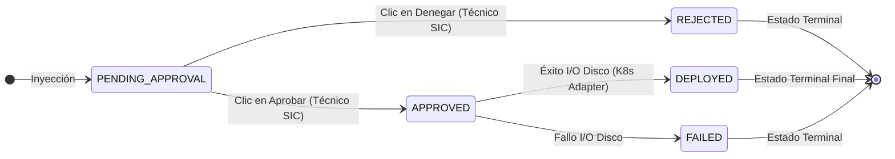
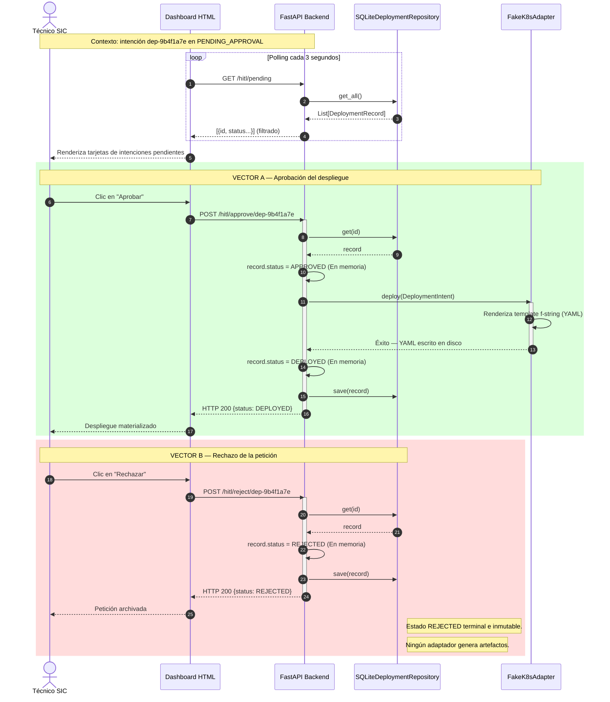

# Capítulo 6. Implementación del Patrón HITL y Gestión de Estados Finita (FSM)

El diseño cognitivo abordado en los capítulos anteriores dota al sistema de una autonomía sintáctica y deductiva sin precedentes. Sin embargo, la autonomía algorítmica total en infraestructuras críticas no es un hito de ingeniería deseable, sino un vector de vulnerabilidad. La orquestación de clústeres de contenedores en entornos productivos exige un grado de gobierno, responsabilidad legal y consciencia del contexto operativo que escapa a las capacidades matemáticas de un Modelo de Lenguaje Estocástico (LLM).

Este capítulo detalla la solución arquitectónica implementada para gobernar a la Inteligencia Artificial: el patrón *Human-In-The-Loop* (HITL). Se fundamentará teóricamente la necesidad de interponer un "cortafuegos humano" y se explicará, a nivel de diseño de software, cómo esta asimetría de autoridad se garantiza tecnológicamente mediante una Máquina de Estados Finita (FSM) inmutable y un *Dashboard* asíncrono para el equipo de operaciones.

## 6.1. Fundamentación del Patrón *Human-In-The-Loop* (HITL)

En el ámbito de la automatización de TI, la taxonomía de la autonomía se divide comúnmente en cinco niveles (inspirados libremente en los niveles de conducción autónoma de la SAE). El Nivel 0 corresponde a la ejecución manual de *scripts* Bash, mientras que el Nivel 5 (Autonomía Completa) implica un sistema de Inteligencia Artificial que monitoriza, toma decisiones y ejecuta mutaciones de red en la infraestructura productiva sin ningún tipo de supervisión biológica.

La tendencia del mercado tecnológico (*hype*) presiona hacia la consecución del Nivel 5. Sin embargo, este Trabajo de Fin de Máster defiende la tesis de que, en la gestión del *Platform Engineering* corporativo, el estándar de oro arquitectónico no es el Nivel 5, sino una automatización de Nivel 4 hiper-acelerada, fuertemente anclada al patrón **Human-In-The-Loop (HITL)**.

### 6.1.1. Los Riesgos de la Autonomía Total (Nivel 5)

Otorgar credenciales de escritura directas (ej. un token con permisos de *ClusterAdmin* en Kubernetes) a un sistema basado en redes neuronales probabilísticas introduce riesgos operativos que ninguna prueba unitaria puede mitigar. Los factores de riesgo sistémico más severos son:

1. **La Alucinación Topológica:** Los LLM, por su arquitectura de predicción del siguiente token (Arquitectura Transformer), carecen de un modelo mental fáctico del mundo real. Si el orquestador ReAct entra en un estado de confusión y deduce que la mejor forma de arreglar un error de red es borrar y recrear el `Deployment` de una base de datos en producción, el Nivel 5 ejecutaría la purga instintivamente.
2. **Elasticidad Financiera Descontrolada:** En infraestructuras desplegadas en nubes públicas (AWS, Google Cloud, Azure), los recursos computacionales se facturan por segundo de uso. Una IA operando en Nivel 5 bajo un bucle estocástico infinito podría auto-aprovisionar clústeres con decenas de GPUs, incurriendo en un gasto económico inasumible para el presupuesto de la universidad en cuestión de horas.
3. **Imprevisibilidad del Momento de Despliegue:** La Inteligencia Artificial desconoce factores socio-temporales críticos. Un agente autónomo total podría intentar aplicar un parche de seguridad un viernes a las tres de la madrugada o durante el pico de tráfico de los exámenes finales. Solo un humano posee el sentido común para prever las ventanas de mantenimiento seguras.

### 6.1.2. Responsabilidad Legal, ITIL y la Asimetría de Contexto

Más allá de la viabilidad técnica, la adopción del patrón HITL es una exigencia legal y normativa. Los marcos de buenas prácticas de la industria, como **ITIL** (*Information Technology Infrastructure Library*) [8] y los estándares ISO/IEC 27000 sobre ciberseguridad, imponen el principio de trazabilidad y responsabilidad de las acciones de red.

Desde una perspectiva jurídica, un modelo matemático (los pesos de una red neuronal almacenados en RAM) carece de personalidad jurídica. Si el *Agentic Deployer* instanciara una topología errónea que expusiera públicamente expedientes sensibles de investigadores (causando una brecha del RGPD), la responsabilidad recaería legalmente sobre el operador humano de la universidad, independientemente de que la orden original la redactase la IA.

Para solventar esta carga legal, el sistema se diseña asumiendo una **Asimetría de Contexto Triangular**, donde cada nodo asume únicamente la responsabilidad para la que está biológicamente (o algorítmicamente) optimizado:

1. **El Investigador (El "Qué"):** Aporta el conocimiento del dominio funcional ("Necesito un WordPress para el departamento de historia con una base de datos de 10 Gigabytes").
2. **La IA y el Servidor MCP (El "Cómo"):** Aportan el conocimiento abstracto de la sintaxis declarativa. Traducen el lenguaje natural a las estructuras de dominio formales de la Arquitectura Hexagonal. 
3. **El Técnico del SIC (El "Cuándo" y el "Sí"):** Aporta la autoridad corporativa y la visión holística de los recursos físicos ("La petición de la IA es sintácticamente correcta, pero los discos NVMe del clúster están al 95%, así que apruebo el despliegue pero lo demoro hasta el fin de semana").

Bajo este modelo, la IA no es un ente decisor; es un **exotraje cognitivo** (un acelerador masivo del flujo de trabajo) que reduce la jornada del ingeniero desde horas de redacción técnica y validación de sintaxis YAML, a meros segundos para auditar y presionar un botón de "Aprobar" en una interfaz visual.

## 6.2. Diseño de la Máquina de Estados Finita (FSM)

Para materializar el control del flujo operativo detallado en la sección anterior, el Backend Hexagonal no puede depender de variables booleanas frágiles (ej. `es_valido = True`). En entornos concurrentes donde múltiples operarios auditan la misma cola de despliegues, el estado de una petición de infraestructura debe gobernarse mediante una **Máquina de Estados Finita** (FSM, por sus siglas en inglés, *Finite-State Machine*).

Una FSM, fundamentada en la teoría de autómatas, es un modelo computacional matemático. Establece que una entidad solo puede existir en un estado mutuamente excluyente en un momento temporal $T$, y que los cambios entre estos estados (Transiciones) obedecen a un conjunto finito y predefinido de reglas direccionales.

### 6.2.1. Modelado del Grafo Dirigido Acíclico (DAG)

En la arquitectura del *Agentic Deployer*, el ciclo de vida de una `DeploymentIntent` (la intención generada por la IA) se modela formalmente como un **Grafo Dirigido Acíclico (DAG)**. El carácter "acíclico" es una condición *sine qua non* de la seguridad del sistema: matemáticamente, es imposible que el estado de una petición fluya hacia atrás en el tiempo. Una vez que una orden es procesada físicamente por el clúster de Kubernetes, el registro no puede revertir a su estado de pendencia.

Los vértices de este grafo (Estados) y sus aristas dirigidas (Transiciones Autorizadas) se definen de la siguiente manera:

- **Nodo Raíz (`PENDING_APPROVAL`):** Es el punto de inyección inicial. Cuando el agente de IA formula una petición válida y el `SecurityContextValidator` (Capítulo 4) la admite en el servidor, esta ingresa obligatoriamente en este nodo de cuarentena. Ningún proceso de despliegue físico se activa desde este estado.
- **Nodo de Sumidero A (`REJECTED`):** Estado terminal e inmutable. Si el Técnico del SIC presiona el botón de denegación en el *Dashboard*, la petición transiciona aquí. Permanece en la base de datos de manera indefinida con propósitos de auditoría legal (Log de Intentos Denegados), pero es ignorada por el *garbage collector* y los adaptadores de infraestructura.
- **Nodo de Tránsito (`APPROVED`):** Estado intermedio y volátil. Cuando el humano autoriza la operación, la petición ingresa a este nodo durante un lapso minúsculo. Actúa como el desencadenante imperativo (*Trigger*) para excitar al adaptador de red secundario (`FakeK8sAdapter` o `RealK8sAdapter`).
- **Nodo de Sumidero B (`DEPLOYED`):** Estado terminal final. Solo se alcanza si, y solo si, la intención superó el nodo `APPROVED` y la API de Kubernetes confirma que los manifiestos YAML han sido guardados sin errores de persistencia en disco.

La única entidad del universo físico con autoridad criptográfica y de red para empujar un registro desde el Nodo Raíz a los Nodos Secundarios es el Técnico Humano portador de la sesión de operaciones en el *Dashboard*. Este flujo unidireccional y acíclico se representa visualmente en la **Figura 9**.


<p align="center"><i><b>Figura 12:</b> Grafo Dirigido Acíclico (DAG) que rige la Máquina de Estados Finita (FSM) del sistema.</i></p>

### 6.2.2. Prevención de Concurrencia y *Race Conditions*

La implementación de este FSM mediante Python y el *framework* asíncrono FastAPI presenta un desafío clásico de Sistemas Operativos Distribuidos: la prevención de Condiciones de Carrera (*Race Conditions*).

Imaginemos un escenario concurrente: Una petición se encuentra en `PENDING_APPROVAL`. Por un problema de latencia en la red Wi-Fi, el Técnico de Operaciones hace doble clic rápidamente sobre el botón "Rechazar" en su interfaz, o peor aún, dos operarios de distintos turnos, visualizando el mismo panel, deciden pulsar simultáneamente los botones de "Aprobar" y "Rechazar" en milisegundos idénticos.

Sin una salvaguarda arquitectónica, estas peticiones paralelas podrían colisionar en la memoria volátil del servidor, resultando en un estado de Schrödinger donde el sistema intenta desplegar y denegar el mismo registro al mismo tiempo, fracturando el estado del clúster de Kubernetes.

Para neutralizar este vector, la transición entre vértices del DAG se blinda mediante algoritmos de comprobación atómica (*Test-and-Set* lógicos) o mecanismos de **Optimistic Locking** (Bloqueo Optimista). A continuación se expone la fundamentación algorítmica de esta defensa en el núcleo Hexagonal:

```text
ALGORITMO 4: Transición Inmutable de la Máquina de Estados (FSM_Transition)

ENTRADA:
 id_peticion -> UUID del registro a transicionar
 nuevo_estado -> El estado de destino (APPROVED o REJECTED) solicitado por el Humano

SALIDA:
 Registro_Actualizado (Si la transición es lícita)
 LANZA HttpConflictError (409) si hay violación de estado

INICIO
  // 1. Adquisición y comprobación (Atomicidad)
  Variable registro = ObtenerRegistroMemoria(id_peticion)
  
  SI registro ES NULO ENTONCES
    LANZAR HttpNotFoundError(404)
  FIN SI

  // 2. Control Invariante del DAG: Solo se muta desde PENDING_APPROVAL
  SI registro.estado NO ES IGUAL A "PENDING_APPROVAL" ENTONCES
    LANZAR HttpConflictError(
      409, 
      "Conflicto de Mutación. El registro ya había sido procesado previamente " +
      "(Estado Actual: " + registro.estado + ")."
    )
  FIN SI
  
  // 3. Mutación del Estado mediante el Repositorio (Bloqueo Atómico)
  registro.estado = nuevo_estado
  registro.fecha_modificacion = ObtenerTiempoSistemaActual()
  
  // 4. Activación de Adaptadores Secundarios (Side-Effects)
  SI nuevo_estado ES IGUAL A "APPROVED" ENTONCES
    INTENTAR
      K8sAdapter.ejecutar_despliegue(registro.intencion)
      registro.estado = "DEPLOYED" // Segunda transición
    CAPTURAR ExcepcionIO COMO error
      registro.estado = "FAILED"
    FIN INTENTAR
  FIN SI
  
  RETORNAR registro
FIN
```

Gracias a este algoritmo determinista, si ocurre una pulsación doble, el primer *thread* (hilo de ejecución HTTP) cruzará el bloque de la Línea 18 y mutará la base de datos a `REJECTED`. El segundo *thread*, desfasado por milisegundos, evaluará la condición invariante de la Línea 18, detectará que el estado ya no es `PENDING_APPROVAL`, y abortará la transacción devolviendo inmediatamente un error `409 Conflict` a la capa frontal. 

Esta rigurosidad garantiza que, a los ojos de la universidad, el *Agentic Deployer* posea la misma inmutabilidad transaccional (*ACID properties*) que un sistema bancario transaccional, eliminando de raíz la estocasticidad que rodea a los sistemas de IA.

## 6.3. El Dashboard Asíncrono de Operaciones

La implementación efectiva del patrón *Human-In-The-Loop* requiere una separación tajante de las Experiencias de Usuario (UX). El Investigador, que interactúa en la frontera cognitiva del sistema, requiere un entorno conversacional y tolerante a la ambigüedad (Streamlit). Por el contrario, el Técnico de Operaciones (SIC) no debe negociar con el Modelo de Lenguaje; su flujo de trabajo exige una interfaz de control visual, tabular, determinista y de baja latencia.

Para satisfacer esta dicotomía, se ha diseñado un segundo portal de acceso independiente del orquestador de IA: el **Dashboard de Operaciones** (`dash.html`), concebido arquitectónicamente como una *Single-Page Application* (SPA) ligera, servida directamente por el Backend Hexagonal de FastAPI.

### 6.3.1. Estrategia de Sincronización: *Polling* Ligero vs. *WebSockets*

El reto técnico subyacente en el diseño del *Dashboard* es la sincronización del estado. Las peticiones de despliegue generadas por la IA no obedecen a un patrón predecible; ingresan en el sistema en ráfagas asíncronas, dependiendo del horario de investigación de la comunidad universitaria.

En arquitecturas web modernas fuertemente acopladas al tiempo real (como aplicaciones de *Trading* o videojuegos), el estado del servidor suele transmitirse al cliente mediante conexiones bidireccionales persistentes (Protocolo *WebSocket*, ws://). Sin embargo, mantener cientos de hilos *WebSocket* abiertos de manera perpetua entre el *Dashboard* y el clúster perflila un sobrecoste de memoria y gestión de concurrencia injustificado para un sistema de auditoría asíncrona, en el cual un retraso de 3 segundos en la visualización no reviste criticidad operacional.

Consecuentemente, el TFM implementa una estrategia de **Polling Activo Ligero**. El *Dashboard* ejecuta bucles temporizados desde el navegador del técnico utilizando llamadas `fetch` nativas de JavaScript:

1. **Interrogación Constante:** El cliente invoca el endpoint `GET /hitl/pending` a intervalos regulares (ej. cada 5.000 milisegundos).
2. **Procesamiento Eficiente y Transaccional:** El *Backend* delega la lectura de las intenciones pendientes en el repositorio local (SQLite). Mediante consultas estructuradas, este enfoque garantiza persistencia ACID y consistencia frente a reinicios inesperados, manteniendo el *overhead* al mínimo en el contexto del prototipo.
3. **Inyección Dinámica:** El cliente recibe el *payload* JSON y reconstruye dinámicamente el Document Object Model (DOM), renderizando tarjetas visuales (*Cards*) para cada petición entrante.

Esta arquitectura desacoplada (*Stateless* en la capa de transporte) favorece la resiliencia del sistema. Si el portátil del Técnico de Operaciones pierde conectividad Wi-Fi, el estado del *Backend* permanece intacto; al recuperar la conexión, el siguiente ciclo de *polling* rehidratará el *Dashboard* con las peticiones acumuladas durante la ventana de desconexión.

### 6.3.2. Ejecución Diferida y Materialización del Código Declarativo

La fase final del ciclo de vida del *Agentic Deployer* ocurre cuando el factor biológico colisiona con el *Backend* físico. El *Dashboard* expone visualmente los atributos inmutables de la intención extraída por la IA (UUID de rastreo, Imagen base a desplegar, Puerto de red y Cuotas de recursos CPU/RAM).

Junto a esta tabla de datos puros, se exponen dos vectores de mutación REST:
- El botón **"Rechazar"**: Ejecuta un `POST /hitl/reject/{id}`, desencadenando el estado `REJECTED` en la Máquina de Estados (sección 6.2). La petición queda archivada indefinidamente con fines de auditoría legal pero no genera ningún artefacto de infraestructura.
- El botón **"Aprobar"**: Ejecuta un `POST /hitl/approve/{id}`. Esta es la llamada más crítica de toda la infraestructura.

Cuando el técnico invoca la aprobación, el ciclo asíncrono concluye y el sistema recupera la naturaleza imperativa bloqueante (*Synchronous Blocking*). El *Backend* despierta la intención retenida y se la inyecta al Adaptador de Red Secundario (el `DeployPort`).

Como se definió en los esquemas *Golden Path* (Capítulo 4), en este preciso milisegundo el Adaptador toma el control. El objeto Python abstracto se mapea contra un motor de interpolación de cadenas basado en **f-strings** y la utilidad estándar `textwrap.dedent` de Python, produciendo estructuras de datos YAML puras. Finalmente, estas cadenas de texto se vuelcan sobre los volúmenes del sistema operativo mediante operaciones I/O del kernel (ej. `open(filepath, 'w')`), materializando físicamente el archivo `{name}.yaml`.

La generación de este archivo en disco (o su envío directo a la API de Kubernetes) confirma que la Inteligencia Artificial, inicialmente un ente discursivo estocástico, ha logrado cristalizar su razonamiento lingüístico en un activo corporativo inmutable, habiendo sorteado con éxito las barreras matemáticas del `SecurityContextValidator` y el escrutinio ético del *Human-In-The-Loop*.

### 6.3.3. Diagrama de Secuencia del Flujo HITL

La **Figura 10** complementa el diagrama E2E global (Figuras 5, 6 y 7, Cap. 4.5) con un foco específico en la interacción entre el Técnico SIC y el Backend durante la fase de decisión. Se ilustran explícitamente los dos vectores de mutación posibles (aprobación y rechazo) y las transiciones de estado intermedias de la FSM, incluyendo la materialización del YAML por `FakeK8sAdapter` únicamente en el camino de aprobación.


<p align="center"><i><b>Figura 13:</b> Diagrama de Secuencia del flujo HITL: polling del Dashboard, vector de aprobación (PENDING → APPROVED → DEPLOYED) y vector de rechazo (PENDING → REJECTED). La materialización del YAML ocurre exclusivamente en el Vector A.</i></p>

## 6.4. Canal de Retorno al Investigador: Notificación Asíncrona del Estado

Una brecha de usabilidad inherente al patrón HITL clásico es la **asimetría informacional**: el Técnico SIC conoce en todo momento el estado de las peticiones a través del Dashboard (sección 6.3), pero el investigador, una vez recibida la confirmación de `PENDING_APPROVAL` del agente, queda en un estado de incertidumbre. No sabe cuándo (ni si) su solicitud ha sido aprobada, rechazada o desplegada.

Esta sección documenta el diseño e implementación del **canal de retorno al investigador**: el mecanismo bidireccional que cierra el ciclo de comunicación y permite al investigador consultar el estado de sus solicitudes directamente desde la interfaz conversacional.

### 6.4.1. Diseño del Endpoint de Consulta de Estado

Se ha incorporado un nuevo endpoint `GET /hitl/status/{deployment_id}` en el `BackendAPI`, diseñado específicamente como **canal orientado al investigador** (a diferencia de `/hitl/pending`, orientado al técnico):

```text
RUTINA: Consulta de Estado de Despliegue (Endpoint REST)

ENDPOINT: GET /hitl/status/{id_despliegue}
ENTRADA: id_despliegue -> Cadena de texto (ej. "dep-1a2b3c")
SALIDA: RespuestaEstado (id, estado, mensaje_contextual)

INICIO
  Variable registro = RepositorioBD.obtener(id_despliegue)
  SI registro ES Nulo ENTONCES
    ABORTAR CON ExcepcionHttp(404, "Despliegue no encontrado")
  FIN SI

  // Mapeo semántico del estado técnico (FSM) a lenguaje natural
  Variable mensajes = NUEVO Diccionario(
    "PENDING_APPROVAL" -> "Su solicitud está en cola, pendiente de revisión por el técnico SIC.",
    "APPROVED" -> "El técnico SIC ha aprobado su solicitud. Despliegue en curso.",
    "DEPLOYED" -> "Su servicio ha sido desplegado exitosamente.",
    "REJECTED" -> "El técnico SIC ha rechazado esta solicitud.",
    "FAILED" -> "El despliegue ha encontrado un error técnico en el clúster."
  )
  
  Variable mensaje_contextual = mensajes[registro.estado_fsm]
  RETORNAR NUEVO RespuestaEstado(registro.id, registro.estado_fsm, mensaje_contextual)
FIN
```

La respuesta incluye el estado actual de la FSM junto con un **mensaje de texto contextual** adaptado a cada estado, de modo que el investigador recibe información comprensible sin necesidad de conocer la nomenclatura técnica de la máquina de estados.

### 6.4.2. Panel de Notificaciones en el Frontend (Streamlit)

La interfaz conversacional (`chat_app.py`) implementa un panel pasivo de seguimiento que se activa automáticamente cuando el agente registra una solicitud con estado `PENDING_APPROVAL`. El mecanismo opera en tres fases:

**1. Extracción automática del ID de seguimiento:**

Tras cada respuesta del agente, el frontend aplica una expresión regular sobre el texto de respuesta para detectar identificadores de deployment del patrón `dep-[a-f0-9]{7,8}`. Si se detecta uno asociado a un estado pendiente, se añade a la lista `session_state.pending_deployments`:

```text
RUTINA: Extracción de Identificadores (Frontend HITL)

ENTRADA: texto_respuesta -> Respuesta generada por el Agente Cognitivo
ESTADO: panel_pendientes -> Lista de IDs mostrados en la interfaz gráfica

INICIO
  // Buscar expresiones regulares de la forma "dep-XXXXXXX"
  Variable id_detectado = ExpresionRegular("dep-[a-f0-9]{7,8}").buscarEn(texto_respuesta)
  
  SI id_detectado EXISTE Y texto_respuesta CONTIENE "PENDING" ENTONCES
    AÑADIR id_detectado A panel_pendientes
  FIN SI
FIN
```

**2. Panel de seguimiento persistente:**

Mientras existan deployments pendientes en `session_state`, el panel " Mis Solicitudes Pendientes" se renderiza en la parte inferior del chat. Por cada solicitud, el investigador dispone de un botón **" Actualizar"** que realiza una llamada `GET /hitl/status/{id}` al backend y muestra el resultado en un badge de color semántico:

| Estado FSM | Color | Mensaje para el investigador |
|---|---|---|
| `PENDING_APPROVAL` | Amarillo | "Su solicitud está en cola, pendiente de revisión." |
| `APPROVED` | Azul | "El técnico ha aprobado. Despliegue en curso." |
| `DEPLOYED` | Verde | "Su servicio ha sido desplegado exitosamente." |
| `REJECTED` | Rojo | "Solicitud rechazada. Contacte con el SIC." |
| `FAILED` | Rojo | "Error técnico. El equipo SIC ha sido notificado." |

**3. Cierre automático del ciclo:**

Cuando el estado devuelto es terminal (`DEPLOYED`, `REJECTED` o `FAILED`), el deployment se elimina de la lista de seguimiento y el agente inyecta automáticamente un mensaje de notificación en el historial del chat, informando al investigador del resultado final sin que este tenga que preguntar activamente.

### 6.4.3. Justificación de Diseño: Polling Explícito frente a Notificaciones *Push*

La alternativa técnica más evidente sería un sistema de notificaciones *push* (correo electrónico o *webhook*). Esta aproximación fue deliberadamente descartada para el prototipo por las siguientes razones arquitectónicas:

1. **Dependencias externas no justificadas:** Un servidor SMTP o un broker de mensajería (Kafka, RabbitMQ) añadiría complejidad de infraestructura que excede el alcance del prototipo y dificulta la reproducibilidad en entornos académicos.
2. **Coherencia con el modelo de polling del Dashboard:** El técnico ya opera bajo un modelo de polling (sección 6.3.1). Mantener el mismo paradigma en el canal del investigador simplifica el modelo mental del sistema y su testing.
3. **Extensibilidad:** El endpoint `GET /hitl/status/{id}` es una interfaz pura REST que puede ser consumida por cualquier sistema externo (correo electrónico, Telegram Bot, Slack Webhook) en una evolución futura sin modificar la lógica del backend (principio de Segregación de Interfaces).

Este diseño cierra el ciclo del patrón HITL, transformándolo de un mecanismo **unidireccional** (investigador → técnico) en un canal **bidireccional** (investigador → técnico → investigador), donde ambos actores disponen de la información necesaria para realizar su rol dentro del flujo de gobierno de la infraestructura.
