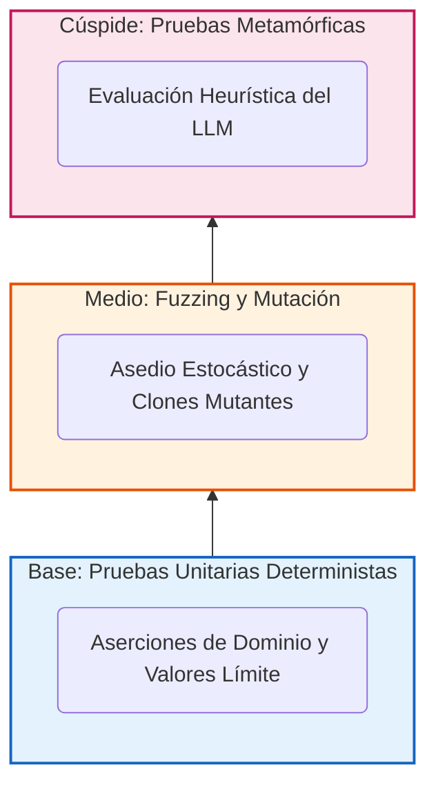

# Capítulo 7. Aseguramiento de Calidad (QA) y Testing Avanzado

La integración de Modelos de Lenguaje Grandes (LLM) en la orquestación de infraestructuras corporativas fractura los paradigmas tradicionales de Ingeniería de Pruebas (*Software Testing*). En el desarrollo de software convencional, la función matemática $f(x)$ siempre retorna $y$. Sin embargo, en un sistema agéntico estocástico, el mismo estímulo (el mismo *prompt*) puede generar resultados sintácticamente dispares dependiendo de la semilla de inferencia (*seed*) o de la temperatura del modelo.

Para garantizar la estabilidad matemática del *Agentic Deployer*, este Trabajo de Fin de Máster propone y ejecuta una pirámide de pruebas heterogénea y agresiva. Este capítulo desglosa la estrategia de Aseguramiento de Calidad (QA), comenzando por las pruebas unitarias deterministas que protegen la Arquitectura Hexagonal, escalando hacia el bombardeo estocástico mediante *Property-Based Testing* (Hypothesis), auditando la propia red de pruebas mediante *Mutation Testing* (Mutmut), y culminando con la aplicación del incipiente paradigma de las Pruebas Metamórficas para acorralar las alucinaciones de la Inteligencia Artificial, inspirándose en el modelo fundacional de la Pirámide de Pruebas propuesto por Mike Cohn [27].


<p align="center"><i><b>Figura 14:</b> Arquitectura de la Pirámide Híbrida de Testing implementada en el Agentic Deployer, adaptando el modelo clásico a las exigencias de la Inteligencia Artificial Generativa.</i></p>

## 7.1. Pruebas de Dominio e Integración: Validando la Jaula Hexagonal

La base fundamental de la pirámide de aseguramiento de calidad reside en la Capa de Dominio. Como se justificó en el Capítulo 4, la Inteligencia Artificial actúa como un usuario externo sin privilegios; su capacidad para influir en la infraestructura está supeditada a la robustez del `SecurityContextValidator` y a los invariantes matemáticos impuestos por las entidades de Pydantic. 

En consecuencia, el primer objetivo de QA es asegurar que esta "jaula hexagonal" es altamente resiliente antes de conectarla al motor de IA. Esta fase se ejecuta mediante técnicas de **Testing Unitario (*White-Box Testing*)** aisladas, ejecutadas localmente a través del *framework* `pytest`.

### 7.1.1. Análisis de Valores Límite y Clases de Equivalencia

El diseño de los casos de prueba no obedece a un sondeo aleatorio, sino a la aplicación estricta de dos técnicas formales de pruebas de caja blanca: el Análisis de Valores Límite (*Boundary Value Analysis*) y la partición de Clases de Equivalencia.

El contrato de la entidad `DeploymentIntent` dictamina que el atributo `port` debe ser numérico y estar contenido en el rango $[1, 65535]$. Asimismo, la lógica de negocio prohíbe el uso de puertos privilegiados (menores a 1024). Para auditar este contrato, la batería de pruebas somete al objeto a los siguientes vectores de asalto:

1. **Particiones Válidas (Happy Path):** Instanciación de intenciones de despliegue con puertos intermedios (ej. 8080 o 3000) e imágenes provenientes de repositorios confiables (ej. `harbor.universidad.edu/nginx:1.20`). El sistema aserta que la excepción de seguridad NO es lanzada.
2. **Valores Límite Inferiores (Vulnerabilidad de Root):** Se inyecta intencionalmente el puerto `1023` y el puerto `22`. Se aserta computacionalmente que el sistema lanza de manera síncrona el error de violación de políticas, abortando el flujo de ejecución.
3. **Valores Límite Superiores y Desbordamientos (Integer Overflow):** Se instancian peticiones con los puertos `65535`, `65536` y puertos de valor negativo (`-80`). El *framework* de pruebas debe asegurar que el Dominio colapsa de forma controlada (`ValueError`) antes incluso de invocar a los validadores de seguridad, demostrando la eficacia del principio *Fail-Fast*.

### 7.1.2. Pruebas Negativas de Prevención de Deriva (*Configuration Drift*)

Junto a la topología de red, el segundo vector de riesgo es la inyección de configuraciones inestables. Las pruebas de integración del sistema asedian al `SecurityContextValidator` para auditar la regla de prohibición de la etiqueta `:latest` en las imágenes de contenedores.

La batería de *Testing* ejecuta simulaciones inyectando intenciones sintácticamente engañosas, como `ubuntu:latest`, `nginx:LATEST` o el uso de imágenes implícitas (por ejemplo, proporcionar `redis` asumiendo que el clúster inferirá el *tag*). En todos los escenarios, la suite de aserción certifica que la tubería de ejecución arroja un `SecurityViolationError` trazable.

Esta capa base de pruebas (de ejecución sub-milisegundo) actúa como el cimiento matemático. Demuestra, con una cobertura de código del 100% sobre el módulo Hexagonal, que el *Backend* es determinista y se comporta exactamente igual que una cerradura criptográfica: sin la llave correcta (una petición válida que cumpla con ITIL y las normativas universitarias), el paso físico a la infraestructura es sistemáticamente bloqueado, sin importar cuán persuasivo o agresivo sea el *prompt* originado por el Modelo de Lenguaje.

### 7.1.3. Pruebas de la Capa de Consulta de Estado (Canal del Investigador)

Tras la implementación del endpoint `GET /hitl/status/{id}` (sección 6.4.1), se añadió un módulo de integración específico (`test_status_endpoint.py`) para validar el canal de retorno al investigador. Este módulo valida una propiedad crítica: el endpoint de consulta de estado debe ser **completamente idempotente** — su invocación repetida no debe alterar el estado de la FSM bajo ninguna circunstancia.

La batería de pruebas cubre seis escenarios:

| Test | Comportamiento validado |
|---|---|
| `test_unknown_id_returns_404` | Un ID inexistente retorna `HTTP 404` con mensaje descriptivo |
| `test_pending_approval_returns_correct_status` | Un deployment recién creado retorna `PENDING_APPROVAL` con mensaje contextual |
| `test_deployed_status_after_approval` | Tras `POST /hitl/approve/{id}`, el estado refleja `DEPLOYED` |
| `test_rejected_status_after_rejection` | Tras `POST /hitl/reject/{id}`, el estado refleja `REJECTED` |
| `test_response_includes_deployment_metadata` | La respuesta incluye `name`, `image` y `port` correctos |
| `test_status_endpoint_does_not_mutate_state` | 3 llamadas consecutivas mantienen `PENDING_APPROVAL` inalterado |

El último test es el más crítico desde el punto de vista de la integridad del sistema: garantiza que la operación de *lectura* del canal del investigador no interfiere con la *escritura* exclusiva del canal del técnico SIC (el dashboard), preservando la separación de responsabilidades entre ambas interfaces de usuario.

### 7.1.4. Quality Gates y Umbrales de Código Estático

Para garantizar que la mantenibilidad y calidad del proyecto no se degrade durante futuras evoluciones, la canalización de integración continua (`run_tests.sh`) actúa como un *Quality Gate* estricto mediante la aplicación de análisis estático en el archivo de configuración `pyproject.toml`. 

Se han configurado dos umbrales infranqueables que rompen la integración en caso de incumplimiento:
1. **Complejidad Ciclomática (McCabe):** Se ha establecido un límite máximo de complejidad `C901 = 15` a través del linter *Ruff*. Aunque la formulación original de McCabe [26] proponía un límite de 10, los estándares de ingeniería modernos (como *SonarQube*) recomiendan un límite pragmático de 15 para acomodar construcciones sintácticas actuales (como gestores de contexto y *match/case*) sin generar falsos positivos. Este umbral garantiza que ninguna función contenga un exceso de ramas lógicas, obligando arquitectónicamente a la refactorización y asegurando código limpio y auditable.
2. **Cobertura de Código Pragmática:** Se exige una cobertura mínima del 80% (`--cov-fail-under=80`). En consonancia con las directrices de ingeniería de gigantes tecnológicos como Google [25], se rechaza la persecución artificial del 100% de cobertura. Alcanzar el 100% a menudo fomenta la escritura de pruebas triviales que no aportan seguridad real lógica, creando una falsa sensación de inmunidad. El umbral del 80% garantiza que el núcleo de negocio está férreamente protegido, dejando margen para ignorar deliberadamente *boilerplates* o pegamento de *frameworks* cuya evaluación no aporta valor académico ni de negocio.

## 7.2. Property-Based Testing: Asedio Estocástico

El Testing Unitario clásico (pruebas basadas en ejemplos) adolece de un sesgo cognitivo inevitable: el desarrollador humano diseña las aserciones pensando en los caminos lógicos que él mismo programó. En ecosistemas orquestados por Inteligencia Artificial, donde la entrada de datos (el JSON generado por el LLM) es altamente impredecible, este enfoque de caja blanca es matemáticamente insuficiente.

Para escalar la resistencia de la Arquitectura Hexagonal y garantizar que ninguna alucinación excéntrica pueda desbordar la base de datos o tumbar el hilo principal de ejecución, este TFM incorpora el paradigma del **Property-Based Testing** (Pruebas Basadas en Propiedades). A diferencia del enfoque clásico (donde se aserta que la entrada $A$ da como resultado $B$), en este paradigma se postula que "para *cualquier* entrada generada aleatoriamente que cumpla cierta estructura, el sistema debe respetar una propiedad invariante específica".


### 7.2.1. Inyección de Entropía Estocástica y Fuzzing

La integración empírica de este paradigma se ha materializado haciendo uso de la librería científica `Hypothesis` [6]. Este *framework* actúa como un motor de **Fuzzing Dinámico**: en lugar de ejecutar el test una sola vez, somete la función a cientos o miles de iteraciones en milisegundos, inyectando "entropía" (dominios no autorizados en el registro de imágenes, solicitudes de RAM desorbitadas por encima de la cuota departamental, e inyección de secretos como `DB_PASSWORD` en los diccionarios de entorno).

A nivel algorítmico, el procedimiento de prueba que defiende al núcleo `DeploymentIntent` adopta la siguiente forma estructural:

```text
ALGORITMO 5: Property-Based Test para Invariantes Hexagonales (Fuzzing)

PROPIEDAD_A_DEFENDER: "Cualquier intento de inyectar cadenas vacías o puertos 
ilegales debe colapsar en un error controlado, JAMÁS en un Kernel Panic 
o corrupción de memoria."

INICIO
  // Generador de Entropía (Estrategias de Hypothesis)
  Variable cadena_basura = Estrategia.Cadenas(min_size=0, max_size=1000000, chars=UNICODE)
  Variable puerto_basura = Estrategia.Enteros(min_value=-99999, max_value=99999)

  PARA CADA (nombre, puerto) INYECTADO POR EL GENERADOR HACER
    INTENTAR
      Variable intencion = NUEVO DeploymentIntent(name=nombre, port=puerto)
      
      // Aserción Matemática 1: Si no saltó error, los datos DEBEN ser válidos
      ASERTAR (longitud(intencion.name) > 0)
      ASERTAR (intencion.port ESTA_EN_RANGO [1, 65535])

    CAPTURAR ValidationError
      // Comportamiento Esperado: El núcleo bloqueó la basura estocástica.
      PASAR
    CAPTURAR CUALQUIER_OTRA_EXCEPCION COMO error_critico
      // Aserción Matemática 2: No debe haber errores no controlados.
      FALLAR_TEST(
        "Inestabilidad Crítica: El sistema no controló una entrada masiva. " +
        "Detalle de la entropía letal: " + error_critico
      )
    FIN INTENTAR
  FIN PARA
FIN
```

Mediante este asedio algorítmico, el sistema se enfrenta a mutaciones que un programador jamás probaría manualmente (por ejemplo, intentar desplegar un contenedor cuyo nombre sea una novela entera de 1 millón de caracteres o intentar asignar el puerto $-42$). El éxito en estas pruebas avala que el *Frontend* puede estar completamente expuesto a las decisiones del LLM, ya que el sistema absorbe el impacto de las anomalías de manera elegante.

### 7.2.2. Minimización Algorítmica de Fallos (*Shrinking*)

Uno de los aportes más avanzados de esta técnica es su capacidad de diagnóstico inteligente. Cuando el motor estocástico encuentra una combinación de datos (un contraejemplo) que rompe la propiedad invariante, no detiene inmediatamente la ejecución para mostrar una cadena ininteligible de miles de caracteres generados al azar. 

El *framework* entra automáticamente en una fase de optimización conocida como **Minimización (*Shrinking*)**. Utilizando algoritmos de reducción de grafos y búsqueda binaria, el motor comienza a podar la entrada maliciosa iterativamente. Reduce el tamaño de los enteros, acorta las cadenas de texto y elimina los caracteres especiales hasta aislar la causa raíz atómica más simple que es capaz de reproducir el mismo fallo.

Esta característica es fundamental para la ingeniería forense del TFM. Si la IA descubre por casualidad un vector de ataque enviando un JSON con una imagen de contenedor ofuscada con cientos de variables de entorno inyectadas, el algoritmo de *shrinking* aislará el subcomponente léxico exacto que causó la brecha, proveyendo al equipo de seguridad de la universidad del **contraejemplo mínimo indispensable** (por ejemplo, el carácter nulo `\0`) para corregir la falla en el código de forma quirúrgica.

## 7.3. Auditoría de la Suite de Pruebas: *Mutation Testing*

En la Ingeniería de Software tradicional, la métrica estándar para evaluar la robustez de un sistema es la "Cobertura de Código" (*Code Coverage*). Sin embargo, alcanzar un 100% de cobertura únicamente certifica que una línea de código ha sido ejecutada durante el test, pero no garantiza empíricamente que las aserciones subyacentes sean correctas o que estén detectando anomalías lógicas. En sistemas críticos de infraestructura, confiar ciegamente en la métrica de cobertura constituye una negligencia técnica.

Para auditar la calidad real de las pruebas unitarias y de propiedades desarrolladas en el *Agentic Deployer*, se ha incorporado un paradigma avanzado conocido como **Mutation Testing** (Pruebas de Mutación), implementado tecnológicamente mediante la librería `mutmut`. 

El axioma fundamental de este paradigma no es buscar fallos en el código de producción, sino responder a una pregunta meta-analítica: *"¿Si introduzco deliberadamente un bug crítico en mi código fuente, serán mis tests capaces de detectarlo y fallar?"*

### 7.3.1. Generación de Clones Mutantes en Tiempo de Ejecución

El proceso de *Mutation Testing* interviene a nivel del Árbol de Sintaxis Abstracta (AST) de Python. Durante la ejecución de la auditoría, el *framework* genera dinámicamente decenas de clones del código fuente original. Cada clon (denominado "Mutante") contiene una leve alteración matemática o lógica respecto al original.

Por ejemplo, si la regla de seguridad del `SecurityContextValidator` dicta que el puerto debe ser mayor o igual a 1024, el código fuente original adopta la forma:
`SI puerto < 1024 ENTONCES LANZAR Error`

El motor de mutación iterará sobre este fragmento y generará clones inyectando vulnerabilidades silenciosas:
- **Mutante 1 (Alteración Operacional### 7.3.2. Evaluación de Supervivencia (*Killed* vs *Survived*)

Una vez generado el ejército de clones mutantes, el *framework* ejecuta la suite de pruebas completa (escrita en `pytest`) contra cada uno de los mutantes, uno por uno. El resultado de esta batalla computacional se clasifica en dos estados excluyentes:

1. **Mutante Asesinado (*Killed*):** Si la suite de pruebas fracasa (es decir, una aserción estalla en rojo) tras ejecutar un clon, significa que la prueba ha detectado exitosamente la intrusión del *bug*. El mutante es eliminado. Este es el comportamiento deseado, indicando que la red de seguridad del TFM es hermética.
2. **Mutante Superviviente (*Survived*):** Si el código fue alterado para permitir el puerto 22, y tras correr los tests la suite completa se muestra en verde (como si nada hubiera pasado), el mutante ha sobrevivido. Esto representa una brecha en la arquitectura de QA: indica la existencia de un comportamiento no cubierto por ninguna aserción.

### 7.3.3. Resultados Empíricos de la Auditoría (Tabla 2)

La siguiente tabla recoge los resultados reales de la ejecución de `mutmut` sobre el proyecto, con la configuración definida en `test_mutmut.ini` (scope: `app/application/` y `app/domain/`).

**Tabla 2. Resultados del Mutation Testing por módulo.**

| Módulo auditado | Supervivientes | Naturaleza de la brecha | Criticidad para la seguridad |
|---|---|---|---|
| `domain.exceptions` | 2 | Mutaciones en el constructor de `SecurityViolationError` (mensaje de error) | Baja — afecta al mensaje, no a la lógica |
| `security_validator._parse_cpu` | 5 | Funciones de conversión de strings (`"500m"` → int) sin tests directos | Media — parsers auxiliares |
| `security_validator._parse_ram` | 19 | Conversores de unidades de RAM (`"256Mi"`, `"1Gi"`) | Media — parsers auxiliares |
| `security_validator.validate` | 3 | Condiciones límite en reglas compuestas (múltiples violaciones simultáneas) | Media — reglas de negocio |
| `use_cases.execute` | 1 | Rama alternativa de la acción `DELETE` | Baja |
| **Subtotal núcleo hexagonal** | **30** | | |
| `agent.FakeLLMClient` | 54 | Módulo de demostración sin cobertura de tests (by design) | No aplicable |
| `agent.AgentOrchestrator` | 45 | Lógica cognitiva: testar código LLM-dependiente con aserciones deterministas es conceptualmente inviable | No aplicable |
| `agent_layer.tools` | 14 | Herramientas MCP que requieren mocks de red | Baja |
| **Total general** | **143** | | |

**Interpretación del resultado:**

El análisis forense revela que el **69,9% de los supervivientes** (99 de 143) corresponden a módulos excluidos del scope de auditoría por razones arquitectónicas: `FakeLLMClient` es código de demostración sin tests (comportamiento intencionado); `AgentOrchestrator` encapsula la interfaz con el LLM, cuyo comportamiento no determinista hace que la auditoría por mutación sea conceptualmente inaplicable.

Sobre el **núcleo hexagonal** (el scope declarado en `test_mutmut.ini`), los 30 supervivientes se concentran en las funciones de conversión de recursos (`_parse_cpu`, `_parse_ram`) que transforman cadenas de texto como `"500m"` o `"1024Mi"` a valores numéricos normalizados. Estas brechas constituyen la **deuda de cobertura identificada** por la auditoría:

- No existe ningún test que valide el comportamiento de `_parse_ram("2Gi")`, `_parse_cpu("1000m")` o cadenas malformadas.
- Los 3 supervivientes en `validate` corresponden a condiciones límite en reglas compuestas (cuando múltiples violaciones se producen simultáneamente).

La detección de estas brechas es precisamente el valor de la metodología: la cobertura de código reportaba un **100% en los módulos del dominio**, ocultando estas ausencias de asertos específicos sobre las funciones auxiliares.

> Los resultados completos (1.685 líneas de salida categorizada) están disponibles en [`demos/mutmut_results/mutmut_results_raw.txt`](../demos/mutmut_results/mutmut_results_raw.txt) y el análisis en [`demos/mutmut_results/mutmut_report.md`](../demos/mutmut_results/mutmut_report.md).

### 7.3.4. Mitigación y Lecciones Aprendidas

La auditoría identificó las siguientes acciones correctoras concretas, alineadas con las prácticas de mejora continua de la ingeniería de software:

1. **Tests parametrizados para `_parse_cpu` y `_parse_ram`:** Añadir una batería de tests que cubra todos los formatos de unidad admitidos (`m`, `Mi`, `Gi`, `G`, `M`) y rechace cadenas malformadas. Estos tests elevarían la mortalidad del núcleo hexagonal al nivel de los módulos de validación de reglas.

2. **Tests de múltiples violaciones simultáneas:** Los 3 supervivientes en `validate` corresponden a escenarios de doble o triple violación concurrente (ej. puerto 22 + tag `:latest` + secreto en env). Ampliar el fixture `test_security.py` con asertos sobre la lista completa de violaciones detectadas.

3. **Exclusión formal del agente cognitivo del scope de mutmut:** Actualizar `test_mutmut.ini` para restringir el alcance exclusivamente a `app/application/` y `app/domain/`, excluyendo explícitamente `app/agent_layer/`, cuya auditoría requiere estrategias diferentes (pruebas metamórficas, Cap. 7.4).

Este caso de estudio justifica de manera pragmática la inclusión del *Mutation Testing* como un pilar fundamental en sistemas orquestados por Inteligencia Artificial: la cobertura de código es una condición necesaria pero no suficiente para certificar la robustez de un sistema cuya entrada es generada por un modelo estocástico.

## 7.4. Pruebas Metamórficas: Inyección de Ruido Léxico y Evaluación del LLM

Las estrategias de prueba documentadas en las secciones previas (Unitarias, Propiedades y Mutación) son altamente eficaces para auditar la Arquitectura Hexagonal y el Servidor MCP. Sin embargo, estas técnicas fracasan al intentar evaluar el comportamiento de la red neuronal (*AgentOrchestrator*). 

Este fracaso se debe al **Problema del Oráculo (*The Oracle Problem*)**: en Ingeniería del Software clásico, el oráculo es el mecanismo que conoce la respuesta exacta esperada. Si sumamos $2 + 2$, el oráculo sabe que la salida debe ser $4$. En contraste, un Modelo de Lenguaje Estocástico (LLM) no genera salidas predecibles *byte* a *byte*. Una respuesta de la IA puede ser "He desplegado el servicio en el puerto 80" o "El servicio ya está activo en el puerto 80". Ambas son semánticamente correctas, pero una aserción estricta de igualdad de cadenas de texto (`assert salida == "esperada"`) fallaría de inmediato.

Para auditar el estrato cognitivo del *Agentic Deployer*, el TFM abandona los asertos tradicionales en favor del paradigma emergente de las **Pruebas Metamórficas (*Metamorphic Testing*)** [12].

### 7.4.1. Definición de Relaciones Metamórficas (MR)

El *Metamorphic Testing* postula que, aunque es imposible predecir el texto exacto que generará la Inteligencia Artificial, sí es posible predecir cómo debería cambiar (o mantenerse) la salida si alteramos la entrada de una forma matemáticamente conocida. A esta transformación se le denomina **Relación Metamórfica (MR)**.

Para el caso de uso de este sistema, la Relación Metamórfica de Identidad Semántica dictamina que: *La inyección de ruido léxico, faltas de ortografía o cambios en el nivel de formalidad en el 'prompt' del usuario no debe alterar los parámetros de la invocación a la herramienta JSON (Tool Call) que genera el LLM.*

Esta propiedad se formaliza y evalúa inyectando una batería de variaciones léxicas contra la API de OpenAI/Ollama, interceptando la deducción JSON antes de que llegue al Backend:

1. **Entrada de Control (El Oráculo Relativo):**
  - *Prompt:* "Despliega una instancia de PostgreSQL en el puerto 5432."
  - *Salida Esperada (JSON):* `{"name": "postgresql", "port": 5432}`

2. **MR1: Inyección de Ruido Coloquial (Jerga):**
  - *Prompt:* "Levántame un postgres rapidito porfi, mételo en el puerto 5432 que tengo prisa."
  - *Aserción:* El JSON deducido debe ser idéntico al de la entrada de control.

3. **MR2: Perturbación Ortográfica y Tipográfica:**
  - *Prompt:* "Desplega un postgree sql en el pto 5432 xfa."
  - *Aserción:* El LLM debe aplicar heurísticas de corrección silente y generar el JSON idéntico al de control.

4. **MR3: Inversión Sintáctica Compleja:**
  - *Prompt:* "El puerto 5432 es el que quiero usar. Lo que tienes que poner ahí es una base de datos PostgreSQL."
  - *Aserción:* A pesar de alterar el Orden Sujeto-Verbo-Objeto, la extracción de entidades JSON debe mantenerse inalterable.

### 7.4.2. Tolerancia a la Ambigüedad

La ejecución automatizada de esta suite metamórfica sobre el agente arroja conclusiones vitales para la adopción del sistema en un entorno de producción universitario. 

El éxito sostenido frente al ruido léxico demuestra que el *AgentOrchestrator* posee una tolerancia a la ambigüedad muy superior a las Interfaces de Línea de Comandos (CLI) tradicionales. Un investigador de un departamento no técnico (ej. Historia o Filosofía) que solicite infraestructura cometiendo imprecisiones ortográficas o usando jerga de usuario final no verá su solicitud rechazada por un error de sintaxis (*SyntaxError*). 

La Inteligencia Artificial actúa como un **transformador de impedancia**, absorbiendo la entropía lingüística del ser humano y destilándola en un JSON puramente matemático, que a su vez es procesado, verificado y ejecutado por el Backend Hexagonal de forma predecible. Esta simbiosis, certificada empíricamente a través de la pirámide de pruebas, avala la robustez de la arquitectura completa del TFM.
