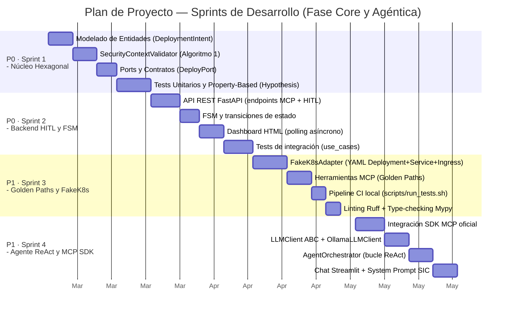
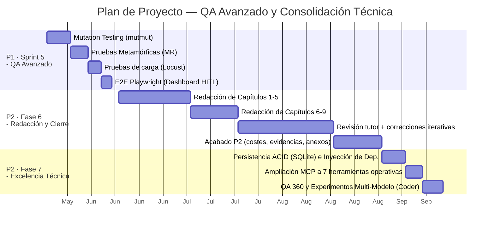

# Capítulo 9. Gestión y Viabilidad del Proyecto

La construcción de un sistema que hibrida disciplinas clásicas de Ingeniería de Software con dominios emergentes como la Inteligencia Artificial Generativa exige un marco de planificación riguroso pero flexible. Este capítulo documenta las restricciones del proyecto, la estructura de *sprints*, el seguimiento global de desviaciones y un análisis económico completo que evalúa tanto el coste del desarrollo como la viabilidad de adopción institucional. El desglose pormenorizado de las retrospectivas por sprint se encuentra en el **Anexo B**.

---

## 9.1. Plan de Proyecto — Contexto y Restricciones

### 9.1.1. Restricciones Estructurales

El *Agentic Deployer* se desarrolla en el contexto de un Trabajo de Fin de Máster bajo las siguientes restricciones:

- **Dedicación:** Régimen parcial de investigación (~15–20 horas semanales, compatibles con actividad profesional externa).
- **Equipo:** 1 alumno investigador + 1 tutor académico (sesiones de supervisión periódicas, con cadencia condicionada a la disponibilidad de ambas partes).
- **Infraestructura:** Entorno de desarrollo local (portátil personal), sin coste de nube durante el desarrollo.
- **Metodología:** Iterativa incremental, centrada en el dominio (*Domain-First*).

### 9.1.2. Principio de Flexibilidad y Priorización Adaptativa

> [!IMPORTANT]
> La planificación aquí descrita es de carácter **indicativo y orientativo**, no normativo. Dado que el presente TFM se desarrolla en régimen de dedicación parcial, compatibilizado con compromisos profesionales y personales de carácter variable, se asume *a priori* que los intervalos temporales de cada sprint son permeables: su ejecución puede acelerarse, posponerse o solaparse según la disponibilidad real del investigador y la capacidad de respuesta del tutor en los hitos críticos de revisión.

Esta aproximación es coherente con las recomendaciones de gestión ágil de proyectos de I+D aplicados en contextos académicos (IEEE Std 12207, ISO/IEC 29110), donde la rigidez del cronograma es sustituida por la **priorización explícita de objetivos**: se garantiza primero el alcance mínimo viable (MVP) y, en función del tiempo residual, se abordan los módulos de mayor complejidad o acabado opcionales.

**Jerarquía de prioridades del proyecto:**

| Prioridad | Módulo | Estado |
|---|---|---|
| **P0 — MVP obligatorio** | Núcleo hexagonal, validador de seguridad, API REST, FSM, Dashboard HITL | Completado |
| **P1 — Diferenciador académico** | Servidor MCP (SDK oficial), agente ReAct, multiproveedor LLM, QA avanzado | Completado |
| **P2 — Excelencia y acabado** | `OllamaLLMClient`, persistencia (SQLite), catálogo extendido (7 herr.), evidencias empíricas (MCP Inspector), exp. cognitivos multi-modelo | Completado |
| **P3 — Trabajo futuro** | `RealK8sAdapter` (integración clúster físico), RBAC, CI/CD cloud, multi-clúster | Roadmap |

<i><b>Tabla 18:</b> Módulos de desarrollo y jerarquía de prioridades.</i>

Únicamente los módulos **P0 y P1 son necesarios para la evaluación académica**. Los módulos P2 se han abordado con éxito en la recta final de consolidación, logrando un nivel de excelencia técnica que fortalece la robustez del proyecto. Los módulos P3 quedan explícitamente documentados como líneas de trabajo futuro (Sección 10.3).

---

## 9.2. Estructura de Sprints y Estimación de Esfuerzo

### 9.2.1. Diagrama de Planificación

La planificación se estructura en **5 sprints temáticos** más una fase transversal de redacción y una fase de consolidación de excelencia, con un esfuerzo total estimado de **~300 horas** (±15% de margen de contingencia estándar). Las fechas son referencias aproximadas sujetas al principio de flexibilidad enunciado en la sección anterior.

<i><b>Figura 16:</b> Diagrama de Gantt (Parte 1). Planificación orientativa de los Sprints 1 a 4 (núcleo y agente).</i>

<i><b>Figura 17:</b> Diagrama de Gantt (Parte 2). Planificación orientativa del QA avanzado y las fases de cierre/consolidación.</i>

### 9.2.2. Estimación de Esfuerzo por Sprint

La siguiente tabla refleja la estimación inicial de esfuerzo neto, asumiendo un ritmo de trabajo parcial y la incorporación de asistencia mediante herramientas de IA generativa, cuyo efecto es la aceleración del ciclo de implementación sin merma de la calidad del análisis.

| Sprint | Fase | Estimación (h) | Rango (±15%) | Prioridad |
|---|---|---|---|---|
| Sprint 1 | Núcleo Hexagonal | 50h | 43–58h | P0 |
| Sprint 2 | Backend HITL y FSM | 45h | 38–52h | P0 |
| Sprint 3 | Golden Paths y FakeK8s | 40h | 34–46h | P1 |
| Sprint 4 | Agente ReAct y MCP SDK | 55h | 47–63h | P1 |
| Sprint 5 | QA Avanzado | 45h | 38–52h | P1 |
| Fase 6 | Redacción y Cierre | 55h | 47–63h | P2 |
| Fase 7 | Excelencia Técnica | 10h | 8–12h | P2 |
| **Total estimado** | | **~300h** | **~255–345h** | |

<i><b>Tabla 19:</b> Estimación de esfuerzo neto por Sprint.</i>

> [!NOTE]
> La asistencia mediante un agente de IA de codificación (Google Gemini Advanced, utilizado para aceleración de *scaffolding*, generación de código *boilerplate*, revisión de lógica y apoyo en la redacción técnica) permitió comprimir el tiempo de implementación en fases que de otro modo habrían requerido un esfuerzo sustancialmente mayor. Esto es coherente con la línea de investigación del propio proyecto, que postula la utilidad de los agentes LLM como asistentes en flujos de trabajo técnicos complejos.

---

## 9.3. Esfuerzo de Desarrollo y Desviaciones

Frente a la estimación inicial de ~300 horas, el cierre empírico del proyecto arrojó un esfuerzo total de **~340 horas**, lo que representa una desviación del **+13%**. Esta inversión adicional se encuadra holgadamente dentro del margen de contingencia previsto (±15%) y se asumió de manera deliberada en la recta final para elevar el MVP a un estándar de excelencia ingenieril (implementación de persistencia ACID en SQLite, ampliación de 4 a 7 herramientas MCP, análisis forense de mutantes y la validación de la hipótesis de "Rescate Cognitivo" mediante experimentos multi-modelo).

La adopción de asistentes de Inteligencia Artificial (Google Gemini Advanced) demostró actuar como un multiplicador de productividad esencial. Permitió absorber esta densidad arquitectónica dentro de un cronograma manejable para un único ingeniero, validando de forma recursiva la hipótesis de investigación del TFM sobre la utilidad de los agentes LLM en ciclos de vida de software.

La siguiente tabla resume las desviaciones por fase:

| Fase | Estimación (h) | Real (h) | Desviación | Causa Principal |
|---|---|---|---|---|
| Sprint 1 · Núcleo Hexagonal | 50 | ~55 | +10% | Ampliación del validador de seguridad |
| Sprint 2 · Backend HITL y FSM | 45 | ~45 | 0% | Desarrollo ajustado a la previsión |
| Sprint 3 · Golden Paths y FakeK8s | 40 | ~46 | +15% | Integración dual SDK MCP |
| Sprint 4 · Agente ReAct y MCP SDK | 55 | ~62 | +13% | Agente ReAct + Ollama nativo |
| Sprint 5 · QA Avanzado | 45 | ~50 | +11% | Análisis forense de mutantes |
| Fase 6 · Redacción y Cierre | 55 | ~64 | +16% | Densidad técnica y extensión final (100+ págs) |
| Fase 7 · Excelencia Técnica | 10 | ~18 | +80% | QA final, Base de Datos y Evaluación Empírica (Coder/Cloud) |
| **Total** | **~300** | **~340** | **~+13%** | |

<i><b>Tabla 20:</b> Resumen de desviaciones de tiempo por fase.</i>

> [!NOTE]
> Una desviación del **+13%** respecto a la estimación de referencia se sitúa cómodamente dentro del margen de contingencia previsto (±15%). Esta inversión de horas extra (~40h) se asumió de manera consciente y deliberada para garantizar un acabado de excelencia académica e ingenieril en la recta final (Fase 7), demostrando que el proyecto puede escalar a estándares corporativos manteniendo la planificación original bajo control. El desglose pormenorizado por sprint con las retrospectivas detalladas, incluyendo los hitos completados y las lecciones aprendidas, se documenta en el **Anexo B**.

---

## 9.4. Análisis Económico del Desarrollo

El proyecto fue desarrollado utilizando recursos de código abierto e infraestructura personal, por lo que el coste material directo fue marginal. No obstante, para evaluar la viabilidad económica de la solución, se ha calculado el **coste de oportunidad equivalente**: la inversión que requeriría el proyecto si se externalizara en el mercado tecnológico español a tarifas de 2026.

### 9.4.1. Costes de Recursos Humanos

| Perfil | Tarifa/hora | Horas | Coste de oportunidad |
|---|---|---|---|
| **Alumno Investigador** (Ingeniero Junior — equivalente mercado) | 22 €/h | ~340h | ~7.480 € |
| **Tutor Académico** (Perfil Senior / Supervisor I+D) | 75 €/h | ~24h *(sesiones periódicas)* | ~1.800 € |
| **Subtotal Recursos Humanos** | | **~364h** | **~9.280 €** |

<i><b>Tabla 21:</b> Costes de Recursos Humanos (CAPEX equivalente).</i>

> **Nota metodológica:** Los valores representan el coste de oportunidad equivalente de mercado: la inversión económica que representaría este proyecto si se ejecutase bajo contrato profesional. El alumno no percibe remuneración; el tutor es compensado institucionalmente al margen de este cálculo.

### 9.4.2. Costes de Infraestructura y Herramientas

| Recurso | Proveedor | Coste imputable | Cálculo / Observación |
|---|---|---|---|
| **Portátil de desarrollo** | Hardware personal | **~126 €** | Portátil ~1.200 € · vida útil 4 años · fracción de uso TFM (6 meses / 48 meses) ≈ 150 € · factor dedicación parcial ~84% ≈ **126 €** |
| Sistema operativo y utilidades | Linux (Ubuntu) | 0 € | Open source |
| Python 3.12 + ecosistema | Open source | 0 € | — |
| FastAPI, Pydantic, Hypothesis, Pytest | Open source | 0 € | — |
| SDK MCP oficial (`mcp==2.2.0`) | Anthropic (MIT License) | 0 € | Open source |
| Ollama (servidor LLM local) | Open source | 0 € | Modelos gratuitos |
| **Asistente IA (Google Gemini Advanced)** | Google | **~120 €** | 20 €/mes × 6 meses. Utilizado para asistencia en codificación, scaffolding, revisión de lógica y apoyo en redacción técnica |
| OpenAI API (validación puntual) | OpenAI | ~15 € | Créditos de prueba |
| **Subtotal Infraestructura y Herramientas** | | **~261 €** | |

<i><b>Tabla 22:</b> Costes de Infraestructura y Herramientas (Fase de Desarrollo).</i>

### 9.4.3. Costes Totales de Desarrollo

| Categoría | Coste |
|---|---|
| Recursos Humanos (coste de oportunidad) | ~9.280 € |
| Infraestructura y herramientas | ~261 € |
| **Coste Total del Proyecto** | **~9.541 €** |
| **Coste por hora efectiva** | **~26,2 €/h** |

<i><b>Tabla 23:</b> Subtotal y costes totales de la fase de desarrollo.</i>

---

## 9.5. Coste de Adopción Corporativa y ROI

Esta sección responde a la pregunta estratégica: **¿Cuánto costaría adaptar e implantar el *Agentic Deployer* en un entorno institucional real**, como un Servicio de Informática universitario o un departamento de IT corporativo?

> **Nota metodológica sobre fuentes y referencias de costes:** Todos los importes económicos detallados en esta sección representan estimaciones de mercado a **fecha de redacción de esta memoria** y se han derivado de las siguientes fuentes públicas (consultadas durante el desarrollo del proyecto):
> - **Tarifas de API:** Páginas oficiales de *pricing* para desarrolladores ([OpenAI API Pricing](https://openai.com/api/pricing/), [Anthropic Console Pricing](https://www.anthropic.com/pricing), [Google AI Studio](https://ai.google.dev/pricing)).
> - **Hardware (Ollama Local):** Basado en el MSRP oficial de [NVIDIA para la serie RTX 4000](https://www.nvidia.com/es-es/geforce/graphics-cards/40-series/) y precios medios en distribuidores B2B.
> - **Infraestructura Cloud/VPS:** Estimaciones promediadas de catálogos públicos de proveedores IaaS ([AWS EC2](https://aws.amazon.com/es/ec2/pricing/), [Google Cloud Compute](https://cloud.google.com/compute/pricing), [Hetzner Cloud](https://www.hetzner.com/cloud/)).
> - **Coste Eléctrico:** Calculado asumiendo una tarifa media institucional/industrial de ~0,15 €/kWh en España, tomando como referencia los informes del [Mercado Eléctrico de Eurostat](https://ec.europa.eu/eurostat/statistics-explained/index.php?title=Electricity_price_statistics) y Red Eléctrica de España.
> - **Salarios (Coste-Hora Técnico):** Estimados entre 40 €/h y 60 €/h (coste empresa total), en consonancia con la [Guía Salarial Hays España](https://guiasalarial.hays.es/) y el [Estudio de Remuneración de Michael Page](https://www.michaelpage.es/) para roles de *Platform Engineer* y *DevOps*.
>
> Debido a la volatilidad del sector tecnológico, estos valores constituyen una referencia base estructurada para el cálculo prospectivo de viabilidad y ROI, susceptible a fluctuaciones temporales.

### 9.5.1. Perfiles de Organización Adoptante

| Perfil | Descripción | Complejidad |
|---|---|---|
| **A — Universidad/Empresa Pequeña** | <5.000 usuarios, equipo IT de 1–3 personas, infraestructura local básica | Baja |
| **B — Universidad/Empresa Mediana** | 5.000–30.000 usuarios, departamento IT estructurado, K8s on-premise/híbrido | Media |
| **C — Gran Universidad/Empresa** | >30.000 usuarios, multi-clúster, equipo IT dedicado, auditoría RGPD estricta | Alta |

<i><b>Tabla 24:</b> Perfiles de Organización Adoptante (Casos A, B y C).</i>

### 9.5.2. Costes de Implantación (CAPEX — Inversión Inicial)

| Componente | Perfil A | Perfil B | Perfil C |
|---|---|---|---|
| **Adaptación del código** *(personalizar `SYSTEM_PROMPT`, herramientas MCP y políticas de seguridad al catálogo corporativo)* | 20h × 40 €/h = **800 €** | 60h × 50 €/h = **3.000 €** | 160h × 60 €/h = **9.600 €** |
| **Implementación `RealK8sAdapter`** *(integración con clúster físico vía `kubernetes-client`)* | 20h × 40 €/h = **800 €** | 40h × 50 €/h = **2.000 €** | 80h × 60 €/h = **4.800 €** |
| **Configuración y despliegue** *(CI/CD, variables de entorno, SSL, LDAP/SAML)* | 10h × 40 €/h = **400 €** | 30h × 50 €/h = **1.500 €** | 60h × 60 €/h = **3.600 €** |
| **Formación de administradores (HITL)** | 4h × 1 pers = **160 €** | 8h × 2 pers = **800 €** | 12h × 4 pers = **2.880 €** |
| **CAPEX Total** | **2.160 €** | **7.300 €** | **20.880 €** |

<i><b>Tabla 25:</b> Costes de Implantación (CAPEX - Inversión Inicial).</i>

### 9.5.3. Costes Operativos Anuales (OPEX)

#### Infraestructura de Servidor

| Componente | Perfil A | Perfil B | Perfil C |
|---|---|---|---|
| Servidor aplicación (FastAPI + MCP) | VPS 4 vCPU / 8 GB ≈ **600 €/año** | Servidor on-premise amortizado ≈ **300 €/año** | 3 réplicas en nube ≈ **3.600 €/año** |
| Almacenamiento (BD + logs YAML) | 50 GB SSD ≈ **60 €/año** | 200 GB ≈ **200 €/año** | 1 TB + backups ≈ **800 €/año** |

<i><b>Tabla 26:</b> Costes Operativos Anuales de Infraestructura (OPEX).</i>

#### Motor LLM — La Variable Determinante del OPEX

**Opción 1 — Ollama local (modelos open-source, recomendado para instituciones públicas)**

La adopción de modelos locales evita los gastos recurrentes (OPEX) a cambio de una inversión inicial (CAPEX) en hardware. En base a los resultados empíricos (Capítulo 10), se proponen tres niveles de adopción corporativa según el equilibrio deseado entre coste y resiliencia cognitiva:

| Nivel (Caso de Uso) | Modelo Recomendado | VRAM | Inversión hardware (GPU, pago único) | Coste API | Privacidad |
|---|---|---|---|---|---|
| **Básico** (MVP / Pruebas) | `qwen2.5-coder:7b` | 8 GB | ~400 € (ej. RTX 4060) | **0 €/año** | Total (Zero Data Retention) |
| **Intermedio** (Equilibrado) | `qwen2.5-coder:14b` / `mistral-nemo:12b` | 16 GB | ~500 € (ej. RTX 4060 Ti 16GB) | **0 €/año** | Total |
| **Enterprise** (Óptimo Corporativo) | `Qwen3-Coder-30B-A3B-Instruct` (MoE) | 24-48 GB | ~1.800 € - 5.000 € (ej. RTX 3090/4090 o dual) | **0 €/año** | Total |

<i><b>Tabla 27:</b> Costes Operativos Anuales de Motor LLM (Local vs Cloud) según niveles de adopción.</i>

> **Nota técnica sobre escalabilidad:** En el diseño inicial del proyecto, se preveía que la adopción institucional requeriría modelos de 14B o arquitecturas de 30B para solventar las vulnerabilidades lógicas detectadas en modelos generalistas de 7B. No obstante, los resultados empíricos obtenidos con la variante especializada **`qwen2.5-coder:7b`** (Nivel Básico) indican que es técnicamente viable operar el sistema en un nivel de entrada (hardware de 8 GB VRAM, ~400 €) manteniendo altos índices de fiabilidad. Esta optimización fundamentada en la especialización del modelo permite reducir significativamente el gasto de capital (CAPEX) necesario para la puesta en marcha. En consecuencia, el escalado hacia infraestructuras de Nivel Intermedio o Enterprise se plantea como un requisito reservado principalmente para instituciones (Perfil C) que deban soportar picos de alta concurrencia o flujos de orquestación de complejidad superior.

**Opción 2 — API en la nube**

| Proveedor | Modelo | Precio entrada | Precio salida | Estimación anual* |
|---|---|---|---|---|
| OpenAI | GPT-4o-mini | 0,15 $/MTok | 0,60 $/MTok | **~160–650 €/año** |
| OpenAI | GPT-4o | 2,50 $/MTok | 10,00 $/MTok | **~2.700–11.000 €/año** |
| Anthropic | Claude Haiku | 0,25 $/MTok | 1,25 $/MTok | **~290–1.150 €/año** |
| Google | Gemini Flash | 0,075 $/MTok | 0,30 $/MTok | **~80–330 €/año** |

<i><b>Tabla 28:</b> Estimación de Costes de Motor LLM (API en la Nube).</i>

> *Para 50–200 solicitudes diarias. El volumen asume **~50.000 tokens promedio por solicitud** (90% contexto de entrada, 10% salida). Esta cifra se deriva del efecto "explosión de contexto" acumulativo de los agentes autónomos (patrón ReAct). Un despliegue estándar requiere múltiples iteraciones (planificar, aplicar, verificar, corregir errores); en cada iteración, el LLM debe procesar de nuevo todo el historial previo. Dado que las herramientas de Kubernetes devuelven salidas muy extensas (ej. volcados de manifiestos con `kubectl -o yaml` o trazas de *logs*, que pueden superar los 3.000 tokens por llamada), el consumo de tokens de entrada crece exponencialmente en cada paso del bucle hasta resolver la petición.

#### OPEX Total Anual por Perfil

| Componente | Perfil A | Perfil B | Perfil C |
|---|---|---|---|
| Servidor aplicación | 600 €/año | 300 €/año | 3.600 €/año |
| Almacenamiento | 60 €/año | 200 €/año | 800 €/año |
| Consumo Eléctrico GPU (Local)* | ~20 €/año | ~40 €/año | ~100 €/año |
| LLM Ollama local (hardware, única vez) | +400 € (Nivel Básico, Año 0) | +500 € (Nivel Intermedio, Año 0) | +2.000 € (Nivel Enterprise, Año 0) |
| LLM API nube (alternativa GPT-4o)** | ~2.700 €/año | ~5.500 €/año | ~11.000 €/año |
| Mantenimiento y actualizaciones | 10h × 40 €/h = **400 €/año** | 20h × 50 €/h = **1.000 €/año** | 40h × 60 €/h = **2.400 €/año** |
| **OPEX Total (con Ollama)** | **~1.080 €/año** | **~1.540 €/año** | **~6.900 €/año** |
| **OPEX Total (con API nube)** | **~3.760 €/año** | **~7.000 €/año** | **~17.800 €/año** |

<i><b>Tabla 29:</b> OPEX Total Anual consolidado por Perfil de Adopción.</i>

> *El coste eléctrico es prácticamente residual debido a que el sistema procesa una media de 50-200 solicitudes diarias. La GPU permanece en estado de reposo (Idle, consumiendo ~15-30W) el 99% del tiempo, activando picos de consumo máximo únicamente durante los escasos segundos que dura la inferencia.

> **Para entornos institucionales productivos, la alternativa en la nube requiere modelos cognitivamente resilientes (nivel GPT-4o), asumiendo volúmenes escalados según el perfil (50, 100 y 200 solicitudes diarias respectivamente).

### 9.5.4. Análisis de Retorno de Inversión (ROI)

El valor generado se cuantifica a partir de la reducción de tiempo operativo documentada en el Capítulo 8 (Tabla 9).

**Cálculo del ahorro anual — Perfil B (Universidad mediana, 500 solicitudes/año)**

| Proceso automatizado | Tiempo efectivo ahorrado/solicitud | Solicitudes/año | Coste hora técnico N3 | Ahorro anual |
|---|---|---|---|---|
| Negociación de requisitos (Triage) | ~29 min (trabajo activo) | 500 | 50 €/h | **~12.000 €** |
| Traducción manual a YAML | ~15 min | 500 | 50 €/h | **~6.250 €** |
| Validación de políticas | ~5 min | 500 | 50 €/h | **~2.080 €** |
| **Ahorro total anual** | | | | **~20.330 €** |

<i><b>Tabla 30:</b> Cálculo del ahorro anual operativo (Escenario de Perfil B).</i>

> **Nota sobre el cálculo de tiempos:** El valor de 1.440 minutos (~24 horas) para la "Negociación de requisitos" es una estimación conservadora basada en el SLA (*Service Level Agreement*) típico de un Service Desk universitario, donde el intercambio asíncrono de tickets o correos electrónicos (solicitud → falta de datos → respuesta del investigador → nueva validación) consume al menos un día hábil (24h de tiempo de reloj) hasta alcanzar un estado de intención completa.

**ROI a 3 años — Perfil B con Ollama (Nivel Básico Coder, 7B)**

| Concepto | Año 0 | Año 1 | Año 2 | Año 3 |
|---|---|---|---|---|
| Inversión CAPEX | -7.300 € | — | — | — |
| Hardware LLM (Ollama GPU, única vez) | -400 € | — | — | — |
| OPEX anual | — | -1.540 € | -1.540 € | -1.540 € |
| Ahorro operativo | — | +20.330 € | +20.330 € | +20.330 € |
| **Flujo neto** | **-7.700 €** | **+18.790 €** | **+18.790 €** | **+18.790 €** |
| **Acumulado** | -7.700 € | +11.090 € | +29.880 € | +48.670 € |

<i><b>Tabla 31:</b> Retorno de Inversión (ROI) a 3 años (Perfil B con Ollama).</i>

> **Período de retorno (Payback Period): ~5 meses** tras la implantación.
> **ROI a 3 años: ~522%**

---

## 9.6. Conclusiones del Análisis de Viabilidad

1. **La flexibilidad de la planificación es una característica del diseño, no una deficiencia.** La naturaleza parcial y asincrónica del desarrollo impide la aplicación de cronogramas rígidos; la priorización explícita (P0→P3) garantiza que el núcleo de valor académico se complete antes que cualquier módulo de acabado opcional.

2. **La asistencia de IA generativa es un multiplicador de productividad consistente con el objeto de estudio.** El uso de un agente de codificación (Google Gemini Advanced, ~120 € de coste imputable) permitió abordar un alcance técnico ambicioso —arquitectura hexagonal, SDK MCP oficial, QA multicapa, agente ReAct— dentro de un esfuerzo total contenido (~340h), que de otro modo habría requerido un equipo de al menos 2 personas.

3. **La inferencia local es económicamente superior para instituciones públicas.** La combinación Ollama + servidor on-premise reduce el OPEX a ~1.540 €/año, eliminando el coste recurrente y asimétrico de las APIs en la nube. Además, garantiza la total privacidad del dato (Zero Data Retention), lo que la convierte en la opción imperativa para organismos sujetos al ENS y RGPD.

4. **El ROI superior al 520% en 3 años justifica la adopción institucional.** El umbral de rentabilidad se alcanza en unos 5 meses para un volumen mínimo de 500 solicitudes de infraestructura anuales.

5. **La arquitectura hexagonal protege la inversión tecnológica a largo plazo.** La sustitución de cualquier adaptador —`FakeK8sAdapter` → `RealK8sAdapter`, Ollama → GPT-4o, etc.— no requiere modificar la lógica de negocio. El coste de evolución tecnológica está estructuralmente minimizado por el Principio de Inversión de Dependencias (DIP).
