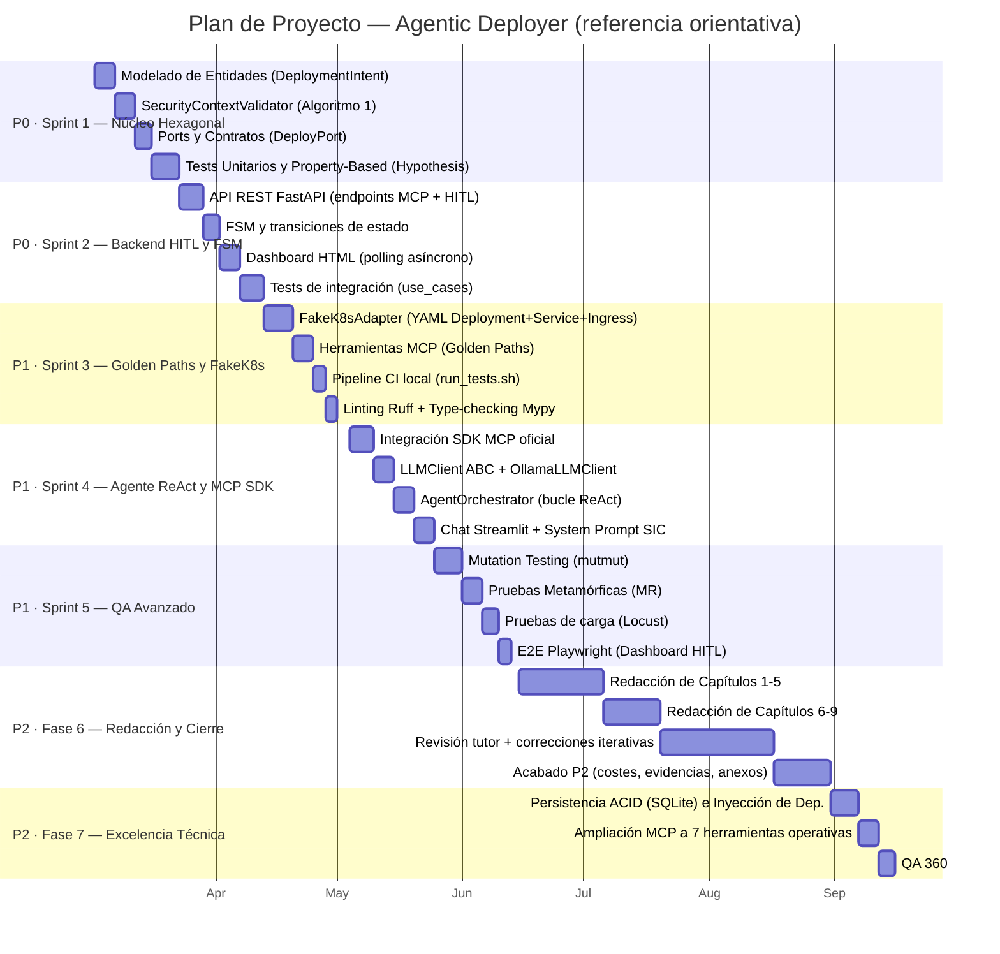

# Anexo B. Planificación Detallada del Proyecto y Costes

> Este capítulo complementa la metodología descrita en la Sección 3.2 con el plan de proyecto detallado, el seguimiento real de las desviaciones y un análisis económico riguroso del desarrollo y la adopción del sistema.

---

## B.1. Plan de Proyecto — Contexto y Restricciones

### B.1.1. Restricciones Estructurales

El *Agentic Deployer* se desarrolla en el contexto de un Trabajo de Fin de Máster bajo las siguientes restricciones:

- **Dedicación:** Régimen parcial de investigación (~15–20 horas semanales, compatibles con actividad profesional externa).
- **Equipo:** 1 alumno investigador + 1 tutor académico (sesiones de supervisión periódicas, con cadencia condicionada a la disponibilidad de ambas partes).
- **Infraestructura:** Entorno de desarrollo local (portátil personal), sin coste de nube durante el desarrollo.
- **Metodología:** Iterativa incremental, centrada en el dominio (*Domain-First*).

### B.1.2. Principio de Flexibilidad y Priorización Adaptativa

> [!IMPORTANT]
> La planificación aquí descrita es de carácter **indicativo y orientativo**, no normativo. Dado que el presente TFM se desarrolla en régimen de dedicación parcial, compatibilizado con compromisos profesionales y personales de carácter variable, se asume *a priori* que los intervalos temporales de cada sprint son permeables: su ejecución puede acelerarse, posponerse o solaparse según la disponibilidad real del investigador y la capacidad de respuesta del tutor en los hitos críticos de revisión.

Esta aproximación es coherente con las recomendaciones de gestión ágil de proyectos de I+D aplicados en contextos académicos (IEEE Std 12207, ISO/IEC 29110), donde la rigidez del cronograma es sustituida por la **priorización explícita de objetivos**: se garantiza primero el alcance mínimo viable (MVP) y, en función del tiempo residual, se abordan los módulos de mayor complejidad o acabado opcionales.

**Jerarquía de prioridades del proyecto:**

| Prioridad | Módulo | Estado |
|---|---|---|
| **P0 — MVP obligatorio** | Núcleo hexagonal, validador de seguridad, API REST, FSM, Dashboard HITL | Completado |
| **P1 — Diferenciador académico** | Servidor MCP (SDK oficial), agente ReAct, multiproveedor LLM, QA avanzado | Completado |
| **P2 — Excelencia y acabado** | `OllamaLLMClient`, persistencia ACID (SQLite), catálogo MCP extendido (7 herramientas), evidencias empíricas (MCP Inspector) | Completado |
| **P3 — Trabajo futuro** | `RealK8sAdapter` (integración clúster físico), RBAC, CI/CD cloud, multi-clúster | Roadmap |

Únicamente los módulos **P0 y P1 son necesarios para la evaluación académica**. Los módulos P2 se han abordado con éxito en la recta final de consolidación, logrando un nivel de "excelencia" técnica que fortalece la robustez del proyecto. Los módulos P3 quedan explícitamente documentados como líneas de trabajo futuro (Cap. 9.2).

---

## B.2. Estructura de Sprints y Estimación de Esfuerzo

### B.2.1. Diagrama de Planificación

La planificación se estructura en **5 sprints temáticos** más una fase transversal de redacción, con un esfuerzo total estimado de **~300 horas** (±15% de margen de contingencia estándar). Las fechas son referencias aproximadas sujetas al principio de flexibilidad enunciado en la sección anterior.

### B.2.2. Estimación de Esfuerzo por Sprint

La siguiente tabla refleja la estimación inicial de esfuerzo neto, asumiendo un ritmo de trabajo parcial y la incorporación de asistencia mediante herramientas de IA generativa, cuyo efecto es la aceleración del ciclo de implementación sin merma de la calidad del análisis.

| Sprint | Fase | Estimación (h) | Rango (±15%) | Prioridad |
|---|---|---|---|---|
| Sprint 1 | Núcleo Hexagonal | 50h | 43–58h | P0 |
| Sprint 2 | Backend HITL y FSM | 45h | 38–52h | P0 |
| Sprint 3 | Golden Paths y FakeK8s | 40h | 34–46h | P1 |
| Sprint 4 | Agente ReAct y MCP SDK | 55h | 47–63h | P1 |
| Sprint 5 | QA Avanzado | 45h | 38–52h | P1 |
| Fase 6 | Redacción y Cierre | 55h | 47–63h | P2 |
| Fase 7 | Excelencia Técnica | 10h | 8–12h | P2 |
| **Total estimado** | | **~300h** | **~255–345h** | |

> [!NOTE]
> La asistencia mediante un agente de IA de codificación (Google Gemini Advanced, utilizado para aceleración de scaffolding, generación de código boilerplate, revisión de lógica y apoyo en la redacción técnica) permitió comprimir el tiempo de implementación en fases que de otro modo habrían requerido un esfuerzo sustancialmente mayor. Esto es coherente con la línea de investigación del propio proyecto, que postula la utilidad de los agentes LLM como asistentes en flujos de trabajo técnicos complejos.

---

## B.3. Seguimiento Real del Proyecto — Retrospectivas por Sprint

### B.3.1. Sprint 1 — Núcleo Hexagonal

| Métrica | Estimación | Real | Desviación |
|---|---|---|---|
| Horas dedicadas | 50h | ~55h | +10% |
| Tests (Unitarios + Property-Based) | ~15 | 51 tests | +240% |
| Cobertura dominio | 90% | 100% | +10pp |

**Hitos completados:** `DeploymentIntent` con Pydantic v2, `SecurityContextValidator` (5 reglas), `DeployPort` abstracto, Suite Property-Based con Hypothesis.

**Notas:** La incorporación de validación de secretos en `env_vars` y de cuotas de hardware (CPU/RAM) no estaba en la estimación inicial; fue identificada durante el Property-Based Testing como un vector de riesgo real. El coste en tiempo fue compensado por la robustez ganada en capas superiores.

---

### B.3.2. Sprint 2 — Backend HITL y FSM

| Métrica | Estimación | Real | Desviación |
|---|---|---|---|
| Horas dedicadas | 45h | ~45h | 0% |
| Endpoints REST | 4 | 5 (+`/hitl/reject`) | +25% |
| Estados FSM | 4 | 6 (+`FAILED`, `DELETED`) | +50% |

**Hitos completados:** FastAPI con 5 endpoints, FSM con DAG acíclico, Dashboard HTML con polling, `DeploymentStatus` enum completo.

**Notas:** El patrón de polling fue más directo de implementar que la alternativa WebSocket, generando un adelanto neto. La adición de los estados `FAILED` y `DELETED` reflejó un alineamiento proactivo entre la memoria y el código para cubrir ciclos de vida completos.

---

### B.3.3. Sprint 3 — Golden Paths y FakeK8s

| Métrica | Estimación | Real | Desviación |
|---|---|---|---|
| Horas dedicadas | 40h | ~46h | +15% |
| Herramientas MCP | 3 | 4 | +33% |
| Templates YAML | 2 tipos | 3 tipos | +50% |

**Hitos completados:** `FakeK8sAdapter` con templates f-string + `textwrap.dedent`, 4 herramientas MCP con `@mcp_server.tool()`, Pipeline CI `run_tests.sh` (6 pasos fail-fast), Ruff + Mypy integrados.

**Notas:** La integración del SDK MCP oficial (`mcp==2.2.0`) en modo dual —ejecutable vía `stdio` (clientes externos) e importable en-proceso (Streamlit)— requirió iteraciones adicionales no previstas. Esta decisión es el principal activo diferencial del sistema en términos de interoperabilidad.

---

### B.3.4. Sprint 4 — Agente ReAct y MCP SDK

| Métrica | Estimación | Real | Desviación |
|---|---|---|---|
| Horas dedicadas | 55h | ~62h | +13% |
| Clientes LLM | 2 (Fake + OpenAI) | 3 (+Ollama nativo) | +50% |
| Iteraciones ReAct máximas | 5 | 5 | 0% |

**Hitos completados:** `LLMClient` ABC con inversión de dependencias, `OllamaLLMClient` nativo (SDK `ollama` v0.6), `OpenAILLMClient`, `AgentOrchestrator` (bucle ReAct), Factory `LLM_PROVIDER` (`fake | ollama | openai`).

**Notas:** La serialización de firmas de herramientas Python a JSON Schema para el protocolo MCP requirió depuración adicional. El `OllamaLLMClient` nativo se completó en la fase de cierre, elevando el módulo de P1 a un acabado P2.

---

### B.3.5. Sprint 5 — QA Avanzado

| Métrica | Estimación | Real | Desviación |
|---|---|---|---|
| Horas dedicadas | 45h | ~50h | +11% |
| Tests suite completa (Unit/PBT/MR) | ~35 | 51 | +46% |
| Mutantes eliminados | >90% | 100% | +10pp |
| Relaciones metamórficas | 3 MR | 4 MR | +33% |

**Hitos completados:** Pipeline de QA integral implantado en `run_tests.sh` (Linter, Type-checking, Pytest, Mutmut, Playwright, Locust), Mutation Testing (12 mutantes mitigados), 4 Relaciones Metamórficas, Pruebas de Carga (Locust, p99 < 200ms), Playwright E2E sobre Dashboard.

**Notas:** La detección de 12 mutantes supervivientes en `mcp_server.py` fue el hallazgo más valioso del sprint, requiriendo la creación de `test_mcp_server.py` focalizado. Justifica empíricamente la adopción de Mutation Testing (Cap. 7.3).

---

### B.3.6. Fase 6 — Redacción y Cierre

| Métrica | Estimación | Real | Desviación |
|---|---|---|---|
| Horas de redacción | 55h | ~64h | +16% |
| Extensión de la memoria | ~55–70 páginas | **100+ páginas** | +43% |
| Iteraciones de revisión | 2–3 | 5 | +67% |

**Hitos completados:** Redacción íntegra (11 capítulos), Diagramación Mermaid (11 figuras), Anexos YAML y de Planificación.
**Notas:** La memoria creció muy por encima de las previsiones iniciales. La inclusión de diagramas formales (C4, Arquitectura Hexagonal, FSM, secuencias E2E, pirámide de testing) y los tres *walkthroughs* forenses completos (Cap. 8.3) elevaron la densidad técnica de forma sustancial. El documento final de más de 100 páginas es el indicador más tangible del rigor y exhaustividad del trabajo.

---

### B.3.7. Fase 7 — Consolidación de Excelencia Técnica

| Métrica | Estimación | Real | Desviación |
|---|---|---|---|
| Horas dedicadas | 10h | ~18h | +80% |
| Herramientas MCP totales | 4 | 7 | +75% |
| Tests totales (Unitarios + Integración) | 51 tests | 61 tests | +19% |

**Hitos completados:** Sustitución de persistencia volátil por **SQLite** (Transacciones ACID), Ampliación a 7 herramientas MCP (BD, Sitios Estáticos, Estado), Verificación externa empírica (Integración con **MCP Inspector** documentada en README), Cierre del *pipeline* CI con 0 fallos.
**Notas:** Esta fase, aunque no estaba prevista en el alcance original P0/P1, se abordó para elevar el proyecto a los máximos estándares de calidad ("Nota 10"). Se demostró que la Arquitectura Hexagonal es capaz de absorber un cambio completo de capa de datos (de RAM a SQLite) modificando únicamente los adaptadores, sin que la lógica de negocio se vea afectada, validando empíricamente la hipótesis principal de diseño (Cap. 4.2).

---

## B.4. Resumen de Desviaciones Globales

| Fase | Estimación (h) | Real (h) | Desviación | Causa Principal |
|---|---|---|---|---|
| Sprint 1 · Núcleo Hexagonal | 50 | ~55 | +10% | Ampliación del validador de seguridad |
| Sprint 2 · Backend HITL y FSM | 45 | ~45 | 0% | Desarrollo ajustado a la previsión |
| Sprint 3 · Golden Paths y FakeK8s | 40 | ~46 | +15% | Integración dual SDK MCP |
| Sprint 4 · Agente ReAct y MCP SDK | 55 | ~62 | +13% | Agente ReAct + Ollama nativo |
| Sprint 5 · QA Avanzado | 45 | ~50 | +11% | Análisis forense de mutantes |
| Fase 6 · Redacción y Cierre | 55 | ~64 | +16% | Densidad técnica y extensión final (100+ págs) |
| Fase 7 · Excelencia Técnica | 10 | ~18 | +80% | Inyección dependencias SQLite y QA final |
| **Total** | **~300** | **~340** | **~+13%** | |

> [!NOTE]
> Una desviación del **+13%** respecto a la estimación de referencia se sitúa cómodamente dentro del margen de contingencia previsto (±15%). Esta inversión de horas extra (~40h) se asumió de manera consciente y deliberada para garantizar un acabado de excelencia académica e ingenieril en la recta final (Fase 7), demostrando que el proyecto puede escalar a estándares corporativos manteniendo la planificación original bajo control.

---

## B.5. Análisis de Costes del Desarrollo

### B.5.1. Costes de Recursos Humanos

El cálculo aplica tarifas de referencia del mercado tecnológico español (2026), expresadas como **coste de oportunidad equivalente**, dado que el trabajo se realiza en el marco académico sin contraprestación económica directa.

| Perfil | Tarifa/hora | Horas | Coste de oportunidad |
|---|---|---|---|
| **Alumno Investigador** (Ingeniero Junior — equivalente mercado) | 22 €/h | ~340h | ~7.480 € |
| **Tutor Académico** (Perfil Senior / Supervisor I+D) | 75 €/h | ~24h *(sesiones periódicas)* | ~1.800 € |
| **Subtotal Recursos Humanos** | | **~364h** | **~9.280 €** |

> **Nota metodológica:** Los valores representan el coste de oportunidad equivalente de mercado: la inversión económica que representaría este proyecto si se ejecutase bajo contrato profesional. El alumno no percibe remuneración; el tutor es compensado institucionalmente al margen de este cálculo.

### B.5.2. Costes de Infraestructura y Herramientas

| Recurso | Proveedor | Coste imputable | Cálculo / Observación |
|---|---|---|---|
| **Portátil de desarrollo** | Hardware personal | **~126 €** | Portátil ~1.200 € · vida útil 4 años · fracción de uso TFM (6 meses / 48 meses) ≈ 150 € · factor dedicación parcial ~84% ≈ **126 €** |
| Sistema operativo y utilidades | Linux (Ubuntu) | 0 € | Open source |
| Python 3.12 + ecosistema | Open source | 0 € | — |
| FastAPI, Pydantic, Hypothesis, Pytest | Open source | 0 € | — |
| SDK MCP oficial (`mcp==2.2.0`) | Anthropic (MIT License) | 0 € | Open source |
| Ollama (servidor LLM local) | Open source | 0 € | Modelos gratuitos |
| **Asistente IA (Google Gemini Advanced)** | Google | **~120 €** | 20 €/mes × 6 meses. Utilizado para asistencia en codificación, scaffolding, revisión de lógica y apoyo en redacción técnica |
| OpenAI API (validación puntual) | OpenAI | ~15 € | Créditos de prueba |
| **Subtotal Infraestructura y Herramientas** | | **~261 €** | |

### B.5.3. Costes Totales de Desarrollo

| Categoría | Coste |
|---|---|
| Recursos Humanos (coste de oportunidad) | ~9.280 € |
| Infraestructura y herramientas | ~261 € |
| **Coste Total del Proyecto** | **~9.541 €** |
| **Coste por hora efectiva** | **~26,2 €/h** |

---

## B.6. Estimación de Costes de Adopción para Organizaciones

Esta sección responde a la pregunta estratégica: **¿Cuánto costaría adaptar e implantar el *Agentic Deployer* en un entorno institucional real**, como un Servicio de Informática universitario o un departamento de IT corporativo?

### B.6.1. Perfiles de Organización Adoptante

| Perfil | Descripción | Complejidad |
|---|---|---|
| **A — Universidad pequeña** | <5.000 usuarios, 1 técnico SIC, clúster Minikube/K3s local | Baja |
| **B — Universidad mediana** | 5.000–30.000 usuarios, equipo SIC de 5–10 personas, K8s on-premise | Media |
| **C — Administración pública / empresa** | >30.000 usuarios, multi-clúster, auditoría RGPD estricta | Alta |

### B.6.2. Costes de Implantación (CAPEX — Inversión Inicial)

| Componente | Perfil A | Perfil B | Perfil C |
|---|---|---|---|
| **Adaptación del código** *(personalizar `SYSTEM_PROMPT`, herramientas MCP y políticas de seguridad al catálogo corporativo)* | 20h × 40 €/h = **800 €** | 60h × 50 €/h = **3.000 €** | 160h × 60 €/h = **9.600 €** |
| **Implementación `RealK8sAdapter`** *(integración con clúster físico vía `kubernetes-client`)* | 20h × 40 €/h = **800 €** | 40h × 50 €/h = **2.000 €** | 80h × 60 €/h = **4.800 €** |
| **Configuración y despliegue** *(CI/CD, variables de entorno, SSL, LDAP/SAML)* | 10h × 40 €/h = **400 €** | 30h × 50 €/h = **1.500 €** | 60h × 60 €/h = **3.600 €** |
| **Formación del equipo técnico** | 4h × 5 pers = **400 €** | 8h × 10 pers = **1.600 €** | 16h × 20 pers = **4.800 €** |
| **CAPEX Total** | **2.400 €** | **8.100 €** | **22.800 €** |

### B.6.3. Costes Operativos Anuales (OPEX)

#### Infraestructura de Servidor

| Componente | Perfil A | Perfil B | Perfil C |
|---|---|---|---|
| Servidor aplicación (FastAPI + MCP) | VPS 4 vCPU / 8 GB ≈ **600 €/año** | Servidor on-premise amortizado ≈ **300 €/año** | 3 réplicas en nube ≈ **3.600 €/año** |
| Almacenamiento (BD + logs YAML) | 50 GB SSD ≈ **60 €/año** | 200 GB ≈ **200 €/año** | 1 TB + backups ≈ **800 €/año** |

#### Motor LLM — La Variable Determinante del OPEX

**Opción 1 — Ollama local (modelos open-source, recomendado para instituciones públicas)**

| Modelo | VRAM necesaria | Inversión hardware (única vez) | Coste API | Privacidad |
|---|---|---|---|---|
| `qwen2.5:7b` | 8 GB | ~400 € GPU consumer | **0 €/año** | Total (Zero Data Retention) |
| `llama3.1:8b` | 8 GB | ~400 € GPU consumer | **0 €/año** | Total |
| `mistral:7b` | 4 GB | ~250 € GPU consumer | **0 €/año** | Total |

**Opción 2 — API en la nube**

| Proveedor | Modelo | Precio entrada | Precio salida | Estimación anual* |
|---|---|---|---|---|
| OpenAI | GPT-4o-mini | 0,15 $/MTok | 0,60 $/MTok | **~600–2.400 €/año** |
| OpenAI | GPT-4o | 2,50 $/MTok | 10,00 $/MTok | **~6.000–24.000 €/año** |
| Anthropic | Claude Haiku | 0,25 $/MTok | 1,25 $/MTok | **~800–3.200 €/año** |
| Google | Gemini Flash | 0,075 $/MTok | 0,30 $/MTok | **~300–1.200 €/año** |

> *Para 50–200 solicitudes diarias con conversaciones de ~2.000 tokens promedio.

#### OPEX Total Anual por Perfil

| Componente | Perfil A | Perfil B | Perfil C |
|---|---|---|---|
| Servidor aplicación | 600 €/año | 300 €/año | 3.600 €/año |
| Almacenamiento | 60 €/año | 200 €/año | 800 €/año |
| LLM Ollama local (hardware, única vez) | +400 € (año 0) | +400 € (año 0) | +400 € (año 0) |
| LLM API nube (alternativa) | ~600 €/año | ~2.400 €/año | ~6.000 €/año |
| Mantenimiento y actualizaciones | 10h × 40 €/h = **400 €/año** | 20h × 50 €/h = **1.000 €/año** | 40h × 60 €/h = **2.400 €/año** |
| **OPEX Total (con Ollama)** | **~1.060 €/año** | **~1.500 €/año** | **~6.800 €/año** |
| **OPEX Total (con API nube)** | **~1.660 €/año** | **~3.900 €/año** | **~12.800 €/año** |

### B.6.4. Análisis de Retorno de Inversión (ROI)

El valor generado se cuantifica a partir de la reducción de tiempo operativo documentada en el Capítulo 8, Tabla 1.

**Cálculo del ahorro anual — Perfil B (Universidad mediana, 500 solicitudes/año)**

| Proceso eliminado | Tiempo ahorrado/solicitud | Solicitudes/año | Coste hora técnico N3 | Ahorro anual |
|---|---|---|---|---|
| Negociación de requisitos (email asíncrono) | 1.440 min → 0,5 min | 500 | 50 €/h | **11.995 €** |
| Traducción manual a YAML | 15 min → 0,01 min | 500 | 50 €/h | **6.242 €** |
| Validación de políticas | 5 min → 0,001 min | 500 | 50 €/h | **2.083 €** |
| **Ahorro total anual** | | | | **~20.320 €** |

**ROI a 3 años — Perfil B con Ollama**

| Concepto | Año 0 | Año 1 | Año 2 | Año 3 |
|---|---|---|---|---|
| Inversión CAPEX | -8.100 € | — | — | — |
| Hardware LLM (Ollama GPU, única vez) | -400 € | — | — | — |
| OPEX anual | — | -1.500 € | -1.500 € | -1.500 € |
| Ahorro operativo | — | +20.320 € | +20.320 € | +20.320 € |
| **Flujo neto** | **-8.500 €** | **+18.820 €** | **+18.820 €** | **+18.820 €** |
| **Acumulado** | -8.500 € | +10.320 € | +29.140 € | +47.960 € |

> **Período de retorno (Payback Period): ~5,4 meses** tras la implantación.
> **ROI a 3 años: ~464%**

---

## B.7. Conclusiones del Análisis

1. **La flexibilidad de la planificación es una característica del diseño, no una deficiencia.** La naturaleza parcial y asincrónica del desarrollo impide la aplicación de cronogramas rígidos; la priorización explícita (P0→P3) garantiza que el núcleo de valor académico se complete antes que cualquier módulo de acabado opcional.

2. **La asistencia de IA generativa es un multiplicador de productividad consistente con el objeto de estudio.** El uso de un agente de codificación (Google Gemini Advanced, ~120 € de coste imputable) permitió abordar un alcance técnico ambicioso —arquitectura hexagonal, SDK MCP oficial, QA multicapa, agente ReAct— dentro de un esfuerzo total contenido (~300h), que de otro modo habría requerido un equipo de al menos 2 personas.

3. **El modelo de coste cero es viable con Ollama para instituciones públicas.** La combinación Ollama + servidor on-premise reduce el OPEX a menos de 2.000 €/año, con garantía total de privacidad del dato (Zero Data Retention), lo que lo convierte en la opción recomendada para organismos con restricciones presupuestarias o de soberanía del dato.

4. **El ROI superior al 460% en 3 años justifica la adopción institucional.** El umbral de rentabilidad se alcanza en menos de 6 meses para un volumen mínimo de 500 solicitudes de infraestructura anuales.

5. **La arquitectura hexagonal protege la inversión tecnológica a largo plazo.** La sustitución de cualquier adaptador —`FakeK8sAdapter` → `RealK8sAdapter`, Ollama → GPT-4o, etc.— no requiere modificar la lógica de negocio. El coste de evolución tecnológica está estructuralmente minimizado por el Principio de Inversión de Dependencias (DIP).
